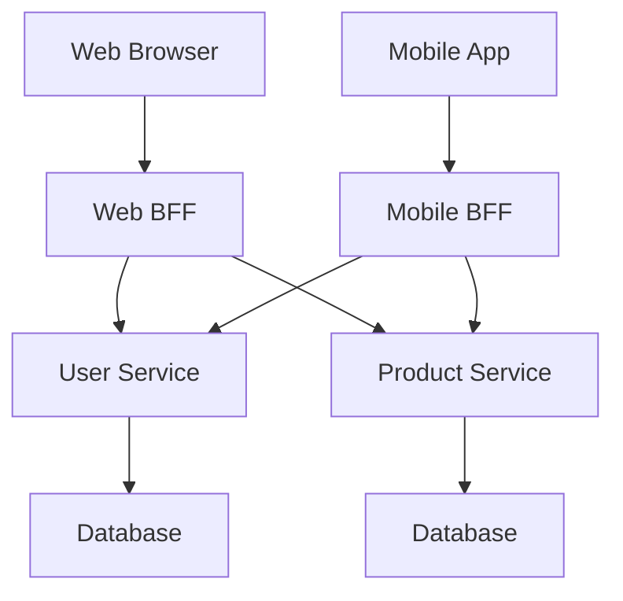

## Backends for Frontend
### Core Concepts

*   **Definition:** BFF (Backend for Frontend) is an architectural pattern where you create dedicated backend services for specific client types (e.g., web, mobile, desktop). Each BFF aggregates and transforms data from one or more upstream microservices to suit the needs of its corresponding frontend.
*   **Purpose:**
    *   **Decouple Frontends from Backend Complexity:** Frontends don't need to know about the internal structure of microservices.
    *   **Optimize Data Fetching:** Reduces over-fetching and under-fetching by tailoring API responses.
    *   **Simplify Frontend Development:** Provides a cleaner, more focused API for each client.
    *   **Enable Frontend Team Autonomy:** Allows frontend teams to evolve their backend needs independently.
    *   **Handle Frontend-Specific Logic:** Can include presentation logic, transformations, and aggregation.

### Key Details & Nuances

*   **Not a Monolith, Not a Gateway:**
    *   A BFF is *not* a generic API Gateway that routes requests to microservices.
    *   It's more specialized than an API Gateway, focusing on specific client experience needs.
*   **Data Aggregation & Transformation:**
    *   BFFs often call multiple downstream microservices.
    *   They merge, filter, and transform data to match the frontend's data model.
*   **Protocol Translation:** Can handle differences in protocols between frontends and backends (e.g., REST to gRPC).
*   **Authentication & Authorization:** Can centralize or tailor authentication/authorization per client type.
*   **Scalability:** Each BFF can be scaled independently based on the demands of its specific frontend.
*   **Technology Choice:** The technology stack for a BFF can differ from downstream services and can be optimized for the frontend's requirements.
*   **Maintainability:** Reduces the burden on microservices to cater to diverse frontend requirements, simplifying their evolution.

### Practical Examples

Consider a scenario with a user profile service and a product catalog service. A web frontend needs to display a user's name and their favorite products, while a mobile frontend only needs the user's username and a list of product IDs.

*   **Web BFF:** Might call User Service to get the full user object (including name) and Product Service to get product details for the favorite product IDs. It then formats this into a JSON suitable for the web UI.
*   **Mobile BFF:** Might call User Service to get just the username and Product Service to get just the product IDs. It formats this into a lean JSON for the mobile app.

### Common Pitfalls & Trade-offs

*   **Creating Too Many BFFs:** Can lead to an explosion of services, increasing complexity and operational overhead.
*   **BFF Logic Bloat:** If a BFF starts incorporating too much business logic, it can become a mini-monolith, defeating the purpose of microservices.
*   **Duplication of Logic:** If multiple BFFs need similar data aggregations, careful design is needed to avoid code duplication.
*   **Tight Coupling to Frontend:** While BFFs are *for* frontends, they shouldn't be so tightly coupled that minor frontend changes break the BFF, or vice-versa.
*   **Performance Overhead:** Each additional network hop (client -> BFF -> microservice) can introduce latency. Careful optimization is required.
*   **Maintenance Burden:** Each BFF requires its own deployment, monitoring, and maintenance.

### Interview Questions

1.  **Question:** Explain the "Backend for Frontend" pattern and when you would choose to use it over a single API gateway or directly consuming microservices.
    **Answer:** BFF creates tailored backend services for specific frontend clients (web, mobile, etc.). It optimizes data fetching and simplifies frontend development by abstracting microservice complexity and providing client-specific data shapes. Use it when frontends have significantly different data needs, require tailored aggregation/transformation, or when you want to allow frontend teams more autonomy without burdening core microservices with frontend-specific concerns. This is distinct from a generic API gateway which typically routes requests with less transformation.

2.  **Question:** What are the potential downsides or anti-patterns associated with the BFF pattern?
    **Answer:** Common pitfalls include: creating too many BFFs leading to an "explosion" of services and increased operational overhead; BFFs becoming mini-monoliths by accumulating excessive business logic; tight coupling between a BFF and its specific frontend, making independent evolution difficult; and introducing performance overhead due to extra network hops. The key is to keep BFFs focused on aggregation, transformation, and client-specific concerns rather than replicating core business logic.

3.  **Question:** How does a BFF differ from a traditional API Gateway in a microservices architecture?
    **Answer:** An API Gateway is typically a single, generic entry point that routes requests to various microservices, often handling cross-cutting concerns like authentication, rate limiting, and basic request transformation. A BFF is more specialized; it acts as a backend *for* a specific client type, aggregating data from multiple microservices and transforming it into a format optimal for that client's user experience. While an API Gateway might route a "get user profile" request to a User service, a Web BFF might route to User service and Product service, aggregate the data, and return a custom payload for the web UI that a generic gateway wouldn't produce.