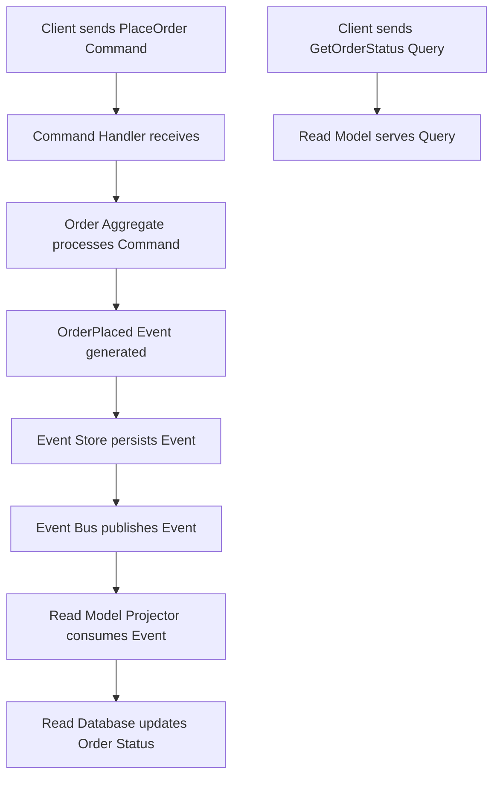

## CQRS & Event Sourcing
### Core Concepts

*   **CQRS (Command Query Responsibility Segregation):**
    *   **What it is:** A design pattern that separates the concerns of reading data (queries) from writing data (commands). This means using different models for updating information (commands) and for querying information (queries).
    *   **Purpose:** Allows independent scaling, optimization, and evolution of the read and write sides.
    *   **Models:**
        *   **Command Model (Write Model):** Focuses on business operations, state changes, and enforcing invariants. Often uses transactional consistency.
        *   **Query Model (Read Model):** Focuses on efficient data retrieval, optimized for specific query patterns. Often denormalized and eventually consistent.

*   **Event Sourcing:**
    *   **What it is:** A pattern where changes to application state are stored as an immutable sequence of domain events. Instead of storing the current state, all events that led to the current state are stored.
    *   **Purpose:** Provides a complete audit log, allows reconstructing past states, enables temporal queries, and facilitates integration with other systems.
    *   **Key Components:**
        *   **Events:** Represent facts that occurred in the domain (e.g., `OrderPlaced`, `ItemAddedToCart`). They are immutable.
        *   **Event Store:** A database specifically designed to store events in an ordered sequence, typically append-only.
        *   **Aggregate:** A cluster of domain objects that can be treated as a single unit for data changes, ensuring consistency within its boundaries. Events originate from aggregates.
        *   **Projection (Read Model Builder):** A component that consumes events from the event store and transforms them into a denormalized read model suitable for queries.

*   **Synergy:** CQRS and Event Sourcing are often used together. Event Sourcing naturally forms the write-side (command model) of a CQRS system, where commands generate events that are saved, and these events then drive the updates to the read-side (query model).

### Key Details & Nuances

*   **Consistency Model:** When CQRS is paired with Event Sourcing, the read model is typically **eventually consistent** with the write model. Updates to the read model are asynchronous, driven by events. This trade-off is often accepted for scalability and performance benefits.
*   **Write Model (Command Side):**
    *   Commands are imperative requests to change state (e.g., `PlaceOrderCommand`).
    *   Command handlers validate commands and apply business logic to aggregates, which in turn emit events.
    *   Events are then persisted to the Event Store.
*   **Read Model (Query Side):**
    *   Queries are declarative requests for data (e.g., `GetOrderStatusQuery`).
    *   Read models are optimized for queries and can use various technologies (e.g., relational DB, NoSQL DB, search engine).
    *   Projections consume events from the event stream to build and update these read models.
*   **Event Immutability & Versioning:** Events, once recorded, cannot be changed. Handling schema evolution (event versioning) is a critical concern, often managed through upcasters or parallel event streams.
*   **Replaying Events:** The entire state of an aggregate or even the entire system can be reconstructed by replaying its historical events. This is invaluable for debugging, auditing, and building new read models.
*   **Snapshots:** For aggregates with a very long event history, replaying all events to restore state can be slow. Snapshots are periodic materialized states of an aggregate, allowing faster restoration by replaying only events since the last snapshot.

### Practical Examples

**CQRS & Event Sourcing Flow for an Order System:**



**Example: Generating an Event from a Command (TypeScript)**

```typescript
// 1. Command Definition
interface PlaceOrderCommand {
    orderId: string;
    items: { productId: string; quantity: number }[];
    customerId: string;
}

// 2. Event Definition
interface OrderPlacedEvent {
    type: 'OrderPlaced';
    orderId: string;
    timestamp: Date;
    items: { productId: string; quantity: number }[];
    customerId: string;
}

// 3. Command Handler (Simplified)
class OrderCommandHandler {
    // This would typically interact with an Aggregate Root to generate events
    handlePlaceOrder(command: PlaceOrderCommand): OrderPlacedEvent {
        // Validation, business logic
        console.log(`Processing command for order: ${command.orderId}`);

        const event: OrderPlacedEvent = {
            type: 'OrderPlaced',
            orderId: command.orderId,
            timestamp: new Date(),
            items: command.items,
            customerId: command.customerId,
        };

        // In a real system, this event would be persisted to an Event Store
        // and then published to an Event Bus.
        console.log(`Generated event: ${event.type} for order: ${event.orderId}`);
        return event;
    }
}

// 4. Read Model Projector (Simplified)
class OrderStatusProjector {
    // This would typically update a denormalized database table
    updateReadModel(event: OrderPlacedEvent): void {
        if (event.type === 'OrderPlaced') {
            console.log(`Projecting OrderPlaced event for order: ${event.orderId}`);
            // Logic to update a 'read_orders' table, e.g.:
            // insert into read_orders (order_id, customer_id, status, placed_date, total_items)
            // values (event.orderId, event.customerId, 'PLACED', event.timestamp, event.items.length);
        }
    }
}

// Usage example
const commandHandler = new OrderCommandHandler();
const projector = new OrderStatusProjector();

const command: PlaceOrderCommand = {
    orderId: 'ORD-123',
    items: [{ productId: 'PROD-A', quantity: 2 }],
    customerId: 'CUST-XYZ',
};

const event = commandHandler.handlePlaceOrder(command);
projector.updateReadModel(event); // This would happen asynchronously via an Event Bus
```

### Common Pitfalls & Trade-offs

*   **Increased Complexity:** Significant boilerplate, more moving parts (command handlers, event stores, projectors, event buses), and a steeper learning curve for the team. Not suitable for simple CRUD applications.
*   **Eventual Consistency Challenges:** Users might see stale data in the read model for a short period. Requires careful UI/UX design to manage this (e.g., showing "processing" states).
*   **Event Versioning/Schema Evolution:** Changing the structure of an event, once persisted, is difficult. Requires a robust strategy for handling legacy events (e.g., event upcasters, side-by-side versions).
*   **Debugging and Testing:** Tracing issues across asynchronous event flows can be challenging. Debugging requires replaying events or inspecting event streams.
*   **Operational Overhead:** Managing event stores, potentially multiple read databases, and ensuring reliable event delivery adds operational complexity.
*   **Replay Performance:** For large event streams, reconstructing state by replaying all events can be slow. Requires strategies like snapshots or event stream segmentation.
*   **Distributed Transactions:** Event sourcing inherently leads to eventual consistency. If strong ACID transaction guarantees are needed across multiple aggregates or services, it complicates the design significantly, often requiring sagas or other compensation patterns.

### Interview Questions

1.  **When would you choose to implement CQRS and Event Sourcing in a system? Provide specific scenarios where their benefits outweigh the added complexity.**
    *   **Answer:**
        *   **High write throughput/scaling needs:** When the write model needs to scale differently or more intensely than the read model, or vice-versa.
        *   **Complex business domains:** Systems with intricate business rules, where capturing intentions (commands) and facts (events) provides clarity and auditability.
        *   **Auditing and traceability:** A strict requirement for a complete, immutable audit trail of all state changes, or the need to reconstruct past states for debugging or compliance.
        *   **Temporal queries:** When the system needs to answer questions about "what was the state at a specific point in time?" or "how did the state evolve?".
        *   **Integration with external systems:** Events provide a natural mechanism for real-time integration, allowing other services to react to domain changes.
        *   **Read model flexibility:** When the system requires highly optimized or specialized read models (e.g., for analytics, search) that differ significantly from the write model's structure.

2.  **Discuss the main challenges you would anticipate when implementing Event Sourcing, particularly concerning event schema evolution and data management.**
    *   **Answer:**
        *   **Event Schema Evolution:** Events are immutable, so changing their schema (adding/removing fields, changing types) requires careful handling. Strategies include:
            *   **Upcasters:** Code that transforms older event versions into newer ones during replay or projection.
            *   **Versioning:** Including a version number in events and handling logic accordingly.
            *   **Backward Compatibility:** Designing events to be backward compatible (e.g., always additive changes).
        *   **Data Management:**
            *   **Storage Cost:** Events can accumulate rapidly, leading to large storage requirements.
            *   **Replay Performance:** Reconstructing state by replaying all events can be slow for long event streams, necessitating **snapshots**.
            *   **Debugging:** Tracing issues involves understanding event sequences, which is more complex than inspecting a current state.
            *   **Data Purging/GDPR:** Removing data (e.g., personal information) is challenging as events are immutable. Strategies involve encrypting sensitive data with keys that can be purged, or using "tombstone" events.

3.  **Explain how eventual consistency is managed in a CQRS system using Event Sourcing. What are the implications for the user experience, and how can they be mitigated?**
    *   **Answer:**
        *   **Management:** Commands are processed by the write model, generating events. These events are persisted to the Event Store and then asynchronously published to an Event Bus. Read model projectors consume these events and update the denormalized read model. The asynchronous nature of this update process leads to eventual consistency.
        *   **Implications for User Experience:**
            *   **Stale Reads:** Users might perform a write operation (e.g., add an item to cart) and then immediately query for that data, only to see the old state before the read model is updated.
            *   **Race Conditions:** Multiple updates might appear out of order if not handled carefully by the projectors.
        *   **Mitigation Strategies:**
            *   **UI Feedback:** Show "processing" or "pending" status after a write operation, indicating that data is being updated.
            *   **Polling/WebSockets:** The client can poll the read model or use WebSockets/Server-Sent Events to be notified when the update is complete.
            *   **Optimistic UI Updates:** Update the UI immediately based on the command, and revert if the actual write fails.
            *   **Command Sourcing:** For simple cases, the UI itself can use the command payload to temporarily update its local view until the read model catches up.
            *   **Read-Your-Own-Writes Consistency:** Direct the immediate read requests for data just written to the write model or a dedicated, strongly consistent temporary store, before transitioning to the eventual consistent read model.

4.  **In what ways does Event Sourcing offer advantages over traditional state persistence (e.g., directly updating a relational database table) for a mid-to-large scale application?**
    *   **Answer:**
        *   **Complete Audit Trail:** Every change is recorded as an immutable event, providing a perfect historical record for auditing, debugging, and compliance. Traditional state persistence typically loses historical context with updates.
        *   **Temporal Queries:** Easily reconstruct the state of the system at any point in the past, enabling "as-of" queries or trend analysis that are difficult with traditional CRUD.
        *   **Decoupling:** Events serve as a strong integration mechanism, decoupling various components and services. Different read models can be built from the same events without impacting the write model.
        *   **Debugging and Forensics:** By replaying events, you can understand exactly how a system reached an erroneous state, facilitating root cause analysis.
        *   **Flexibility for Read Models:** New read models can be built from scratch by replaying all historical events, allowing for evolving analytical needs or new user experiences without changing the core write logic.
        *   **Business Insight:** Events often reflect meaningful business facts, providing a rich source of data for business intelligence and analytics.