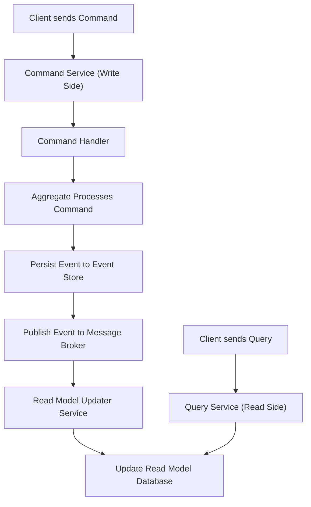

## Data Management Patterns
### Core Concepts

*   **Data Management Patterns:** Architectural approaches to efficiently store, retrieve, process, and distribute data in cloud-native and distributed systems. They address challenges like scalability, availability, consistency, and data integrity.
*   **Key Patterns Covered:**
    *   **Sharding (Partitioning):** Horizontally scaling databases by distributing rows/documents across multiple independent physical or logical database instances (shards).
    *   **Data Replication:** Maintaining multiple copies of data across different nodes or regions for high availability, fault tolerance, and improved read performance.
    *   **Command Query Responsibility Segregation (CQRS):** Separating the read model (queries) from the write model (commands) of an application, allowing independent optimization and scaling.
    *   **Event Sourcing:** Storing the full sequence of events that occurred in the application domain as the primary source of truth, rather than just the current state.

### Key Details & Nuances

*   **Sharding:**
    *   **Sharding Key:** The crucial piece of data used to determine which shard a record belongs to.
        *   **Hash-based:** Distributes data evenly, but range queries are inefficient. `shard_id = hash(user_id) % num_shards`.
        *   **Range-based:** Efficient for range queries, but can lead to hot spots if data is not uniformly distributed (e.g., timestamps).
        *   **Directory-based:** Uses a lookup service to map keys to shards, offering flexibility but adding complexity.
    *   **Re-sharding:** Complex and disruptive process requiring data migration when adding/removing shards. Consistent hashing can mitigate this.
    *   **Cross-Shard Queries/Transactions:** Challenging to implement efficiently; often requires fan-out queries or distributed transactions, increasing latency and complexity.
*   **Data Replication:**
    *   **Replication Types:**
        *   **Primary-Replica (Master-Slave):** One primary node handles all writes, replicas handle reads. Good for read scaling and simple failover.
        *   **Multi-Primary (Multi-Master):** All nodes can accept writes. Provides higher write availability but introduces data conflict resolution challenges.
    *   **Consistency Models (CAP Theorem relevance):**
        *   **Strong Consistency:** All readers see the most recent write. Low latency for reads, but higher write latency and lower availability during partitions (CP system).
        *   **Eventual Consistency:** Reads may return stale data for a period, but eventually all replicas converge to the same state. Higher availability and lower latency (AP system).
        *   **Causal Consistency:** Guarantees that if event A causes event B, then B will not be seen before A. Weaker than strong, stronger than eventual.
*   **CQRS:**
    *   **Write Model (Command Side):** Handles commands (e.g., `CreateOrderCommand`, `UpdateProductCommand`). Often uses a transactional database.
    *   **Read Model (Query Side):** Optimized for queries (e.g., `GetProductCatalogQuery`, `GetUserOrdersQuery`). Can use denormalized views, different database types (e.g., NoSQL for speed).
    *   **Data Synchronization:** Requires a mechanism to update the read model from the write model (e.g., event buses, message queues).
    *   **Benefits:** Independent scaling, optimized data models for reads/writes, improved performance, simpler aggregates in write model.
*   **Event Sourcing:**
    *   **Event Log:** An append-only sequence of domain events (e.g., `OrderCreatedEvent`, `ProductShippedEvent`). The "source of truth."
    *   **Replaying Events:** The current state of an aggregate is derived by replaying all events related to it. Used for state reconstruction, debugging, and audit.
    *   **Snapshots:** Periodically save aggregate state to avoid replaying all events from the beginning.
    *   **Integration with CQRS:** Events from the Event Store are published to update read models. This is a common pattern for complex, evolvable systems.

### Practical Examples

**1. Sharding a User Database**

To shard a `users` table based on `userId`:

```typescript
// Assuming 10 shards
const NUM_SHARDS = 10;

function getShardId(userId: string): number {
    // A simple hash-based sharding key
    let hash = 0;
    for (let i = 0; i < userId.length; i++) {
        hash = (hash << 5) - hash + userId.charCodeAt(i);
        hash |= 0; // Ensure 32-bit integer
    }
    return Math.abs(hash % NUM_SHARDS);
}

// Example usage
const userId1 = "user-12345";
const userId2 = "user-67890";

console.log(`User ${userId1} belongs to shard: ${getShardId(userId1)}`);
console.log(`User ${userId2} belongs to shard: ${getShardId(userId2)}`);

// In a real system, you'd then connect to db_shard_X
// e.g., dbConnections[getShardId(userId)].query(...)
```

**2. CQRS with Event Sourcing Flow**



### Common Pitfalls & Trade-offs

*   **Sharding:**
    *   **Hot Spots:** Uneven data distribution or highly accessed shards (e.g., "power users" on a single shard) can bottleneck performance.
    *   **Complex Joins/Queries:** Queries involving multiple shards become difficult or impossible to perform efficiently at the database level.
    *   **Schema Evolution:** Changes to the database schema can be complicated to roll out across many shards.
*   **Replication/Consistency:**
    *   **Data Conflicts (Multi-Primary):** Resolving conflicting writes to the same data on different primary nodes can be complex (e.g., last-write-wins, merge functions).
    *   **Eventual Consistency Challenges:** Developers must explicitly handle eventual consistency in the application layer, leading to potential "stale read" issues or complex retries.
    *   **Latency vs. Consistency:** Strong consistency typically incurs higher latency due to distributed consensus protocols.
*   **CQRS & Event Sourcing:**
    *   **Increased Complexity:** Introduces more moving parts (event store, read models, message queues, updaters) and a higher operational overhead.
    *   **Learning Curve:** Requires teams to adapt to a different way of thinking about data and state management.
    *   **Debugging:** Tracing issues can be harder when state is derived from an event stream and separated into distinct read/write models.
    *   **Tooling/Ecosystem:** Requires robust messaging systems and specialized libraries or frameworks.

### Interview Questions

1.  **Question:** Explain the trade-offs between hash-based and range-based sharding. When would you choose one over the other?
    **Answer:** Hash-based sharding provides even data distribution, reducing hot spots, but makes range queries inefficient as related data might be on different shards. Range-based sharding makes range queries efficient but can lead to hot spots if data is not uniformly accessed. Choose hash-based for balanced load and point queries (e.g., user profiles), range-based for time-series data or geographic partitioning where range queries are common.

2.  **Question:** In a highly available e-commerce system, you've chosen eventual consistency for your product catalog. How would you handle a user seeing an outdated price after an update, and what are the implications for the user experience?
    **Answer:** To handle outdated prices, we could implement client-side refresh mechanisms (e.g., polling, web sockets for real-time updates), or inform the user that prices may be subject to change upon checkout. Implications for UX include potential confusion or frustration if the user expects immediate consistency. The system must clearly define boundaries of eventual consistency and potentially use a stronger consistency model for critical paths like checkout.

3.  **Question:** Describe a scenario where adopting CQRS and Event Sourcing would be highly beneficial. What are the main challenges you'd anticipate?
    **Answer:** A complex domain like an online trading platform or supply chain management system would benefit, especially where auditability is key, historical state needs to be reconstructed, and read/write workloads are vastly different. For instance, high-volume order placement (writes) needs to be separated from complex analytics and dashboard views (reads). Challenges include increased system complexity, the learning curve for the development team, ensuring eventual consistency doesn't lead to issues, and managing the size and replaying of the event log.

4.  **Question:** Your application uses a primary-replica database setup. The primary fails. Describe the failover process and discuss the consistency implications during and after failover.
    **Answer:** During primary failure, a replica is promoted to become the new primary. This involves detecting the failure, electing a new primary (often using a consensus mechanism like Paxos/Raft or a coordination service like ZooKeeper/etcd), and updating application configurations to point to the new primary.
    *   **During Failover:** There's a period of unavailability or degraded performance. If asynchronous replication was used, some recent writes to the old primary might be lost (data loss) if they hadn't propagated to the promoted replica.
    *   **After Failover:** Reads will resume, potentially from the new primary or other replicas. If data was lost, the system is no longer strongly consistent with the pre-failover state. New replicas might need to be provisioned and synced from the new primary.

5.  **Question:** How does the Saga pattern relate to Data Management Patterns, especially in the context of distributed transactions?
    **Answer:** The Saga pattern is a distributed transaction pattern that manages a sequence of local transactions, where each transaction updates data within a single service. It's crucial in microservices architectures where a single logical operation spans multiple services, each with its own database, preventing a global ACID transaction. Sagas ensure atomicity (all or nothing) by using compensating transactions to undo previous successful steps if a later step fails. It often leverages eventing (from Event Sourcing) and message queues for coordination, tying into data management as it dictates how distributed state changes are managed and maintained consistently across boundaries.