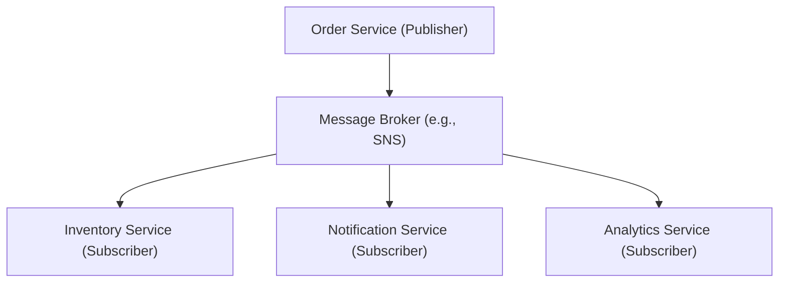

## Messaging Patterns
### Core Concepts

*   **Asynchronous Communication:** Messaging patterns enable services to communicate without waiting for an immediate response, fostering loose coupling and improved system responsiveness.
*   **Decoupling Services:** Producers and consumers of messages do not need direct knowledge of each other, simplifying service dependencies and independent deployment.
*   **Resilience & Scalability:** Messages can be queued, allowing consumers to process them at their own pace. If a consumer fails, messages persist and can be retried or processed by other instances, enhancing fault tolerance and horizontal scalability.
*   **Backpressure Handling:** Messaging systems act as buffers, absorbing spikes in message production and allowing consumers to process at their sustained rate, preventing system overload.

### Key Details & Nuances

*   **Message Queues (Point-to-Point):**
    *   **Concept:** A message is sent to a queue and processed by *only one* available consumer.
    *   **Use Cases:** Task queues, work distribution (e.g., image processing, email sending).
    *   **Characteristics:** FIFO (First-In, First-Out) order is often maintained within a single consumer group or partition.
    *   **Common Services:** AWS SQS, Azure Storage Queues, RabbitMQ.
*   **Publish/Subscribe (Pub/Sub):**
    *   **Concept:** Publishers send messages to a `topic`. Subscribers express interest in a topic and receive a *copy* of every message published to it.
    *   **Use Cases:** Event-driven architectures, data fan-out, real-time notifications, system-wide state changes.
    *   **Characteristics:** Messages are broadcast to multiple consumers. Eventual consistency is common.
    *   **Common Services:** AWS SNS, Azure Event Grid/Service Bus Topics, Google Cloud Pub/Sub, Kafka.
*   **Idempotency:**
    *   **Definition:** An operation is idempotent if executing it multiple times produces the same result as executing it once.
    *   **Importance:** Crucial for message processing due to "at-least-once" delivery guarantees in most messaging systems (messages might be delivered more than once due to retries or network issues).
    *   **Implementation:** Use unique message IDs (transaction IDs, request IDs) to check if an operation has already been processed before committing changes.
*   **Ordering Guarantees:**
    *   **FIFO:** Achieved through single-threaded processing per partition/queue or by using message groups/keys to ensure related messages are processed in order.
    *   **Global Ordering:** Difficult to achieve across partitions/topics without sacrificing scalability. Usually, applications only require ordering for related events.
*   **Dead-Letter Queues (DLQ):**
    *   **Purpose:** A dedicated queue for messages that cannot be successfully processed after a certain number of retries or due to invalid format.
    *   **Benefit:** Prevents poison pill messages from blocking queues, allows for manual inspection and debugging, improves system robustness.
*   **Message Durability:**
    *   **Transient:** Messages are held in memory; lost on system restart. Suitable for high-throughput, non-critical data.
    *   **Persistent:** Messages are written to disk; survive restarts. Standard for critical business processes.

### Practical Examples

**1. Basic Pub/Sub Flow**



**2. Publishing a Message (TypeScript)**

```typescript
// Define a simple message interface
interface OrderProcessedMessage {
  orderId: string;
  customerId: string;
  amount: number;
  timestamp: string;
}

// Assume a hypothetical messaging client
class MessagingClient {
  private brokerUrl: string;

  constructor(brokerUrl: string) {
    this.brokerUrl = brokerUrl;
  }

  /**
   * Publishes a message to a specific topic.
   * In a real-world scenario, this would interact with an SDK (e.g., AWS SNS.publish).
   */
  public async publish<T>(topic: string, message: T): Promise<void> {
    console.log(`[${new Date().toISOString()}] Publishing to topic '${topic}':`);
    console.log(JSON.stringify(message, null, 2));

    // Simulate API call to message broker
    return new Promise(resolve => setTimeout(() => {
      console.log(`Message sent to broker for topic '${topic}'.`);
      resolve();
    }, 100)); // Simulate network latency
  }
}

// --- Usage Example ---
const messagingClient = new MessagingClient("https://my-message-broker.com");

const newOrderEvent: OrderProcessedMessage = {
  orderId: "ORD-98765",
  customerId: "CUST-ABC",
  amount: 123.45,
  timestamp: new Date().toISOString(),
};

messagingClient.publish<OrderProcessedMessage>("order.processed", newOrderEvent)
  .then(() => console.log("\nOrder processed event published successfully!"))
  .catch(error => console.error("Error publishing message:", error));

// Example of an idempotent operation (pseudo-code)
async function processPayment(paymentId: string, amount: number): Promise<void> {
  // Check if this paymentId has already been processed
  if (await isPaymentProcessed(paymentId)) {
    console.log(`Payment ${paymentId} already processed. Skipping.`);
    return; // Idempotent check
  }

  // Process payment...
  console.log(`Processing payment ${paymentId} for amount ${amount}.`);
  await savePaymentProcessedStatus(paymentId); // Mark as processed
  // ... actual payment gateway interaction ...
}

// Dummy functions for demonstration
async function isPaymentProcessed(id: string): Promise<boolean> { return Promise.resolve(Math.random() < 0.1); } // Simulate rare duplicates
async function savePaymentProcessedStatus(id: string): Promise<void> { console.log(`Marking ${id} as processed.`); return Promise.resolve(); }

// Simulate calling processPayment multiple times with the same ID
console.log("\n--- Idempotency Example ---");
processPayment("PAY-111", 50.00);
processPayment("PAY-111", 50.00); // Second call might be a retry
processPayment("PAY-222", 75.00);
```

### Common Pitfalls & Trade-offs

*   **Over-engineering:** Not all communication needs to be asynchronous. Synchronous RPC is simpler for immediate request-response needs. Introducing messaging adds complexity (e.g., eventual consistency, debugging distributed traces).
*   **Debugging:** Tracing messages across multiple services and queues can be challenging. Requires robust logging, correlation IDs, and potentially distributed tracing tools.
*   **Latency vs. Throughput:** While messaging improves overall system throughput by decoupling, it inherently introduces latency for individual message processing due to buffering and network hops.
*   **Strong Consistency vs. Eventual Consistency:** Messaging systems typically offer eventual consistency. If strong consistency is required (e.g., for financial transactions), additional mechanisms like distributed transactions (complex) or saga patterns (complex) are needed, or messaging might not be the primary solution.
*   **Cost:** Managed messaging services incur costs based on messages processed, data transfer, and storage. Self-hosting requires operational overhead.
*   **Message Schema Evolution:** Changes to message schemas require careful coordination between producers and consumers to avoid breaking changes. Versioning messages or using schema registries helps.

### Interview Questions

1.  **When would you choose a message queue over a pub/sub system, and vice versa? Provide specific use cases for each.**
    *   **Answer:** Use **message queues** (e.g., SQS) when you need to distribute tasks among a group of workers where each message is processed *exactly once* by *one* consumer (e.g., job processing, order fulfillment tasks). Use **pub/sub systems** (e.g., SNS) when you need to broadcast events to *multiple, independent subscribers* interested in the same data (e.g., notifying various services about a user signup, sending notifications, data replication).
2.  **Explain the concept of "at-least-once" delivery in messaging systems. How does it impact consumer design, and what pattern is crucial to handle it?**
    *   **Answer:** "At-least-once" delivery means a message might be delivered to a consumer more than one time due to network issues, consumer crashes, or retries. This impacts consumer design because it cannot assume a message is unique. The crucial pattern to handle this is **idempotency**. Consumers must be designed so that processing the same message multiple times yields the same correct result as processing it once, typically by using unique message IDs to track already processed operations.
3.  **Describe how you would ensure message ordering for a critical sequence of events (e.g., financial transactions) using a messaging system. What are the trade-offs?**
    *   **Answer:** For critical ordering, use **message groups** or **partition keys**. Messages with the same key are guaranteed to be delivered to the same consumer instance within a consumer group, and in order. For example, all events related to `transaction_id_XYZ` go to one partition/queue consumer. The trade-off is **reduced parallelism/scalability** for that specific group, as processing for a given key is typically single-threaded to maintain order. Global ordering across all messages is generally sacrificed for scalability.
4.  **A new requirement comes in: your microservice needs to react to changes in a database table owned by another team. How might you achieve this using messaging patterns, and what are the advantages over directly querying their database or exposing an API?**
    *   **Answer:** Use **Change Data Capture (CDC)**, where changes in the database are streamed as events to a messaging system (e.g., Kafka Connect for Kafka, AWS DMS to Kinesis/SNS/SQS). Your microservice then subscribes to these events.
    *   **Advantages:**
        *   **Decoupling:** Your service doesn't directly depend on the other team's database schema or internal API implementation.
        *   **Scalability:** Event streams can handle high volumes, allowing your service to scale independently.
        *   **Real-time:** React to changes almost immediately.
        *   **Resilience:** Events persist in the messaging system, allowing your service to catch up if it goes down.
        *   **Auditability:** The event stream provides a log of all changes.
5.  **You've deployed a new consumer, and you notice some messages are failing repeatedly and blocking the queue. What mechanism should be in place to handle this, and why?**
    *   **Answer:** A **Dead-Letter Queue (DLQ)** should be configured. Messages that fail processing after a configured number of retries (or exceeding a processing time limit) are automatically moved to the DLQ. This prevents "poison pill" messages from perpetually blocking the main queue, allows the operational team to inspect and potentially fix the issue with the message or consumer, and ensures the main processing continues uninterrupted.