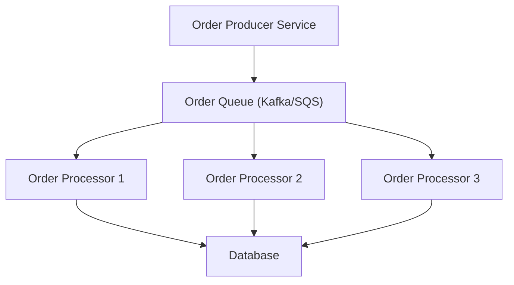
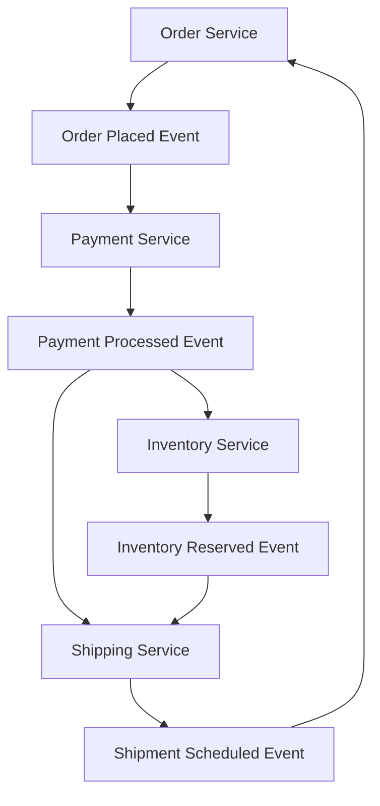

## Competing Consumers & Choreography
### Core Concepts

*   **Competing Consumers Pattern:**
    *   **What it is:** A distributed messaging pattern where multiple consumer instances process messages from a single message queue in parallel.
    *   **Purpose:** Enables horizontal scaling of message processing, improves throughput, increases system resilience, and balances workload across consumers. Each message is processed by only one consumer.
*   **Choreography Pattern:**
    *   **What it is:** A style of inter-service communication in distributed systems (especially microservices) where services react to events published by other services, without a central orchestrator.
    *   **Purpose:** Promotes loose coupling, high autonomy, and decentralization. Business processes are driven by a sequence of events, where each service is responsible for its part of the process and publishes events for others to react to.

### Key Details & Nuances

*   **Competing Consumers:**
    *   **Message Queue (MQ):** Essential component. Guarantees that each message is delivered to only one active consumer. Examples: Kafka, RabbitMQ, SQS, Azure Service Bus.
    *   **Idempotency:** Crucial. Consumers must be able to process the same message multiple times without unintended side effects, as message delivery guarantees are often "at-least-once."
    *   **Error Handling:** Implement robust error handling, retries, and dead-letter queues (DLQs) for failed messages.
    *   **Scalability:** Consumers can be scaled independently of producers. Adding more consumers directly increases processing capacity.
    *   **Order Guarantees:** Message queues typically do not guarantee strict global order for competing consumers (unless explicitly configured for partitioned queues with single consumer per partition). If order is critical, design around it (e.g., using correlation IDs, state management).
*   **Choreography:**
    *   **Event-Driven:** Business processes are decomposed into a series of events. Services publish events and subscribe to events relevant to them.
    *   **Decentralized Control:** No single service orchestrates the entire business process. Each service decides independently what action to take based on the events it consumes.
    *   **Loose Coupling:** Services only need to know about the events they publish and subscribe to, not the internal logic or existence of other services.
    *   **Eventual Consistency:** Often leads to eventual consistency, where data might be temporarily inconsistent across services until all relevant events are processed.
    *   **Sagas:** Complex business transactions spanning multiple services often use the Saga pattern (often implemented via choreography with compensating transactions) to maintain data consistency.
    *   **Observability:** Can be challenging to trace end-to-end business processes due to the decentralized nature. Requires robust distributed tracing and logging.

### Practical Examples

**Competing Consumers Pattern**

**Choreography Pattern for Order Fulfillment**

### Common Pitfalls & Trade-offs

*   **Competing Consumers:**
    *   **Non-Idempotent Operations:** Leading to data corruption or incorrect state if messages are processed multiple times.
    *   **Hot Spots:** A single large message or a few consumers getting stuck can impact overall throughput if not properly monitored and managed.
    *   **Over-Provisioning:** Running too many consumers can lead to contention on shared resources (e.g., database connections) or unnecessary infrastructure costs.
*   **Choreography:**
    *   **Debugging & Tracing:** Difficult to understand the full flow of a business process, especially across many services. "Spaghetti events" can lead to complex dependencies.
    *   **Transaction Management:** Implementing distributed transactions (Sagas) can be complex and requires careful design of compensating actions.
    *   **Lack of Global View:** No single service holds the complete state of a business process, making it harder to reason about the system's overall health or progress.
    *   **Event Schema Evolution:** Changes to event schemas can break consumers if not managed carefully (e.g., using versioning, backward compatibility).
*   **Choreography vs. Orchestration:**
    *   **Choreography:** Higher autonomy, loose coupling, simpler services, better for highly distributed and evolving systems. Harder to manage complex, multi-step transactions.
    *   **Orchestration:** Centralized control, easier to manage complex workflows and distributed transactions, clearer visibility of business process. Can lead to a "smart orchestrator" becoming a monolithic bottleneck.

### Interview Questions

1.  **Explain the Competing Consumers pattern, its primary benefits, and a critical design consideration when implementing it.**
    *   **Answer:** Competing Consumers involves multiple consumer instances asynchronously processing messages from a shared queue. Its primary benefits are increased throughput through parallel processing, improved scalability by adding more consumers, and enhanced reliability as failures in one consumer don't halt the entire system. A critical design consideration is ensuring **idempotency** of consumer operations, meaning processing the same message multiple times yields the same result without adverse effects, due to "at-least-once" delivery guarantees.

2.  **How does Choreography differ from Orchestration in a microservices context, and when would you choose one over the other?**
    *   **Answer:** In **Choreography**, services react to events published by other services, with no central coordinator; the business process flow emerges from these interactions. In **Orchestration**, a dedicated orchestrator service manages and directs the flow of operations, explicitly calling other services.
        *   Choose **Choreography** for high autonomy, loose coupling, and when business processes are simpler or can be naturally decomposed into event reactions. It's good for highly distributed, evolving systems.
        *   Choose **Orchestration** for complex, multi-step business processes requiring strict sequencing and transactional consistency (e.g., a saga where immediate rollback is critical). It offers clearer visibility of the overall flow but can create a central point of failure or a "smart orchestrator" anti-pattern.

3.  **What are the main challenges you would anticipate when building a large-scale system primarily using a Choreography pattern?**
    *   **Answer:**
        1.  **Observability & Tracing:** It's hard to trace the end-to-end flow of a business transaction because there's no central point of control. Requires robust distributed tracing.
        2.  **Distributed Transactions (Sagas):** Managing consistency across multiple services becomes complex, often requiring the implementation of compensating actions for failed steps.
        3.  **Event Schema Evolution:** Changes to event schemas need careful versioning and backward compatibility to avoid breaking existing consumers.
        4.  **"Event Spaghetti":** Over time, dependencies can become intricate and hard to manage if not designed carefully, leading to a tangled web of event flows.

4.  **How do you ensure reliable message processing and data consistency when using the Competing Consumers pattern, particularly with regard to idempotency?**
    *   **Answer:**
        1.  **Reliable Delivery:** Use a message queue that provides "at-least-once" delivery semantics and acknowledgement mechanisms. Consumers should only acknowledge messages after successful processing and persistence.
        2.  **Idempotency:** This is key. For database operations, use unique keys or conditional updates (e.g., `INSERT IF NOT EXISTS`, `UPDATE WHERE version = X`). For external API calls, check the state of the external system before retrying. Implement a "processed messages" log or a unique transaction ID to track already handled messages and prevent duplicate work.
        3.  **Dead-Letter Queues (DLQs):** Configure DLQs to capture messages that repeatedly fail processing, preventing them from blocking the queue and allowing for manual inspection or re-processing.

5.  **Describe a scenario where both the Competing Consumers and Choreography patterns could be used together effectively.**
    *   **Answer:** Consider an e-commerce order fulfillment system.
        *   **Choreography:** When an "Order Placed" event is published, multiple services react (e.g., Payment Service processes payment, Inventory Service reserves stock, Shipping Service schedules shipment). This entire flow is choreographed by events.
        *   **Competing Consumers:** Within the **Payment Service**, it might receive a high volume of "Process Payment" requests. To handle this, multiple instances of the Payment Service (competing consumers) could pull from a dedicated "Payment Processing Queue," ensuring that each payment request is handled efficiently and in parallel, scaling independently of the rest of the choreography. Similarly, the Inventory Service could use competing consumers to process "Reserve Stock" messages.