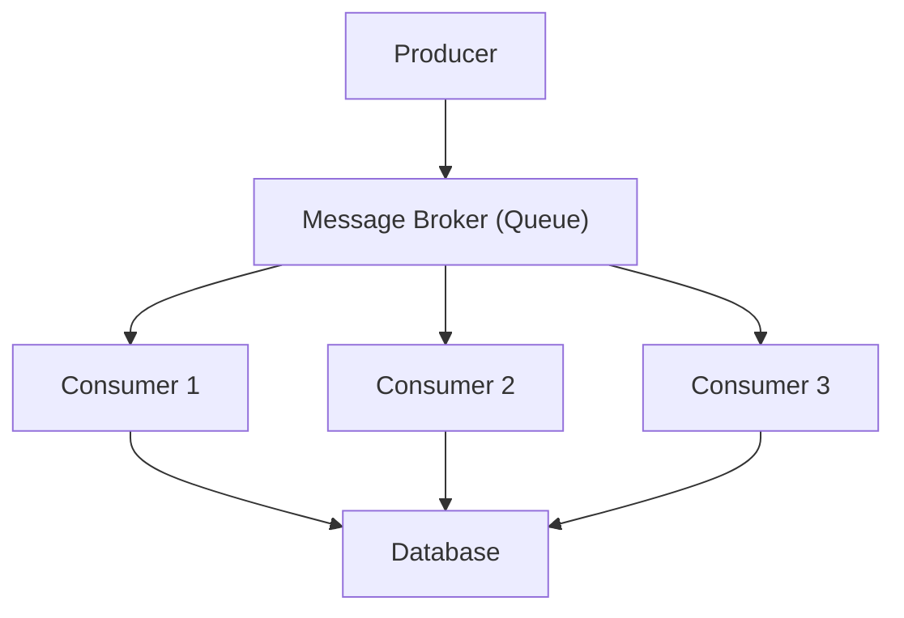

## Advanced Messaging Patterns
### Core Concepts

*   **Advanced Messaging Patterns:** Go beyond simple Publish/Subscribe (Pub/Sub) or Queues. These patterns address more complex communication needs in distributed systems, focusing on reliability, ordering, idempotency, and flow control.
*   **Key Goals:**
    *   **Decoupling:** Further separating message producers and consumers.
    *   **Resilience:** Handling failures gracefully (e.g., retries, dead-lettering).
    *   **Ordering:** Ensuring messages are processed in a specific sequence when necessary.
    *   **Idempotency:** Allowing messages to be processed multiple times without adverse effects.
    *   **Scalability:** Designing for high throughput and low latency.

### Key Details & Nuances

*   **Message Queues (vs. Pub/Sub):**
    *   **Queues:** Point-to-point, one consumer receives each message. Guarantees delivery to *a* consumer.
    *   **Pub/Sub:** One-to-many, multiple consumers receive each message (broadcast).
*   **Advanced Patterns:**
    *   **Competing Consumers:**
        *   **Concept:** Multiple instances of the same consumer process messages from a single queue.
        *   **Benefit:** Increases throughput and availability. If one consumer fails, others continue processing.
        *   **Consideration:** Requires consumers to be stateless or handle state externally to avoid data corruption.
    *   **Message Relay/Orchestration:**
        *   **Concept:** An intermediary service that receives a message, performs some logic (e.g., enrichment, transformation, routing based on content), and then sends it to one or more destinations.
        *   **Use Case:** Implementing complex workflows, implementing the Saga pattern.
        *   **Trade-off:** Adds latency and a potential single point of failure if not designed with high availability.
    *   **Transactional Messaging:**
        *   **Concept:** Ensures that a message is sent *and* received/processed atomically within a transaction. Either both operations succeed, or both fail.
        *   **Use Case:** Critical operations where data consistency is paramount (e.g., financial transactions).
        *   **Complexity:** Can be harder to implement and may impact performance due to the overhead of distributed transactions. Often requires integration with transactional capabilities of databases or message brokers.
    *   **Idempotent Consumers:**
        *   **Concept:** Consumers that can safely process the same message multiple times.
        *   **Implementation:** Often achieved by tracking message IDs and ensuring that the action performed by the message is only executed once, even if the message is received multiple times.
        *   **Importance:** Crucial in distributed systems where message redelivery due to network issues or consumer crashes is common.
    *   **Dead-Letter Queues (DLQ):**
        *   **Concept:** A queue where messages that cannot be processed after a certain number of retries are sent.
        *   **Purpose:** Prevents poison messages from blocking the main queue. Allows for manual inspection and reprocessing of failed messages.
        *   **Configuration:** Typically configured on the message broker or the consumer application.

### Practical Examples

*   **Idempotent Consumer Logic (Conceptual TypeScript):**

```typescript
interface ProcessedMessage {
  messageId: string;
  processedAt: Date;
}

class IdempotentConsumer {
  private processedMessages: Map<string, Date> = new Map(); // In-memory store for simplicity

  async processMessage(message: { id: string; payload: any }): Promise<void> {
    if (this.processedMessages.has(message.id)) {
      console.log(`Message ${message.id} already processed. Skipping.`);
      return;
    }

    try {
      // --- Actual message processing logic ---
      console.log(`Processing message ${message.id}:`, message.payload);
      await this.performAction(message.payload);
      // --- End processing logic ---

      // Mark as processed *after* successful processing
      this.processedMessages.set(message.id, new Date());
      console.log(`Message ${message.id} processed successfully.`);

    } catch (error) {
      console.error(`Error processing message ${message.id}:`, error);
      // Depending on retry strategy, may re-queue or move to DLQ
      throw error; // Re-throw to signal failure for retries
    }
  }

  private async performAction(payload: any): Promise<void> {
    // Simulate work
    await new Promise(resolve => setTimeout(resolve, 100));
    if (payload.fail) {
      throw new Error("Simulated processing failure");
    }
    console.log("Action performed.");
  }
}
```

*   **Competing Consumers with a Message Broker (Mermaid):**



### Common Pitfalls & Trade-offs

*   **Over-Engineering Ordering:** Requiring strict message ordering can severely limit scalability. Only use it when absolutely necessary. Most systems benefit from "eventual consistency" rather than strict ordering.
*   **Ignoring Idempotency:** Leads to data inconsistencies and duplicate operations if messages are redelivered. This is a critical pattern to implement correctly.
*   **DLQ Mismanagement:** Not monitoring or processing DLQs leads to silent failures. DLQs should trigger alerts and have a clear remediation process.
*   **Tight Coupling in Relays:** If the message relay logic becomes too complex or tightly coupled to specific downstream services, it becomes a bottleneck and reduces the benefits of decoupling.
*   **Performance vs. Durability:** Transactional messaging or strong guarantees often come with performance overhead. Choose the appropriate level of guarantee based on business requirements.

### Interview Questions

1.  **Question:** How would you design a system to process millions of user sign-ups per day, ensuring that each user receives a welcome email, but also handling potential failures in email delivery?
    **Answer:** Use a message queue (e.g., SQS, Kafka) for sign-up events. A producer writes sign-up events to the queue. Multiple competing consumer instances poll the queue. Each consumer processes a sign-up, sends a welcome email, and marks the message as processed. For reliability:
    *   Implement **idempotency** in the consumer for email sending (e.g., track sent email status by user ID) to avoid duplicate emails if redelivered.
    *   Configure a **Dead-Letter Queue (DLQ)** for messages that fail processing after several retries.
    *   Monitor the DLQ for undelivered emails to investigate and potentially reprocess manually.
    *   This pattern supports **scalability** via competing consumers and provides **resilience** through retries and DLQ.

2.  **Question:** Explain the difference between a message queue and a publish/subscribe system, and when you might use one over the other.
    **Answer:**
    *   **Message Queue:** Point-to-point communication. A message is delivered to *one* consumer. Used when a task needs to be performed by only one worker (e.g., processing an order, a single background job). Guarantees at-least-once delivery to *a* consumer.
    *   **Publish/Subscribe:** One-to-many communication. A message is broadcast to *all* interested subscribers. Used when multiple services need to react to an event (e.g., a user profile update triggering notifications, cache invalidation, analytics).
    *   **Choice:** Use queues for work distribution and task processing. Use Pub/Sub for broadcasting events and decoupling event producers from multiple event consumers.

3.  **Question:** Imagine a financial transaction system where a service needs to debit an account and then credit another. How would you ensure this operation is atomic using messaging?
    **Answer:** This is a classic use case for distributed transactions or the Saga pattern.
    *   **Transactional Messaging:** If the message broker and databases support distributed transactions (e.g., JMS with XA transactions), the debit, message send, and credit could be part of a single transaction. This is complex and can impact performance.
    *   **Saga Pattern with Messaging:** A more common approach in microservices.
        1.  Service A debits the account and publishes a `DebitSuccessful` event.
        2.  A Saga orchestrator (or Service B directly) consumes `DebitSuccessful`.
        3.  Service B credits the account and publishes a `CreditSuccessful` event.
        4.  If Service B fails, it publishes a `CreditFailed` event.
        5.  The orchestrator (or Service A) consumes `CreditFailed` and initiates a compensating action (e.g., Service A reverses the debit).
    *   **Key for Saga:** Both the forward and compensating actions must be **idempotent**. Messages should be sent reliably, and a DLQ should be used for failed compensating actions.