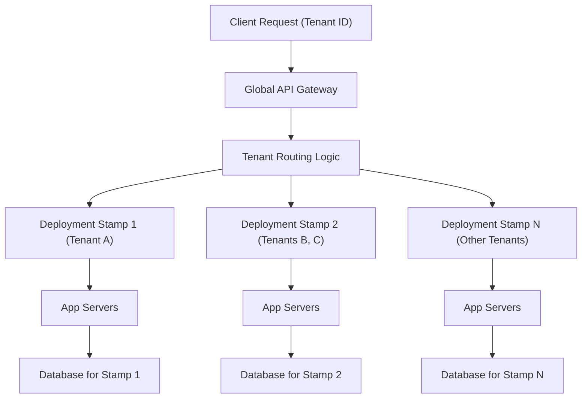

## Deployment Stamps
### Core Concepts
*   **Definition:** Deployment Stamps (also known as Deployment Units, Scale Units, or Micro-deployment) are independent, isolated deployments of an application or a subset of an application's components. Each stamp includes its own set of infrastructure, application instances, and data stores.
*   **Purpose:**
    *   **Scalability:** Allows horizontal scaling by deploying more identical stamps as demand increases, rather than scaling up individual components within a single deployment.
    *   **Isolation/Fault Tolerance:** Failures in one stamp do not affect others, improving overall system resilience.
    *   **Multi-Tenancy:** Enables strong isolation for tenants by assigning specific tenants or groups of tenants to dedicated stamps, preventing "noisy neighbor" issues and meeting data residency requirements.
    *   **Geographic Distribution:** Facilitates deploying services closer to users in different regions for lower latency and compliance.

### Key Details & Nuances
*   **Independence:** Each stamp is an autonomous unit, containing all necessary components (compute, storage, networking) to serve its assigned workload or tenants. They are designed to operate without direct dependencies on other stamps.
*   **Data Partitioning:** Critical to stamp architecture. Data (e.g., tenant data) is partitioned such that a specific tenant's data resides entirely within its assigned stamp. Cross-stamp data access is generally avoided.
*   **Routing Logic:** A global routing layer (e.g., API Gateway, Load Balancer, custom router) is essential to direct incoming requests to the correct stamp based on criteria like tenant ID, geographical region, or user affinity.
*   **Shared Services vs. Stamped Services:**
    *   **Stamped Services:** Core application logic, databases, caching layers that are duplicated within each stamp.
    *   **Shared Services:** Global services that are accessed by all stamps (e.g., authentication service, global telemetry, central logging, tenant management service). These must be highly available and scalable themselves.
*   **Deployment & Management:** Requires robust automation (Infrastructure as Code, CI/CD pipelines) to provision, update, and manage multiple identical stamps consistently.

### Practical Examples

**Scenario: Multi-tenant SaaS Application**
A SaaS provider offering a project management tool. Each customer (tenant) requires strong data isolation and performance guarantees.

**Architecture:**
*   A global API Gateway routes requests.
*   Each "Deployment Stamp" is a full instance of the application stack (web servers, application servers, database, cache) deployed into a dedicated Virtual Private Cloud (VPC) or resource group.
*   Tenant A is assigned to Stamp 1, Tenants B and C to Stamp 2, etc.



**Routing Example (Conceptual):**

```typescript
// Example routing logic in an API Gateway or custom service
function getStampEndpoint(tenantId: string): string {
    // This mapping would typically come from a configuration service or database
    const tenantToStampMap: { [key: string]: string } = {
        "tenant_alpha": "https://stamp1.example.com",
        "tenant_beta": "https://stamp2.example.com",
        "tenant_gamma": "https://stamp1.example.com", // Example: multiple tenants per stamp
        // ... more mappings
    };

    const stampUrl = tenantToStampMap[tenantId];
    if (!stampUrl) {
        throw new Error(`No stamp found for tenant ID: ${tenantId}`);
    }
    return stampUrl;
}

// In your API Gateway middleware:
// const incomingTenantId = extractTenantIdFromRequest(request);
// const targetStampUrl = getStampEndpoint(incomingTenantId);
// proxyRequestTo(targetStampUrl, request);
```

### Common Pitfalls & Trade-offs
*   **Increased Operational Overhead:** Managing N identical deployments is more complex than one monolithic deployment. Requires mature automation for provisioning, patching, monitoring, and alerting.
*   **Cost:** Duplication of infrastructure for each stamp can lead to higher cloud costs, especially if stamps are underutilized.
*   **Shared Services Bottlenecks:** If critical shared services (e.g., authentication, tenant management) are not highly scalable, they can become a single point of failure or performance bottleneck for all stamps.
*   **Tenant Migration Complexity:** Moving a tenant from one stamp to another (e.g., for rebalancing or specific requirements) involves data migration and routing updates, which can be complex and require downtime.
*   **Deployment Strategy:** Rolling out updates across many stamps needs careful planning (e.g., canary deployments per stamp, staggered rollouts) to minimize blast radius.
*   **Global vs. Local State:** Deciding what data is global (shared across stamps) vs. local (within a stamp) is crucial. Avoid cross-stamp transactions if possible.

### Interview Questions
1.  **When would you choose a Deployment Stamp architecture over a monolithic or microservices architecture? Provide specific use cases.**
    *   **Answer:** Primarily for multi-tenant SaaS applications requiring strong isolation (data, performance, security), meeting data residency requirements, or achieving massive scale and fault isolation that a single deployment cannot provide. It's often an evolution for microservices when global scale and regional distribution become critical.
2.  **How do you handle routing requests to the correct stamp, particularly in a multi-tenant environment? What considerations are important for this routing layer?**
    *   **Answer:** A global routing layer (API Gateway, specialized Load Balancer, or custom service) is used. It extracts tenant ID (or region, user group, etc.) from the request, queries a mapping service (e.g., a distributed key-value store or database) to determine the associated stamp, and then forwards the request. Considerations include low latency, high availability of the routing layer, efficient mapping lookups, and the ability to re-route during stamp failures or migrations.
3.  **Discuss the main operational challenges and trade-offs associated with managing a large number of Deployment Stamps.**
    *   **Answer:** Challenges include significantly increased operational complexity due to managing N identical deployments (provisioning, patching, monitoring, alerting, troubleshooting). It requires heavy investment in automation (IaC, CI/CD). Trade-offs involve higher infrastructure costs due to duplication, complexity of tenant migration, and the need for robust global services that don't become bottlenecks for the entire system.
4.  **In a Deployment Stamp architecture, what types of services or components are typically "shared" across all stamps, and what are "stamped" (i.e., duplicated within each stamp)? Why make these distinctions?**
    *   **Answer:** **Stamped:** Application logic, tenant-specific databases, caching layers, message queues – anything directly serving tenant requests or holding tenant-specific data. **Shared:** Global authentication/authorization, central logging/monitoring, global analytics, tenant management/provisioning services, CDN. The distinction is made to maximize isolation and scalability for tenant-facing components while centralizing common, non-tenant-specific functionalities to reduce duplication and management overhead.
5.  **Describe a scenario where using Deployment Stamps would be an over-engineering or an inappropriate solution.**
    *   **Answer:** For applications that don't require extreme scale, strong multi-tenant isolation, or global geographical distribution. If an application serves a single organization, or has relatively low traffic, or if the cost and operational overhead of managing multiple isolated stacks outweigh the benefits, then a simpler monolithic, single-region microservices, or even a serverless architecture might be more appropriate and cost-effective.