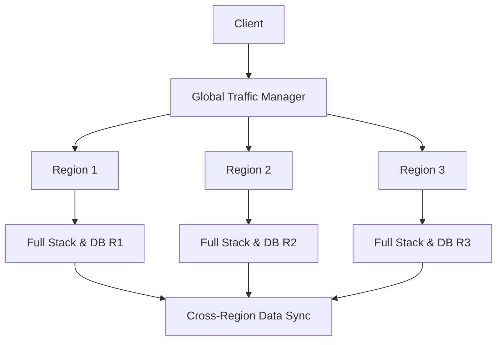

## Geodes Pattern
### Core Concepts
*   **Definition:** The Geodes Pattern is a system design approach where a complete, independent instance of an application's entire technology stack (including compute, storage, and possibly caching) is deployed to multiple geographically dispersed regions.
*   **Purpose:**
    *   **High Availability (HA):** Provides extreme resilience against regional outages, as other regions can immediately take over traffic.
    *   **Low Latency:** Routes user requests to the geographically closest available region, minimizing network travel time.
    *   **Disaster Recovery (DR):** Acts as an ultimate DR strategy, as each region can operate autonomously.
*   **Distinction:** Differs from traditional multi-region active-active setups where specific services might be spread across regions. In Geodes, *each region is a full, self-contained replica*.

### Key Details & Nuances
*   **Active-Active-Active:** All deployed regions are active and capable of serving traffic independently and concurrently.
*   **Full Stack Replication:** Every service, including front-end, back-end APIs, databases, message queues, and caches, is fully replicated within each region.
*   **Data Replication:** The most critical and complex aspect.
    *   Typically uses **asynchronous multi-master replication** for databases across regions.
    *   Prioritizes write availability and low latency, often leading to **eventual consistency**.
    *   Requires robust conflict resolution mechanisms (e.g., Last Write Wins, custom logic) for concurrent writes to the same data item in different regions.
*   **Traffic Routing:** Achieved through global load balancing mechanisms:
    *   **DNS Latency-Based Routing:** Routes users to the IP address of the closest healthy regional entry point.
    *   **Anycast IP:** Routes traffic to the topologically closest node announcing the same IP address.
    *   **Content Delivery Networks (CDNs):** Can route requests to the nearest point of presence (PoP) which then directs to the optimal region.
*   **Stateless Services:** Maximizing statelessness in application services simplifies the pattern, as state replication is confined primarily to the data layer.

### Practical Examples

**Global Geodes Architecture Flow:**

**Explanation:**
1.  A user's `Client` request is directed to the `Global Traffic Manager` (e.g., Route 53 with latency-based routing, Azure Traffic Manager, GCP Global External Load Balancer).
2.  The `Global Traffic Manager` routes the request to the nearest healthy `Region` (e.g., `Region 1`, `Region 2`, or `Region 3`).
3.  Each region contains a `Full Stack & DB` capable of handling the request autonomously.
4.  `Cross-Region Data Sync` ensures data replication and eventual consistency across all regional databases.

### Common Pitfalls & Trade-offs
*   **Cost:** Significantly higher operational cost due to running multiple complete, active infrastructures across different regions.
*   **Complexity:**
    *   **Deployment & Management:** More complex CI/CD, monitoring, and operations due to managing multiple identical, active deployments.
    *   **Data Consistency:** The most challenging aspect. Designing and implementing robust data conflict resolution strategies for multi-master replication is difficult and error-prone. Eventual consistency might not be suitable for all applications (e.g., financial transactions requiring strong consistency).
*   **Write Performance:** While reads benefit from proximity, writes often incur higher latency as they might need to be replicated across regions before full acknowledgment, or they rely on async replication introducing eventual consistency.
*   **Testing:** Thorough testing across all regions and failure scenarios (including data conflicts) is much more involved.

### Interview Questions
1.  **"Explain the Geodes Pattern and its primary benefits in a system design context."**
    *   **Answer:** The Geodes Pattern involves deploying a complete, independent instance of an application's full stack (compute, storage, services) in multiple geographical regions, all active. Its primary benefits are maximizing high availability, providing near-zero RTO disaster recovery, and reducing user latency by serving requests from the closest available region.
2.  **"How is data consistency typically handled in a Geodes deployment, and what are the associated challenges?"**
    *   **Answer:** Data consistency is usually achieved via asynchronous multi-master replication, leading to eventual consistency. Challenges include designing robust conflict resolution strategies (e.g., Last Write Wins, custom application-level logic), managing potential data discrepancies during reconciliation, and ensuring that application logic can gracefully handle eventually consistent data. Strong consistency is very difficult to achieve globally without significant latency penalties.
3.  **"What are the main drawbacks or trade-offs of implementing a Geodes Pattern compared to a simpler multi-region setup?"**
    *   **Answer:** The main drawbacks are significantly higher operational costs due to replicated infrastructure, increased complexity in deployment and management, and the inherent challenges of maintaining data consistency across globally distributed active databases, which often requires accepting eventual consistency and robust conflict resolution.
4.  **"For what types of applications or scenarios would you recommend a Geodes Pattern, and when would it be overkill?"**
    *   **Answer:** It's recommended for applications requiring extreme high availability (e.g., minimal downtime for critical services like global e-commerce, banking, or real-time communication platforms), very low latency for a globally distributed user base, and robust disaster recovery capabilities. It's overkill for applications that can tolerate some downtime, are primarily regional, or where strong global consistency is a non-negotiable requirement that outweighs latency concerns.