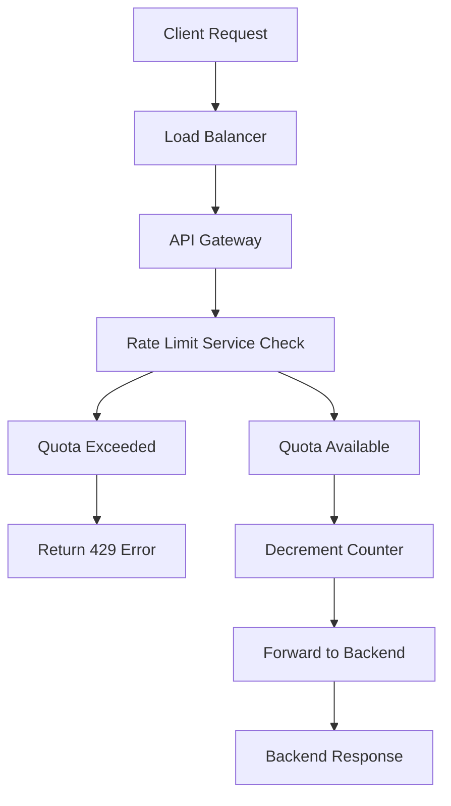

## Throttling Strategies
### Core Concepts
*   **Throttling (Rate Limiting):** A mechanism to control the rate at which an API or service is accessed by users or clients. It limits the number of requests a user can send within a given time window.
*   **Purpose:**
    *   **Resource Protection:** Prevent server overload, ensuring stability and availability for all users.
    *   **Cost Control:** Manage infrastructure costs by limiting usage.
    *   **Fairness:** Distribute available resources equitably among clients.
    *   **Security:** Mitigate DDoS attacks, brute-force attempts, and abuse.
    *   **Quality of Service (QoS):** Enforce different service tiers (e.g., free vs. premium accounts).

### Key Details & Nuances
*   **Algorithms:**
    *   **Fixed Window Counter:**
        *   **How:** A counter for each client that resets at the end of a fixed time window (e.g., 100 requests/minute).
        *   **Pros:** Simple to implement, low memory footprint.
        *   **Cons:** Prone to "bursty" traffic at the window edges (e.g., 200 requests within 1 second if window resets, then 200 more if next window starts, effectively 400 in ~1 second).
    *   **Sliding Window Log:**
        *   **How:** Stores a timestamp for every request in a sorted data structure (e.g., Redis sorted set). When a new request comes, remove timestamps older than the window, then check if the count exceeds the limit.
        *   **Pros:** Highly accurate, perfectly enforces the rate limit over the sliding window.
        *   **Cons:** High memory usage (stores every request's timestamp), high CPU cost for deletion/insertion, performance degrades with high request rates and large windows.
    *   **Sliding Window Counter (or "Sliding Log Approximation"):**
        *   **How:** Combines fixed windows with a sliding average. Calculates the current window's request count plus a weighted portion of the previous window's count.
        *   **Pros:** Balances accuracy and performance. Less "bursty" than fixed window, less memory/CPU intensive than sliding window log.
        *   **Cons:** Not perfectly accurate, can slightly over/under allow requests at window boundaries.
    *   **Leaky Bucket:**
        *   **How:** Requests are processed at a constant rate, like water leaking from a bucket. If requests arrive faster than they can be processed, the "bucket" overflows, and requests are dropped (or queued if queue enabled).
        *   **Pros:** Smooths out traffic, ensures a consistent output rate.
        *   **Cons:** May drop legitimate bursts if the bucket size is small or the leak rate is low. Does not allow for idle period credit accumulation.
    *   **Token Bucket:**
        *   **How:** Tokens are added to a "bucket" at a fixed rate. Each request consumes one token. If no tokens are available, the request is dropped/queued. Allows bursts up to the bucket's capacity.
        *   **Pros:** Allows for bursts (up to bucket size), simple to implement, handles idle periods (tokens accumulate).
        *   **Cons:** Requires careful tuning of refill rate and bucket size.
*   **Location of Throttling:**
    *   **Client-Side:** Least reliable (easily bypassed).
    *   **Server-Side:**
        *   **API Gateway/Load Balancer:** Centralized, efficient, protects backend services. Ideal for common limits across all services.
        *   **Application Layer:** Fine-grained control, custom logic. Can add overhead to application servers.
*   **Distributed Throttling:**
    *   **Challenge:** How to maintain a consistent rate limit across multiple instances of a service.
    *   **Solutions:**
        *   **Centralized Counter Store:** Use a distributed data store (e.g., Redis, Cassandra, Zookeeper) to store and increment/decrement counters. Requires atomic operations (`INCRBY`, `GETSET`).
        *   **Dedicated Rate Limiting Service:** A microservice specifically for rate limiting, often backed by Redis for high throughput.
        *   **Consensus Algorithms:** More complex, but can ensure strong consistency (e.g., using Paxos or Raft, but overkill for most rate limiters).

### Practical Examples

#### Distributed Throttling Flow (Conceptual)



#### Token Bucket Implementation (Simplified)

```typescript
class TokenBucket {
    private capacity: number;
    private tokens: number;
    private lastRefillTime: number;
    private refillRatePerSecond: number; // tokens per second

    constructor(capacity: number, refillRatePerSecond: number) {
        this.capacity = capacity;
        this.tokens = capacity; // Start with full bucket
        this.lastRefillTime = Date.now();
        this.refillRatePerSecond = refillRatePerSecond;
    }

    private refill(): void {
        const now = Date.now();
        const timeElapsedSeconds = (now - this.lastRefillTime) / 1000;
        const tokensToAdd = timeElapsedSeconds * this.refillRatePerSecond;

        this.tokens = Math.min(this.capacity, this.tokens + tokensToAdd);
        this.lastRefillTime = now;
    }

    public tryConsume(tokensToConsume: number = 1): boolean {
        this.refill(); // Always refill before attempting to consume

        if (this.tokens >= tokensToConsume) {
            this.tokens -= tokensToConsume;
            return true;
        }
        return false;
    }
}

// Example Usage: Allow 5 requests per second, with a burst capacity of 10 requests
const limiter = new TokenBucket(10, 5); // capacity: 10, refill: 5 tokens/sec

for (let i = 0; i < 15; i++) {
    const success = limiter.tryConsume();
    if (success) {
        console.log(`Request ${i + 1}: ALLOWED`);
    } else {
        console.log(`Request ${i + 1}: DENIED (rate limited)`);
    }
    // Simulate some time passing between requests
    if (i === 9) {
        // After 10 rapid requests, it should be denied. Wait a bit to refill.
        console.log("--- Waiting for refill ---");
        await new Promise(resolve => setTimeout(resolve, 1500)); // Wait 1.5 seconds
    }
}
```

### Common Pitfalls & Trade-offs
*   **Algorithm Choice:**
    *   **Leaky Bucket:** Good for very steady, predictable output rates, smoothing out bursts. Not ideal if bursts are meant to be allowed after idle periods.
    *   **Token Bucket:** Best balance for allowing controlled bursts while enforcing an average rate. More flexible.
    *   **Fixed Window:** Simplest but creates "bursts at the edge" problem.
    *   **Sliding Window Log:** Most accurate but resource-intensive, scales poorly with high throughput or large window sizes.
    *   **Sliding Window Counter:** Good compromise between accuracy and performance.
*   **Distributed Consistency vs. Performance:** Achieving strong consistency for rate limits across many nodes is complex and adds latency. Eventual consistency (e.g., using Redis where counters are updated and read, but small inconsistencies might occur due to network lag) is often sufficient and more performant.
*   **State Management Overhead:** Storing rate limit counters in a centralized store (like Redis) adds network round trips and can become a bottleneck. Caching and batching updates can help.
*   **Fairness:** Simply limiting total requests per IP isn't always fair. Consider per-user, per-API key, or per-endpoint limits.
*   **Over-Throttling:** Aggressive throttling can block legitimate users, leading to poor user experience. It's a balance between protecting resources and enabling usage.
*   **Edge Cases:** Handling leap seconds, daylight savings, or clock skew in distributed systems can affect time-based window calculations.

### Interview Questions
1.  **Describe the common rate-limiting algorithms and their respective strengths and weaknesses. In what scenarios would you choose one over another?**
    *   **Answer:** Discuss Fixed Window (simple, bursty at edges), Sliding Window Log (accurate, resource-intensive), Sliding Window Counter (compromise), Leaky Bucket (smooth output, no burst credit), and Token Bucket (burst tolerant, accumulates credit). Choose based on requirements:
        *   High accuracy: Sliding Window Log (if resource cost is acceptable).
        *   Burst tolerance: Token Bucket.
        *   Smooth traffic output: Leaky Bucket.
        *   Simplicity/low resource: Fixed Window (if edge problem is acceptable).
        *   Balanced: Sliding Window Counter.

2.  **How would you design a distributed rate limiter for an API with millions of requests per second? What challenges would you anticipate?**
    *   **Answer:**
        *   **Architecture:** Centralized rate limiting service or API Gateway layer.
        *   **Data Store:** Redis is a common choice due to its in-memory performance and atomic operations (`INCR`, `EXPIRE`, `ZADD`/`ZREM`).
        *   **Algorithm:** Sliding Window Counter or Token Bucket for efficiency and burst handling.
        *   **Challenges:**
            *   **Consistency:** Ensuring all API gateway instances see the same count (eventual consistency often acceptable).
            *   **Latency:** Network round trips to Redis for every request. Mitigate with local caching and asynchronous updates.
            *   **Scalability:** Scaling Redis (sharding, master-replica setup).
            *   **Failure Modes:** What if the Redis instance or rate limiting service goes down? Implement fail-open (allow requests) or fail-closed (deny requests) policies with circuit breakers.

3.  **Explain the trade-offs between accuracy and performance when choosing a rate-limiting algorithm. Provide examples.**
    *   **Answer:**
        *   **Accuracy:** How precisely the rate limit adheres to the defined rate over any given time window.
        *   **Performance:** The computational and memory overhead of the algorithm.
        *   **Trade-off:** More accurate algorithms (e.g., Sliding Window Log) typically require more memory (storing timestamps) and CPU (complex calculations/deletions), leading to lower performance. Less accurate algorithms (e.g., Fixed Window Counter) are very performant but can allow brief bursts violating the desired rate.
        *   **Example:** Sliding Window Log is very accurate but might require `O(N)` memory and computation per request for `N` requests in the window. Fixed Window is `O(1)` but can allow double the rate at window transitions.

4.  **How do you handle bursts efficiently with a rate limiter, and why is this important?**
    *   **Answer:**
        *   **Algorithms:** Token Bucket is ideal for handling bursts. It allows tokens to accumulate during idle periods, so when a burst of requests arrives, they can consume accumulated tokens up to the bucket's capacity. Leaky Bucket, on the other hand, smooths traffic and might drop burst requests if the bucket is full.
        *   **Importance:** Bursts are common (e.g., a user refreshes a page multiple times, a mobile app syncing data). Efficiently handling them improves user experience by not immediately rejecting legitimate, short-lived spikes in traffic, while still protecting resources from sustained overload. It prevents unnecessary 429 errors for valid usage patterns.

5.  **What strategies can be used if your primary rate-limiting service (e.g., a Redis cluster) experiences an outage?**
    *   **Answer:**
        *   **Fail-Open:** Default to allowing requests if the rate limiter is unavailable. This prioritizes availability over strict rate limiting. Risk: potential overload/abuse during outage.
        *   **Fail-Closed:** Default to denying requests if the rate limiter is unavailable. Prioritizes protection over availability. Risk: service becomes unusable.
        *   **Circuit Breaker:** Implement a circuit breaker pattern around the rate limiting service. If calls to the rate limiter start failing or time out, the circuit opens, and the application switches to a fallback policy (e.g., fail-open, or a very basic local per-instance rate limit).
        *   **Local Caching with TTL:** Cache recent rate limit states locally with a short Time-To-Live (TTL). If the centralized service is down, use the cached state for a grace period.
        *   **Graceful Degradation:** Allow a slightly higher rate during an outage, or only rate limit the most critical/expensive endpoints.