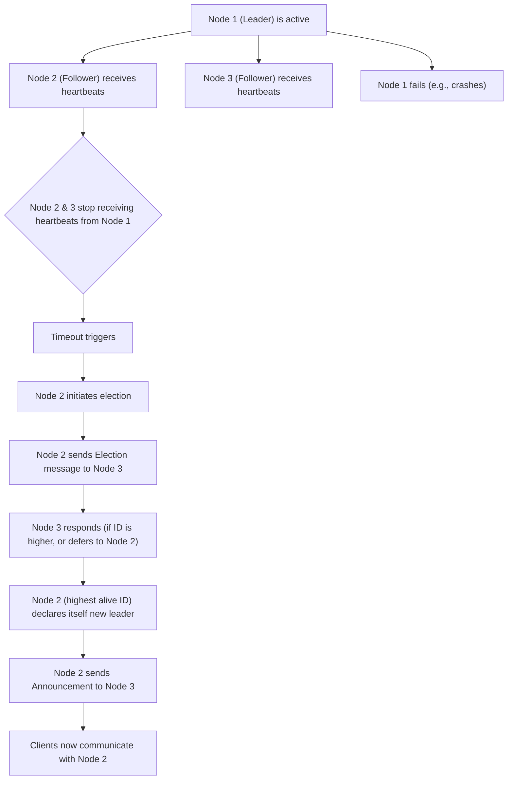

## Leader Election
### Core Concepts

*   **Definition:** A mechanism in distributed systems to designate a single node (the "leader" or "master") responsible for coordinating specific tasks, managing shared resources, or ensuring consistency among multiple replicas.
*   **Purpose:**
    *   **High Availability (HA):** Eliminates single points of failure. If the current leader fails, a new one is elected.
    *   **Coordination & Consistency:** Ensures that certain operations are performed by only one node, preventing conflicting updates (e.g., updating a shared state, managing a queue).
    *   **Simplification:** Centralizes decision-making for specific operations, simplifying application logic.
*   **Applications:** Distributed databases (primary-replica failover), distributed queues, distributed locks, cluster management systems (Kubernetes, ZooKeeper).

### Key Details & Nuances

*   **Uniqueness:** At any given time, there should ideally be only one leader.
*   **Fault Tolerance:** The system must be able to elect a new leader if the current one fails, without manual intervention.
*   **Consistency:** The newly elected leader must have the most up-to-date state or be able to recover it consistently.
*   **Heartbeating:** Nodes periodically send messages (heartbeats) to indicate they are alive. The leader sends heartbeats to followers, and followers can send heartbeats to the leader.
*   **Timeouts:** If a follower doesn't receive a heartbeat from the leader within a specified timeout, it assumes the leader has failed and initiates a new election.
*   **Quorum:** A minimum number of nodes (a majority) required to agree on a decision (e.g., electing a new leader, committing a write). This is crucial for preventing the "split-brain" problem. Typically, a quorum is `(N/2) + 1` for `N` nodes.
*   **Common Algorithms (Conceptual):**
    *   **Bully Algorithm:** Simpler, where a node detecting a leader failure sends an "election" message to all higher-ID nodes. The highest-ID node that responds becomes the leader. If no higher ID responds, the initiator becomes the leader.
    *   **Raft/Paxos:** More robust consensus algorithms that inherently provide leader election as part of achieving strong consistency. They handle network partitions and arbitrary failures more gracefully.
*   **Leader Lease/Term:** The leader's authority is often granted for a specific "term" or "lease" period, after which it must renew its leadership by getting confirmation from a quorum. This helps in case of network partitions where an old leader might still think it's in charge.

### Practical Examples

**1. Leader Election Process (Simplified Bully/Heartbeat Model)**



**2. Conceptual Leader Health Check**

```typescript
interface NodeStatus {
  id: string;
  isLeader: boolean;
  lastHeartbeatTime: number;
}

const HEARTBEAT_TIMEOUT_MS = 3000; // 3 seconds

class Node {
  id: string;
  isLeader: boolean = false;
  nodes: NodeStatus[] = []; // Other nodes in the cluster

  constructor(id: string) {
    this.id = id;
  }

  // Simulates receiving a heartbeat from another node
  receiveHeartbeat(fromNodeId: string) {
    const node = this.nodes.find(n => n.id === fromNodeId);
    if (node) {
      node.lastHeartbeatTime = Date.now();
    }
  }

  // Periodically checks the leader's status
  checkLeaderStatus() {
    const currentLeader = this.nodes.find(n => n.isLeader);

    if (currentLeader && (Date.now() - currentLeader.lastHeartbeatTime > HEARTBEAT_TIMEOUT_MS)) {
      console.log(`Node ${this.id}: Leader ${currentLeader.id} failed. Initiating new election.`);
      this.initiateElection();
    } else if (!currentLeader && !this.isLeader) {
      console.log(`Node ${this.id}: No leader detected. Initiating election.`);
      this.initiateElection();
    }
  }

  initiateElection() {
    // Simplified: In a real system, this would involve consensus or a bully algorithm
    // For demonstration, let's assume the highest ID becomes leader if others respond
    const myIdNum = parseInt(this.id.replace('Node ', ''));
    const aliveNodes = this.nodes.filter(n => (Date.now() - n.lastHeartbeatTime < HEARTBEAT_TIMEOUT_MS));

    let canBeLeader = true;
    for (const node of aliveNodes) {
      if (parseInt(node.id.replace('Node ', '')) > myIdNum) {
        canBeLeader = false; // A higher ID node is still alive
        break;
      }
    }

    if (canBeLeader) {
      this.declareLeader();
    } else {
      // Defer to higher ID or wait for election announcement
    }
  }

  declareLeader() {
    this.isLeader = true;
    this.nodes.forEach(n => n.isLeader = false); // Clear old leader status
    const myNodeStatus = this.nodes.find(n => n.id === this.id);
    if (myNodeStatus) {
      myNodeStatus.isLeader = true;
    }
    console.log(`Node ${this.id}: I am the new leader!`);
    // Announce leadership to other nodes
  }
}
```

### Common Pitfalls & Trade-offs

*   **Split-Brain:** When a network partition occurs, and two or more subsets of nodes each independently elect their own leader. This leads to conflicting actions and data inconsistency.
    *   **Mitigation:** Quorum-based elections (majority rule), fencing (isolating old leader), leader leases/terms.
*   **Election Overhead:** The process of electing a new leader can introduce latency and consume network/CPU resources, especially in large clusters or during frequent failures.
*   **False Positives:** A node might be declared failed due to temporary network glitches rather than an actual crash, leading to unnecessary elections and potential service disruption.
    *   **Trade-off:** Fast failure detection vs. avoiding false positives (tune timeouts, use multiple heartbeats).
*   **Network Partitions:** The most challenging scenario. Algorithms like Paxos/Raft are designed to handle these, but simpler algorithms might struggle, leading to unavailability or split-brain.
*   **Algorithm Complexity vs. Guarantees:**
    *   **Simple (Bully):** Easier to implement, but vulnerable to certain failure modes (e.g., if a high-ID node is partitioned). Good for less critical systems where eventual consistency is acceptable.
    *   **Complex (Raft/Paxos):** Harder to implement and debug, but provide strong consistency guarantees and better resilience to network partitions. Essential for mission-critical systems requiring strict data consistency.
*   **Leader Starvation:** In some algorithms, a node might repeatedly fail to become a leader due to various reasons, leading to unfairness or prolonged elections.

### Interview Questions

1.  **What is the purpose of leader election in a distributed system, and when is it necessary?**
    *   **Answer:** It's used to designate a single coordinator among multiple nodes to prevent conflicting operations, ensure consistency, and eliminate single points of failure. It's necessary when tasks require a central orchestrator (e.g., primary for writes, distributed lock manager, task scheduler) and high availability is critical.

2.  **Describe a common leader election algorithm (e.g., Bully or briefly explain the concept in Raft) and its key properties.**
    *   **Answer (Bully):** In the Bully algorithm, when a node detects the leader is down, it sends an "election" message to all nodes with higher IDs. If a higher-ID node responds, the initiator stops; otherwise, it becomes the leader and announces it. If a higher-ID node responds, it then starts its own election. Key properties include simple implementation and eventual leader election, but it can be inefficient (many messages) and prone to issues during network partitions.

3.  **How do you handle the "split-brain" problem in leader election, and why is it so dangerous?**
    *   **Answer:** Split-brain occurs when a network partition causes multiple nodes to believe they are the legitimate leader, leading to conflicting operations and data corruption. It's dangerous because it breaks consistency. It's primarily handled using **quorum-based decision making** (a majority of nodes must agree) and **fencing** (mechanisms to ensure an old, partitioned leader cannot cause harm, e.g., by revoking its access to shared resources). Leader "leases" or "terms" also help, ensuring leadership expires if not actively renewed by a majority.

4.  **What are the key trade-offs to consider when choosing a leader election strategy for a distributed service?**
    *   **Answer:**
        *   **Consistency vs. Availability:** Simpler algorithms might favor availability over strong consistency during partitions. More robust algorithms (like Raft) prioritize consistency, potentially sacrificing availability if a quorum cannot be formed.
        *   **Performance Overhead:** Election processes introduce latency and resource consumption. Faster failure detection might lead to more frequent elections.
        *   **Complexity:** Simple algorithms are easier to implement but less resilient. Complex algorithms (Raft/Paxos) are powerful but challenging to build and debug correctly.
        *   **Fault Tolerance:** How well the algorithm handles various failures (node crashes, network partitions, message loss).

5.  **How does leader election relate to distributed consensus, and why are they often discussed together?**
    *   **Answer:** Leader election is often a *component* or *byproduct* of a broader distributed consensus algorithm (like Raft or Paxos). Consensus algorithms aim to get a majority of nodes to agree on a single value or decision, even in the presence of failures. In such algorithms, a stable leader is usually elected first, and then this leader coordinates the consensus process, proposing values and replicating logs. A stable leader simplifies consensus significantly by centralizing the proposal phase, making the system more efficient and easier to reason about.