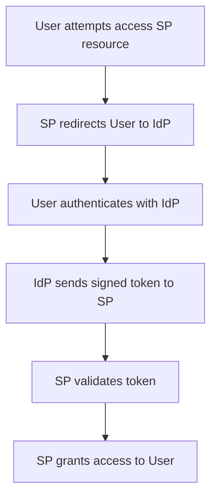

## Federated Identity
### Core Concepts
*   **Definition:** A system that allows users to access resources across multiple independent domains (Service Providers - SPs) using a single set of authentication credentials managed by a trusted third party (Identity Provider - IdP). It establishes a trust relationship between the IdP and SPs, enabling Single Sign-On (SSO).
*   **Primary Goal:** Enable seamless user experience by eliminating the need to re-authenticate for each service, while centralizing identity management and improving security.
*   **Key Roles:**
    *   **User/Client:** The individual trying to access a service.
    *   **Service Provider (SP):** The application or service that the user wants to access (e.g., Salesforce, Google Workspace). It relies on an IdP for authentication.
    *   **Identity Provider (IdP):** The system responsible for authenticating the user and providing identity assertions to SPs (e.g., Okta, Auth0, Azure AD, Google Identity).

### Key Details & Nuances
*   **Trust Relationship:** The core of federated identity is the pre-established trust between an IdP and one or more SPs. The SP trusts the IdP to verify the user's identity accurately.
*   **Standards:**
    *   **SAML (Security Assertion Markup Language):** XML-based standard for exchanging authentication and authorization data between an IdP and an SP. Widely used for enterprise SSO.
    *   **OAuth 2.0 (Open Authorization):** An authorization framework (not an authentication protocol) that allows a user to grant a third-party application limited access to their resources on another service, without sharing credentials. Defines roles: Resource Owner, Resource Server, Client, Authorization Server.
    *   **OpenID Connect (OIDC):** An identity layer built on top of OAuth 2.0. It enables clients to verify the identity of the End-User based on authentication performed by an Authorization Server (IdP) and to obtain basic profile information about the End-User in an interoperable REST-like manner. Preferred for modern web and mobile applications.
*   **Identity Assertion/Token:** After successful authentication, the IdP issues a cryptographically signed assertion (SAML) or token (OIDC - JWT) containing user identity and attributes, which the SP validates.
*   **Attribute Exchange:** Federated identity often includes the exchange of user attributes (e.g., email, groups, roles) from the IdP to the SP, enabling authorization decisions at the SP.

### Practical Examples

**Mermaid Diagram: OIDC/SAML Basic Flow**

### Common Pitfalls & Trade-offs
*   **Complexity:** Setting up and managing federated identity can be complex, especially with multiple SPs and custom attribute mappings.
*   **Single Point of Failure/Compromise:** If the IdP is compromised, all connected SPs are at risk. Robust security and high availability for the IdP are paramount.
*   **Vendor Lock-in:** Choosing a specific IdP or set of standards can lead to dependencies on that vendor's ecosystem.
*   **Performance Overhead:** Redirection flows and token validation introduce slight latency compared to direct authentication, though often negligible.
*   **Attribute Management:** Ensuring consistent and secure attribute exchange between IdP and SPs requires careful planning and synchronization.
*   **Session Management:** Managing sessions across the IdP and various SPs (e.g., logout propagation) can be challenging.

### Interview Questions
1.  **Question:** Explain the core difference between SAML and OpenID Connect (OIDC) in the context of federated identity, and when you would choose one over the other.
    **Answer:** SAML is an XML-based protocol primarily used for enterprise SSO, often in B2B scenarios, and handles both authentication and authorization. OIDC is an identity layer built on OAuth 2.0, using JSON Web Tokens (JWTs). It's simpler for developers, preferred for modern web/mobile apps, and designed for RESTful APIs. Choose SAML for legacy enterprise integrations or when rich authorization profiles are needed; OIDC for new, consumer-facing apps, mobile, or microservices due to its simplicity and REST-friendliness.

2.  **Question:** Describe the role of an Identity Provider (IdP) and a Service Provider (SP) in a federated identity system. How do they establish trust?
    **Answer:** The IdP authenticates the user and issues identity assertions (e.g., SAML assertions, OIDC ID Tokens). The SP is the application or service that trusts the IdP's assertion to grant access. Trust is established out-of-band, typically through metadata exchange where the SP consumes the IdP's public key (for digital signature verification) and endpoint URLs, and vice versa for the IdP to know SP details (e.g., redirect URIs). This allows the SP to cryptographically verify assertions issued by the IdP.

3.  **Question:** What are the main benefits of adopting a federated identity solution compared to traditional siloed authentication? Discuss a significant security consideration.
    **Answer:** Main benefits include: **Single Sign-On (SSO)** for users, reducing password fatigue and increasing productivity; **Centralized Identity Management**, simplifying user provisioning/deprovisioning; **Enhanced Security**, as credentials are not shared directly with SPs, and strong authentication methods can be enforced at the IdP. A significant security consideration is the **IdP becoming a single point of failure or compromise**. If the IdP is breached, attackers could gain access to all connected SPs, making robust security, high availability, and monitoring of the IdP critical.

4.  **Question:** How does an SP verify the authenticity and integrity of an identity assertion (e.g., a SAML assertion or OIDC ID Token) received from an IdP?
    **Answer:** The SP verifies the assertion using cryptographic signatures. For SAML, the IdP signs the XML assertion with its private key, and the SP uses the IdP's pre-configured public key to verify the signature. For OIDC, the IdP signs the JWT with its private key, and the SP retrieves the IdP's public key (often from a `/.well-known/jwks.json` endpoint) to verify the signature. Additionally, the SP checks parameters like issuer, audience, expiry time (`exp`), and issued at time (`iat`) to ensure the token is valid and intended for that SP.