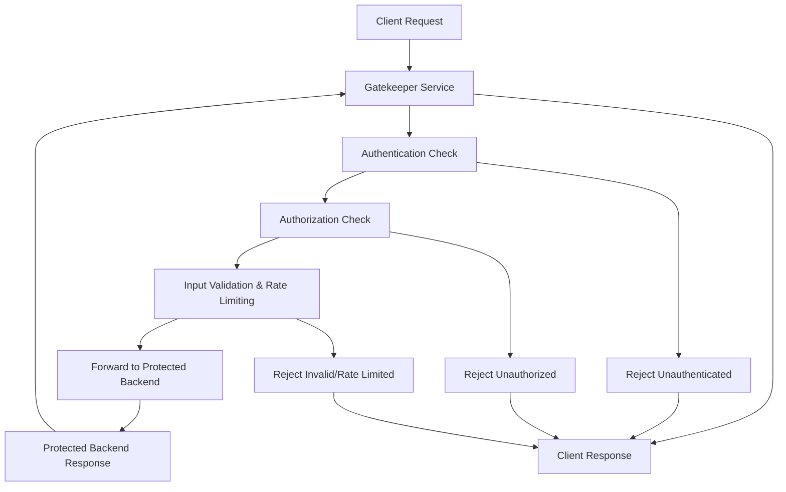

## Gatekeeper Pattern
### Core Concepts
The Gatekeeper Pattern is a system design pattern where an intermediary service (a "gatekeeper") acts as a front-end to a set of backend services. Its primary role is to enforce security policies, validate requests, and protect the internal services from direct external access or malicious traffic. It centralizes common security and operational concerns, offloading them from individual backend services.

### Key Details & Nuances
*   **Purpose:** Centralizes security controls (authentication, authorization, input validation, rate limiting, DDoS protection, WAF), reducing the burden on individual backend services and ensuring consistent policy enforcement.
*   **Location:** Typically implemented at the edge of a network or as a component of an API Gateway, acting as a reverse proxy.
*   **Responsibilities:**
    *   **Authentication (AuthN):** Verifies the identity of the client (e.g., JWT validation, API key checks).
    *   **Authorization (AuthZ):** Determines if the authenticated client has permission to access the requested resource.
    *   **Input Validation:** Sanitizes and validates request parameters (headers, query strings, body) to prevent common attacks (e.g., SQL injection, XSS).
    *   **Rate Limiting/Throttling:** Controls the number of requests a client can make over a period to prevent abuse and ensure fair usage.
    *   **Threat Protection:** Filters out malicious traffic, often integrating with Web Application Firewalls (WAFs).
    *   **Logging & Monitoring:** Provides a centralized point for auditing and observability of incoming requests.
*   **Benefits:**
    *   **Improved Security Posture:** Centralized control makes it easier to apply and update security policies consistently.
    *   **Reduced Complexity for Backend Services:** Backend services can focus purely on business logic.
    *   **Enhanced Resilience:** Protects services from overload or malformed requests.
    *   **Consistent Experience:** Ensures all requests go through the same validation process.

### Practical Examples

#### **Request Flow through a Gatekeeper**



#### **Conceptual Middleware Implementation (Node.js/Express)**

```typescript
// Example: Simplified Gatekeeper Middleware
// In a real system, this would be a separate service or sophisticated API Gateway

const express = require('express');
const app = express();
const jwt = require('jsonwebtoken'); // For JWT validation
const rateLimit = require('express-rate-limit'); // For rate limiting

// Dummy secret for JWT
const JWT_SECRET = 'your_super_secret_key';

// 1. Rate Limiting Middleware
const apiLimiter = rateLimit({
    windowMs: 15 * 60 * 1000, // 15 minutes
    max: 100, // Limit each IP to 100 requests per windowMs
    message: "Too many requests from this IP, please try again after 15 minutes"
});
app.use(apiLimiter);

// 2. Authentication Middleware
const authenticateToken = (req, res, next) => {
    const authHeader = req.headers['authorization'];
    const token = authHeader && authHeader.split(' ')[1]; // Bearer TOKEN

    if (token == null) return res.sendStatus(401); // No token

    jwt.verify(token, JWT_SECRET, (err, user) => {
        if (err) return res.sendStatus(403); // Invalid token
        req.user = user; // Attach user payload to request
        next();
    });
};

// 3. Authorization Middleware (example: check for 'admin' role)
const authorizeRole = (roles) => {
    return (req, res, next) => {
        if (!req.user || !roles.includes(req.user.role)) {
            return res.sendStatus(403); // Forbidden
        }
        next();
    };
};

// 4. Input Validation (basic example)
const validateProductInput = (req, res, next) => {
    const { name, price } = req.body;
    if (!name || typeof name !== 'string' || name.trim() === '') {
        return res.status(400).send('Product name is required and must be a string.');
    }
    if (typeof price !== 'number' || price <= 0) {
        return res.status(400).send('Product price must be a positive number.');
    }
    next();
};

// Protected routes using the Gatekeeper Pattern
app.post('/products', authenticateToken, authorizeRole(['admin']), validateProductInput, (req, res) => {
    // This is the "Protected Backend Service" logic
    console.log('Product created:', req.body);
    res.status(201).send('Product created successfully!');
});

app.get('/data', authenticateToken, (req, res) => {
    // Accessible to any authenticated user
    res.json({ message: `Welcome, ${req.user.username}! This is protected data.` });
});

// Start server
const PORT = 3000;
app.listen(PORT, () => {
    console.log(`Gatekeeper server running on port ${PORT}`);
});
```

### Common Pitfalls & Trade-offs
*   **Single Point of Failure (SPOF):** If the gatekeeper itself fails, all services behind it become unreachable. Requires high availability (HA) and robust error handling.
*   **Increased Latency:** Every request must pass through the gatekeeper, adding a small overhead to each transaction.
*   **Complexity:** Implementing and managing a robust gatekeeper (especially an API Gateway solution) can be complex, requiring careful configuration, monitoring, and scaling.
*   **Over-Engineering:** For very simple applications or microservices with limited security requirements, a full-fledged gatekeeper might be overkill and introduce unnecessary overhead.
*   **Traffic Bottleneck:** Without proper scaling and resource allocation, the gatekeeper can become a bottleneck under heavy load.
*   **Misconfiguration:** Incorrectly configured security policies can lead to security vulnerabilities (e.g., allowing unauthorized access) or denial of service (e.g., blocking legitimate traffic).

### Interview Questions

1.  **What is the Gatekeeper Pattern in system design, and why is it considered a crucial component for modern distributed systems?**
    *   **Answer:** The Gatekeeper Pattern involves an intermediary service that acts as a secure entry point for backend services, enforcing security policies (AuthN, AuthZ, input validation, rate limiting) and protecting internal systems. It's crucial for modern distributed systems because it centralizes security, offloads common concerns from microservices, enhances resilience against attacks, and ensures consistent policy application across diverse services.

2.  **How does the Gatekeeper Pattern differ from a standard reverse proxy or load balancer, and what unique responsibilities does it typically assume?**
    *   **Answer:** While a gatekeeper often *acts* as a reverse proxy or is part of an API Gateway, its primary distinction is its *security-centric* focus. A standard reverse proxy primarily forwards requests and handles load balancing, whereas a gatekeeper specifically enforces authentication, authorization, input validation, rate limiting, and other security measures before forwarding requests. It's an active decision-making layer, not just a pass-through.

3.  **Describe a scenario where a poorly implemented Gatekeeper Pattern could introduce new security vulnerabilities or operational issues. How would you mitigate these risks?**
    *   **Answer:** A poorly implemented gatekeeper could introduce a single point of failure (if not made highly available), become a performance bottleneck (if not scaled properly), or, critically, if misconfigured, allow unauthorized access or be susceptible to bypass attacks. Mitigation includes: implementing HA (e.g., multiple instances, failover mechanisms), rigorous performance testing and horizontal scaling, comprehensive security audits, least-privilege configuration, and continuous monitoring/logging to detect anomalies.

4.  **Beyond authentication and authorization, what are some less obvious but equally important security functions a Gatekeeper might perform?**
    *   **Answer:** Beyond AuthN/AuthZ, crucial functions include:
        *   **Input/Schema Validation:** Sanitizing and validating request payloads against defined schemas to prevent injection attacks (SQLi, XSS) and malformed requests.
        *   **Rate Limiting/Throttling:** Protecting backend services from denial-of-service (DoS) attacks or abuse by limiting client request frequency.
        *   **Threat Intelligence Integration:** Blocking requests from known malicious IP addresses or bot networks.
        *   **Protocol Transformation:** Allowing external clients to communicate using one protocol (e.g., REST) while internal services use another (e.g., gRPC), often with security policy enforcement during transformation.
        *   **Logging and Auditing:** Centralized collection of access logs for security monitoring and compliance.

5.  **When might you advise against using a Gatekeeper Pattern, or prefer a decentralized approach to security, even in a microservices architecture?**
    *   **Answer:** While generally beneficial, one might advise against it for:
        *   **Extremely Simple/Low-Risk Services:** If the service has minimal external exposure and sensitive data, the overhead and complexity might outweigh the benefits.
        *   **Strict Latency Requirements:** For applications where every millisecond counts and the gatekeeper adds unacceptable latency.
        *   **Immature Infrastructure:** If the team lacks the operational maturity or tools to manage a complex, highly available gatekeeper, it could become a liability.
        *   **High Intra-Service Communication:** A gatekeeper is primarily for *external* traffic. Internal service-to-service communication might benefit more from mutual TLS (mTLS) or service meshes for decentralized security, rather than routing all internal traffic through a central gatekeeper.