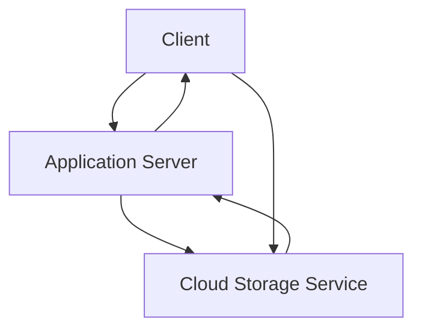

## Valet Key Pattern
### Core Concepts
*   **Delegated Access:** The Valet Key pattern is a design pattern where an application server delegates direct access to a specific resource in a cloud storage service (or other backend service) to a client, using a temporary, limited-privilege credential (the "valet key").
*   **Offloading Server:** It primarily offloads the transfer of large files or large volumes of data from the application server, allowing clients to interact directly with the storage service. This reduces bandwidth, CPU, and memory usage on the application server.
*   **Security Principle:** Adheres to the principle of "least privilege" by providing time-limited and scope-limited access.

### Key Details & Nuances
*   **Flow:**
    1.  **Request:** Client requests a Valet Key from the application server for a specific operation (e.g., upload a file, download a specific document).
    2.  **Generate:** The application server, after authenticating and authorizing the client, generates a short-lived, permission-scoped credential (the "valet key") from the cloud storage service.
    3.  **Return:** The application server returns this key (e.g., a pre-signed URL for AWS S3) to the client.
    4.  **Direct Interaction:** The client uses the received key to directly interact with the cloud storage service, bypassing the application server for the data transfer.
*   **Types of Valet Keys:**
    *   **Pre-signed URLs (AWS S3, Azure Blob Storage):** Most common example, allowing direct PUT (upload) or GET (download) operations for a specified duration.
    *   **Shared Access Signatures (SAS) (Azure):** Similar to pre-signed URLs, offering granular control over permissions and expiry.
    *   **Temporary Security Credentials (AWS STS):** Can provide temporary access keys, secret keys, and session tokens for more complex operations.
*   **Advantages:**
    *   **Scalability:** Reduces load on application servers, allowing them to handle more control plane requests rather than data plane transfers.
    *   **Cost Efficiency:** Can reduce data transfer costs if server-side proxying involves egress fees.
    *   **Performance:** Faster transfers as data flows directly between client and cloud storage, often leveraging CDN integration.
*   **Security Controls:**
    *   **Time-limited:** Keys expire automatically after a set duration.
    *   **Scope-limited:** Keys are typically restricted to specific objects, buckets, or actions (e.g., `putObject` for upload, `getObject` for download).
    *   **Authentication/Authorization:** The application server remains responsible for authenticating the client and authorizing the key generation request.

### Practical Examples

#### **Conceptual Flow Diagram**


#### **TypeScript (AWS S3 Pre-signed URL for Upload)**

```typescript
// Core concept: Server-side generation of a Valet Key (e.g., AWS S3 Pre-signed URL)
import { S3Client, PutObjectCommand } from "@aws-sdk/client-s3";
import { getSignedUrl } from "@aws-sdk/s3-request-presigner";

/**
 * Generates a pre-signed URL for uploading an object to an S3 bucket.
 * This URL acts as the "valet key".
 *
 * @param bucketName The name of the S3 bucket.
 * @param objectKey The full path/key of the object to be uploaded (e.g., 'uploads/image.jpg').
 * @param expiresInSeconds The duration (in seconds) the URL is valid. Defaults to 1 hour.
 * @returns A promise that resolves with the pre-signed URL string.
 */
async function generateValetKeyForUpload(
    bucketName: string,
    objectKey: string,
    expiresInSeconds: number = 3600
): Promise<string> {
    // Configure S3 client (e.g., specify region, credentials if not using IAM roles)
    const s3Client = new S3Client({ region: process.env.AWS_REGION || "us-east-1" });

    // Define the S3 PUT operation command
    const command = new PutObjectCommand({
        Bucket: bucketName,
        Key: objectKey,
        ContentType: "application/octet-stream", // Or derive from client request
        // Add any other specific headers or metadata required for the upload
    });

    try {
        // Generate the pre-signed URL
        const url = await getSignedUrl(s3Client, command, { expiresIn: expiresInSeconds });
        return url;
    } catch (error) {
        console.error(`Error generating pre-signed URL for ${objectKey}:`, error);
        throw new Error("Failed to generate valet key for upload.");
    }
}

// --- Conceptual Usage in an API Endpoint (e.g., Express.js) ---
/*
import express from 'express';
const app = express();
app.use(express.json());

app.post('/get-upload-url', async (req, res) => {
    const { filename, filetype } = req.body;
    if (!filename || !filetype) {
        return res.status(400).send('Filename and filetype are required.');
    }

    try {
        const uploadKey = await generateValetKeyForUpload(
            'my-app-user-uploads', // Your S3 bucket name
            `user-files/${Date.now()}-${filename}`, // Unique object key
            300 // Valet key valid for 5 minutes
        );
        res.json({ uploadUrl: uploadKey });
    } catch (error) {
        res.status(500).send('Internal server error when generating upload URL.');
    }
});

app.listen(3000, () => console.log('Server running on port 3000'));
*/
```

### Common Pitfalls & Trade-offs
*   **Key Expiration/Revocation:**
    *   **Pitfall:** Keys with excessively long expiry times increase the window of opportunity for misuse if intercepted. Most valet keys are very hard to revoke *before* their natural expiry.
    *   **Mitigation:** Set the shortest reasonable expiry time. For critical security scenarios requiring immediate revocation, a proxy-based approach might be necessary, or implement a "proxy" at the storage layer (e.g., a Lambda/Cloud Function that validates requests against a revocation list before proxying to storage).
*   **Over-Privileging:**
    *   **Pitfall:** Granting broader permissions than necessary (e.g., a key that allows deleting objects when only upload is needed).
    *   **Mitigation:** Strictly adhere to the principle of least privilege. The application server should generate keys with the absolute minimum required permissions for the intended action and object.
*   **Leakage of Keys:**
    *   **Pitfall:** If a generated valet key is exposed (e.g., logged, sent over insecure channels), anyone can use it until it expires.
    *   **Mitigation:** Always use HTTPS. Do not log keys. Ensure client-side code handles keys securely.
*   **Complexity vs. Benefit:**
    *   **Trade-off:** Implementing the Valet Key pattern adds initial complexity compared to direct server-side proxying.
    *   **Consideration:** It's justified when dealing with large volumes of data, high traffic, or large individual files where offloading the server significantly improves scalability, performance, or reduces cost. For small, infrequent file transfers, direct server-side proxying might be simpler to implement and manage.
*   **Error Handling:**
    *   **Pitfall:** Client-side upload/download failures may not propagate detailed errors back to the application server immediately, making debugging harder.
    *   **Mitigation:** Design a robust client-side retry mechanism and ensure the application server has ways to reconcile object status (e.g., through webhooks from storage service, or client confirming successful upload).

### Interview Questions
1.  **"Describe a scenario where you would use the Valet Key pattern. What problems does it solve?"**
    *   **Answer:** Typically used for large file uploads/downloads (e.g., user profile pictures, video files) or bulk data transfers to/from cloud storage. It solves application server bottlenecks (CPU, memory, network I/O) by offloading data transfer directly to the highly optimized cloud storage service, improving scalability, reducing operational costs, and often improving transfer speed.
2.  **"What are the primary security considerations when implementing a Valet Key pattern, and how would you address them?"**
    *   **Answer:** Key concerns are limiting access and preventing misuse. Address this by:
        *   **Time-limited:** Issuing short-lived keys.
        *   **Scope-limited:** Restricting keys to specific objects/paths and minimum necessary operations (e.g., only `putObject` for uploads).
        *   **Authentication & Authorization:** The application server must robustly authenticate the client and authorize the *request to generate the key* before issuing it.
        *   **Secure Transport:** Always use HTTPS/SSL to transmit the key to the client.
        *   **No Logging:** Avoid logging generated keys.
3.  **"How does the Valet Key pattern differ from a traditional file upload/download where the application server acts as a proxy? What are the trade-offs?"**
    *   **Answer:** In traditional proxying, the client sends data *to* the application server, which then forwards it to storage. With Valet Key, the client sends data *directly* to storage using a temporary credential obtained from the server.
    *   **Trade-offs:**
        *   **Valet Key Advantages:** Better scalability, reduced server load/cost, potentially faster transfers, leverages CDN benefits.
        *   **Proxy Advantages:** Simpler implementation for small scale, easier to implement custom real-time processing/validation during transfer, easier to revoke access mid-transfer (though less performant).
        *   **Valet Key Disadvantages:** More complex initial setup, harder to track/audit in real-time by the app server, difficult to revoke *active* keys before expiry.
4.  **"Suppose a valet key (e.g., a pre-signed URL) is compromised before its expiry. How would you handle this situation or mitigate the risk?"**
    *   **Answer:** Direct revocation of an active pre-signed URL is generally not possible for most cloud storage services (it's a signature, not a session). Mitigation focuses on minimizing impact:
        *   **Short Expiry:** Issue keys with very short expiry times (seconds to minutes) to limit the window of exposure.
        *   **Scope Limitation:** Ensure the key is limited to a single object or a very specific path, not an entire bucket.
        *   **Monitoring/Auditing:** Monitor storage access logs for unusual activity.
        *   **Immediate Action:** If an *account* or IAM role used to generate keys is compromised, rotate credentials and revoke broad access immediately. For a single leaked key, the best approach is to wait for expiry or delete the underlying object if possible.
5.  **"When might the Valet Key pattern *not* be the right choice for file transfer?"**
    *   **Answer:**
        *   **Small, infrequent files:** The overhead of generating and managing keys might outweigh the benefits.
        *   **Real-time processing during transfer:** If you need to inspect, modify, or validate file content *as* it's being uploaded (e.g., virus scanning, watermarking), proxying through the server might be simpler, though you could combine Valet Key with serverless functions triggered by storage events.
        *   **Strict compliance/auditing:** If every byte transfer *must* pass through your controlled server for logging or compliance reasons (though cloud storage logs are usually sufficient).
        *   **Complex authentication/authorization:** If access decisions are highly dynamic and require real-time database lookups for every chunk of data, a proxy might be necessary.