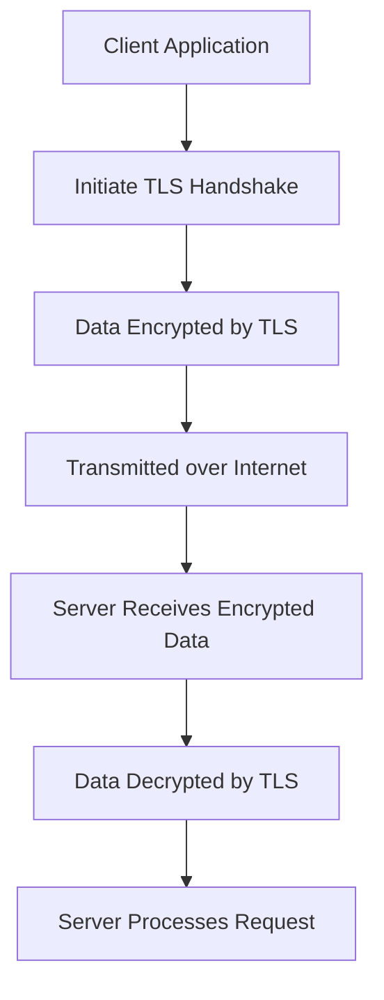

## Security Best Practices
### Core Concepts
*   **Definition:** A proactive and systematic approach to integrate security considerations throughout the entire System Development Life Cycle (SDLC), from design and development to deployment and maintenance.
*   **CIA Triad:** The fundamental goals of information security:
    *   **Confidentiality:** Protecting information from unauthorized access.
    *   **Integrity:** Ensuring information is accurate, complete, and protected from unauthorized modification.
    *   **Availability:** Ensuring authorized users can access information and systems when needed.
*   **"Shift Left" Security:** Emphasizing security measures early in the development process (design, coding) rather than only at the end (testing, production).
*   **Assume Breach Mentality:** Designing systems with the assumption that a breach is inevitable, focusing on detection, containment, and recovery rather than just prevention.

### Key Details & Nuances
*   **Principle of Least Privilege (PoLP):** Granting users, processes, and applications only the minimum necessary permissions to perform their required tasks. Reduces the attack surface and potential damage from compromise.
*   **Defense in Depth:** Implementing multiple layers of security controls (e.g., network firewalls, host-based firewalls, secure coding practices, data encryption, access controls) to create a robust defense.
*   **Secure Defaults:** Ensuring that systems, applications, and configurations are secure out-of-the-box, requiring explicit actions to reduce security rather than increase it.
*   **Input Validation & Output Encoding:**
    *   **Input Validation:** Sanitize, filter, and validate all user inputs (e.g., user-provided data, query parameters, headers) to prevent injection attacks (SQL Injection, XSS, Command Injection). Validate data type, length, format, and range.
    *   **Output Encoding:** Escaping data before rendering it in a specific context (HTML, JavaScript, URL) to prevent the browser from interpreting user-supplied data as executable code.
*   **Encryption:**
    *   **Data at Rest:** Encrypting data stored in databases, file systems, or backups (e.g., AES-256).
    *   **Data in Transit:** Encrypting data communicated over networks (e.g., TLS/SSL for HTTP, SSH for remote access, VPNs).
*   **Secure Authentication & Authorization:**
    *   **Authentication:** Strong password policies, Multi-Factor Authentication (MFA), password hashing (e.g., bcrypt, scrypt), rate limiting for login attempts.
    *   **Authorization:** Role-Based Access Control (RBAC), Attribute-Based Access Control (ABAC), OAuth 2.0 and OpenID Connect for delegated authorization and identity.
*   **Security Logging & Monitoring:** Implement comprehensive logging for security-relevant events (e.g., failed logins, access to sensitive data, configuration changes) and monitor logs for anomalies and potential attacks.
*   **Incident Response Plan:** A well-defined plan for detecting, responding to, and recovering from security incidents. Includes roles, responsibilities, communication protocols, and containment/eradication strategies.
*   **Regular Security Audits & Penetration Testing:** Proactively identifying vulnerabilities through code reviews, static/dynamic analysis (SAST/DAST), and simulated attacks by ethical hackers.
*   **Supply Chain Security:** Vetting third-party libraries, dependencies, and external services for known vulnerabilities (e.g., using SCA tools) and ensuring their security practices align with your own.

### Practical Examples

#### Data Encryption in Transit Flow
A fundamental security best practice is to encrypt data as it travels across networks, typically using TLS/SSL.



#### Input Sanitization (TypeScript)
Example of basic HTML input sanitization to prevent Cross-Site Scripting (XSS). In production, always use a robust library like DOMPurify.

```typescript
/**
 * A basic function to sanitize HTML input by encoding common HTML entities.
 * NOTE: For production, use a dedicated library like DOMPurify or sanitize-html.
 * This example is for illustrative purposes only.
 */
function sanitizeHtmlInput(input: string): string {
  if (typeof input !== 'string') {
    return ''; // Or throw an error, depending on requirements
  }
  return input
    .replace(/&/g, "&amp;")  // Must be first
    .replace(/</g, "&lt;")
    .replace(/>/g, "&gt;")
    .replace(/"/g, "&quot;")
    .replace(/'/g, "&#039;"); // For apostrophes
}

// Example usage:
const userInputDangerous = "<script>alert('You are hacked!');</script><h1>Hello & Welcome!</h1>";
const sanitizedInput = sanitizeHtmlInput(userInputDangerous);

console.log(`Original: ${userInputDangerous}`);
console.log(`Sanitized: ${sanitizedInput}`);
// Output: Sanitized: &lt;script&gt;alert(&#039;You are hacked!&#039;);&lt;/script&gt;&lt;h1&gt;Hello &amp; Welcome!&lt;/h1&gt;

const userInputSafe = "Just a regular text string.";
console.log(`Sanitized Safe: ${sanitizeHtmlInput(userInputSafe)}`);
// Output: Sanitized Safe: Just a regular text string.
```

### Common Pitfalls & Trade-offs
*   **Security by Obscurity:** Relying on the secrecy of an implementation or design as the primary security measure instead of well-tested, open standards. This is not a real security measure.
*   **Ignoring Third-Party Dependencies:** Failing to regularly audit and update open-source libraries and frameworks, which often contain known vulnerabilities.
*   **Insufficient Logging & Monitoring:** Not collecting enough security-relevant logs or failing to actively monitor them, leading to delayed detection of breaches.
*   **Neglecting Physical Security:** Overlooking physical access controls to servers or data centers.
*   **Single Point of Failure:** Designing systems where the compromise of one component can lead to complete system failure or data breach.
*   **Trade-offs:**
    *   **Security vs. Performance:** Strong encryption and extensive logging can introduce overhead. High-security measures may require more powerful (and costly) hardware.
    *   **Security vs. Usability:** Very strict password policies, frequent MFA, and complex access flows can degrade user experience.
    *   **Security vs. Cost:** Implementing robust security measures, hiring security experts, and using advanced tools can be expensive.

### Interview Questions
1.  **Question:** How do you implement "Defense in Depth" in a typical web application architecture, providing specific examples for each layer?
    **Answer:** Defense in Depth involves layering security controls. For a web app, this means:
    *   **Network Layer:** Firewalls (WAF, network ACLs) to block malicious traffic.
    *   **Host Layer:** Secure OS configurations, endpoint protection, host-based firewalls, regular patching.
    *   **Application Layer:** Input validation, output encoding, secure coding practices (OWASP Top 10), secure authentication/authorization.
    *   **Data Layer:** Encryption at rest (database encryption), encryption in transit (TLS), regular backups.
    *   **Operational Layer:** Security logging, monitoring, incident response, regular penetration testing.

2.  **Question:** Explain the "Principle of Least Privilege" (PoLP) and provide an example of its application in a microservices environment.
    **Answer:** PoLP dictates that entities (users, processes, services) should only be granted the minimum necessary permissions to perform their specific function, and no more. In a microservices environment, this means:
    *   Each microservice's API key or service account should only have access to the specific database tables, S3 buckets, or other services it absolutely needs.
    *   For example, a "Product Catalog" service should only have read access to product data, not write access to order data. If it needs to update product stock, it should use a dedicated endpoint/permission for that specific action, rather than full write access to the entire database.

3.  **Question:** What are the key considerations for securing data both at rest and in transit?
    **Answer:**
    *   **Data at Rest:**
        *   **Encryption:** Use strong encryption algorithms (e.g., AES-256) for databases, file systems, and backups. Manage encryption keys securely (e.g., using a Key Management Service - KMS).
        *   **Access Control:** Implement strict access controls (RBAC/ABAC) on storage systems.
        *   **Data Masking/Tokenization:** For sensitive data that doesn't need to be decrypted for all operations.
        *   **Auditing:** Log all access attempts to sensitive data.
    *   **Data in Transit:**
        *   **Encryption:** Use TLS/SSL for all network communications (HTTP, API calls, database connections). For internal service-to-service communication, enforce mTLS (mutual TLS).
        *   **Strong Ciphers:** Ensure modern, strong cipher suites are used and outdated ones are disabled.
        *   **Certificates:** Use valid, trusted certificates and implement certificate pinning where appropriate.

4.  **Question:** Describe your approach to handling user input securely to prevent common web vulnerabilities.
    **Answer:** My approach focuses on never trusting user input:
    1.  **Validation:** Validate all input at the earliest possible point (e.g., client-side for UX, but *always* server-side for security). Check data types, length, format (e.g., regex), range, and expected values. Reject invalid input outright.
    2.  **Sanitization:** Remove or encode potentially malicious characters from input. For HTML content, use a dedicated library like DOMPurify to whitelist safe tags and attributes, preventing XSS.
    3.  **Parameterized Queries/Prepared Statements:** Always use these for database interactions to prevent SQL Injection, as they separate code from data.
    4.  **Output Encoding:** Before displaying any user-generated content back to the user, ensure it is properly encoded for the context (HTML, URL, JavaScript) to prevent XSS.
    5.  **Contextual Security:** Be aware of the specific vulnerability type (XSS, SQLi, Command Injection) and apply the appropriate defense (encoding, parameterization, escaping).

5.  **Question:** How do you balance security requirements with system performance and user experience?
    **Answer:** This is a crucial trade-off:
    *   **Identify Critical Assets:** Prioritize security for the most sensitive data and critical system components. Not all data needs the same level of encryption or access control.
    *   **Optimize Security Controls:** Choose efficient algorithms (e.g., hardware-accelerated encryption), optimize logging mechanisms to minimize overhead, and implement security in an asynchronous manner where possible.
    *   **User Experience:**
        *   **Progressive Security:** Introduce security measures incrementally, explaining their purpose (e.g., "MFA protects your account").
        *   **Streamlined Processes:** Design secure workflows to be as seamless as possible (e.g., "remember me" functionality with care, single sign-on).
        *   **Just-in-Time Access:** Grant privileged access only when needed, for a limited time, to reduce friction while maintaining security.
    *   **Monitoring and A/B Testing:** Continuously monitor performance metrics and user feedback. A/B test different security implementations to find the optimal balance.
    *   **Risk-Based Approach:** Base security decisions on a thorough risk assessment, accepting some calculated risks for improved performance or UX, but only for low-impact scenarios.