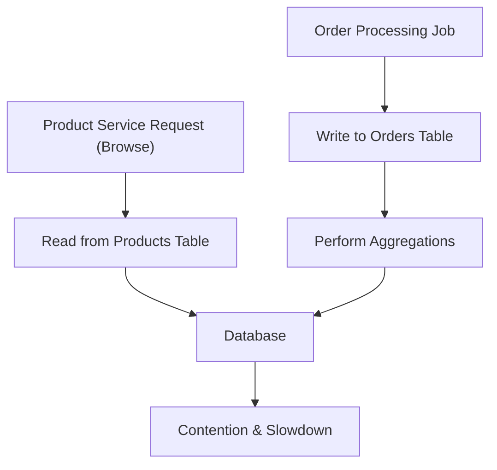

## Monolithic Persistence
### Core Concepts

*   **Monolithic Persistence:** A single, large, and often complex database instance that serves all the data needs of a monolithic application. All data, regardless of domain or access patterns, resides within this single database.
*   **Performance Antipattern:** Leads to significant performance bottlenecks as the application scales and complexity grows.

### Key Details & Nuances

*   **Shared Schema:** All application modules share a single database schema. This tight coupling makes schema changes difficult and risky.
*   **Resource Contention:** Different modules contend for the same database resources (CPU, memory, I/O, network), leading to unpredictable performance.
*   **Scaling Limitations:**
    *   **Vertical Scaling:** Only possible to a certain extent. Eventually, the single database becomes a hard limit.
    *   **Horizontal Scaling:** Difficult to shard effectively due to the interwoven nature of data and lack of clear domain boundaries. Read replicas can help, but write contention remains.
*   **Data Access Layer (DAL) Complexity:** The DAL often becomes overly complex, trying to manage different access patterns, transaction isolation levels, and data types for disparate parts of the application.
*   **Testing Difficulties:** Testing becomes challenging due to the interdependencies and the need for a fully functional, large database.
*   **Technology Lock-in:** The chosen database technology must satisfy all use cases, potentially leading to compromises for specialized data needs.

### Practical Examples

*   **Scenario:** An e-commerce monolith where the `Users` table, `Products` table, `Orders` table, and `Inventory` table all reside in a single PostgreSQL database.

*   **Problematic Query Example:** A high-traffic product browsing feature (`GET /products`) might inadvertently cause contention with a background order processing job that performs complex aggregations on the `Orders` table.

### Common Pitfalls & Trade-offs

*   **Initial Simplicity vs. Future Complexity:** While simpler to start, it quickly becomes unmanageable as the application grows.
*   **"Just Add Indexes":** Often an initial reaction to performance issues, but it doesn't solve underlying resource contention or scaling problems.
*   **Transaction Management:** Ensuring ACID compliance across diverse operations in a single database can become a complex balancing act, often leading to suboptimal transaction isolation levels.
*   **Data Duplication/Denormalization:** To improve read performance for specific modules, data might be denormalized, leading to consistency issues if not managed carefully.

### Interview Questions

1.  **Question:** Describe a situation where monolithic persistence could become a significant performance bottleneck.
    **Answer:** In a large e-commerce application, imagine a high-traffic product browsing feature (many `SELECT` queries on `products` and `inventory`) running concurrently with an order fulfillment process that frequently updates `orders` and `inventory` with complex transactions. Without separation, these operations contend for the same database locks, CPU, and I/O, leading to slow response times for both users and the fulfillment system. Scaling solutions like read replicas help, but write contention remains a core issue.

2.  **Question:** What are the main challenges of scaling a monolithic database compared to a microservices architecture with independent databases?
    **Answer:**
    *   **Database Schema Coupling:** All services share one schema, making independent schema evolution difficult and risky.
    *   **Resource Contention:** All services compete for the same database resources (CPU, memory, I/O, network), making it hard to isolate performance impacts.
    *   **Scaling Complexity:** Sharding a single monolithic database across diverse data domains is often impractical. Horizontal scaling is limited to replicating the entire monolith.
    *   **Technology Choice Limitations:** A single database technology must satisfy all use cases, potentially compromising specialized needs (e.g., a graph DB for relationships or a time-series DB for metrics).

3.  **Question:** How might you identify that your monolithic persistence layer is causing performance issues?
    **Answer:**
    *   **Database Metrics:** High CPU, memory, or I/O utilization on the database server.
    *   **Slow Query Logs:** Frequent, long-running queries, often involving complex joins across many tables or table scans.
    *   **Application Logs:** Increased latency in requests that heavily interact with the database. Error rates increasing due to timeouts or deadlocks.
    *   **Lock Contention:** Monitoring database lock wait times and identifying bottlenecks caused by multiple processes waiting for resource access.
    *   **Resource Saturation:** Observing that adding more application instances doesn't improve performance, indicating the database is the limiting factor.