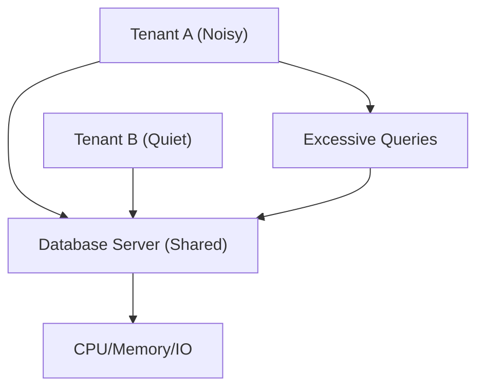

## Noisy Neighbor
### Core Concepts

*   **Definition:** The "Noisy Neighbor" is a performance anti-pattern in shared resource environments where one tenant's or application's excessive resource consumption negatively impacts the performance of other tenants or applications sharing the same underlying infrastructure.
*   **Impact:** Leads to degraded performance, unpredictable latency, and poor user experience for unaffected tenants.
*   **Environment:** Primarily seen in multi-tenant systems, cloud computing (IaaS, PaaS), and any environment where resources are pooled and shared.

### Key Details & Nuances

*   **Resource Types:** Can affect CPU, memory, network bandwidth, disk I/O, database connections, and even shared caching layers.
*   **Tenant Isolation:** Poor isolation mechanisms are the root cause. Tenants are not effectively contained within their allocated resource limits.
*   **Root Cause Analysis:** Difficult as the "noisy neighbor" may not be intentionally malicious but rather a consequence of inefficient code, high load, or misconfiguration.
*   **Detection:** Monitoring is crucial. Anomalies in resource utilization, increased error rates, or latency spikes for specific tenants can indicate a noisy neighbor.
*   **Mitigation Strategies:** Resource throttling, rate limiting, capacity planning, better isolation technologies (e.g., containers, virtual machines with proper resource guarding), QoS (Quality of Service) policies.

### Practical Examples

*   **Scenario:** A shared database instance for multiple microservices in a multi-tenant SaaS application.

*   **Impact:** Tenant A's heavy, unoptimized queries consume a disproportionate number of database connections and I/O, slowing down Tenant B's requests that also rely on the shared database.

### Common Pitfalls & Trade-offs

*   **Over-provisioning:** Provisioning significantly more resources than needed to avoid perceived noisy neighbor issues can lead to increased costs and underutilization.
*   **Aggressive Throttling:** While necessary, aggressive throttling can sometimes impact legitimate high-usage tenants if not carefully configured, turning it into a denial-of-service for that tenant.
*   **Complexity of Isolation:** Implementing robust isolation adds complexity to the system architecture and management.
*   **Detection Latency:** Identifying a noisy neighbor often happens after performance degradation has already occurred, leading to reactive rather than proactive solutions.

### Interview Questions

1.  **Question:** How would you detect and diagnose a "noisy neighbor" problem in a distributed microservices architecture?
    **Answer:** Detection involves comprehensive monitoring of resource utilization (CPU, memory, network, disk I/O) at the service and infrastructure level, correlated with application-level metrics like latency and error rates. We'd look for spikes in resource usage for one service/tenant that coincide with performance degradation for others. Diagnosis would involve tracing requests across services, analyzing logs, and potentially using profiling tools to identify the resource-intensive operations. Tagging metrics and logs by tenant ID is crucial for isolation.

2.  **Question:** Describe a scenario where a noisy neighbor might impact a distributed cache. How would you mitigate this?
    **Answer:** In a shared cache cluster (e.g., Redis), one tenant performing many expensive operations like complex Lua scripts, large `KEYS *` scans, or excessive `FLUSHALL`/`FLUSHDB` commands could consume significant CPU and memory, increasing latency for all other tenants accessing the cache. Mitigation includes:
    *   **Database-level Throttling/Rate Limiting:** On the cache client side.
    *   **Cache Sharding/Partitioning:** Assigning cache partitions to specific tenants or groups of tenants.
    *   **Resource Quotas:** Implementing per-tenant limits on memory usage or command execution rate within the cache system if supported.
    *   **Dedicated Cache Instances:** For critical or high-usage tenants.

3.  **Question:** What are the trade-offs between using strict resource limits (like cgroups) versus rate limiting for preventing noisy neighbors?
    **Answer:** Strict resource limits (e.g., CPU shares, memory limits) provide hard caps, preventing one process from consuming more than its allocated slice, thus offering strong isolation. However, they can be less flexible; a tenant might hit its limit even during legitimate high load, causing artificial starvation. Rate limiting (e.g., per-request limits) is more dynamic and targets specific actions, allowing bursts up to a certain rate. It's good for controlling traffic patterns but less effective for preventing overall resource exhaustion if the *nature* of the work is heavy. The trade-off is between hard isolation (limits) versus flexible control of specific operations (rate limiting). Often, a combination is best.