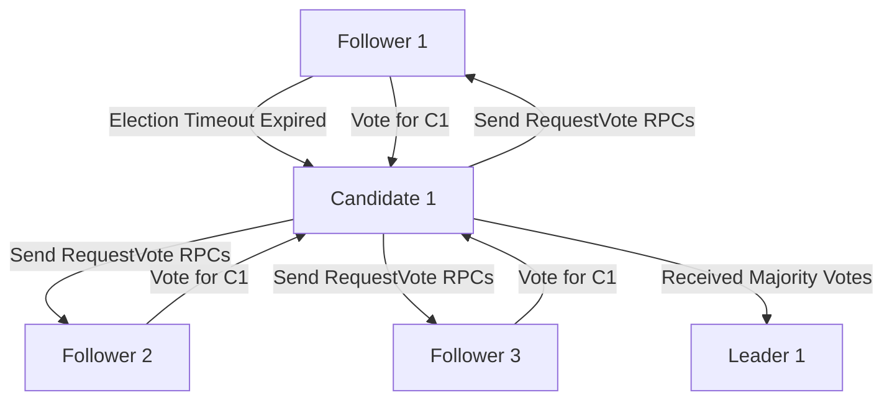

## Raft Consensus Algorithm
### Core Concepts
*   **Distributed Consensus Algorithm**: Raft is designed for managing a replicated log across a cluster of machines, ensuring all nodes agree on the sequence of operations even in the face of failures.
*   **State Machine Replication**: The primary goal is to build fault-tolerant systems using replicated state machines. Client commands are applied in the same order on all replicas, ensuring consistent outputs.
*   **Understandability-First**: Raft prioritizes being understandable and implementable compared to other consensus algorithms like Paxos, while offering equivalent safety and liveness guarantees.
*   **Strong Leader Model**: A core tenet where one server is elected as the leader, responsible for all client requests and log replication. This simplifies system behavior.

### Key Details & Nuances
*   **Server States**: A server in a Raft cluster can be in one of three states:
    *   `Follower`: Passive; responds to requests from leaders and candidates.
    *   `Candidate`: Actively seeking to be elected as the new leader.
    *   `Leader`: Handles all client requests, replicates log entries, and sends heartbeats.
*   **Terms**: A monotonically increasing integer used to represent logical time periods. Each term begins with an election, and if a leader is elected, it serves for the rest of the term. Terms help identify out-of-date information.
*   **Remote Procedure Calls (RPCs)**:
    *   `RequestVote RPC`: Sent by candidates to gather votes during an election.
    *   `AppendEntries RPC`: Sent by leaders to replicate log entries to followers and as heartbeats to maintain leadership.
*   **Leader Election Process**:
    1.  **Election Timeout**: Each follower maintains a randomized election timeout (e.g., 150-300ms). If it expires without receiving an `AppendEntries` heartbeat from the leader, the follower transitions to `Candidate`.
    2.  **Candidate Action**: Increments its `currentTerm`, votes for itself, and sends `RequestVote` RPCs to all other servers.
    3.  **Vote Granting**: Servers grant a vote if the candidate's `term` is at least as up-to-date as their own and their log is at least as up-to-date. Each server votes for at most one candidate per term.
    4.  **Election Outcome**:
        *   If the candidate receives votes from a `majority` of servers in the same `term`, it becomes the `Leader`.
        *   If it discovers a valid leader (e.g., an `AppendEntries` with a higher or equal `term`), it reverts to a `Follower`.
        *   If the election timeout expires again without a clear winner, it increments `term` and retries.
    *   **Randomized Election Timers**: Crucial for preventing frequent split votes during elections.
*   **Log Replication and Consistency**:
    1.  **Leader Receives Command**: A leader receives a client command, appends it as a new entry to its local log.
    2.  **AppendEntries**: Leader sends `AppendEntries` RPCs to all followers with new log entries. Each `AppendEntries` includes the index and term of the log entry *preceding* the new ones (`prevLogIndex`, `prevLogTerm`) for consistency checking.
    3.  **Follower Response**:
        *   If `prevLogIndex` and `prevLogTerm` don't match its log, the follower rejects the entries. The leader decrements `nextIndex` for that follower and retries until a match is found.
        *   If they match, the follower appends the entries to its log.
    4.  **Commitment**: An entry is `committed` when it has been safely replicated to a `majority` of servers. Only committed entries are applied to the state machine.
*   **Safety Guarantees (Critical for Interviews)**:
    *   `Election Safety`: At most one leader can be elected in a given term.
    *   `Leader Append-Only`: Leaders only append new entries; they never delete or overwrite existing ones.
    *   `Log Matching`: If two logs contain an entry with the same index and term, then the logs are identical in all preceding entries.
    *   `Leader Completeness`: If a log entry is committed in a given term, then that entry will be present in the logs of all future leaders.
    *   `State Machine Safety`: If a server applies a log entry at a given index to its state machine, no other server will ever apply a different log entry for the same index.
*   **Cluster Membership Changes**: Raft uses a `joint consensus` approach for adding or removing servers to maintain safety and availability. The system temporarily operates with two overlapping configurations (old and new majorities must agree) before transitioning to the new configuration.

### Practical Examples
#### Basic Leader Election Flow

### Common Pitfalls & Trade-offs
*   **Performance vs. Consistency**: Raft prioritizes strong consistency, meaning every write requires acknowledgment from a majority of servers. This introduces network latency for each write operation. For high-throughput, eventually consistent workloads, Raft might be overkill.
*   **Leader Bottleneck**: All client requests must go through the leader. The leader's capacity (CPU, network I/O) can become a bottleneck for write-heavy applications. Read requests can potentially be served by followers if eventual consistency is acceptable.
*   **Network Partitioning**: While Raft guarantees safety (no inconsistent commits) during partitions, availability can be impacted. A minority partition might elect a leader, but it won't be able to commit entries. The majority partition will continue operating.
*   **Split Votes & Election Delays**: Although randomized election timeouts mitigate it, it's still possible for multiple candidates to arise and split votes, leading to extended election periods or multiple rounds of elections before a leader is chosen.
*   **Client Redirection**: Clients must always find and communicate with the current leader. This requires a mechanism for clients to discover the leader or be redirected by followers.

### Interview Questions
1.  **Q:** Explain the Raft leader election process. How does it ensure only one leader is elected per term, and what mechanisms prevent perpetual elections due to split votes?
    **A:** A follower becomes a candidate if its election timeout expires. It increments its `currentTerm`, votes for itself, and sends `RequestVote` RPCs to peers. If it receives votes from a majority, it becomes leader. `Election Safety` is ensured as each server votes for at most one candidate per term, and a candidate needs a majority. `Randomized election timeouts` (e.g., 150-300ms) help prevent simultaneous timeouts and split votes by making it highly probable only one server times out first and wins.
2.  **Q:** How does Raft ensure log consistency and safety when a new leader is elected after a failure? Specifically, discuss the `Leader Completeness` property.
    **A:** Raft ensures log consistency by requiring a new leader to have the most up-to-date log. When a candidate requests votes, it includes its `lastLogIndex` and `lastLogTerm`. Voters only grant a vote if their log is *not* "more complete" than the candidate's. The `Leader Completeness` property states that if a log entry is committed in a given term, then that entry will be present in the logs of all future leaders. This is enforced because a new leader must have all committed entries from its predecessors by virtue of being elected by a majority that *must* contain at least one server that had the committed entry. The leader then forces its log onto followers via `AppendEntries`.
3.  **Q:** Compare Raft's approach to cluster membership changes (joint consensus) with a naive approach of simply updating configuration files. What are the safety and availability implications?
    **A:** A naive approach (e.g., updating configuration and restarting servers) risks safety and availability. If the new configuration is applied partially or incorrectly during a failure, it could lead to split-brain scenarios (multiple leaders, inconsistent states) or a lack of quorum, halting the system. Raft's `joint consensus` is a two-phase commit: the cluster first transitions to a `(C_old, C_new)` configuration where operations require agreement from *both* the old and new majorities. Once this joint configuration is committed, the cluster transitions to `C_new`. This guarantees safety and continuous availability throughout the configuration change by ensuring a majority can always be formed and preventing multiple leaders.
4.  **Q:** Discuss the performance implications and trade-offs of using Raft for a write-heavy application.
    **A:** Raft enforces strong consistency, which introduces performance trade-offs for write-heavy applications. Every write request must be replicated to a `majority` of followers before it can be committed. This means each write involves at least one network round-trip from the leader to followers and back for acknowledgment. Latency is directly impacted by network conditions and quorum size. Increasing cluster size for higher fault tolerance increases the quorum, potentially increasing latency. Throughput is limited by the leader's ability to process and replicate entries to the majority.
5.  **Q:** When would you choose Raft over other consensus algorithms like Paxos, or even simpler replication methods?
    **A:** Raft is often chosen over Paxos due to its *understandability* and *simplicity of implementation* while providing equivalent safety and liveness. For simpler replication methods (e.g., primary-backup without consensus), Raft is chosen when `strong consistency` and `fault tolerance` for state changes are critical, meaning you cannot tolerate data loss or divergence in the face of multiple node failures or network partitions. If eventual consistency or weaker consistency models are acceptable (e.g., for analytics, caching), then simpler, higher-throughput replication methods might be preferred.