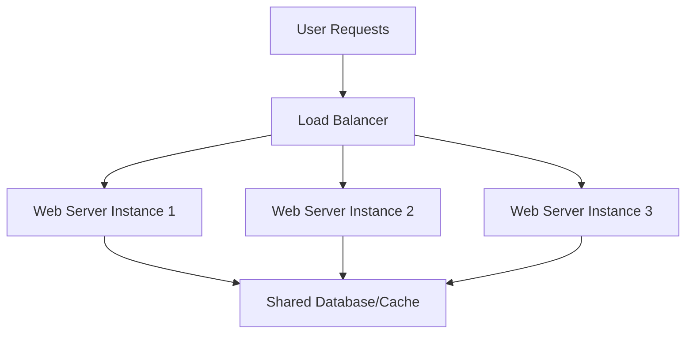

## Performance vs Scalability
### Core Concepts
*   **Performance:** How quickly a single operation or request is completed, or the amount of work a system can accomplish within a fixed timeframe *under a specific load*.
    *   **Key Metrics:** Latency (response time for a single request), Throughput (requests per second for a *fixed* system capacity).
*   **Scalability:** The ability of a system to handle an increasing amount of work (e.g., more users, higher data volume, more requests) by adding resources, without significant degradation in performance.
    *   **Key Metrics:** How throughput increases with added resources, concurrent user capacity, resource utilization as load grows.

### Key Details & Nuances
*   **Relationship:** A high-performance system is not necessarily scalable. A system might be very fast for a single user but collapse under load. Conversely, a highly scalable system might not have the absolute lowest latency for a single request if it trades off for distributed processing overhead.
*   **Scaling Strategies:**
    *   **Vertical Scaling (Scale Up):** Adding more resources (CPU, RAM, faster disk) to an existing server/machine.
        *   **Pros:** Simpler to manage, less architectural complexity, lower operational overhead initially.
        *   **Cons:** Finite limits (hardware ceiling), higher cost per unit of resource at higher tiers, single point of failure.
    *   **Horizontal Scaling (Scale Out):** Adding more identical servers/nodes to a distributed system.
        *   **Pros:** Near-limitless scaling potential, higher fault tolerance (redundancy), more cost-effective with commodity hardware.
        *   **Cons:** Significantly increases system complexity (load balancing, distributed data management, consistency, inter-service communication, monitoring).
*   **Identifying Bottlenecks:** Critical for effective scaling. Common bottlenecks include:
    *   CPU-bound operations (heavy computation)
    *   Memory-bound operations (insufficient RAM, excessive swapping)
    *   I/O-bound operations (disk reads/writes, network latency/bandwidth)
    *   Database contention (locks, slow queries, limited connections)

### Practical Examples
**Horizontal Scaling of a Web Service**

*   **Description:** User requests hit a Load Balancer, which distributes traffic across multiple identical Web Server Instances. This allows the system to handle more concurrent users and requests by adding more `Web Server Instance` nodes, effectively scaling horizontally. The database/cache often needs its own scaling strategy (e.g., read replicas, sharding) to avoid becoming the next bottleneck.

### Common Pitfalls & Trade-offs
*   **Premature Optimization:** Focusing on micro-optimizations for performance before understanding the actual bottlenecks or needing to scale. Often leads to wasted effort.
*   **Ignoring Bottlenecks:** Attempting to scale a system by adding resources to the wrong component (e.g., adding more web servers when the database is the actual bottleneck).
*   **Overlooking Distributed System Complexity:** Horizontal scaling introduces challenges like:
    *   **Data Consistency:** Ensuring all nodes have the same, up-to-date data (e.g., CAP Theorem tradeoffs).
    *   **State Management:** How to handle session state (sticky sessions vs. stateless services).
    *   **Inter-service Communication:** Latency and reliability of network calls between services.
    *   **Operational Overhead:** Deploying, monitoring, and debugging distributed systems.
*   **Amdahl's Law:** Highlights that the maximum speedup of a program due to parallelization is limited by the sequential portion of the program. If 20% of a task must be sequential, even with infinite parallel resources, you can't get more than a 5x speedup. This limits the ultimate scalability of any system.
*   **Cost vs. Benefit:** Every scaling solution comes with increased infrastructure costs, operational complexity, and development time. It's crucial to evaluate if the cost justifies the gain in performance/scalability for the current business needs.

### Interview Questions
1.  **"Define performance and scalability in the context of system design. How are they related, and can a system be high-performance but not scalable?"**
    *   **Answer:** Performance is about how fast individual operations are (latency) or how much work a system does per second *at a fixed size* (throughput). Scalability is the ability to handle *increased* load by adding resources without significant performance degradation. They are related as scalability often aims to maintain performance under growing load. Yes, a system can be high-performance (e.g., very low latency for one user) but not scalable if it hits inherent bottlenecks quickly when load increases, or cannot efficiently utilize added resources.
2.  **"Explain the difference between vertical and horizontal scaling. When would you choose one over the other, and what are the main implications of each?"**
    *   **Answer:** Vertical scaling (scale up) means adding more power (CPU, RAM) to an existing server, simpler but limited by hardware ceilings and creating a single point of failure. Horizontal scaling (scale out) means adding more servers/nodes, offering near-limitless potential and fault tolerance, but introducing significant distributed system complexity (e.g., load balancing, data consistency, distributed state). Choose vertical for simplicity and when load increases are manageable/predictable; choose horizontal for high availability, massive scale requirements, and to avoid single points of failure, understanding the increased complexity cost.
3.  **"You've identified a performance bottleneck in your system (e.g., slow database queries). Outline your approach to diagnose and resolve it, considering both performance and scalability."**
    *   **Answer:** First, **verify the bottleneck** using profiling tools (APM, database query logs, system metrics). If it's slow queries, I'd:
        1.  **Optimize Queries:** Add/optimize indexes, rewrite inefficient queries, avoid N+1 problems.
        2.  **Caching:** Implement caching layers (Redis, Memcached) for frequently accessed, less volatile data.
        3.  **Database Scaling:**
            *   **Vertical:** Upgrade DB server resources (CPU, RAM) if feasible.
            *   **Horizontal (Read Replicas):** Offload read traffic to replicas.
            *   **Sharding/Partitioning:** Distribute data across multiple DB instances if table size/write volume is the issue, though this adds significant complexity.
        4.  **Application Code Review:** Ensure application interacts efficiently with the database (e.g., connection pooling, batching operations).
    *   The goal is to fix the immediate performance issue while ensuring the solution scales with future load.
4.  **"Discuss the trade-offs involved when moving from a monolithic application on a single powerful server to a distributed microservices architecture for scalability."**
    *   **Answer:** The primary gain is **scalability** (individual services can scale independently) and **fault isolation** (failure in one service doesn't bring down the whole app). However, trade-offs include:
        *   **Increased Complexity:** Distributed transactions, inter-service communication (network latency, RPC overhead), eventual consistency.
        *   **Operational Overhead:** More services to deploy, monitor, and manage (CI/CD, logging, tracing, service mesh).
        *   **Development Complexity:** Data consistency across services, debugging distributed issues.
        *   **Cost:** Potentially higher infrastructure and operational costs due to more machines and tools.
        *   **Performance:** Can introduce network latency for inter-service calls, potentially slower than in-process calls in a monolith.
5.  **"How does the CAP theorem relate to scalability in distributed systems, particularly when dealing with data?"**
    *   **Answer:** The CAP theorem states that a distributed system cannot simultaneously guarantee Consistency, Availability, and Partition Tolerance. In a scalable distributed system, partitions (network failures) are inevitable. Therefore, you must choose between Consistency (all nodes see the same data at the same time) and Availability (every request receives a response, even if it's not the latest data). For highly scalable web services, developers often prioritize Availability and Partition Tolerance, accepting eventual consistency, as strict consistency can severely limit availability during network partitions. For financial transactions, Consistency might be prioritized, potentially sacrificing some availability during network issues.