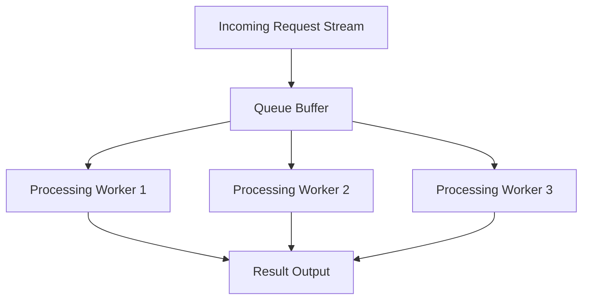

## Latency vs Throughput
### Core Concepts
*   **Latency:** The time delay between a cause and effect, or the time it takes for a single operation/request to complete from start to finish.
    *   **Measurement:** Typically measured in milliseconds (ms), microseconds (µs), or nanoseconds (ns).
    *   **Analogy:** The time it takes for *one* car to travel from origin to destination.
*   **Throughput:** The rate at which a system can process a number of operations, transactions, or requests over a given period.
    *   **Measurement:** Typically measured in operations per second (OPS), requests per second (RPS), transactions per second (TPS), or messages per second (MPS).
    *   **Analogy:** The number of cars that can pass a certain point on a road per hour.

### Key Details & Nuances
*   **Relationship:** Latency and throughput are often inversely related, or at least they present a trade-off. Optimizing for one can negatively impact the other.
    *   **Example:** A batch processing system might have high latency for any single item (because it waits for others) but very high throughput overall. A real-time system prioritizes low latency, potentially at the cost of maximum throughput if not scaled adequately.
*   **Context Matters:**
    *   **Latency-Sensitive Systems:** Real-time user interfaces, financial trading platforms, video conferencing, online gaming. Users directly experience delays.
    *   **Throughput-Sensitive Systems:** Batch processing, data analytics pipelines, asynchronous message queues, logging systems. The total volume processed is key.
*   **Bottlenecks:** Identifying bottlenecks is crucial. A component with high latency can reduce overall system throughput if it's in a critical path.
*   **Queuing Theory:** Understanding queues is vital. As system utilization approaches 100%, latency (due to queuing delays) increases non-linearly, even if raw processing time remains constant. This is Little's Law: L = λW (average number of items in a stationary system `L` equals the average arrival rate `λ` times the average time an item spends in the system `W`).

### Practical Examples

The following diagram illustrates a processing pipeline.

*   **Optimizing for Low Latency:**
    *   Minimize `B["Queue Buffer"]` size or bypass it for critical requests.
    *   Ensure `C`, `D`, `E` (processing workers) are highly optimized for single-request speed.
    *   Reduce network hops and serialization/deserialization overhead.
    *   Use faster hardware, optimized algorithms.
*   **Optimizing for High Throughput:**
    *   Increase the number of `C`, `D`, `E` (processing workers) to handle more requests concurrently.
    *   Utilize `B["Queue Buffer"]` effectively to smooth out request spikes, allowing workers to process at their own pace.
    *   Process requests in batches if possible (each batch has high latency but high throughput).
    *   Leverage parallelism (e.g., multi-threading, distributed systems).

### Common Pitfalls & Trade-offs
*   **False Dichotomy:** It's not always an "either/or." A well-designed system balances both by scaling appropriately and using different strategies for different workloads.
*   **Over-optimizing One:**
    *   **Excessive Latency Reduction:** Can lead to complex, resource-intensive designs (e.g., bare-metal, highly optimized code) that struggle to scale for high volume, limiting throughput.
    *   **Excessive Throughput Increase:** Can lead to large queues, delayed responses, or reliance on batching, which is unacceptable for real-time user experiences.
*   **Ignoring Queuing Effects:** Adding more workers (to increase throughput) without considering the impact on shared resources (e.g., database, network I/O) can just shift the bottleneck, leading to higher latency for all.
*   **Measuring Incorrectly:** Measuring latency under low load is misleading for high-throughput systems. Latency should be measured under representative load and often using percentiles (e.g., p99 latency) to account for outliers.

### Interview Questions
1.  **Question:** "Explain the fundamental difference between latency and throughput in the context of a web service. Provide an example where one is prioritized over the other."
    **Answer:** Latency is the time for a single request (e.g., user clicks button, sees response). Throughput is the number of requests processed per unit time (e.g., 1000 requests/second). In an online gaming server, low latency is critical for responsiveness. In a data analytics batch job, high throughput (processing millions of records per hour) is prioritized over the latency of any single record.
2.  **Question:** "You're designing a new message queue system. What are the key architectural decisions you'd make if the primary goal is extremely low latency? What if it's extremely high throughput?"
    **Answer:** For low latency, I'd minimize network hops, avoid disk writes (prefer in-memory), use efficient serialization, and ensure fast consumer processing with direct delivery. For high throughput, I'd focus on horizontal scaling of producers/consumers, batching messages, leveraging persistent storage for durability, and using a publish-subscribe model to fan out messages efficiently, potentially accepting higher individual message latency.
3.  **Question:** "How would you measure the latency and throughput of a REST API, and what metrics would you look at beyond simple averages?"
    **Answer:** I'd use load testing tools (e.g., JMeter, Locust) to simulate concurrent users. For latency, I'd measure response time, focusing on P90, P99, and P99.9 latencies to understand tail latencies and outliers, not just the average (which can hide issues). For throughput, I'd measure Requests Per Second (RPS) and error rates under increasing load. I'd also monitor CPU/memory utilization, network I/O, and database query times on the server side to identify bottlenecks.
4.  **Question:** "Consider a system experiencing high latency. List common causes and initial steps you'd take to diagnose the problem."
    **Answer:** Common causes include CPU bound processing, I/O bottlenecks (disk or network), database contention, inefficient algorithms, garbage collection pauses, too many concurrent requests causing queuing, or external service dependencies. I'd start by checking system-level metrics (CPU, memory, disk I/O, network I/O), then application logs for errors or slow operations, profile code to identify hot spots, analyze database query performance, and inspect queues or message brokers for backlogs.
5.  **Question:** "Explain how a queue can help improve throughput but potentially hurt latency in a system. When is this a desirable trade-off?"
    **Answer:** A queue acts as a buffer, decoupling producers from consumers. When producers temporarily generate requests faster than consumers can process them, the queue absorbs the burst, allowing the system to maintain a high *average* throughput over time by smoothing out load spikes. However, requests sit in the queue for longer during high load, increasing their individual latency. This trade-off is desirable in asynchronous processing, background jobs, or logging systems where immediate response isn't critical, but the ability to handle varying loads and avoid dropping requests is.