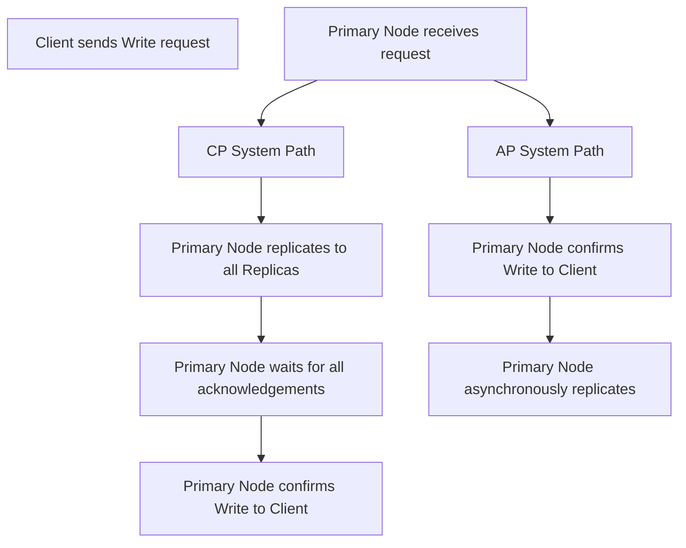

## Availability vs Consistency
### Core Concepts

*   **Availability (A):** The system's ability to remain operational and serve requests even in the face of failures (e.g., node crashes, network outages). Measured by uptime percentage. A highly available system minimizes downtime.
*   **Consistency (C):** A guarantee that all clients see the same, most up-to-date data at any given time.
    *   **Strong Consistency (Linearizability/Atomic):** Guarantees that any read will return the most recently written value. All operations appear to execute atomically and in a single, global, real-time order.
    *   **Eventual Consistency:** If no new writes occur, all reads will eventually return the last written value. There might be a period of inconsistency after a write.
*   **Partition Tolerance (P):** The system's ability to continue operating despite network partitions – communication breakdowns between different nodes in the distributed system.
*   **CAP Theorem:** In a distributed system, it's impossible to simultaneously provide all three guarantees: Consistency (C), Availability (A), and Partition Tolerance (P). You must choose two out of three when a partition occurs.
    *   **CP System:** Prioritizes Consistency and Partition Tolerance. If a network partition occurs, the system will sacrifice Availability to ensure data consistency. It might block or return an error until the partition is resolved or consistency can be guaranteed.
        *   *Example:* Distributed databases using strict ACID properties, systems leveraging consensus algorithms like Paxos/Raft (e.g., ZooKeeper, etcd).
    *   **AP System:** Prioritizes Availability and Partition Tolerance. If a network partition occurs, the system will remain available but may return stale or inconsistent data. Consistency is eventually achieved.
        *   *Example:* NoSQL databases like Apache Cassandra, Amazon DynamoDB.

### Key Details & Nuances

*   **Types of Consistency (Beyond Strong/Eventual):**
    *   **Causal Consistency:** If process A has seen process B's update, then any subsequent process C must also see B's update after A's update. Maintains causal order.
    *   **Sequential Consistency:** All processes see all operations in the same global order. Weaker than linearizability, stronger than causal.
*   **Real-world Implications:**
    *   **CP:** Higher data integrity, simpler reasoning about state. Can lead to higher latency and reduced availability during network issues or failures. Suitable for financial transactions, critical inventory.
    *   **AP:** Higher uptime, better performance under network duress. Requires application-level handling of potential inconsistencies (e.g., conflict resolution, compensating transactions). Suitable for social media feeds, e-commerce product catalogs.
*   **PACELC Theorem:** An extension to CAP, stating that in the *absence* of partitions (P), a system must choose between Latency (L) and Consistency (C). And in the *presence* of partitions (P), it must choose between Availability (A) and Consistency (C). This highlights that even without partitions, there's often a trade-off between strict consistency and performance.
*   **Quorum Mechanisms:** Many distributed systems use read/write quorums (e.g., in Apache Cassandra, DynamoDB) to tune consistency.
    *   `W + R > N` (where W=write quorum, R=read quorum, N=number of replicas) ensures strong consistency because every read will overlap with at least one replica that participated in the most recent write.
    *   Adjusting W and R values allows for flexibility between strong consistency (W=N, R=1 or W=majority, R=majority) and eventual consistency (W=1, R=1).

### Practical Examples

The choice between Availability and Consistency profoundly impacts how write operations are handled in a distributed system during a network partition.

*   **CP System Path:** The primary node will not confirm the write to the client until it has successfully replicated the data to a majority (or all, depending on configuration) of its replicas and received their acknowledgements. If a replica is unreachable due to a partition, the write will fail or block, ensuring consistency across all available nodes.
*   **AP System Path:** The primary node will confirm the write to the client as soon as it has written the data locally (or to a very small number of replicas). Replication to other nodes happens asynchronously in the background. If a replica is unreachable, the write still succeeds from the client's perspective, but that replica will temporarily hold stale data.

### Common Pitfalls & Trade-offs

*   **Misunderstanding CAP Theorem:** CAP applies *only when a network partition occurs*. In the absence of a partition, a system can theoretically be both highly available and strongly consistent. The theorem forces a choice *during* network failures.
*   **"Highly Consistent" vs. "Strongly Consistent":** Marketing often uses "highly consistent" loosely. For an interview, always clarify if "strong/linearizable" consistency is implied.
*   **Complexity Trade-offs:**
    *   **CP Systems:** Push complexity into distributed consensus algorithms (Paxos, Raft) to coordinate writes and maintain global order. This is hard to implement correctly.
    *   **AP Systems:** Push complexity to the application layer, which must deal with potential inconsistencies, conflict resolution (e.g., last-write-wins, vector clocks, custom merge logic), and compensating actions.
*   **Performance Impact:** Strong consistency typically incurs higher latency and lower throughput due to the need for synchronous replication and coordination. Eventual consistency offers better performance.
*   **Data Loss Risk:** While AP systems prioritize availability, poorly designed ones can increase the risk of data loss or complex reconciliation if partitions are long-lived or conflict resolution is inadequate.

### Interview Questions

1.  **Explain the CAP theorem. How does it influence system design decisions when building distributed applications?**
    *   *Answer:* CAP states that a distributed system cannot simultaneously guarantee Consistency, Availability, and Partition Tolerance during a network partition. It forces a trade-off: a CP system prioritizes consistency and partition tolerance, sacrificing availability during partitions (e.g., a banking system ensures transactions are never lost or seen incorrectly); an AP system prioritizes availability and partition tolerance, sacrificing immediate consistency (e.g., a social media feed might show slightly outdated data but remains accessible). This dictates database choice (RDBMS/ZooKeeper for CP vs. Cassandra/DynamoDB for AP) and application logic for handling data staleness or write failures.

2.  **Describe a real-world scenario where eventual consistency is perfectly acceptable and one where strong consistency is absolutely mandatory. How would you design for each using common system components?**
    *   *Answer:*
        *   **Eventual (Acceptable):** A social media 'like' counter. If a user likes a post, it's acceptable for the count to be temporarily inconsistent across replicas. Design: Use an AP database (e.g., DynamoDB, Cassandra). The application writes to one node, which acknowledges immediately. Replication occurs asynchronously. Reads can hit any replica, potentially returning a stale count, which will eventually converge.
        *   **Strong (Mandatory):** A bank account balance for a money transfer. It's critical that the sender's balance is debited and the receiver's credited atomically and consistently. Design: Use a CP system (e.g., PostgreSQL with master-slave replication, ensuring all writes go to the master and are replicated synchronously or via a distributed transaction/consensus protocol like 2PC/Paxos/Raft). All reads must go to the consistent source, ensuring the most recent state.

3.  **Beyond the CAP theorem, what other factors or theorems should a system designer consider when dealing with distributed data consistency and availability?**
    *   *Answer:* The **PACELC theorem** is crucial; it extends CAP by stating that even in the *absence* of a partition, a system must choose between Latency (L) and Consistency (C). This means even CP systems will trade lower consistency for lower latency during normal operation (e.g., weaker isolation levels in databases). Other factors include:
        *   **Durability:** Guarantee that once data is written, it won't be lost.
        *   **Throughput & Latency:** Stronger consistency often implies lower throughput and higher latency due to coordination overhead.
        *   **Operational Complexity:** Maintaining highly consistent distributed systems (e.g., managing consensus protocols) is often more complex than eventual consistency.
        *   **Cost:** Hardware, licensing, and operational costs.
        *   **Failure Modes:** How different components fail and how the system reacts.

4.  **How do systems like Apache Cassandra (AP) and Apache ZooKeeper (CP) handle the Consistency-Availability trade-off differently in their core design?**
    *   *Answer:*
        *   **Apache Cassandra (AP):** Designed for high availability and partition tolerance. It achieves this by using an eventually consistent model with tunable consistency levels (e.g., `ONE`, `QUORUM`, `ALL`). Writes are acknowledged quickly and replicated asynchronously. In a partition, nodes on both sides remain available to accept writes, leading to potential inconsistencies that are resolved later (e.g., via last-write-wins or hinted handoffs).
        *   **Apache ZooKeeper (CP):** Designed for strong consistency and partition tolerance, critical for distributed coordination. It uses a ZAB (ZooKeeper Atomic Broadcast) protocol, a variant of Paxos, to ensure linearizable writes. Every write goes through a leader, which ensures all followers agree on the state before acknowledging the write. If a partition occurs, ZooKeeper will sacrifice availability (e.g., become unavailable for writes) to prevent inconsistencies, as its primary role is to provide a consistent view of shared configuration and coordination data.