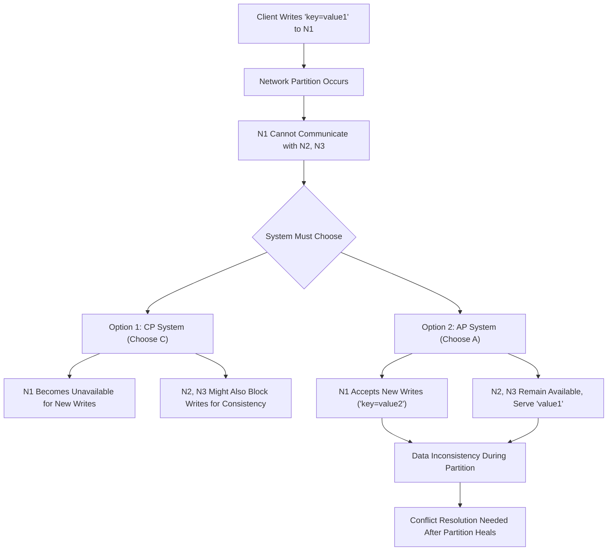

## CAP Theorem
### Core Concepts
*   The **CAP Theorem** (Consistency, Availability, Partition Tolerance) states that a distributed data store can only guarantee two out of the three properties simultaneously when a network partition occurs.

    *   **Consistency (C):** Every read receives the most recent write or an error. All nodes see the same data at the same time. This is often "strong consistency."
    *   **Availability (A):** Every request receives a (non-error) response, without guarantee that it contains the most recent write. The system remains operational even if some nodes fail.
    *   **Partition Tolerance (P):** The system continues to operate despite arbitrary message loss or failure of parts of the system (network partitions).

### Key Details & Nuances
*   **P is a given in distributed systems:** In any real-world distributed system, network failures (partitions) are inevitable. Therefore, you *must* design for Partition Tolerance. This means the practical choice for distributed systems is between **Consistency (CP)** and **Availability (AP)** during a partition. You cannot achieve CA without P in a distributed system.
*   **What is a Partition?** A network partition is a communication breakdown between nodes in a distributed system. Nodes become unable to communicate with each other, forming isolated "islands" of nodes.
*   **Consistency Spectrum:** "Consistency" isn't binary. It ranges from strong (immediate, linearizable) to eventual (data will eventually converge) to causal. CAP typically refers to strong consistency.
*   **During a Partition:**
    *   **CP System:** Prioritizes consistency. If a partition occurs, nodes in the minority partition (or all nodes if quorum cannot be reached) will become unavailable for writes (and potentially reads) to ensure data consistency. Examples: ZooKeeper, etcd, traditional relational databases using 2PC (e.g., PostgreSQL with distributed transactions).
    *   **AP System:** Prioritizes availability. If a partition occurs, all nodes remain available for reads and writes. This might lead to data inconsistencies across partitions, which must be resolved later (e.g., via eventual consistency). Examples: Apache Cassandra, Amazon DynamoDB, CouchDB.

### Practical Examples
Consider a distributed key-value store with three nodes (N1, N2, N3). A client writes `key=value1` to N1. Suddenly, N1 loses network connectivity with N2 and N3 (a partition).

*   **CP System Behavior:** If a client attempts to read `key` from N2 or N3, they would either wait for N1 to respond (if using strong consistency with quorum reads) or return an error/stale data if they can't establish a quorum. N1 would not accept new writes for `key` to prevent divergence.
*   **AP System Behavior:** If a client reads `key` from N2 or N3, they might get `value1`. If a client writes `key=value2` to N1, N1 accepts it. Now N1 has `value2`, N2/N3 have `value1`. This inconsistency is resolved once the partition heals (e.g., via last-write-wins, vector clocks, or application-specific logic).

### Common Pitfalls & Trade-offs
*   **Misconception: "You *always* choose 2 of 3."** This is wrong. P is a *given* in distributed systems. The practical choice is between CP and AP during a partition. You cannot "choose" to opt out of partitions in a large-scale system.
*   **Trade-off: Latency vs. Consistency/Availability.**
    *   **CP systems** often have higher write latencies (e.g., waiting for quorum acknowledgments) and lower availability during partitions.
    *   **AP systems** often have lower write latencies (write to local replica, eventually propagate) and higher availability but risk eventual inconsistency.
*   **Not a Monolith:** CAP applies to a single consistent *data store*, not an entire system. Different parts of a microservices architecture might make different CAP trade-offs. For example, user profiles might be AP, while transaction logs are CP.
*   **PACELC Theorem:** An extension that states: If there is a partition (P), you choose between Availability (A) and Consistency (C). Else (E), when the system is running normally (no partition), you choose between Latency (L) and Consistency (C). This highlights that choices are made even in the absence of partitions.

### Interview Questions
1.  **Explain the CAP theorem and clarify why "P" (Partition Tolerance) is considered non-negotiable in real-world distributed systems.**
    *   **Answer:** CAP states a distributed system can only guarantee two of C, A, P. P is non-negotiable because network partitions (communication failures between nodes) are inevitable in any sufficiently large or complex distributed system. Ignoring P means assuming a perfect, failure-free network, which is unrealistic. Thus, in practice, distributed systems always choose between C and A during a partition.

2.  **Provide examples of systems that prioritize Consistency (CP) versus Availability (AP) and discuss their typical use cases.**
    *   **Answer:**
        *   **CP Systems:** ZooKeeper, etcd, traditional relational databases (like PostgreSQL/MySQL with distributed transactions or strong consistency features). **Use Cases:** Systems requiring strong consistency guarantees, such as leader election, distributed locking, distributed transactions (e.g., financial transactions where data integrity is paramount), or maintaining critical metadata.
        *   **AP Systems:** Apache Cassandra, Amazon DynamoDB, CouchDB, Redis in cluster mode. **Use Cases:** Systems prioritizing high availability and scalability, tolerating eventual consistency, such as user session data, IoT telemetry, social media feeds, or any application where continuous operation and eventual data convergence are acceptable over strict immediate consistency.

3.  **Imagine a network partition occurs in a distributed key-value store. Describe how a CP-oriented system would behave compared to an AP-oriented system when a client tries to write data.**
    *   **Answer:**
        *   **CP System:** Upon detecting a partition, a CP system would typically sacrifice availability to ensure consistency. If a client attempts to write data to a node that cannot communicate with a quorum of other nodes (e.g., the primary or majority replica), the write operation would either fail (return an error) or block until the partition is resolved and consistency can be guaranteed. This prevents divergent data states.
        *   **AP System:** An AP system would prioritize availability. Nodes on either side of the partition would continue to accept writes independently. This means new data might be written to one part of the system while older data exists in another. The system remains available but will require conflict resolution mechanisms (e.g., last-write-wins, vector clocks) to reconcile inconsistencies once the partition heals.

4.  **Does the CAP theorem apply to a single-node database (e.g., a standalone MySQL instance)? Why or why not?**
    *   **Answer:** No, the CAP theorem does not apply to a single-node database. The "P" in CAP stands for Partition Tolerance, which refers to the system's ability to continue operating despite network partitions *between multiple nodes*. A single-node database by definition has no network partitions within itself. It can achieve both Consistency and Availability without needing to make the CAP trade-off because the "P" constraint is absent.