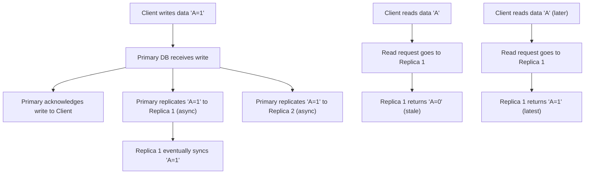

## Consistency Patterns
### Core Concepts

*   **Consistency (in Distributed Systems):** Guarantees about the visibility and ordering of data updates across multiple nodes in a distributed system. It defines what data a read operation will return after a write operation.
*   **CAP Theorem:** A fundamental theorem stating that a distributed data store can only simultaneously provide two out of three guarantees:
    *   **Consistency (C):** All clients see the same data at the same time.
    *   **Availability (A):** Every request receives a response, without guarantee that it contains the latest version of the information.
    *   **Partition Tolerance (P):** The system continues to operate despite arbitrary message loss or failure of parts of the system.
*   **Consistency Models:** Different approaches to guarantee consistency, each with varying trade-offs for availability and performance. The choice of model significantly impacts system design.

### Key Details & Nuances

*   **Strong Consistency (Linearizability/Atomic Consistency):**
    *   **Guarantee:** All readers see the most recent successful write, and all operations appear to occur in a single, global, real-time order.
    *   **Implications:** Requires coordination (e.g., distributed consensus like Paxos/Raft) across nodes, leading to higher latency and lower availability during partitions.
    *   **Use Cases:** Banking transactions, critical state management where data integrity is paramount.
*   **Eventual Consistency:**
    *   **Guarantee:** If no new updates are made to a given data item, eventually all accesses to that item will return the last updated value. There might be a delay.
    *   **Implications:** High availability and partition tolerance. Simpler to implement in highly scalable systems. Reads might return stale data temporarily.
    *   **Use Cases:** DNS, social media feeds, e-commerce shopping carts (non-critical parts), S3.
*   **Relaxed Consistency Models (often seen as "stronger" than eventual but "weaker" than strong):**
    *   **Causal Consistency:** If process A causes process B, then B must be seen after A by all processes. Ensures causality is respected.
    *   **Sequential Consistency:** All processes see all operations in the same sequential order, but not necessarily real-time order.
    *   **Read-Your-Writes Consistency:** A process reading its own writes will always see the value it just wrote. Important for user experience.
    *   **Monotonic Reads Consistency:** If a process reads a value `X`, subsequent reads by that process will never see an older value than `X`. Prevents "going back in time."

### Practical Examples

**Illustrating Eventual Consistency with Replication**

### Common Pitfalls & Trade-offs

*   **Over-designing for Strong Consistency:** Implementing strong consistency when it's not strictly necessary can lead to complex systems, higher latency, and reduced availability, especially under high load or network partitions.
*   **Ignoring User Experience (UX) with Eventual Consistency:** While highly scalable, eventual consistency can lead to confusing UX if not handled properly (e.g., a user writes a post but doesn't see it immediately on refresh). Read-your-writes and monotonic reads help mitigate this.
*   **Misunderstanding CAP Theorem:** CAP states you cannot achieve all three *simultaneously* during a *network partition*. In a non-partitioned state, a system can be both highly consistent and available.
*   **Optimistic vs. Pessimistic Locking:**
    *   **Pessimistic:** Locks data before an operation (e.g., for strong consistency). Higher overhead, reduced concurrency.
    *   **Optimistic:** Allows concurrent operations, then checks for conflicts at commit time. Retries on conflict. Higher concurrency, but requires conflict resolution strategies.

### Interview Questions

1.  **"Explain the CAP theorem and its practical implications for designing a distributed system. Provide an example where you would prioritize Availability over Consistency, and vice versa."**
    *   **Expert Answer:** The CAP theorem states that a distributed system can only guarantee two of Consistency, Availability, and Partition Tolerance simultaneously. In a real-world system, Partition Tolerance is almost always a given, meaning we must choose between Consistency and Availability during a network partition.
        *   **Prioritize Availability (CP -> AP):** Systems like social media feeds, DNS, or large-scale e-commerce product catalogs often favor Availability. For instance, if a user posts a comment, it's acceptable for it to not immediately appear globally, as long as the system remains responsive. MongoDB (prior to specific configurations) and Cassandra are examples of AP systems.
        *   **Prioritize Consistency (AP -> CP):** Systems requiring strict data integrity like financial transactions, patient health records, or inventory management for scarce items must prioritize Consistency. You'd rather refuse a transaction than process it incorrectly due to stale data. Examples include traditional relational databases with distributed transactions, or systems built on Paxos/Raft (e.g., ZooKeeper, etcd).
        The choice depends heavily on the business requirements and tolerance for stale data versus downtime.

2.  **"Differentiate between strong consistency (e.g., linearizability) and eventual consistency. When would you choose one over the other for a new application?"**
    *   **Expert Answer:**
        *   **Strong Consistency (Linearizability):** Guarantees that all clients see the most up-to-date data, and all operations appear to execute instantaneously in a single, global, real-time order. This is the strictest form of consistency, often achieved via distributed consensus protocols (e.g., Raft, Paxos) or strong locking mechanisms. It's like having a single, atomic global clock.
        *   **Eventual Consistency:** Guarantees that if no new updates occur to a data item, eventually all reads will return the last written value. There's no guarantee on *when* "eventually" is, and reads can return stale data. This model prioritizes availability and partition tolerance over immediate consistency.
        **Choice:**
        *   **Choose Strong Consistency for:** Financial transactions, critical configuration data (e.g., feature flags for core services), multi-player game state where immediate and correct state synchronization is vital. The cost is typically higher latency and reduced availability during failures.
        *   **Choose Eventual Consistency for:** User profiles, social media posts, caching layers, analytics data, or any scenario where occasional stale reads are acceptable for the benefit of high availability, scalability, and lower latency. This is often the default for large-scale web services.

3.  **"How can you achieve 'Read-Your-Writes' consistency in a distributed system, even if the underlying system is eventually consistent?"**
    *   **Expert Answer:** Read-Your-Writes (RYW) consistency ensures that once a client writes data, subsequent reads by *that same client* will always reflect their own prior writes, even if other clients might still see stale data. It's a common requirement for good user experience over eventually consistent systems.
        Methods to achieve RYW:
        1.  **Sticky Sessions:** Route a client's subsequent read requests to the same replica that processed their initial write. This works until that replica fails or data is accessed from a different replica.
        2.  **Versioning/Timestamps:** Include a version number or timestamp with each write. When a client performs a read, it passes its "last seen" version. The system ensures the read is served only by a replica that has at least that version of the data, potentially waiting for replication or redirecting to the primary.
        3.  **Direct Read from Primary/Write-Back Cache:** After a write, the client's subsequent reads (for a short period or for specific data) are explicitly directed to the primary replica that handled the write, or data is written to a fast, consistent cache that is read from immediately after the write.
        4.  **Client-Side Caching with Invalidation:** The client caches its own writes locally and serves reads from this cache until a certain period passes or an update from the server indicates a fresher version is available.
        The most common and robust approach typically involves a combination of versioning/timestamps and potentially directing reads to the primary for a brief period after a write.

4.  **"Consider building a distributed system for a new online ticketing platform. Which consistency models would you apply to different parts of the system (e.g., seat booking vs. user profile updates)? Justify your choices."**
    *   **Expert Answer:**
        *   **Seat Booking (Inventory Management):** This requires **Strong Consistency (Linearizability)**. When a user selects a seat, it must be immediately marked as unavailable for all other users to prevent double-booking. Any read of seat availability must reflect the most recent state. Failure to secure a seat is preferable to an erroneous booking. This would involve distributed transactions or consensus protocols (e.g., leader-based replication with strong consistency checks) for the critical booking path.
        *   **User Profile Updates (e.g., updating address, email):** This can mostly leverage **Eventual Consistency with Read-Your-Writes and Monotonic Reads**. If a user updates their email, it's acceptable for that update to propagate over a few seconds, as long as *they* see their updated email immediately (Read-Your-Writes) and never see an older version after seeing a newer one (Monotonic Reads). High availability is preferred for profile updates.
        *   **Event Listing/Search:** This can be **Eventual Consistency**. New events or changes to event details don't need to be instantly consistent across all search indices or listing services. A few seconds or minutes of delay for propagation is acceptable for the benefit of scalability and performance of the search infrastructure.
        This approach balances strict data integrity where absolutely required with the scalability and performance benefits of eventual consistency for less critical paths.