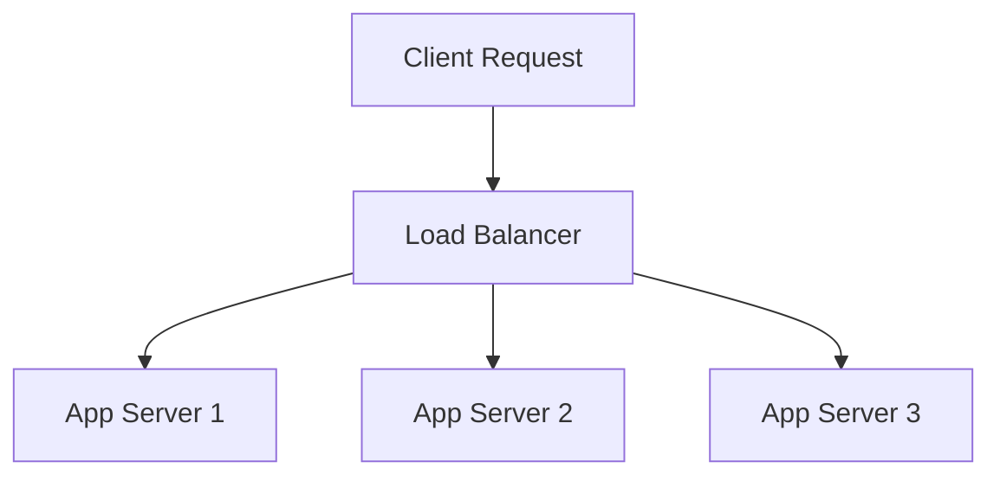

## Availability Patterns
### Core Concepts
*   **Availability:** The percentage of time a system or service is operational and accessible. Often measured in "nines" (e.g., 99.9% is three nines).
*   **High Availability (HA):** Designing systems to minimize downtime and provide continuous operation, even in the event of component failures or external disruptions.
*   **Resilience:** The ability of a system to recover from failures and continue to function, potentially in a degraded mode.
*   **Disaster Recovery (DR):** Strategies and procedures to restore a system's operations after a catastrophic event, typically involving geographically dispersed infrastructure.

### Key Details & Nuances
*   **Redundancy:** Eliminating single points of failure by duplicating critical components.
    *   **N+1 Redundancy:** N active components with 1 standby/spare.
    *   **N+M Redundancy:** N active components with M standby/spare components.
    *   **2N (Active-Active) Redundancy:** Two identical sets of components, both processing traffic, providing immediate failover.
    *   **Active-Passive (Hot/Warm/Cold Standby):** One component is active, others are idle or partially running, ready to take over.
*   **Load Balancing:** Distributing incoming network traffic across multiple servers to ensure no single server is overwhelmed and to facilitate seamless failover.
    *   **Layer 4 (Transport Layer):** Distributes traffic based on IP address and port. Faster.
    *   **Layer 7 (Application Layer):** Distributes traffic based on application-level information (e.g., HTTP headers, URL paths). More intelligent, enables content routing.
*   **Failover Mechanisms:**
    *   **Health Checks:** Regular checks on component status.
    *   **Automatic Failover:** System detects failure and automatically redirects traffic to a healthy component.
    *   **Manual Failover:** Requires human intervention to switch to a standby.
*   **Circuit Breakers:** Prevent a failing service from overwhelming other services by temporarily stopping requests to it, thus preventing cascading failures.
*   **Rate Limiting:** Controls the number of requests a client can make to a service within a given timeframe, protecting against abuse and overload.
*   **Bulkheads:** Isolating components or resources to prevent a failure in one area from impacting others (e.g., separate thread pools for different service calls).
*   **Graceful Degradation:** Maintaining partial functionality when some components fail, rather than a complete outage.
*   **Asynchronous Processing/Queues:** Decoupling components using message queues (e.g., Kafka, RabbitMQ) to buffer requests, absorb spikes, and ensure durability during downstream failures.
*   **Idempotency:** Designing operations so that multiple identical requests have the same effect as a single request, crucial for retries in distributed systems.
*   **Disaster Recovery (DR) Strategies:**
    *   **Backup and Restore:** Lowest RPO/RTO.
    *   **Pilot Light:** Minimal resources always running, scale up on failover.
    *   **Warm Standby:** Replicated data, pre-warmed servers.
    *   **Multi-site/Hot-Hot (Active-Active DR):** Full replication across multiple active regions/zones.

### Practical Examples

#### 1. Load Balancer Distribution
A conceptual diagram showing how a load balancer distributes client requests among multiple application servers to ensure availability and prevent overload.



#### 2. Basic Circuit Breaker Implementation
A simplified TypeScript example of a circuit breaker protecting a potentially failing external service call.

```typescript
type CircuitBreakerState = 'CLOSED' | 'OPEN' | 'HALF_OPEN';

class CircuitBreaker {
    private state: CircuitBreakerState = 'CLOSED';
    private failureCount: number = 0;
    private lastFailureTime: number = 0;
    private threshold: number; // Number of failures to trip
    private timeout: number;   // Time in ms to stay OPEN
    private resetTimeout: number; // Time in ms to stay HALF_OPEN

    constructor(threshold: number = 3, timeout: number = 5000, resetTimeout: number = 2000) {
        this.threshold = threshold;
        this.timeout = timeout;
        this.resetTimeout = resetTimeout;
    }

    async execute<T>(command: () => Promise<T>): Promise<T> {
        if (this.state === 'OPEN') {
            if (Date.now() - this.lastFailureTime > this.timeout) {
                this.state = 'HALF_OPEN'; // Attempt to reset
            } else {
                throw new Error("Circuit Breaker is OPEN: Service unavailable.");
            }
        }

        try {
            const result = await command();
            this.success();
            return result;
        } catch (error) {
            this.failure();
            throw error;
        }
    }

    private success(): void {
        this.state = 'CLOSED';
        this.failureCount = 0;
    }

    private failure(): void {
        this.failureCount++;
        this.lastFailureTime = Date.now();
        if (this.state === 'HALF_OPEN' || this.failureCount >= this.threshold) {
            this.state = 'OPEN';
        }
    }
}

// Example Usage
async function callExternalService(): Promise<string> {
    // Simulate service call success/failure
    if (Math.random() > 0.3) { // 70% success, 30% failure
        console.log("External service call successful.");
        return "Data from external service";
    } else {
        throw new Error("External service failed.");
    }
}

async function main() {
    const breaker = new CircuitBreaker(3, 10000); // 3 failures, stay open for 10s

    for (let i = 0; i < 10; i++) {
        try {
            console.log(`Attempt ${i + 1}:`);
            const data = await breaker.execute(callExternalService);
            console.log(data);
        } catch (e: any) {
            console.error(`Error: ${e.message}`);
        }
        await new Promise(resolve => setTimeout(resolve, 500)); // Wait a bit
    }
}

// main(); // Uncomment to run
```

### Common Pitfalls & Trade-offs
*   **Over-engineering:** Chasing too many "nines" (e.g., 99.999%) can lead to disproportionately high costs and complexity for marginal availability gains. Balance availability goals with business needs and budget.
*   **Complexity vs. Availability:** Highly available systems are inherently more complex. This complexity can introduce new failure modes or make debugging harder, ironically reducing overall reliability if not managed well.
*   **Cost:** Achieving higher availability (e.g., multi-region active-active setups) significantly increases infrastructure and operational costs.
*   **Testing Failover:** It's crucial to regularly test failover procedures (e.g., chaos engineering) to ensure they work as expected under pressure, rather than assuming they will.
*   **Consistency vs. Availability (CAP Theorem):** In a distributed system, you can typically choose between Consistency and Availability during a Partition (network failure), but not both. Availability patterns often favor availability over strong consistency (e.g., eventual consistency).

### Interview Questions
1.  **Explain the difference between High Availability and Disaster Recovery. When would you prioritize one over the other in a system design?**
    *   **Answer:** High Availability focuses on continuous operation within a single data center/region, minimizing downtime from component failures. Disaster Recovery prepares for catastrophic events (e.g., regional outage) by restoring services in a different geographical location. You prioritize HA for immediate operational resilience and DR for business continuity against widespread disasters. For mission-critical systems, both are essential; for less critical systems, cost-benefit analysis dictates the level of investment.

2.  **Describe how a Circuit Breaker pattern works and its benefits in a microservices architecture. Can you provide a scenario where it's particularly effective?**
    *   **Answer:** A Circuit Breaker acts as a proxy for operations that might fail (e.g., external API calls). It monitors failures; if they exceed a threshold, it "opens" the circuit, stopping calls to the failing service. After a timeout, it goes "half-open" to test if the service has recovered. Benefits include preventing cascading failures, providing fast failure, and allowing the failing service to recover. It's effective when a downstream service is struggling, preventing the calling service from wasting resources on doomed requests and ensuring its own stability.

3.  **You need to design a highly available API service. What are the key patterns you would consider, and how would you implement them using cloud services (e.g., AWS, Azure, GCP)?**
    *   **Answer:** Key patterns:
        *   **Redundancy:** Deploying across multiple Availability Zones (AZs) within a region (active-active or active-passive).
        *   **Load Balancing:** Using a cloud-managed Load Balancer (e.g., AWS ALB/NLB, Azure Application Gateway/Load Balancer) to distribute traffic and perform health checks.
        *   **Auto-Scaling:** Using Auto Scaling Groups (ASGs) to automatically scale instances up/down based on load and replace unhealthy instances.
        *   **Database HA:** Using managed database services with multi-AZ replication (e.g., AWS RDS Multi-AZ, Azure SQL Database Geo-replication).
        *   **Monitoring & Alerting:** Cloud monitoring tools (e.g., CloudWatch, Azure Monitor) for proactive issue detection and automated responses.
        *   **DNS Failover:** Using DNS with health checks (e.g., AWS Route 53 with failover routing policies) for regional failover.

4.  **Discuss the trade-offs between strong consistency and high availability in a distributed database system, especially in the context of the CAP theorem. How do modern databases address this?**
    *   **Answer:** The CAP theorem states that a distributed data store can only guarantee two of three properties: Consistency, Availability, and Partition Tolerance. In a network partition, a system must choose between Consistency (all nodes see the same data at the same time) and Availability (every request receives a response, even if stale). For highly available systems, Availability is often prioritized, leading to **eventual consistency**, where data inconsistencies are tolerated temporarily, resolving over time. Modern databases address this via:
        *   **Tunable Consistency:** Allowing developers to choose the level of consistency based on use case (e.g., read-your-writes vs. eventual consistency).
        *   **CRDTs (Conflict-free Replicated Data Types):** Allowing concurrent updates to converge without coordination.
        *   **Leader-Replica Models:** Primary for writes, replicas for reads, with varying replication lags.
        *   **Quorum-based Consistency:** Requiring a minimum number of nodes to acknowledge a read/write operation for higher consistency guarantees.