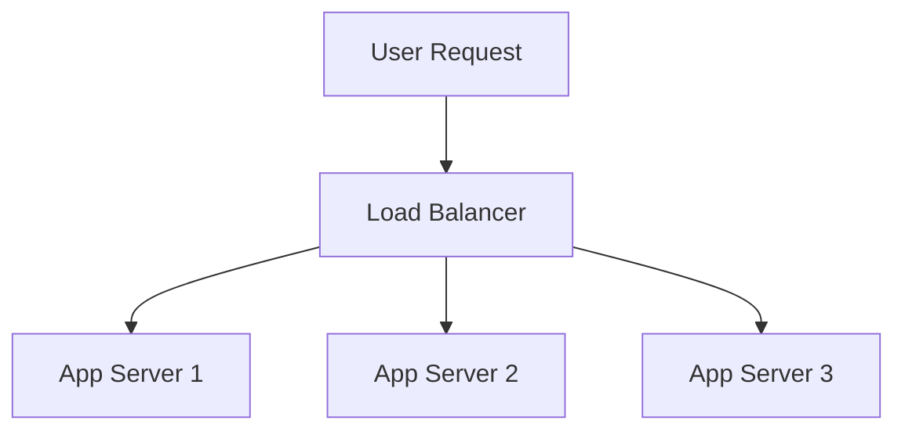

## Availability Numbers
### Core Concepts
*   **Availability:** The percentage of time a system is operational and accessible to users within a given period. It's a key metric for system reliability.
*   **"Nines":** A common way to quantify availability. For example, "three nines" refers to 99.9% availability, and "five nines" to 99.999%. The more nines, the less permissible downtime.
*   **Service Level Agreements (SLAs):** Formal commitments to a specific level of availability, often with penalties for non-compliance.

### Key Details & Nuances
*   **Calculating Downtime:** Higher "nines" drastically reduce permissible downtime.
    *   `Availability % = (Total Time - Downtime) / Total Time * 100`
*   **Factors Influencing Availability:**
    *   **Redundancy:** Having multiple instances of components (servers, databases, network paths) to prevent single points of failure (SPOFs).
    *   **Failover:** Automatic or manual switching to a redundant system when the primary fails.
    *   **Disaster Recovery (DR):** Strategies and procedures to recover from major outages (e.g., regional data center failure).
    *   **Mean Time Between Failures (MTBF):** Average time a system or component operates without failure.
    *   **Mean Time To Recovery (MTTR):** Average time it takes to restore a system after a failure. High availability requires high MTBF and low MTTR.
    *   **Observability:** Comprehensive monitoring, logging, and alerting are crucial to detect issues quickly and enable rapid recovery, thus improving MTTR.
*   **Achieving High Availability:** Involves strategies like load balancing, distributed systems, replication, automatic health checks, self-healing systems, and blue/green or canary deployments for zero-downtime updates.
*   **Perceived vs. Actual Availability:** A system might be technically "up," but if a critical user flow is broken due to a subtle bug or dependency issue, users perceive it as unavailable. Focus on end-to-end user experience.

### Practical Examples

**Availability Nines to Annual Downtime Conversion:**

| Nines       | Availability (%) | Annual Downtime (approx.) |
| :---------- | :--------------- | :------------------------ |
| Two Nines   | 99%              | 3 days, 15 hours          |
| Three Nines | 99.9%            | 8 hours, 45 minutes       |
| Four Nines  | 99.99%           | 52 minutes, 36 seconds    |
| Five Nines  | 99.999%          | 5 minutes, 15 seconds     |

**Example of Redundancy for Availability:**

*Description:* A load balancer distributes incoming user requests across multiple application servers. If "App Server 1" fails, the load balancer can automatically route traffic to "App Server 2" or "App Server 3," preventing a complete service outage and improving overall availability.

### Common Pitfalls & Trade-offs
*   **Cost vs. Availability:** Achieving more "nines" comes with significantly higher costs for infrastructure, specialized hardware, software licenses, and operational complexity. Going from 99.9% to 99.999% is exponentially more expensive.
*   **Complexity:** Highly available systems are inherently more complex to design, implement, test, deploy, and operate due to distributed components, synchronization needs, and failover logic. This complexity can introduce new failure modes.
*   **Consistency vs. Availability (CAP Theorem):** In distributed systems, a trade-off often exists between consistency and availability during a network partition. Designers must choose which to prioritize for a given service.
*   **Dependencies:** The availability of your system is ultimately capped by the least available critical dependency (e.g., a third-party API, a database cluster).
*   **Human Error:** A significant cause of downtime. Automation, robust deployment pipelines, and well-rehearsed incident response procedures are critical.

### Interview Questions
1.  **"What do 'five nines' of availability mean, and what are the primary challenges in achieving it?"**
    *   **Answer:** "Five nines" means a system is available 99.999% of the time, equating to roughly 5 minutes and 15 seconds of downtime per year. Challenges include the exponential cost increase, managing extreme system complexity, eliminating every single point of failure (hardware, software, network, human error), ensuring near-instantaneous failover, and the difficulty of testing for such rare failure scenarios (e.g., chaos engineering). It also requires robust observability and automation.
2.  **"Design a highly available web service. What architectural patterns and operational practices would you employ to target 99.99% availability?"**
    *   **Answer:** Architecturally: active-active redundancy for all components (load balancers, app servers, databases), multi-region deployment for disaster recovery, asynchronous processing for non-critical tasks, robust health checks and automated failover. Operationally: comprehensive monitoring and alerting, automated deployments (CI/CD) with rollbacks, chaos engineering to proactively find weaknesses, regular disaster recovery drills, and well-defined incident response procedures to minimize MTTR.
3.  **"How does the concept of MTBF and MTTR relate to a system's overall availability?"**
    *   **Answer:** Availability is directly proportional to MTBF and inversely proportional to MTTR. `Availability = MTBF / (MTBF + MTTR)`. To increase availability, you want to increase the time between failures (higher MTBF through reliable components, good design, preventative maintenance) and decrease the time it takes to recover from failures (lower MTTR through automation, fast detection, well-practiced recovery procedures).
4.  **"When might it be acceptable to sacrifice some availability for stronger consistency, or vice versa? Provide an example."**
    *   **Answer:** It's a trade-off, often guided by the CAP theorem. For a banking system handling financial transactions, stronger consistency is paramount (e.g., ensuring an account balance is always correct, even if it means a slight delay during a network partition). For a social media feed where occasional stale data is acceptable, availability is often prioritized (e.g., showing slightly outdated posts to ensure the feed always loads). The choice depends on the business requirements and criticality of data freshness versus continuous access.