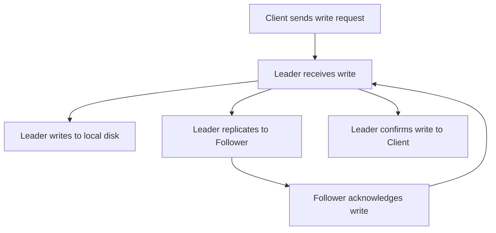

## Replication Strategies
### Core Concepts

*   **Replication:** The process of maintaining multiple copies of data across different nodes (servers) in a distributed system.
*   **Purpose:**
    *   **High Availability (HA):** Data remains accessible even if some nodes fail.
    *   **Durability:** Data loss is minimized by having redundant copies.
    *   **Read Scalability:** Distribute read load across multiple replicas.
    *   **Low Latency:** Place data closer to users.
*   **Key Strategies:**
    *   **Leader-Follower (Master-Replica/Primary-Secondary):** One node (leader) handles all writes; followers replicate data from the leader and serve reads.
    *   **Multi-Leader:** Multiple nodes can accept writes; data changes are replicated asynchronously between all leaders.
    *   **Leaderless (Peer-to-Peer):** All nodes can accept reads and writes; conflicts are resolved during read or write operations using techniques like quorum.

### Key Details & Nuances

*   **Leader-Follower Replication:**
    *   **Writes:** Always go to the leader.
    *   **Reads:** Can be served by leader or followers.
    *   **Synchronous vs. Asynchronous:**
        *   **Synchronous:** Leader waits for followers to acknowledge write before confirming to client. Higher consistency (stronger durability), lower write throughput, higher latency. Risk of leader being blocked if follower fails.
        *   **Asynchronous:** Leader writes to its local log and immediately responds to client. Replicates to followers in background. Higher write throughput, lower latency, but potential for data loss on leader failure (replication lag). Most common setup.
    *   **Failover:** If leader fails, one follower is promoted to leader. Manual or automated (e.g., ZooKeeper, Raft, Paxos). Automated failover is complex (split-brain risk).
*   **Multi-Leader Replication:**
    *   **Use Cases:** Multi-datacenter deployments, collaborative editing.
    *   **Complexity:** Conflict resolution is critical when same data is modified concurrently on different leaders (e.g., last-write-wins, merge functions, CRDTs - Conflict-Free Replicated Data Types).
    *   **Write Throughput:** Can be higher as writes are distributed.
*   **Leaderless Replication:**
    *   **Concept:** Writes sent to multiple nodes; reads sent to multiple nodes. Quorum (N, W, R) used for consistency.
        *   `N`: Total number of replicas.
        *   `W`: Number of replicas that must acknowledge a write for it to be considered successful.
        *   `R`: Number of replicas that must be queried for a read operation.
        *   **Consistency:** If `W + R > N`, strong consistency is possible (e.g., DynamoDB's eventually consistent model with `W + R > N` for quorum consistency).
    *   **Read Repair:** When reading, stale replicas are updated based on the newest version.
    *   **Hinted Handoff:** If a replica is temporarily unavailable for a write, another replica temporarily stores the write "hinted" for the unavailable node.
    *   **Anti-Entropy:** Background processes continuously reconcile discrepancies between replicas.
    *   **Availability:** High availability as no single point of failure for writes or reads.

### Practical Examples

**Leader-Follower Write Flow (Synchronous Replication):**



**Conceptual Quorum Calculation (Leaderless):**

```typescript
// N = Total number of replicas
const N = 5;

// W = Number of replicas for successful write
const W_strong = 3; // For strong consistency, W + R > N
const W_eventual = 1; // For eventual consistency

// R = Number of replicas to query for read
const R_strong = 3; // For strong consistency, W + R > N
const R_eventual = 1; // For eventual consistency

// Example: Strong Consistency (W=3, R=3, N=5)
// W + R = 3 + 3 = 6
// N = 5
// Since 6 > 5, this configuration can provide strong consistency for reads after writes.

// Example: Eventual Consistency (W=1, R=1, N=5)
// W + R = 1 + 1 = 2
// N = 5
// Since 2 <= 5, this configuration prioritizes availability and performance over immediate consistency.
```

### Common Pitfalls & Trade-offs

*   **Replication Lag:** In asynchronous Leader-Follower and Leaderless systems, followers/replicas may not have the most up-to-date data, leading to eventual consistency and potential stale reads.
*   **Split-Brain:** A critical issue in Leader-Follower setups where network partition causes multiple nodes to believe they are the leader, leading to data divergence and corruption. Requires robust quorum-based election protocols (e.g., Raft, Paxos).
*   **Conflict Resolution:** Multi-leader systems face the challenge of resolving conflicting writes. Simple strategies like Last-Write-Wins (LWW) can lose data; more complex CRDTs are harder to implement but preserve data.
*   **Complexity vs. Consistency/Availability:**
    *   Leader-Follower is simpler for consistency but can have lower write availability during failover.
    *   Leaderless offers high availability but shifts consistency burden to application/client and increases system complexity (anti-entropy, read repair).
*   **Resource Utilization:** Replicating all data can be resource-intensive (storage, network bandwidth).
*   **Data Consistency Models:** Understanding how replication strategy impacts different consistency models (strong, eventual, causal, etc.) is crucial.

### Interview Questions

1.  **"Explain the trade-offs between synchronous and asynchronous replication in a Leader-Follower setup. When would you choose one over the other?"**
    *   **Answer:** Synchronous offers stronger consistency (no data loss on leader crash) but has higher write latency and lower throughput, as the leader waits for follower acknowledgements. Asynchronous offers lower write latency and higher throughput but has replication lag, meaning potential data loss on leader crash (if pending writes haven't replicated). Choose synchronous for mission-critical data where zero data loss is paramount (e.g., financial transactions). Choose asynchronous for high-volume, performance-critical applications where some data loss is tolerable or can be recovered (e.g., logging, many web services).
2.  **"How does a multi-leader replication strategy handle conflicts? Provide an example of a conflict resolution technique."**
    *   **Answer:** Conflicts arise when the same data item is concurrently modified on different leaders before replication. Common techniques include:
        *   **Last-Write-Wins (LWW):** Based on timestamp or version number. Simple, but can lose valid updates.
        *   **Merge Functions:** Application-specific logic to combine concurrent changes (e.g., list append, set union).
        *   **Conflict-Free Replicated Data Types (CRDTs):** Data structures designed so that concurrent operations commute, resulting in a consistent state without complex merge logic.
        *   **Application-Specific:** Prompting the user to resolve, or storing all conflicting versions.
        *   Example for LWW: If two leaders update a user's profile with different email addresses at roughly the same time, the one with the later timestamp wins.
3.  **"Describe the N, W, R quorum model in leaderless replication. How does it relate to consistency and availability?"**
    *   **Answer:** `N` is the total number of replicas. `W` is the number of replicas that must acknowledge a write for it to be successful. `R` is the number of replicas that must be queried for a read.
        *   **Strong Consistency:** Achieved if `W + R > N`. This ensures that a read always overlaps with the most recent write, guaranteeing that a read sees the latest committed write. This favors consistency over availability/performance.
        *   **Eventual Consistency:** Achieved if `W + R <= N`. This configuration prioritizes availability and performance (lower latency) over immediate consistency. Reads might return stale data, but eventually all replicas converge to the same state.
4.  **"What is 'split-brain' in the context of database replication, and how is it typically mitigated?"**
    *   **Answer:** Split-brain occurs in Leader-Follower setups, typically due to a network partition, where the original leader becomes isolated from its followers, and the followers elect a new leader. Both the old leader (now isolated) and the new leader independently accept writes. When the network partition resolves, there are two divergent versions of data, leading to inconsistency and potential data corruption.
    *   **Mitigation:**
        *   **Quorum-based Election:** Using a consensus algorithm (e.g., Raft, Paxos, ZooKeeper) that requires a majority vote (`(N/2) + 1` nodes) to elect a new leader. This prevents a leader from being elected in a minority partition.
        *   **Fencing/STONITH (Shoot The Other Node In The Head):** forcibly shutting down or isolating the old leader once a new one is established.
        *   **No-Op Writes / Heartbeats:** Leaders periodically write a no-op or heartbeat to a shared log or consensus system; if this fails, they step down.