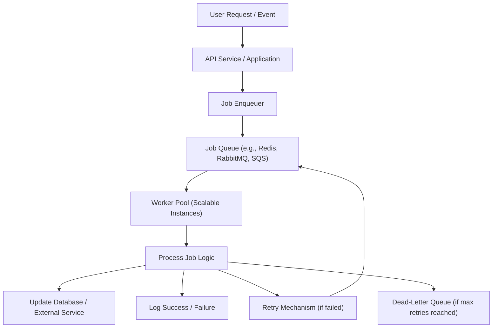

## Background Jobs
### Core Concepts
*   **Definition:** Background jobs are tasks executed asynchronously, separate from the main request-response cycle of an application. They run independently, typically in dedicated worker processes.
*   **Purpose:**
    *   **Decoupling:** Separate long-running or resource-intensive operations from the critical user flow.
    *   **Improved Responsiveness:** Allows the primary application to respond quickly to user requests, offloading heavy computations.
    *   **Reliability:** Jobs can be retried on failure, improving system resilience.
    *   **Scalability:** Workloads can be distributed across multiple workers, scaling processing capacity independently.
*   **Typical Use Cases:**
    *   Email sending (notifications, newsletters)
    *   Image/video processing (resizing, encoding)
    *   Batch data processing (report generation, analytics)
    *   Asynchronous API calls to external services
    *   Scheduled tasks (cron jobs)
    *   Data synchronization

### Key Details & Nuances
*   **Core Components:**
    *   **Producer/Client:** Enqueues jobs into a queue (e.g., web server).
    *   **Job Queue:** A persistent message broker (e.g., Redis, RabbitMQ, Kafka, AWS SQS/SNS) that stores jobs. Provides durability and ordering.
    *   **Worker Pool/Consumer:** A set of processes or threads that poll the job queue, fetch jobs, and execute them.
    *   **Job Processor Logic:** The actual code that performs the work for a specific job type.
    *   **Results Store (Optional):** A database or cache to store the results or status of completed jobs.
*   **Job Lifecycles & States:** Enqueued, pending, active, completed, failed, retrying, dead-lettered.
*   **Job Guarantees:**
    *   **At-most-once:** Job is delivered at most once (can be lost if worker fails before processing).
    *   **At-least-once:** Job is guaranteed to be delivered and processed, possibly multiple times (requires idempotency). Common and often desired.
    *   **Exactly-once:** Job is processed exactly once. Difficult to achieve purely at the message queue level; typically requires application-level idempotency and transactional semantics.
*   **Idempotency:** Crucial for "at-least-once" guarantees. Designing jobs so that executing them multiple times has the same effect as executing them once.
    *   *Example:* Instead of `user.incrementPoints()`, use `user.setPoints(currentPoints + delta)` with a transactional check or `user.addPoints(delta)` with a unique transaction ID.
*   **Error Handling & Retries:**
    *   **Exponential Backoff:** Increasing delay between retries to prevent overwhelming external services or immediate re-failure.
    *   **Max Retries:** Limit the number of retries before marking a job as permanently failed.
    *   **Dead-Letter Queue (DLQ):** A separate queue for jobs that have failed repeatedly or cannot be processed, allowing for manual inspection or alternative processing.
*   **Scheduling:**
    *   **Immediate:** Process as soon as possible.
    *   **Delayed:** Process after a specified delay (e.g., send reminder email in 24 hours).
    *   **Recurring (Cron-like):** Process at fixed intervals (e.g., daily report generation).
*   **Worker Scaling:** Horizontally scale worker instances based on job queue depth, CPU utilization, or desired throughput.

### Practical Examples

**1. Enqueuing a Job (Producer - Node.js with Redis Queue like `bullmq` or `ioredis`)**

```typescript
// Assume 'myQueue' is an initialized queue instance
import { Queue } from 'bullmq';

const myQueue = new Queue('emailQueue', {
  connection: {
    host: 'localhost',
    port: 6379,
  },
});

async function sendWelcomeEmail(userId: string, email: string) {
  await myQueue.add(
    'welcomeEmail', // Job name
    { userId, email, subject: 'Welcome!' }, // Job data
    {
      attempts: 3, // Retry up to 3 times on failure
      backoff: {
        type: 'exponential', // Exponential backoff
        delay: 1000, // Initial delay in milliseconds
      },
    }
  );
  console.log(`Enqueued welcome email for user ${userId}`);
}

// Example usage:
sendWelcomeEmail('user123', 'user@example.com');
```

**2. Processing a Job (Worker - Node.js with `bullmq`)**

```typescript
// Assume 'myWorker' is an initialized worker instance
import { Worker } from 'bullmq';

const myWorker = new Worker(
  'emailQueue', // Queue name to listen to
  async (job) => {
    const { userId, email, subject } = job.data;
    console.log(`Processing welcome email for user ${userId} to ${email}...`);

    try {
      // Simulate sending email (e.g., call an external API)
      await new Promise(resolve => setTimeout(resolve, Math.random() * 2000 + 500));
      if (Math.random() < 0.1) { // Simulate 10% failure rate
        throw new Error('Email service unavailable');
      }
      console.log(`Successfully sent email to ${email} for user ${userId}`);
      // Job is automatically marked as completed if no error is thrown
    } catch (error) {
      console.error(`Failed to send email to ${email} for user ${userId}: ${error.message}`);
      throw error; // Re-throw to indicate job failure and trigger retries
    }
  },
  {
    connection: {
      host: 'localhost',
      port: 6379,
    },
  }
);

myWorker.on('completed', (job) => {
  console.log(`Job ${job.id} of type ${job.name} completed.`);
});

myWorker.on('failed', (job, err) => {
  console.error(`Job ${job.id} of type ${job.name} failed with error: ${err.message}`);
});

console.log('Email Worker started, listening for jobs...');
```

**3. System Flow Diagram**



### Common Pitfalls & Trade-offs
*   **Over-engineering:** Not every asynchronous task requires a full-fledged background job system. Simple async/await or event emitters might suffice for lightweight tasks.
*   **Job Idempotency:** Failing to design idempotent jobs leads to unintended side effects when retries occur (e.g., duplicate charges, incorrect data).
*   **Insufficient Monitoring:** Lack of visibility into queue depth, worker health, job success/failure rates, and processing times can lead to system blind spots and slow debugging.
*   **Resource Management:** Workers can consume significant CPU/memory/network resources. Poorly optimized jobs or too many concurrent jobs can exhaust worker resources and degrade performance.
*   **Queue Congestion:** If producers enqueue jobs faster than workers can process them, the queue can grow indefinitely, leading to high latency and potential resource exhaustion for the queue itself.
*   **Distributed Transaction Complexity:** Achieving "exactly-once" semantics across multiple services or systems with background jobs is very challenging and often requires complex compensation logic or saga patterns.

### Interview Questions
1.  **Describe a scenario where you would use a background job system. What are the key benefits compared to processing tasks synchronously?**
    *   **Answer:** A prime scenario is sending user notifications (emails, push). Benefits include: improved user experience (faster response times as email sending is offloaded), increased reliability (retries for transient network issues), scalability (can add more workers to handle peak loads), and decoupling (main service isn't blocked or tightly coupled to the notification service's uptime).
2.  **How would you ensure "at-least-once" processing for a critical background job, and what implications does this have for your job logic?**
    *   **Answer:** "At-least-once" is typically achieved by having the job queue guarantee delivery and requiring workers to explicitly acknowledge job completion *after* successful processing. If a worker crashes before acknowledging, the job is redelivered. The critical implication is that the job logic *must* be idempotent, meaning it can be safely executed multiple times without adverse effects (e.g., using unique transaction IDs for database operations, or checking state before applying changes).
3.  **A background job to resize images starts failing intermittently. How would you debug this system, and what common issues would you look for?**
    *   **Answer:** I'd start by checking monitoring dashboards: queue depth, worker CPU/memory usage, job failure rates, and worker logs for specific error messages. Common issues include: worker memory leaks leading to crashes, I/O bottlenecks accessing image storage, external service (e.g., image resizing library, CDN) throttling or outages, database connection limits, and transient network issues causing retries. I'd also check if the failed jobs are ending up in a Dead-Letter Queue for inspection.
4.  **You need to run a background job daily at 3 AM. How would you implement this, and what considerations are important for scheduling?**
    *   **Answer:** I'd use a scheduler (e.g., a cron job on a dedicated server, AWS EventBridge + SQS, Kubernetes CronJob, or a feature within the job queue system like BullMQ's repeatable jobs). Considerations include:
        *   **Timezone:** Ensure the schedule aligns with the intended timezone.
        *   **Reliability:** The scheduler itself should be highly available (e.g., using distributed cron).
        *   **Skipped Runs:** What happens if the scheduler or workers are down at 3 AM? Jobs might need to be backfilled.
        *   **Concurrency:** Prevent multiple instances of the same daily job from running simultaneously.
        *   **Observability:** Monitor if the scheduled job successfully ran and completed.
5.  **Discuss the trade-offs between using a dedicated message broker (e.g., RabbitMQ, Kafka) versus a simpler solution like Redis for a job queue.**
    *   **Answer:**
        *   **Redis:** Simpler to set up and manage, often faster for basic queueing, good for smaller to medium scale, integrates well with existing Redis usage. Trade-offs: less mature features for complex routing, message guarantees (compared to full brokers), lack of built-in dead-lettering, less robust persistence options depending on configuration.
        *   **RabbitMQ:** Robust, battle-tested, supports complex routing patterns (exchanges, topics), strong message guarantees (ACKs, durable queues), built-in DLQs, good for microservices. Trade-offs: higher operational complexity, more resource-intensive, steeper learning curve.
        *   **Kafka:** High-throughput, durable, fault-tolerant distributed log. Excellent for high-volume data streams, ordered processing, and replayability. Trade-offs: even higher operational complexity, typically overkill for simple job queues, less suited for low-latency point-to-point messaging compared to RabbitMQ.
    The choice depends on scale, complexity of messaging patterns, and operational overhead tolerance.