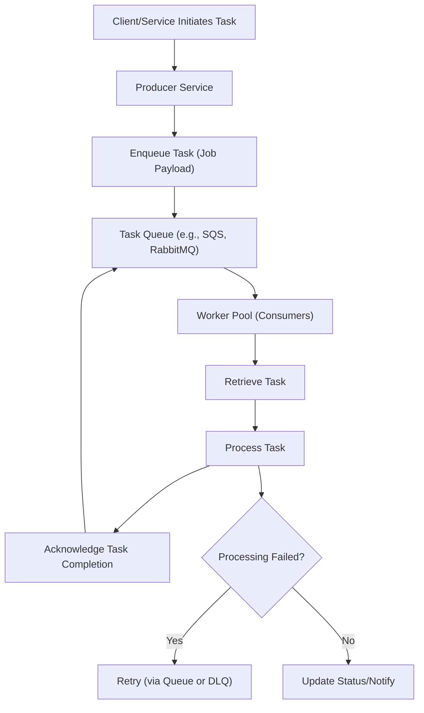

## Task Queues
### Core Concepts

*   **Asynchronous Processing:** Decouples long-running, CPU-intensive, or I/O-bound tasks from the main request/response flow.
*   **Decoupling:** Producers (task initiators) and Consumers (task processors/workers) operate independently, improving system resilience and scalability.
*   **Reliability:** Queues store tasks until processed, preventing loss if workers fail. Retries and Dead-Letter Queues (DLQs) enhance fault tolerance.
*   **Scalability:** Allows horizontal scaling of workers to handle varying loads. Tasks are distributed among available workers.
*   **Components:**
    *   **Producer:** Enqueues tasks (messages/jobs) into the queue.
    *   **Task Queue:** A durable storage mechanism (e.g., message broker, database, in-memory) for holding tasks.
    *   **Consumer/Worker:** Polls the queue, retrieves tasks, processes them, and acknowledges completion.

### Key Details & Nuances

*   **Queueing Mechanisms:**
    *   **Message Brokers:** Dedicated systems (e.g., **RabbitMQ**, **Kafka**, **Amazon SQS**, **Azure Service Bus**, **Google Pub/Sub**). Offer robust features like durability, message guarantees, pub/sub, routing.
    *   **Redis/Database Backed:** Simpler for smaller scale or specific use cases (e.g., **Redis lists/streams**, **PostgreSQL LISTEN/NOTIFY**). Less feature-rich, may require more custom logic for reliability.
*   **Message Guarantees (Crucial for Reliability):**
    *   **At-most-once:** Message might be lost, but never processed more than once. (Rarely desired for tasks).
    *   **At-least-once:** Message is guaranteed to be processed, but might be processed multiple times (due to retries/failures). Requires consumers to be **idempotent**.
    *   **Exactly-once:** Highly challenging to achieve across distributed systems without significant overhead or specific patterns (e.g., distributed transactions, deduplication at source). Often approximated by at-least-once with idempotency.
*   **Acknowledgement (ACK) Model:**
    *   Consumers explicitly acknowledge task completion. If no ACK, the task is re-queued or moved to a DLQ after a timeout.
    *   **Visibility Timeout:** After a worker retrieves a task, it becomes invisible to other workers for a set duration. If no ACK within this time, it becomes visible again for re-processing.
*   **Error Handling & Retries:**
    *   **Exponential Backoff:** Increasing delays between retries to avoid overwhelming downstream services.
    *   **Dead-Letter Queues (DLQ):** A separate queue for tasks that fail too many times or cannot be processed. Allows for manual inspection and re-processing.
*   **Idempotency:** A task processing operation is idempotent if executing it multiple times produces the same result as executing it once. Essential when using "at-least-once" delivery to prevent unintended side effects from retries.
*   **Worker Pool Management:**
    *   **Polling:** Workers periodically check the queue for new tasks. Can be inefficient.
    *   **Long Polling:** Workers keep a connection open, and the queue pushes a task when available, reducing latency and empty polls.
    *   **Event-Driven:** Queue directly triggers a worker (e.g., AWS Lambda triggered by SQS).
*   **Prioritization:** Some queues support prioritizing tasks, processing high-priority ones first. Can be complex to implement efficiently.

### Practical Examples

#### Producer-Consumer Flow with a Task Queue



#### TypeScript Producer Example (Conceptual)

```typescript
import { SQSClient, SendMessageCommand } from "@aws-sdk/client-sqs";

const sqsClient = new SQSClient({ region: "us-east-1" });
const QUEUE_URL = "https://sqs.us-east-1.amazonaws.com/123456789012/MyImageQueue";

interface ImageProcessingTask {
  imageId: string;
  s3Key: string;
  filterType: 'grayscale' | 'sepia';
  callbackUrl?: string;
}

async function enqueueImageProcessTask(task: ImageProcessingTask): Promise<void> {
  try {
    const command = new SendMessageCommand({
      QueueUrl: QUEUE_URL,
      MessageBody: JSON.stringify(task),
      DelaySeconds: 0, // Or higher for delayed processing
      MessageAttributes: {
        'TaskType': {
          DataType: 'String',
          StringValue: 'ImageProcessing',
        },
      },
    });
    const response = await sqsClient.send(command);
    console.log("Task enqueued successfully:", response.MessageId);
  } catch (error) {
    console.error("Failed to enqueue task:", error);
    throw error;
  }
}

// Example usage:
enqueueImageProcessTask({
  imageId: "img_abc123",
  s3Key: "uploads/user1/image_source.jpg",
  filterType: "grayscale",
  callbackUrl: "https://my-api.com/image-processed",
});
```

### Common Pitfalls & Trade-offs

*   **Complexity Overhead:** Introducing a task queue adds operational complexity (managing the queue, monitoring workers, handling failures). Don't use if a simple synchronous call suffices.
*   **Message Ordering:** Most distributed queues do not guarantee strict FIFO ordering by default, especially with multiple consumers. If ordering is critical, specialized queues (e.g., Kafka topics with single partition/consumer, SQS FIFO queues) or custom sequencing logic is required.
*   **"At-Least-Once" Challenges:** Requires careful design for idempotency in consumers to prevent incorrect side effects from duplicate processing.
*   **Monitoring & Observability:** Crucial to monitor queue depth, message age, worker health, and task success/failure rates.
*   **Cost:** Managed queue services can incur significant costs at scale. Self-hosting requires management effort.
*   **Over-optimization:** Don't build a complex queue system for tasks that are infrequent, fast, or don't require high reliability.

### Interview Questions

1.  **Describe the core components and flow of a task queue system. What are the primary benefits of using one?**
    *   **Answer:** Core components are Producers (enqueue tasks), the Task Queue itself (stores tasks), and Consumers/Workers (process tasks). The flow involves producers adding tasks, workers retrieving them, processing, and acknowledging. Benefits include asynchronous processing, decoupling, improved fault tolerance (tasks persist if workers fail), and scalability (horizontal scaling of workers).

2.  **How do you ensure reliability and fault tolerance in a task queue system? Discuss specific mechanisms.**
    *   **Answer:** Key mechanisms are:
        *   **Persistence/Durability:** The queue stores messages on disk until successfully processed.
        *   **Acknowledgement (ACK) Model:** Workers explicitly confirm task completion; unacknowledged tasks are re-queued.
        *   **Visibility Timeout:** Prevents multiple workers from processing the same task concurrently during a processing attempt.
        *   **Retries with Exponential Backoff:** For transient failures, tasks are retried after increasing delays.
        *   **Dead-Letter Queues (DLQs):** For tasks that consistently fail or cannot be processed, they are moved to a DLQ for investigation.
        *   **Idempotency in Consumers:** Ensures that re-processing a task (due to retries or duplicates) has no unintended side effects.

3.  **When would you choose a message queue for a background task over a direct RPC call or a simple cron job?**
    *   **Answer:**
        *   **Message Queue:** Choose when tasks are long-running, might fail and need retries, need to be decoupled from the request-response cycle, require high scalability, or need to be processed reliably even if the producer or consumer crashes. Good for asynchronous processing (e.g., image resizing, email sending).
        *   **Direct RPC:** Use for synchronous, fast operations where an immediate response is required and failure is handled directly by the caller.
        *   **Cron Job:** Use for scheduled, recurring tasks that run at specific intervals and are less event-driven (e.g., daily report generation, database cleanup). Cron jobs don't handle dynamic task submission or load balancing across multiple instances as easily as queues.

4.  **Explain idempotency in the context of job processing and why it's important.**
    *   **Answer:** An operation is **idempotent** if executing it multiple times has the same effect as executing it once. In job processing, it's crucial because task queues often guarantee "at-least-once" delivery, meaning a task might be processed multiple times due to network issues, worker failures, or retries. If a task isn't idempotent (e.g., a "decrement balance" operation), processing it twice would lead to incorrect state (double decrement). By designing tasks to be idempotent (e.g., using unique transaction IDs, checking prior state before applying changes), we ensure correctness even with duplicate processing.

5.  **How would you handle a sudden spike in job submissions, ensuring the system remains stable and responsive?**
    *   **Answer:** Task queues inherently handle spikes by buffering messages. To ensure stability:
        *   **Queue Capacity:** Ensure the queue system (e.g., SQS, Kafka) can handle the message volume without degradation.
        *   **Horizontal Scaling of Workers:** Implement auto-scaling for worker instances based on queue depth or CPU utilization, allowing more workers to come online and process the backlog.
        *   **Rate Limiting/Throttling (at Producer):** If the spike is extreme and threatens to overwhelm the queue or downstream services, producers might temporarily rate-limit or reject new submissions.
        *   **Circuit Breakers:** Implement circuit breakers in workers when interacting with external dependencies to prevent cascading failures if a downstream service becomes unresponsive.
        *   **Prioritization:** If applicable, process high-priority jobs first from the backlog.