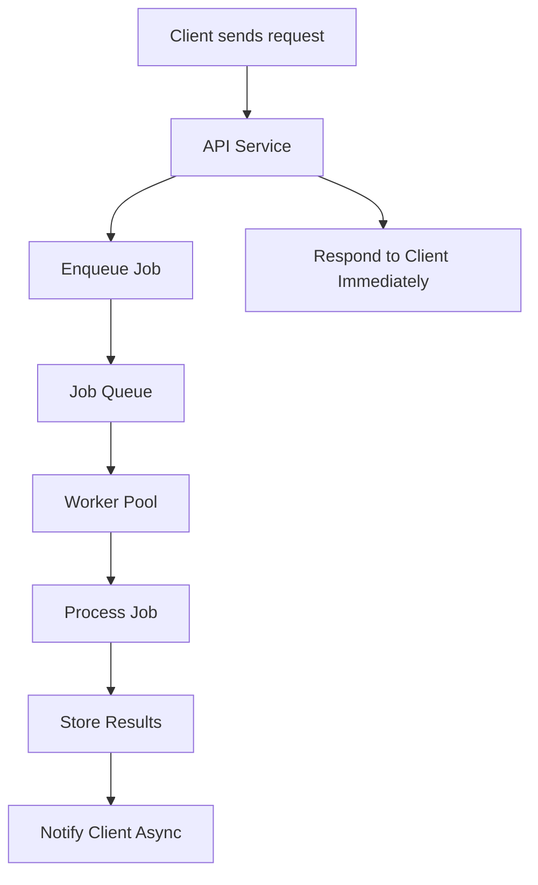

## Asynchronism
### Core Concepts

*   **Asynchronism:** A programming paradigm where long-running operations (e.g., I/O, network requests, CPU-bound tasks) do not block the main execution thread. Instead, they operate in the background, and a notification or callback is triggered upon completion.
*   **Non-Blocking Operations:** The ability for a system to continue processing other requests or tasks while waiting for a specific operation (like reading from a disk or network) to finish.
*   **Job Processing Context:** Essential for offloading heavy or time-consuming tasks (e.g., image processing, email sending, report generation) from the request-response cycle, improving user experience and system throughput.

### Key Details & Nuances

*   **Event Loop:** The fundamental mechanism in many asynchronous runtimes (e.g., Node.js, browsers). It continuously checks the message queue for pending tasks (callbacks from completed async operations) and pushes them onto the call stack when the stack is empty.
*   **Concurrency vs. Parallelism:**
    *   **Concurrency:** Deals with multiple tasks seemingly making progress over the same period, often by interleaving execution on a single core (e.g., switching between tasks when one is waiting for I/O). Achieved via asynchronism.
    *   **Parallelism:** Deals with multiple tasks executing *simultaneously* on multiple cores or machines. Asynchronism *enables* better utilization of parallel resources but doesn't inherently mean parallel execution on a single thread.
*   **Models of Asynchronism:**
    *   **Callbacks:** Functions passed as arguments to be executed later upon event completion. Can lead to "callback hell" (pyramid of doom).
    *   **Promises:** Objects representing the eventual completion (or failure) of an asynchronous operation and its resulting value. Chainable for sequential operations.
    *   **Async/Await:** Syntactic sugar built on Promises, allowing asynchronous code to be written and read in a more synchronous-like style, improving readability and error handling.
*   **Importance in System Design:**
    *   **Responsiveness:** Keeps the primary application thread free, ensuring UIs remain interactive and APIs respond quickly.
    *   **Scalability:** Allows a single server instance to handle many concurrent connections without needing a thread per connection (common in traditional blocking I/O models), reducing resource consumption.
    *   **Resilience:** Enables graceful degradation by offloading non-critical tasks to background workers, preventing failures in one component from cascading.

### Practical Examples

**1. Async/Await in TypeScript/JavaScript**

```typescript
// Simulate an asynchronous database operation
function fetchUserData(userId: string): Promise<{ id: string; name: string }> {
  return new Promise(resolve => {
    setTimeout(() => {
      console.log(`[DB] Fetched user data for ${userId}`);
      resolve({ id: userId, name: `User ${userId}` });
    }, 1000); // Simulates 1 second delay
  });
}

// Simulate an asynchronous email sending operation
function sendWelcomeEmail(email: string, userName: string): Promise<void> {
  return new Promise(resolve => {
    setTimeout(() => {
      console.log(`[Email] Sent welcome email to ${userName} at ${email}`);
      resolve();
    }, 500); // Simulates 0.5 second delay
  });
}

async function processNewUser(userId: string, email: string) {
  console.log(`[Main] Starting user processing for ${userId}...`);

  try {
    // These operations run asynchronously and don't block the main thread.
    // The 'await' pauses the execution of *this* async function, not the whole program.
    const user = await fetchUserData(userId);
    console.log(`[Main] User ${user.name} data retrieved.`);

    await sendWelcomeEmail(email, user.name);
    console.log(`[Main] Welcome email sent.`);

    console.log(`[Main] User processing for ${userId} complete.`);
  } catch (error) {
    console.error(`[Main] Error processing user ${userId}:`, error);
  }
}

// Example usage:
console.log("Application started. Registering new users...");
processNewUser("123", "user123@example.com");
processNewUser("456", "user456@example.com");
console.log("Application continues to run non-blocking tasks.");
// Output will show interleaved messages, demonstrating non-blocking behavior.
```

**2. Asynchronous Job Processing Flow (Mermaid Diagram)**



### Common Pitfalls & Trade-offs

*   **Increased Complexity:** Asynchronous code can be harder to reason about, debug, and test due to non-linear execution flow, especially with nested callbacks or improper promise chaining.
*   **Error Handling:** Requires careful consideration of error propagation and handling in asynchronous chains (e.g., using `try/catch` with `await`, `.catch()` with Promises). Unhandled promise rejections can lead to silent failures or ungraceful crashes.
*   **Debugging Challenges:** Debugging asynchronous code often requires specific tools or techniques to follow the flow of execution across multiple events or Promises.
*   **Resource Management:** While improving concurrency, poorly managed asynchronous operations (e.g., too many concurrent I/O requests) can still exhaust system resources (memory, file descriptors).
*   **State Management:** Maintaining consistent state across asynchronous operations can be tricky, especially in highly concurrent scenarios. Requires proper synchronization mechanisms if shared mutable state is involved.
*   **Overhead:** While generally beneficial, the overhead of context switching and managing the event loop or worker threads exists. For purely CPU-bound tasks that don't involve I/O, blocking synchronous operations might be simpler if parallelism isn't the primary concern and responsiveness isn't critical.

### Interview Questions

1.  **Explain the difference between synchronous and asynchronous operations. When would you choose one over the other in a system design, specifically for handling user requests?**
    *   **Answer:** Synchronous operations block the main thread until completion, while asynchronous operations offload tasks and allow the main thread to continue processing. Choose asynchronous for I/O-bound tasks (database calls, network requests) to maintain responsiveness and high throughput, especially for user-facing APIs. Synchronous might be acceptable for simple, fast, CPU-bound tasks if the blocking time is negligible, or for critical path operations that *must* complete before proceeding.

2.  **Describe the role of the Event Loop in an asynchronous runtime like Node.js. How does it enable non-blocking I/O?**
    *   **Answer:** The Event Loop is the core mechanism that allows Node.js (single-threaded JavaScript) to perform non-blocking I/O operations. When an asynchronous I/O operation (e.g., reading a file, making a network request) is initiated, it's offloaded to the OS kernel or a C++ worker pool. The Event Loop continuously monitors the "message queue" (or "callback queue") for callbacks from completed asynchronous operations. Once the main call stack is empty, it picks a callback from the queue and pushes it onto the stack for execution, ensuring the main thread remains available for new incoming requests.

3.  **You're designing a service that takes large image uploads, processes them (resizing, watermarking), and then stores them. How would you leverage asynchronism and background tasks to handle this, and what are the benefits?**
    *   **Answer:** I would accept the image upload via an API synchronously, immediately return a confirmation to the user, and then asynchronously process the image in the background. The API service would put a "process image" message into a message queue (e.g., RabbitMQ, SQS). A separate worker service would consume messages from this queue, perform the resizing/watermarking, and store the result. Benefits: User gets immediate feedback; API service remains highly responsive and scalable; image processing is decoupled and won't block the main application; allows for retry mechanisms if processing fails; enables scaling workers independently of the API.

4.  **Discuss the challenges of error handling and debugging in an asynchronous system, particularly when dealing with long chains of operations or distributed background tasks.**
    *   **Answer:** Error handling becomes more complex due to non-linear execution; errors can occur in callbacks or promises much later than the initial call. Unhandled promise rejections can be silent or hard to trace. Debugging requires understanding the flow of events rather than a sequential call stack. For distributed tasks, tracing errors across multiple services (API, queue, worker) requires robust logging, correlation IDs, and potentially distributed tracing tools (e.g., OpenTelemetry). Retries and dead-letter queues are crucial for handling transient failures and persistent errors in background tasks.

5.  **When might a synchronous approach be preferable or simpler than an asynchronous one, even for operations that could technically be asynchronous? Provide a specific example.**
    *   **Answer:** A synchronous approach might be preferable for very short, CPU-bound operations where the overhead of context switching for asynchronous processing outweighs the benefits, or when the sequential nature of the task is critical and simplicity of reasoning about the code is prioritized over maximum concurrency. For example, a simple mathematical calculation or parsing a small, in-memory configuration file. If the operation consistently takes microseconds and is not I/O bound, making it asynchronous might add unnecessary complexity (e.g., wrapping it in a Promise, awaiting it) without significant performance gain, and could even introduce subtle bugs related to race conditions if not carefully managed.