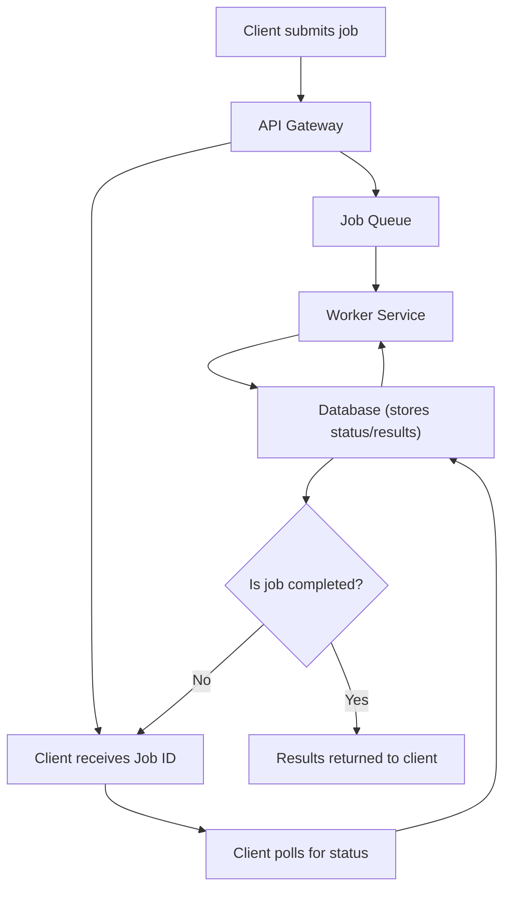

## Returning Results
### Core Concepts
*   **Asynchronous Processing:** Long-running or resource-intensive tasks are offloaded from the main request-response thread to background workers. This keeps the primary service responsive.
*   **The Challenge:** Since the client's initial request completes immediately, a mechanism is needed to deliver the final result of the background job back to the client or another system once it's ready.
*   **Result Delivery:** Refers to the methods and patterns used to bridge the asynchronous gap and effectively communicate job completion and results.

### Key Details & Nuances
*   **Job ID:** A unique identifier generated immediately upon job submission and returned to the client. This ID is crucial for tracking job status and retrieving results.
*   **Persistent Storage for Results:**
    *   **Database (SQL/NoSQL):** Most common. Stores job status (`pending`, `processing`, `completed`, `failed`) and the final output/error.
    *   **Cache (e.g., Redis):** For temporary storage of results, especially if frequently accessed or short-lived.
*   **Result Delivery Mechanisms:**
    *   **Polling (Short Polling):**
        *   Client periodically sends requests to a server endpoint with the Job ID to check status.
        *   **Pros:** Simple to implement, firewall-friendly, stateless server-side.
        *   **Cons:** Inefficient (wasted requests, high server load with many clients), latency depends on poll interval.
    *   **Long Polling:**
        *   Client makes a request; server holds the connection open until data is available or a timeout occurs.
        *   **Pros:** More efficient than short polling, lower latency.
        *   **Cons:** Server resources tied up, still requires re-establishment, potential timeout issues.
    *   **WebSockets / Server-Sent Events (SSE):**
        *   **Persistent Connection:** A dedicated, persistent connection is established between client and server.
        *   **Push-based:** Server pushes results directly to the client once available.
        *   **Pros:** Real-time, highly efficient (low overhead once connected), low latency.
        *   **Cons:** More complex to implement and scale (connection management), potential firewall issues (WebSockets).
    *   **Webhooks (Callbacks):**
        *   **Server-to-Server:** The job processing service makes an HTTP POST request to a pre-registered URL (callback URL) provided by the client (or another system).
        *   **Event-driven:** Results are delivered only when the job completes.
        *   **Pros:** Highly decoupled, efficient (no polling overhead), push-based.
        *   **Cons:** Requires the client to expose an accessible endpoint, security concerns (authenticating callbacks), robust error handling (retries, dead-letter queues) is critical.
*   **Idempotency:** Design result delivery mechanisms to handle potential duplicate notifications or deliveries gracefully. The client should process the result the same way whether it receives it once or multiple times.

### Practical Examples

#### Polling Flow Diagram



#### Client-side Polling Example (JavaScript)

```typescript
// Client-side polling function (simplified)
async function pollJobStatus(jobId: string, intervalMs: number = 2000) {
    return new Promise((resolve, reject) => {
        const poll = async () => {
            try {
                const response = await fetch(`/api/job-status/${jobId}`);
                const data = await response.json();

                if (data.status === 'completed') {
                    // Job finished, resolve with results
                    clearInterval(intervalId);
                    resolve(data.results);
                } else if (data.status === 'failed') {
                    // Job failed, reject with error
                    clearInterval(intervalId);
                    reject(new Error(data.error || 'Job failed'));
                } else {
                    // Job still pending/processing
                    console.log('Job still processing...');
                }
            } catch (error) {
                // Network or API error
                console.error('Polling error:', error);
                clearInterval(intervalId);
                reject(error);
            }
        };

        // Start polling immediately, then repeat at interval
        const intervalId = setInterval(poll, intervalMs);
        poll();
    });
}

// Example usage:
// Imagine 'startJob' returns a { jobId: '...' }
// pollJobStatus('job-abc-123')
//     .then(results => console.log('Job completed, results:', results))
//     .catch(error => console.error('Job polling failed:', error));
```

### Common Pitfalls & Trade-offs
*   **Polling Frequency:** Too frequent polling can overload the server; too infrequent leads to high latency. Implement **exponential backoff** for polling.
*   **Scalability of Push Mechanisms:** WebSockets/SSE require careful design for high concurrency (e.g., using pub/sub with Redis, distributed WebSocket servers like Socket.IO with adapters).
*   **Security for Webhooks:** Ensure callback endpoints are secure. Use HTTPS, validate sender identity (e.g., HMAC signatures), and implement IP whitelisting if possible.
*   **Failure Handling for Push:** If a client or a webhook receiver is offline, implement robust retry mechanisms with exponential backoff and potentially a **dead-letter queue (DLQ)** for un-deliverable messages.
*   **Result Lifetime:** Determine how long results should be stored in the database/cache. Implement TTLs (Time-To-Live) for cache or cleanup routines for databases to prevent unbounded growth.
*   **Data Size:** Avoid pushing very large results directly. Instead, push a URL or identifier that the client can use to fetch the large data.

### Interview Questions
1.  **Question:** Describe the various methods for returning results from a long-running background job to a client. Discuss the advantages and disadvantages of each.
    **Answer:** Common methods include polling (short/long), WebSockets/SSE, and webhooks. Polling is simple but inefficient due to wasted requests. WebSockets/SSE offer real-time push but add complexity in connection management and scaling. Webhooks are decoupled and efficient (event-driven) but require the client to expose an endpoint and careful security/error handling. The choice depends on latency requirements, client type, and system complexity.
2.  **Question:** When would you choose WebSockets/SSE over polling for result delivery, and vice versa?
    **Answer:** Choose WebSockets/SSE when real-time updates are critical, latency must be minimized, and continuous, bidirectional (WebSockets) or unidirectional (SSE) communication is desired (e.g., live dashboards, chat). Choose polling when simplicity is paramount, updates are not strictly real-time, the client is a browser that doesn't need persistent connections, or when dealing with restrictive network environments (firewalls).
3.  **Question:** Design a system to deliver results from an image processing job. How would you handle cases where the client application is offline or the delivery fails?
    **Answer:** The system would typically return a `jobId` to the client immediately. The image processing worker would store the result (e.g., image URL, metadata) in a database. For result delivery, webhooks are preferred. If the client is offline or delivery fails, the webhook sender (e.g., a notification service) would implement a retry mechanism with exponential backoff. Failed deliveries after several retries would be moved to a dead-letter queue (DLQ) for manual inspection or alternative delivery (e.g., email notification to the user).
4.  **Question:** Explain how you would secure a webhook endpoint used for receiving job results.
    **Answer:**
    *   **HTTPS:** Always use HTTPS to encrypt traffic.
    *   **HMAC Signatures:** The sender should sign the payload with a shared secret key, and the receiver verifies the signature to ensure authenticity and integrity.
    *   **IP Whitelisting:** If possible, restrict incoming requests to known IP addresses of the job processing service.
    *   **Rate Limiting:** Protect against abuse or DoS attacks.
    *   **Least Privilege:** The webhook endpoint should only accept `POST` requests and perform minimal necessary actions.
    *   **Validation:** Rigorously validate the incoming payload structure and content.
5.  **Question:** How would you ensure the client receives a result *exactly once*, even if the result delivery mechanism (e.g., webhook) attempts multiple deliveries?
    **Answer:** Ensuring "exactly once" delivery is hard; "at-least-once" is common. To achieve *effective* exactly-once processing on the client side, use **idempotency**. The client's receiving endpoint should use a unique identifier from the webhook payload (e.g., a `deliveryId` or `jobId` from the sender, or a unique hash of the payload) to detect and discard duplicate messages. Before processing a result, check if it has already been processed based on this identifier, typically by storing it in a database or cache.