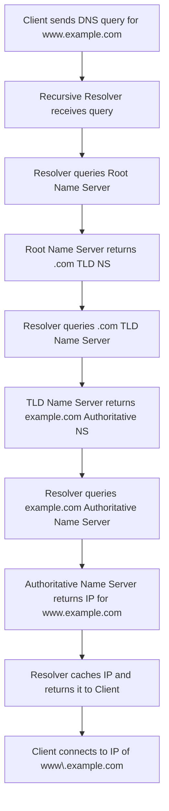

## Domain Name System

### Core Concepts

- **Decentralized Naming System:** Translates human-readable domain names (e.g., `example.com`) into machine-readable IP addresses (e.g., `93.184.216.34`).
- **Hierarchical Structure:** Organized as a tree, starting from the Root DNS servers, flowing down to Top-Level Domains (TLDs) like `.com`, `.org`, and then to authoritative name servers for specific domains.
- **Distributed Database:** No single server holds all DNS information; it's spread across millions of servers globally, improving scalability and resilience.
- **Purpose:** Essential for accessing resources on the internet by name, enabling services to move hosts without changing their public address, and load balancing traffic (e.g., Round Robin DNS).

### Key Details & Nuances

- **DNS Resolution Process:**
  - **Recursive Resolver:** A DNS server (often provided by your ISP or a public service like Google DNS) that handles the full lookup process on behalf of the client.
  - **Root Name Servers:** 13 sets of servers that know where to find TLD name servers.
  - **TLD Name Servers:** Servers responsible for top-level domains (e.g., `.com`, `.org`, `.net`) and know which authoritative name servers manage specific domains within their TLD.
  - **Authoritative Name Servers:** Servers that hold the actual DNS records for a specific domain (e.g., `example.com`).
- **DNS Record Types (Resource Records - RRs):**
  - `A` (Address): Maps a hostname to an IPv4 address.
  - `AAAA` (IPv6 Address): Maps a hostname to an IPv6 address.
  - `CNAME` (Canonical Name): Maps one hostname to another hostname (alias). The resolution then continues for the target hostname.
  - `MX` (Mail Exchange): Specifies mail servers responsible for receiving email messages on behalf of a domain.
  - `NS` (Name Server): Delegates a DNS zone to use a specific authoritative name server.
  - `TXT` (Text): Holds arbitrary text strings, often used for verification (e.g., SPF, DKIM for email, domain ownership).
  - `PTR` (Pointer): Used for reverse DNS lookups (IP to hostname).
- **Time To Live (TTL):** A value (in seconds) that tells a recursive resolver how long to cache a DNS record before querying an authoritative server again.
  - **High TTL:** Faster subsequent lookups, less load on authoritative servers, but slower propagation of DNS changes.
  - **Low TTL:** Faster propagation of DNS changes (e.g., during failovers or migrations), but increased load on authoritative servers due to more frequent queries.
- **Caching:** DNS resolvers and clients cache records based on TTL to reduce latency and server load.
- **DNSSEC (DNS Security Extensions):** Adds cryptographic signatures to DNS records to verify their authenticity and integrity, protecting against DNS spoofing and cache poisoning attacks.

### Practical Examples

**DNS Resolution Flow for `www.example.com`**



**Checking DNS Records using `dig`**

```sh
# Lookup A record for example.com
dig example.com A

# Lookup CNAME record for www.example.com
dig www.example.com CNAME

# Lookup MX records for example.com
dig example.com MX
```

### Common Pitfalls & Trade-offs

- **TTL Mismanagement:** Setting TTL too high can delay critical updates (e.g., failovers, IP changes). Setting it too low can overwhelm authoritative servers and increase latency due to reduced caching.
- **Caching Issues:** Stale records in caches can lead to users being directed to old or non-existent services after a DNS update.
- **Single Point of Failure (SPOF) via DNS:** If an organization's authoritative DNS servers are misconfigured or become unreachable, all services relying on those domains become inaccessible. Redundancy (multiple name servers in different geographic locations) is critical.
- **DDoS Attacks:** DNS servers are common targets for DDoS attacks (e.g., DNS amplification, volumetric attacks). Mitigation involves using robust DNS providers with high capacity and DDoS protection.
- **DNS vs. Service Discovery:** DNS is name-to-IP. Service discovery (e.g., Consul, ZooKeeper, Eureka) typically involves health checks, dynamic registration/deregistration, and more complex service metadata, often used for internal microservice communication rather than public internet access. DNS can be _part_ of a service discovery solution (e.g., DNS SRV records, or DNS for an API Gateway that then uses service discovery).

### Interview Questions

1.  **Describe the step-by-step process of how your browser resolves `www.google.com` to an IP address.**

    - **Answer:** Client queries recursive resolver (ISP/public DNS). If not in cache, resolver queries root name servers, which point to `.com` TLD name servers. TLD name servers point to Google's authoritative name servers. Google's authoritative name servers provide the IP for `www.google.com`. The resolver caches this, returns it to the client, and the client initiates a connection.

2.  **Explain the role of TTL in DNS. What are the implications of setting a very high TTL versus a very low TTL for a critical service?**

    - **Answer:** TTL (Time To Live) dictates how long DNS records are cached. High TTL leads to faster subsequent lookups and less load on authoritative servers but slows down record updates (propagation). Low TTL allows faster propagation of changes (critical for failovers or quick migrations) but increases load on authoritative servers and can increase lookup latency due to less effective caching.

3.  **When would you typically use a `CNAME` record versus an `A` record? Provide examples.**

    - **Answer:** An `A` record directly maps a hostname to an IP address (e.g., `example.com` to `192.0.2.1`). A `CNAME` record maps one hostname to another hostname (e.g., `www.example.com` to `example.com`). Use `A` records for the primary canonical name. Use `CNAME` for aliases, such as mapping `www.yourcompany.com` to `yourcompany.com`, or mapping a subdomain like `blog.yourcompany.com` to a third-party blogging platform's domain. `CNAME` is flexible for pointing multiple names to a single underlying service.

4.  **How do DNS servers handle redundancy and ensure high availability in a production environment?**

    - **Answer:** Redundancy is achieved by configuring multiple `NS` (Name Server) records for a domain, pointing to distinct authoritative name servers often hosted by different providers or in different geographic regions. This ensures that if one name server fails or becomes unreachable, others can still serve requests. Load balancers or DNS Anycast can also distribute traffic across these redundant servers.

5.  **What is DNS cache poisoning, and how can DNSSEC help mitigate it?**
    - **Answer:** DNS cache poisoning is an attack where an attacker injects fraudulent DNS data into a resolver's cache, causing it to return incorrect IP addresses for legitimate domains. This can redirect users to malicious sites. DNSSEC (DNS Security Extensions) helps mitigate this by adding cryptographic signatures to DNS records. Resolvers configured with DNSSEC can verify these signatures, ensuring the authenticity and integrity of the DNS responses received from authoritative servers, thus rejecting spoofed or tampered records.
