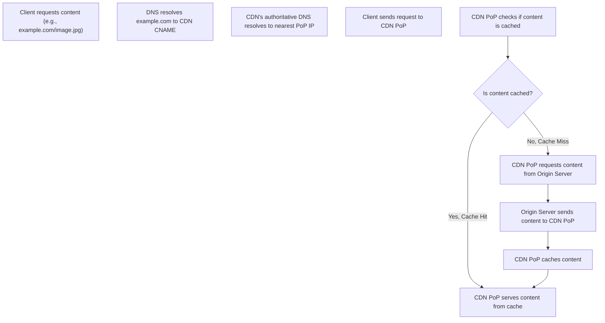

## Content Delivery Networks
### Core Concepts
*   **What is a CDN?** A Content Delivery Network (CDN) is a globally distributed network of proxy servers (Points of Presence, or PoPs) strategically located close to end-users. Its primary purpose is to serve web content (e.g., images, videos, CSS, JavaScript files, HTML) from geographically closer locations.
*   **Primary Goal:** Reduce latency, improve content delivery speed, decrease load on origin servers, and enhance website reliability and availability.
*   **How it Works (Fundamentally):** Content is cached at CDN PoPs. When a user requests content, their DNS query is typically directed to the nearest or optimal PoP, which then serves the cached content if available.

### Key Details & Nuances
*   **Components:**
    *   **Origin Server:** The authoritative source where the original content resides.
    *   **Edge Servers (PoPs):** Distributed servers that cache copies of content. They are the first point of contact for user requests within the CDN.
    *   **DNS:** Used to direct user requests to the optimal CDN PoP based on user location, network conditions, and PoP load.
*   **Content Types:** Primarily static assets (images, videos, stylesheets, scripts). Increasingly, CDNs also support dynamic content (via edge logic/serverless functions), API acceleration, and live streaming.
*   **Caching Strategies:**
    *   **Origin Pull:** Most common. CDN fetches content from the origin the first time it's requested (cache miss), then caches it. Subsequent requests (cache hit) are served from the PoP.
    *   **Origin Push:** Content is proactively uploaded/pushed from the origin to CDN PoPs. Suitable for large, frequently accessed files or non-web assets.
*   **Cache Invalidation:**
    *   **Time-To-Live (TTL):** Content expires after a set duration, triggering a re-fetch from the origin.
    *   **Manual Purge:** Forcing immediate removal of content from cache (e.g., for critical updates).
    *   **Content Versioning/Fingerprinting:** Appending a hash or version number to file names (e.g., `app.js?v=123`) to force new fetches on deployment. This avoids cache invalidation issues.
*   **Benefits:**
    *   **Performance:** Lower latency, faster load times due to geographical proximity.
    *   **Scalability:** Distributes traffic, offloads origin server load.
    *   **Availability:** Redundancy across PoPs ensures content is served even if one PoP or the origin is down.
    *   **Security:** Can mitigate DDoS attacks by absorbing traffic at the edge.
    *   **Cost Savings:** Reduced egress bandwidth costs from origin servers.

### Practical Examples

The typical request flow for content served via a CDN:

### Common Pitfalls & Trade-offs
*   **Complexity of Cache Invalidation:** Managing TTLs and purges can be challenging, leading to stale content or unnecessary origin fetches.
*   **Cost:** While often reducing origin egress costs, CDN services themselves incur costs that scale with bandwidth usage.
*   **Debugging:** Tracing issues can be harder due to the distributed nature and multiple layers (client, CDN, origin).
*   **Security for Dynamic/Authenticated Content:** CDNs are primarily for static content. Serving dynamic or authenticated content through them requires careful configuration to avoid caching user-specific data or session information. Edge logic (e.g., Lambda@Edge) can address this.
*   **Cache Coherence:** Ensuring all PoPs have the latest version of content can be eventually consistent, not immediately.
*   **Cold Cache:** The first request to a new PoP for a specific asset will always be a cache miss, leading to higher initial latency for that user.

### Interview Questions

1.  **Explain the complete request flow for a static asset from a user's browser, through a CDN, and potentially to the origin server.**
    *   **Answer:** User's browser performs DNS lookup for the domain. The domain's CNAME record points to the CDN's DNS. The CDN's intelligent DNS then resolves to the IP of the optimal (e.g., nearest) PoP. The browser sends the request to this PoP. If the PoP has the content cached (cache hit), it serves it immediately. If not (cache miss), the PoP fetches the content from the origin server, caches it, and then serves it to the user.

2.  **What are the key trade-offs to consider when deciding whether to use a CDN for an application?**
    *   **Answer:** Key trade-offs include: **Cost** (CDN services add expense), **Complexity** (managing cache invalidation, DNS configuration), **Cache Incoherence/Staleness** (potential for serving old content if TTLs are long or invalidation fails), and **Debugging Difficulty** (multi-layered request path). These must be weighed against benefits like performance, scalability, and security.

3.  **How would you handle cache invalidation for frequently updated content (e.g., a news feed's main page) or for critical content that needs immediate refresh across all CDN PoPs?**
    *   **Answer:** For frequently updated content, use a short TTL or employ content versioning (e.g., `news.js?v=timestamp`). For immediate refresh of critical content, use **manual cache purging** (also known as invalidation) provided by the CDN. This forces the CDN to remove the specific content from its cache across all PoPs, ensuring the next request goes to the origin.

4.  **Beyond serving static assets, how can modern CDNs be leveraged for dynamic content or API acceleration?**
    *   **Answer:** Modern CDNs offer **edge computing** capabilities (e.g., AWS Lambda@Edge, Cloudflare Workers). These allow running serverless functions at the CDN's edge locations, enabling dynamic content generation, API routing, request modification, authentication, and data manipulation closer to users, thereby reducing latency for dynamic requests without hitting the origin. They can also optimize TCP connections and apply routing rules for API requests.

5.  **Under what circumstances might a CDN be overkill or not the right solution for content delivery?**
    *   **Answer:** A CDN might be overkill for applications with **very small user bases**, **highly localized users** (where a single, well-provisioned origin server suffices geographically), or applications serving **exclusively private/authenticated content** that shouldn't be cached widely. For applications with **extremely low latency requirements** for dynamic data, an edge compute solution might be needed over simple caching. The added cost and complexity might not justify the benefits in these scenarios.