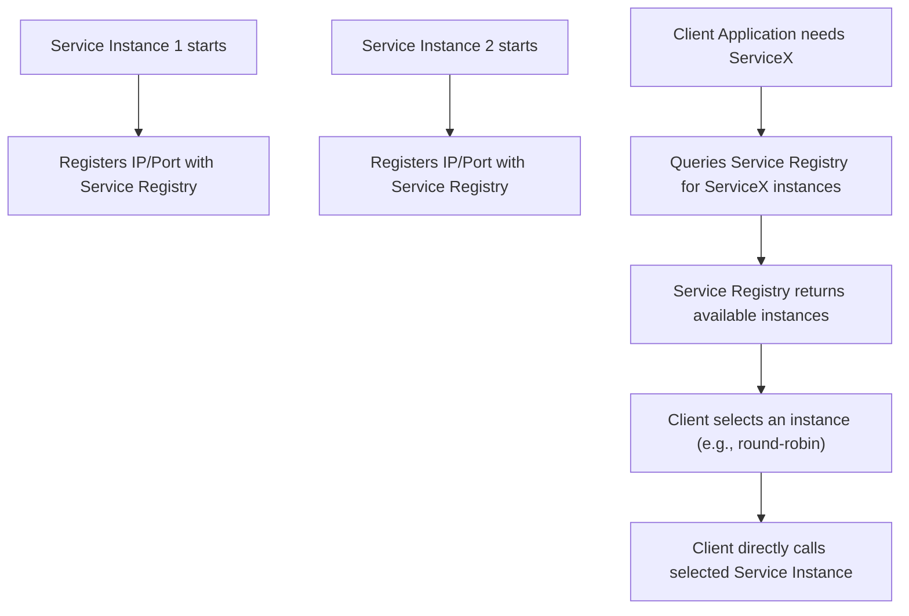

## Microservices
### Core Concepts

*   **Domain Name System (DNS):** A hierarchical and decentralized naming system for computers, services, or any resource connected to the Internet or a private network. It translates human-readable domain names (e.g., `api.example.com`) into machine-readable IP addresses (e.g., `192.0.2.44`). While foundational, raw DNS is often insufficient for dynamic microservices.
*   **Service Discovery:** The process by which microservices (clients) find other microservices (servers) they need to communicate with. In a dynamic microservices environment where instances are frequently added, removed, or moved, hardcoding IP addresses is impractical.
*   **Microservices Context:**
    *   Services are ephemeral: They scale up/down, crash, and restart frequently, leading to constantly changing IP addresses.
    *   Manual configuration is impossible.
    *   Service discovery enables loose coupling and resilience.

### Key Details & Nuances

*   **DNS in Microservices:**
    *   **Limitations:** Traditional DNS records (A, AAAA) map a hostname to one or more static IP addresses. This is problematic for dynamic microservices where IPs change rapidly and health checks aren't built-in.
    *   **SRV Records:** Allow a service to specify its port, protocol, and weight, providing more flexibility than A records. Kubernetes' CoreDNS uses SRV records for internal service discovery.
    *   **DNS Caching (TTL):** While crucial for performance, high TTLs (Time To Live) can lead to stale IP addresses. Low TTLs increase DNS query load.

*   **Service Discovery Mechanisms:**
    *   **Client-Side Service Discovery:**
        *   **How it works:** The client is responsible for querying a Service Registry to get the network locations of available service instances and then selecting one using a load-balancing algorithm.
        *   **Components:**
            *   **Service Registry:** A database containing the network locations of all service instances (e.g., Consul, Eureka, Apache Zookeeper). Instances register themselves upon startup and deregister upon shutdown/failure.
            *   **Client-side Load Balancer:** A library integrated into the client application that queries the registry, selects an instance, and makes the call (e.g., Netflix Ribbon).
        *   **Pros:** Simpler architecture for the service provider, direct connection, more control over load balancing strategy.
        *   **Cons:** Requires coupling client services with a specific discovery library/logic, potential for language-specific implementations.
    *   **Server-Side Service Discovery:**
        *   **How it works:** Clients make requests to a router/load balancer, which queries the Service Registry and forwards the request to an available service instance.
        *   **Components:**
            *   **Service Registry:** Same as above.
            *   **Router/Load Balancer:** An intermediary that handles service lookup and request forwarding (e.g., NGINX, AWS ELB/ALB, Kubernetes Ingress/Service).
        *   **Pros:** Clients are decoupled from discovery logic, easy to evolve, supports multiple client types.
        *   **Cons:** Additional network hop, potential bottleneck if the load balancer isn't scaled, complexity of managing the load balancer itself.

*   **Service Registration & Health Checks:**
    *   **Self-Registration:** Service instances register themselves with the Service Registry upon startup and send heartbeats to confirm availability.
    *   **Third-Party Registration:** An external component (e.g., Kubernetes, a custom agent) registers and deregisters service instances.
    *   **Health Checks:** Critical for removing unhealthy instances from the registry, preventing clients from routing requests to failed services. Can be periodic polls, heartbeat mechanisms, or active monitoring.

### Practical Examples

**1. Client-Side Service Discovery Flow:**



**2. Conceptual Service Lookup (Client-Side):**

```typescript
interface ServiceInstance {
  id: string;
  ip: string;
  port: number;
}

class ServiceRegistryClient {
  private registryUrl: string; // e.g., "http://consul-server:8500"

  constructor(registryUrl: string) {
    this.registryUrl = registryUrl;
  }

  async getServiceInstances(serviceName: string): Promise<ServiceInstance[]> {
    try {
      // In a real scenario, this would involve a specific API call to Consul/Eureka/etc.
      // This is a simplified representation.
      const response = await fetch(`${this.registryUrl}/services/${serviceName}`);
      if (!response.ok) {
        throw new Error(`Failed to fetch service instances: ${response.statusText}`);
      }
      const instances: ServiceInstance[] = await response.json();
      return instances;
    } catch (error) {
      console.error(`Error fetching instances for ${serviceName}:`, error);
      return [];
    }
  }
}

// Example usage:
async function callMyService() {
  const registry = new ServiceRegistryClient("http://my-registry-host:8500");
  const instances = await registry.getServiceInstances("user-service");

  if (instances.length > 0) {
    // Basic client-side load balancing: pick the first available instance
    const selectedInstance = instances[0];
    console.log(`Calling user-service at ${selectedInstance.ip}:${selectedInstance.port}`);
    // Perform actual API call to selectedInstance.ip:selectedInstance.port
  } else {
    console.log("No user-service instances found.");
  }
}

callMyService();
```

### Common Pitfalls & Trade-offs

*   **Stale Data:** Service registries might contain outdated instance information if health checks are slow or instances fail without proper deregistration. This leads to clients attempting to connect to unavailable services.
*   **Discovery Latency:** Every service call might involve an initial lookup, adding latency. Caching discovered IPs/ports can mitigate this, but introduces cache invalidation challenges.
*   **Centralized Registry Bottleneck/SPOF:** A single, non-resilient service registry can become a bottleneck or a single point of failure. Distributed, highly available registries (e.g., Raft/Paxos-based) are crucial.
*   **Complexity:** Setting up and maintaining a robust service discovery solution (especially client-side with custom load balancing) adds significant operational overhead.
*   **Coupling vs. Decoupling:**
    *   **Client-side:** Tightly couples clients to the discovery mechanism (library dependency), making language/platform migration harder.
    *   **Server-side:** Decouples clients from discovery, but introduces an extra layer of abstraction and potential for the load balancer to become a bottleneck.

### Interview Questions

1.  **Explain the core difference between client-side and server-side service discovery, and provide a scenario where each might be preferred.**
    *   **Answer:** Client-side means the client application directly queries a service registry to get service instance locations and performs its own load balancing. Preferred when you need fine-grained control over routing/load balancing logic (e.g., custom algorithms) or when a centralized load balancer is an undesirable hop. Server-side means a load balancer or API Gateway queries the registry on behalf of the client, routing the request to an available instance. Preferred for heterogeneous client types, simpler client-side implementation, and when centralized traffic management/security is needed (e.g., microservices in Kubernetes via Ingress/Service, or AWS ELB).

2.  **How can DNS be used for service discovery in a microservices architecture, and what are its inherent limitations compared to a dedicated service registry?**
    *   **Answer:** DNS can be used via SRV records (which include port information) or by simply updating A records. Kubernetes' CoreDNS leverages this for service discovery. Its limitations are:
        1.  **Dynamic Updates:** Updating DNS records quickly for frequently changing microservice instances (due to scaling, failures) can be challenging and slow due to caching.
        2.  **Health Checks:** DNS doesn't inherently support granular health checks beyond basic endpoint availability. A dedicated registry actively monitors service health.
        3.  **Metadata:** DNS records typically only provide IP/port, lacking richer service metadata (version, capabilities) that a registry can store.

3.  **Describe the role of a Service Registry. What are the key challenges in maintaining a highly available and consistent service registry in a large-scale microservices environment?**
    *   **Answer:** A Service Registry stores the network locations (IPs, ports) and metadata of all active service instances. Its role is to enable services to register themselves and for clients (or load balancers) to look them up.
    *   **Challenges:**
        1.  **Availability:** The registry is critical; if it's down, services can't find each other. Requires a distributed, fault-tolerant setup (e.g., multiple nodes, replication, consensus algorithms like Raft/Paxos).
        2.  **Consistency:** Ensuring all registry nodes have the most up-to-date view of available services, especially during rapid scaling events or failures. Eventual consistency is often tolerated, but stale data can lead to failed requests.
        3.  **Scalability:** Handling high volumes of registration/deregistration requests and lookup queries.
        4.  **Health Check Overhead:** Effectively performing health checks on potentially thousands of instances without overwhelming the network or the services themselves.

4.  **In a microservices system experiencing frequent deploys and auto-scaling events, which service discovery mechanism (client-side vs. server-side) would you lean towards and why? Discuss relevant considerations.**
    *   **Answer:** I would generally lean towards **server-side service discovery** (e.g., via an API Gateway or a cloud load balancer like AWS ALB, or Kubernetes' built-in Service/Ingress).
    *   **Reasons:**
        *   **Decoupling:** Clients don't need to know discovery logic or maintain discovery libraries. This simplifies client development, especially with diverse client types (different languages, mobile apps, web UIs).
        *   **Operational Simplicity:** The platform (e.g., Kubernetes, cloud provider) handles the registration, deregistration, and health checks of instances, abstracting away much of the complexity from individual microservices.
        *   **Centralized Control:** Allows for centralized routing rules, traffic shaping, security policies (e.g., WAF, authentication), and monitoring at the load balancer level, which is beneficial in a dynamic environment.
        *   **Resilience:** The load balancer can quickly adapt to new instances or remove unhealthy ones based on real-time health checks, without requiring client-side updates.
    *   **Considerations:** Cost of load balancers, potential single point of failure if the load balancer itself isn't highly available, and an additional network hop. However, the benefits of manageability and robustness in highly dynamic environments typically outweigh these concerns.