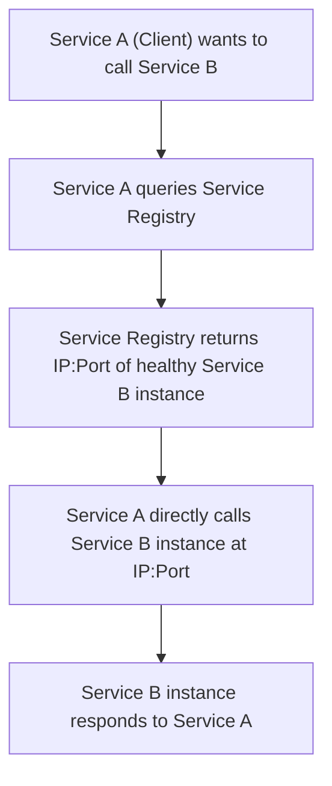

## Service Discovery
### Core Concepts
*   **Definition:** A mechanism for services to find and communicate with other services in a distributed system (e.g., microservices architecture) without hardcoding network locations.
*   **Problem Solved:** Addresses the dynamic nature of distributed systems where service instances can scale up/down, crash, or move, making static configuration impossible.
*   **Key Components:**
    *   **Service Provider:** A service instance that registers its network location (IP, port) with a Service Registry.
    *   **Service Consumer:** A service that needs to call a Service Provider. It queries the Service Registry to find available instances.
    *   **Service Registry:** A central database or distributed system that stores the network locations of service instances. Examples: ZooKeeper, etcd, Consul, Eureka.

### Key Details & Nuances
*   **Types of Service Discovery:**
    *   **Client-Side Discovery:**
        *   **Mechanism:** The client (Service Consumer) is responsible for querying the Service Registry directly and then load-balancing requests across available service instances.
        *   **Pros:** Simpler architecture for the service provider; client can implement sophisticated load-balancing strategies.
        *   **Cons:** Requires discovery logic in every client; clients need to be aware of the Service Registry.
        *   **Examples:** Netflix Eureka (client-side library), Ribbon.
    *   **Server-Side Discovery:**
        *   **Mechanism:** A dedicated component (e.g., a load balancer, API Gateway, or reverse proxy) sits between the client and the service. The client makes a request to this component, which then queries the Service Registry and forwards the request to an available service instance.
        *   **Pros:** Clients are decoupled from the Service Registry and discovery logic; simplifies client implementation.
        *   **Cons:** Introduces an additional hop and potential bottleneck; adds complexity to infrastructure.
        *   **Examples:** AWS ELB/ALB, NGINX Plus, Kubernetes Kube-proxy.
*   **Service Registration:**
    *   **Self-Registration (Provider-Side):** Service instances register themselves with the Service Registry upon startup and deregister on shutdown. They also send periodic heartbeats to indicate health.
        *   **Pros:** Simple for services to integrate.
        *   **Cons:** Coupling between service and registry; service must handle registration/deregistration logic.
    *   **Third-Party Registration (Server-Side/Registrar):** A separate component (registrar) monitors service instances (e.g., via deployment scripts, orchestration tools like Kubernetes) and registers/deregisters them with the Service Registry.
        *   **Pros:** Service instances are decoupled from the registry; cleaner deployment.
        *   **Cons:** Adds another component to manage.
*   **Health Checks:** Service Registries continuously monitor registered instances to ensure they are healthy and remove unhealthy ones, preventing clients from routing requests to failed services.
*   **Caching:** Clients or discovery components often cache resolved service locations to reduce latency and load on the Service Registry. Cache invalidation strategies are crucial (e.g., TTL, push-based updates).
*   **Eventual Consistency:** Service registries are often eventually consistent. Updates (registrations, deregistrations, health status changes) propagate over time, meaning clients might temporarily get stale data.

### Practical Examples

**1. Client-Side Service Discovery Flow:**



**2. Conceptual Client-Side Discovery (TypeScript):**

```typescript
// Assume a discovery client library is available
interface ServiceInstance {
    id: string;
    host: string;
    port: number;
    // ... other metadata
}

class DiscoveryClient {
    private serviceRegistryUrl: string; // e.g., "http://consul-agent:8500"

    constructor(registryUrl: string) {
        this.serviceRegistryUrl = registryUrl;
    }

    /**
     * Fetches a list of healthy instances for a given service name.
     * In a real scenario, this would involve HTTP requests to the registry
     * and possibly client-side caching/load balancing.
     */
    public async getServiceInstances(serviceName: string): Promise<ServiceInstance[]> {
        // Example: Fetch from a mock registry
        console.log(`Querying registry for service: ${serviceName}`);
        const instances: ServiceInstance[] = [
            { id: "b1", host: "192.168.1.10", port: 8081 },
            { id: "b2", host: "192.168.1.11", port: 8081 },
        ];
        // In a real system, this would involve calling the registry API
        // e.g., fetch(`${this.serviceRegistryUrl}/v1/catalog/service/${serviceName}`)
        return instances;
    }
}

class ServiceA {
    private discoveryClient: DiscoveryClient;

    constructor(discoveryClient: DiscoveryClient) {
        this.discoveryClient = discoveryClient;
    }

    public async callServiceB(): Promise<string> {
        try {
            const serviceBInstances = await this.discoveryClient.getServiceInstances("service-b");
            if (serviceBInstances.length === 0) {
                throw new Error("No instances of Service B found.");
            }

            // Simple round-robin load balancing (in a real client, this would be more robust)
            const chosenInstance = serviceBInstances[Math.floor(Math.random() * serviceBInstances.length)];

            const url = `http://${chosenInstance.host}:${chosenInstance.port}/api/data`;
            console.log(`Calling Service B at: ${url}`);
            // In a real application, make an actual HTTP request
            // const response = await fetch(url);
            // return response.text();
            return `Data from Service B (${chosenInstance.id}) via ${url}`;

        } catch (error) {
            console.error("Error calling Service B:", error);
            throw error;
        }
    }
}

// --- Usage ---
// const discoveryClient = new DiscoveryClient("http://localhost:8500"); // Your Consul/Eureka endpoint
// const serviceA = new ServiceA(discoveryClient);

// serviceA.callServiceB()
//     .then(result => console.log(result))
//     .catch(err => console.error("Operation failed:", err.message));
```

### Common Pitfalls & Trade-offs
*   **Single Point of Failure (SPOF) for Registry:** If the Service Registry itself goes down, services cannot find each other. Requires high availability for the registry (e.g., clustering, replication).
*   **Stale Data:** Due to network latency, caching, and eventual consistency, a client might get outdated information from the registry (e.g., an instance marked healthy is actually down, or a new instance isn't yet registered). Mitigated by aggressive health checks and short TTLs.
*   **Increased Network Latency:** Each discovery lookup adds a network hop to the registry. Caching helps mitigate this.
*   **Client-Side Complexity:** For client-side discovery, every client needs to embed discovery logic, including load balancing and retry mechanisms, increasing code duplication and maintenance burden.
*   **Security:** Securing communication with the registry and ensuring only authorized services can register/deregister or query.

### Interview Questions
1.  **"Explain the core problem Service Discovery solves in a microservices architecture. Why can't we just use DNS?"**
    *   **Answer:** It solves the problem of dynamic location of services. In microservices, instances frequently scale up/down, move, or fail. Traditional DNS entries are too static and have long TTLs, making them unsuitable for quickly updating IP addresses of ephemeral service instances. Service discovery provides a dynamic, real-time mechanism for services to find each other, supporting automatic registration/deregistration and health checks.

2.  **"Compare and contrast Client-Side vs. Server-Side Service Discovery. What are the key trade-offs in choosing one over the other?"**
    *   **Answer:** Client-side requires the client to have discovery logic (querying registry, load balancing). Pros: More control for client (e.g., sophisticated LB), no extra network hop before the service. Cons: Logic duplication, tight coupling. Server-side uses an intermediary (LB, API Gateway) to handle discovery. Pros: Clients are simpler/decoupled, centralized control. Cons: Extra hop, intermediary becomes a potential bottleneck/SPOF, adds infrastructure complexity. The choice depends on team expertise, existing infrastructure, and desired decoupling level.

3.  **"How does a Service Registry ensure that it only provides healthy service instances? What happens if an instance becomes unhealthy?"**
    *   **Answer:** Service Registries rely on **health checks**. Registered service instances typically send periodic **heartbeats** or the registry actively pings instances (HTTP, TCP, gRPC checks). If an instance fails to respond to heartbeats or health checks for a configured duration, the registry marks it as unhealthy and removes it from the list of available instances. This prevents clients from routing requests to failed services, improving system reliability.

4.  **"What are the implications of eventual consistency in a Service Discovery system, particularly regarding stale data? How can this be mitigated?"**
    *   **Answer:** Eventual consistency means that updates (e.g., a service instance failing) take time to propagate across the registry and to clients. This can lead to clients receiving **stale data**, meaning they might try to connect to an instance that is no longer available or healthy. Mitigation strategies include:
        *   **Aggressive Health Checks:** Frequent checks to quickly identify and remove unhealthy instances.
        *   **Short TTLs for Caching:** Reduce the time cached data remains valid, forcing more frequent refreshes.
        *   **Client-Side Retry Logic:** Clients should implement retries with backoff for failed service calls, allowing them to eventually query the registry again for updated information.
        *   **Push-based Updates:** Some registries can push updates to clients/proxies, rather than relying solely on polling, reducing propagation delay.