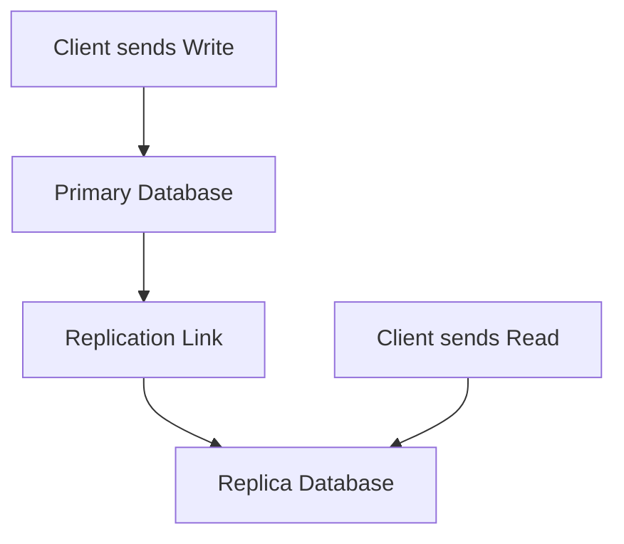

## SQL Databases
### Core Concepts

*   **Relational Model:** Data organized into tables (relations), each with rows (records) and columns (attributes). Relationships between tables are defined using primary and foreign keys.
*   **Structured Query Language (SQL):** Standard language for managing and querying relational databases. Used for DDL (Data Definition Language) and DML (Data Manipulation Language).
*   **ACID Properties:** Fundamental guarantees for reliable transaction processing:
    *   **Atomicity:** A transaction is an indivisible unit; either all operations succeed, or none do.
    *   **Consistency:** A transaction brings the database from one valid state to another, maintaining all defined rules and constraints.
    *   **Isolation:** Concurrent transactions execute without interfering with each other; results are as if transactions ran sequentially.
    *   **Durability:** Once a transaction is committed, its changes are permanent and survive system failures.
*   **Schema:** Pre-defined structure of the database, including tables, columns, data types, indexes, and constraints. Enforcement of schema ensures data integrity.

### Key Details & Nuances

*   **Normalization vs. Denormalization:**
    *   **Normalization:** Organizing data to reduce redundancy and improve data integrity, typically involving multiple tables and joins. Reduces write anomalies. (e.g., 3NF, BCNF)
    *   **Denormalization:** Intentionally introducing redundancy, often by combining tables or duplicating data, to optimize read performance by reducing joins. Trade-off: increased storage, potential for update anomalies.
    *   **Interview focus:** When to use which, the performance trade-offs.
*   **Indexing:**
    *   **Purpose:** Data structures (e.g., B-Trees) that speed up data retrieval operations on tables.
    *   **Trade-offs:** Improves read performance (`SELECT`, `WHERE` clauses, `JOIN` conditions), but adds overhead to write operations (`INSERT`, `UPDATE`, `DELETE`) as indexes must also be updated. Consumes storage space.
*   **Transactions & Locking:**
    *   **Transactions:** A sequence of operations performed as a single logical unit of work. Ensures ACID properties.
    *   **Locking:** Mechanisms (e.g., row-level, table-level) used to prevent data corruption during concurrent transactions by controlling access to data. Granularity of locks impacts concurrency.
*   **Replication:**
    *   **Primary-Replica (Leader-Follower):** Data written to the primary database, then asynchronously or synchronously copied to one or more replica databases.
        *   **Use Cases:** Read scaling (distribute read load), disaster recovery/high availability.
        *   **Trade-offs:** Potential for replication lag (async), increased write latency (sync).
*   **Sharding (Horizontal Partitioning):**
    *   Distributing rows of a single table across multiple database instances (shards) based on a sharding key.
    *   **Use Cases:** Horizontal scalability for both reads and writes when a single instance can no longer handle the load.
    *   **Challenges:** Choosing a good sharding key, hot spots, rebalancing, distributed transactions/joins become complex.
*   **Stored Procedures & Triggers:**
    *   **Stored Procedures:** Pre-compiled SQL code stored in the database, offering performance benefits and encapsulation of business logic.
    *   **Triggers:** Stored procedures that automatically execute in response to specific events (e.g., `INSERT`, `UPDATE`, `DELETE`) on a table.
    *   **Trade-offs:** Can lead to "logic in the database" challenges, making application logic harder to manage, test, and scale.

### Practical Examples

#### SQL Table Creation and Data Retrieval

```sql
-- Create a 'users' table
CREATE TABLE users (
    id INT PRIMARY KEY AUTO_INCREMENT,
    username VARCHAR(50) UNIQUE NOT NULL,
    email VARCHAR(100) UNIQUE NOT NULL,
    registration_date TIMESTAMP DEFAULT CURRENT_TIMESTAMP
);

-- Create an 'orders' table with a foreign key to 'users'
CREATE TABLE orders (
    order_id INT PRIMARY KEY AUTO_INCREMENT,
    user_id INT NOT NULL,
    order_date TIMESTAMP DEFAULT CURRENT_TIMESTAMP,
    total_amount DECIMAL(10, 2) NOT NULL,
    FOREIGN KEY (user_id) REFERENCES users(id)
);

-- Insert data
INSERT INTO users (username, email) VALUES ('alice', 'alice@example.com');
INSERT INTO users (username, email) VALUES ('bob', 'bob@example.com');
INSERT INTO orders (user_id, total_amount) VALUES (1, 99.99);
INSERT INTO orders (user_id, total_amount) VALUES (1, 150.00);
INSERT INTO orders (user_id, total_amount) VALUES (2, 25.50);

-- Retrieve user and their order details using a JOIN
SELECT u.username, o.order_id, o.order_date, o.total_amount
FROM users u
JOIN orders o ON u.id = o.user_id
WHERE u.username = 'alice';
```

#### Read Replica Flow



### Common Pitfalls & Trade-offs

*   **Vertical Scaling Limits:** SQL databases often scale vertically (more powerful hardware) well, but eventually hit limits. Horizontal scaling (sharding) is complex.
*   **Over-Normalization:** Can lead to excessive `JOIN` operations, impacting read performance.
*   **N+1 Query Problem:** Common with ORMs; retrieving a list of parent objects, then issuing a separate query for each child object. Solution: Eager loading/Joins.
*   **Poor Indexing:** Missing critical indexes results in full table scans, while too many indexes or indexes on low-cardinality columns can degrade write performance and waste space.
*   **Deadlocks:** Occur in highly concurrent systems when two or more transactions are waiting for locks held by each other. Requires proper transaction design and deadlock detection/resolution mechanisms.
*   **Schema Rigidity:** While beneficial for data integrity, changes to a large, complex schema can be difficult and require downtime, especially in high-traffic systems.

### Interview Questions

1.  **When would you choose a SQL database over a NoSQL database for a new project?**
    *   **Answer:** When data integrity, consistency (ACID compliance), and complex relationships are paramount. Suitable for applications with well-defined, stable schemas like financial systems, e-commerce transactions, or user management, where strong transactional guarantees and complex analytical queries with joins are essential.
2.  **Explain the ACID properties and why they are critical for SQL databases.**
    *   **Answer:** ACID properties ensure data reliability and consistency, especially in concurrent and failure-prone environments.
        *   **Atomicity:** Prevents partial updates, ensuring data integrity.
        *   **Consistency:** Guarantees valid state transitions, maintaining business rules.
        *   **Isolation:** Prevents concurrent operations from interfering, ensuring reliable results.
        *   **Durability:** Ensures committed data survives crashes, preventing data loss.
        Together, they make SQL databases reliable for critical data operations.
3.  **How do database indexes work, and what are their trade-offs?**
    *   **Answer:** Indexes are data structures (commonly B-Trees) that store a sorted copy of specific table columns and pointers to their rows. They accelerate data retrieval (`SELECT`, `WHERE`, `JOIN`) by allowing the database to quickly locate relevant rows without scanning the entire table. The trade-offs are:
        *   **Pros:** Significantly faster read performance, especially for large tables.
        *   **Cons:** Increased storage space, slower write operations (`INSERT`, `UPDATE`, `DELETE`) due to index maintenance, and potential for index fragmentation.
4.  **Describe different replication strategies for SQL databases and their use cases.**
    *   **Answer:** The most common is **Primary-Replica (Leader-Follower) replication**. The Primary handles all writes, which are then asynchronously or synchronously copied to one or more Replicas.
        *   **Use Cases:** Read scaling (distribute read traffic across replicas), high availability (failover to a replica if primary fails), disaster recovery.
        *   **Variations:** Asynchronous replication offers lower write latency but potential data loss on primary failure (lag). Synchronous replication guarantees no data loss but higher write latency.
    *   Less common for pure SQL scaling is **Multi-Primary (Active-Active)**, where multiple primaries can accept writes, but this introduces significant complexity around conflict resolution and data consistency, often making it less practical for general-purpose SQL scaling than sharding.
5.  **How would you scale a SQL database horizontally, and what challenges does it introduce?**
    *   **Answer:** Horizontal scaling for SQL databases is primarily achieved through **sharding (or horizontal partitioning)**. This involves distributing rows of a table across multiple, independent database instances (shards) based on a "sharding key" (e.g., `user_id % N_shards`).
    *   **Challenges:**
        *   **Sharding Key Selection:** Crucial for even data distribution and avoiding hot spots. Poor choice can lead to data imbalance.
        *   **Data Rebalancing:** As data grows or traffic patterns change, rebalancing data across shards is complex and can be disruptive.
        *   **Distributed Transactions & Joins:** Operations spanning multiple shards (e.g., joining data from two shards, or transactions involving multiple shards) become significantly more complex to implement and manage, potentially sacrificing ACID properties across the cluster.
        *   **Operational Complexity:** Managing multiple database instances is more complex than a single monolithic one.