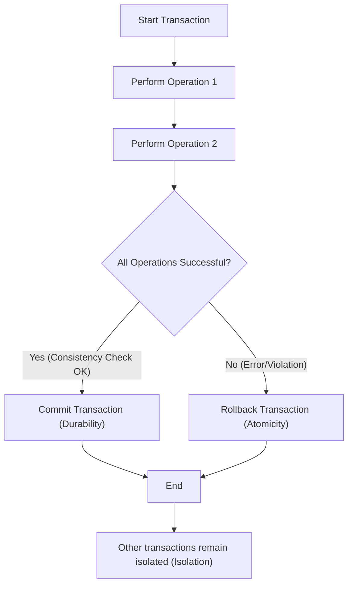

## RDBMS
### Core Concepts

*   **Relational Model:** Data is organized into tables (relations), each with rows (tuples) and columns (attributes). Each column has a defined data type.
*   **Schema:** A predefined structure that defines the tables, columns, data types, relationships (primary/foreign keys), and constraints.
*   **SQL (Structured Query Language):** The standard language for managing and querying relational databases.
    *   **DDL (Data Definition Language):** `CREATE`, `ALTER`, `DROP` for schema.
    *   **DML (Data Manipulation Language):** `SELECT`, `INSERT`, `UPDATE`, `DELETE` for data.
    *   **DCL (Data Control Language):** `GRANT`, `REVOKE` for permissions.
    *   **TCL (Transaction Control Language):** `COMMIT`, `ROLLBACK`, `SAVEPOINT` for transactions.
*   **ACID Properties:** Fundamental principles ensuring data integrity and reliability for transactions:
    *   **Atomicity:** All-or-nothing. A transaction either fully completes or completely fails, leaving the database unchanged.
    *   **Consistency:** A transaction brings the database from one valid state to another, preserving all defined rules and constraints.
    *   **Isolation:** Concurrent transactions execute independently without interfering with each other, as if they were executed sequentially.
    *   **Durability:** Once a transaction is committed, its changes are permanent and survive system failures (e.g., power loss).

### Key Details & Nuances

*   **Normalization:** Process of organizing table columns and keys to minimize data redundancy and improve data integrity.
    *   **Goals:** Eliminate redundant data, ensure data dependencies are logical (data stored only once).
    *   **Forms (1NF, 2NF, 3NF, BCNF):** Progressively stricter rules for table design. 3NF is often a practical target.
    *   **Trade-off:** Higher normalization might require more `JOIN` operations for queries, potentially impacting read performance.
*   **Indexing:** Data structures (commonly B-trees or hash tables) that improve the speed of data retrieval operations on a database table.
    *   **Mechanism:** Indexes create a quick lookup path for specified columns.
    *   **Trade-offs:** Speed up reads, but slow down writes (`INSERT`, `UPDATE`, `DELETE`) as indexes must also be updated. Consume disk space.
    *   **Types:** Primary, Unique, Composite, Full-Text.
*   **Transactions:** A sequence of operations performed as a single logical unit of work. Essential for maintaining data integrity in concurrent environments.
    *   **Syntax:** `BEGIN TRANSACTION; ... COMMIT;` or `ROLLBACK;`
    *   **Isolation Levels (SQL Standard):** Define the degree to which one transaction's uncommitted changes are visible to others.
        *   `READ UNCOMMITTED`: Dirty reads possible.
        *   `READ COMMITTED`: Prevents dirty reads.
        *   `REPEATABLE READ`: Prevents dirty reads and non-repeatable reads.
        *   `SERIALIZABLE`: Prevents all concurrency issues (dirty, non-repeatable, phantom reads), but highest overhead.
*   **Concurrency Control:** Mechanisms (e.g., locking, Multi-Version Concurrency Control - MVCC) to manage simultaneous access to data to ensure ACID properties.
    *   **Locking:** Prevents conflicting access to data by multiple transactions. Can lead to deadlocks.
    *   **MVCC:** Allows multiple versions of a row to exist simultaneously, letting readers access older consistent versions without blocking writers, improving concurrency. (e.g., PostgreSQL, Oracle, MySQL InnoDB).
*   **Replication:** Copying data from a primary (master) database to one or more secondary (replica/slave) databases.
    *   **Purpose:** High availability, disaster recovery, read scalability.
    *   **Types:**
        *   **Master-Slave:** Reads from replicas, writes only to master.
        *   **Multi-Master:** Writes to any master, changes synchronized across all. More complex.
*   **Sharding (Horizontal Partitioning):** Distributing rows of a single table across multiple database instances, typically on different servers.
    *   **Purpose:** Scale writes and storage beyond a single server's capacity.
    *   **Complexity:** Adds significant complexity to application logic, querying, transactions, and data management. Requires a sharding key.

### Practical Examples

**Mermaid: Transaction Flow with ACID**



**SQL Example: Basic Schema & Query**

```sql
-- DDL: Create Tables with Primary and Foreign Keys
CREATE TABLE Users (
    user_id UUID PRIMARY KEY DEFAULT gen_random_uuid(), -- PostgreSQL specific for UUID
    username VARCHAR(50) UNIQUE NOT NULL,
    email VARCHAR(100) UNIQUE NOT NULL,
    created_at TIMESTAMP DEFAULT CURRENT_TIMESTAMP
);

CREATE TABLE Orders (
    order_id UUID PRIMARY KEY DEFAULT gen_random_uuid(),
    user_id UUID NOT NULL,
    order_date TIMESTAMP DEFAULT CURRENT_TIMESTAMP,
    total_amount DECIMAL(10, 2) NOT NULL,
    FOREIGN KEY (user_id) REFERENCES Users(user_id)
);

-- DML: Insert Data
INSERT INTO Users (username, email) VALUES
('alice', 'alice@example.com'),
('bob', 'bob@example.com');

INSERT INTO Orders (user_id, total_amount) VALUES
((SELECT user_id FROM Users WHERE username = 'alice'), 99.99),
((SELECT user_id FROM Users WHERE username = 'bob'), 150.00);

-- DML: Select Data with JOIN
SELECT
    u.username,
    o.order_id,
    o.total_amount,
    o.order_date
FROM
    Users u
JOIN
    Orders o ON u.user_id = o.user_id
WHERE
    u.username = 'alice';
```

### Common Pitfalls & Trade-offs

*   **Scalability Limitations (Writes):** While read scaling is achievable with replication, horizontal scaling for writes in RDBMS is notoriously hard and complex (sharding) due to the need to maintain ACID properties across distributed transactions.
*   **Schema Rigidity:** Changing schema in large, production RDBMS can be complex and require downtime, especially with significant data volume.
*   **Performance Bottlenecks:**
    *   **N+1 Query Problem (with ORMs):** Fetching parent objects, then individually querying for each child object, leading to many inefficient database calls.
    *   **Over-Normalization:** Can lead to too many `JOIN` operations, degrading read performance. Denormalization (controlled redundancy) is sometimes used in data warehousing or specific performance-critical scenarios.
    *   **Missing/Ineffective Indexes:** Queries on non-indexed columns can result in full table scans, which are slow for large tables.
    *   **Poorly Written Queries:** Unoptimized `JOIN` conditions, excessive `SELECT *`, or `LIKE '%string'` can prevent index usage.
*   **Vendor Lock-in:** Moving between different RDBMS vendors (e.g., Oracle to PostgreSQL) can involve significant re-work due to proprietary features, SQL dialects, and tooling.

### Interview Questions

1.  **Explain the ACID properties in the context of a bank transfer scenario. Why is each property critical?**
    *   **Answer:** Consider transferring $100 from Account A to Account B.
        *   **Atomicity:** Either A loses $100 AND B gains $100, or neither happens. If B's update fails, A's debit must be rolled back. Prevents inconsistent state.
        *   **Consistency:** The total sum of money across all accounts must remain unchanged after the transfer (assuming no new money creation/destruction). Ensures business rules (e.g., `balance >= 0`) are maintained.
        *   **Isolation:** If another user queries Account A during the transfer, they should either see the balance before the transfer or after, never an intermediate state (e.g., A debited, B not credited yet). Prevents "dirty reads" or "non-repeatable reads."
        *   **Durability:** Once the transfer is committed, even if the power goes out, the changes are permanently recorded and won't be lost. Ensures data persistence.
    *   **Criticality:** Without ACID, data integrity is compromised, leading to financial inaccuracies, lost data, and unreliable systems, which is unacceptable for transactional systems.

2.  **Discuss the trade-offs between normalization and denormalization in RDBMS design. When would you opt for denormalization?**
    *   **Answer:**
        *   **Normalization (Pros):** Reduces data redundancy, improves data integrity (less chance of inconsistencies), simpler updates/deletes, smaller table sizes, better for transactional (OLTP) systems.
        *   **Normalization (Cons):** Requires more `JOIN` operations for queries, potentially impacting read performance, especially for complex analytical queries.
        *   **Denormalization (Pros):** Improves read performance by reducing `JOIN`s, simpler queries, better for analytical (OLAP) systems or read-heavy applications.
        *   **Denormalization (Cons):** Increases data redundancy (data stored in multiple places), risk of data inconsistencies (requires careful application-level management), larger storage footprint, more complex updates/inserts.
        *   **Opt for Denormalization When:** Read performance is critical and `JOIN`s are expensive; data is primarily for reporting/analytics (data warehousing); integrity can be managed at the application level or through triggers; or for specific performance bottlenecks in highly optimized transactional systems. It's a calculated trade-off.

3.  **How do RDBMS typically handle concurrent transactions? Briefly explain locking vs. MVCC.**
    *   **Answer:** RDBMS use concurrency control mechanisms to ensure that multiple transactions running simultaneously don't interfere with each other and maintain ACID properties.
        *   **Locking:** The traditional approach. When a transaction accesses data, it acquires a lock (e.g., shared lock for reads, exclusive lock for writes) on rows, pages, or tables. Other transactions requesting conflicting locks are blocked until the lock is released. Can lead to deadlocks if transactions wait for each other in a circular fashion.
        *   **MVCC (Multi-Version Concurrency Control):** A more advanced technique where the database maintains multiple versions of a row. When a transaction modifies a row, a new version is created. Readers access older, consistent versions of the data without being blocked by writers, and writers don't block readers. This significantly increases concurrency and reduces contention, avoiding most locking issues for readers. PostgreSQL and MySQL InnoDB are prominent examples.

4.  **What are the primary challenges of scaling an RDBMS horizontally for write-heavy workloads, and how are these typically addressed?**
    *   **Answer:** The primary challenge is maintaining global data consistency (ACID) across multiple distributed nodes.
        *   **Single Write Master:** Most RDBMS designs rely on a single primary (master) node for all writes to ensure data integrity and atomicity of transactions. This becomes a bottleneck for write-heavy applications.
        *   **Data Partitioning (Sharding) Complexity:** Distributing data across multiple independent database instances (shards) introduces:
            *   **Complex Application Logic:** Applications need to know which shard to query/write to (sharding key).
            *   **Distributed Transactions:** Transactions spanning multiple shards are extremely complex to guarantee atomicity and isolation.
            *   **Rebalancing:** Adding/removing shards or redistributing data is a massive operational challenge.
            *   **Hot Spots:** Uneven distribution of data or traffic can lead to certain shards becoming overloaded.
        *   **Addressing Challenges:**
            *   **Replication for Reads:** Master-slave replication handles read scaling effectively.
            *   **Vertical Scaling:** Upgrading hardware (CPU, RAM, faster disk) for the master. This has limits.
            *   **Sharding (with caveats):** The most common horizontal scaling approach for writes, but it's a significant architectural decision often requiring:
                *   Careful sharding key selection.
                *   Distributed transaction frameworks or relaxing ACID for certain operations.
                *   Specialized sharding proxies or services.
            *   **Asynchronous Processing:** Using message queues to batch writes or process them in the background, reducing immediate load on the master.

5.  **When would you choose a NoSQL database over an RDBMS? Provide specific use cases.**
    *   **Answer:**
        *   **Unstructured/Semi-structured Data:** When data schema is highly flexible, evolves rapidly, or varies significantly (e.g., IoT sensor data, user profiles with varying attributes, log data). RDBMS's rigid schema is a poor fit.
        *   **Extreme Write Scalability:** For applications requiring massive write throughput (e.g., real-time analytics, social media feeds, gaming leaderboards) where horizontal scaling of writes is paramount, and immediate strong consistency is not always required.
        *   **High Velocity/Volume Data:** When dealing with petabytes of data or millions of writes per second that would overwhelm a single RDBMS instance.
        *   **Specific Data Models:** When the natural representation of data is not relational (e.g., key-value pairs, wide columns, documents, graphs).
            *   **Key-Value:** Caching, session management (Redis, DynamoDB).
            *   **Document:** Content management, e-commerce catalogs (MongoDB, Couchbase).
            *   **Column-Family:** Time series data, analytics dashboards (Cassandra, HBase).
            *   **Graph:** Social networks, recommendation engines (Neo4j, Amazon Neptune).
        *   **Schema-on-Read:** When the schema is determined at query time, not write time, offering more flexibility for evolving data requirements.