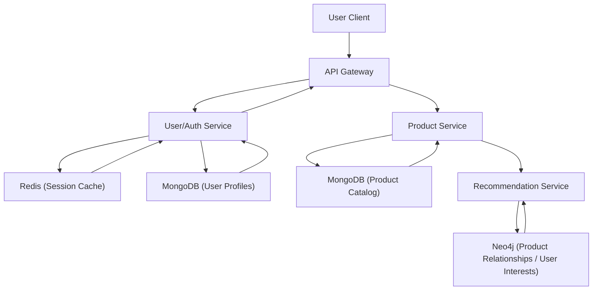

## NoSQL Types
### Core Concepts

*   **Definition:** Non-relational databases, designed for flexibility, scalability, and specific data models beyond the traditional relational table structure.
*   **Motivation (Why NoSQL):**
    *   **Scalability:** Achieve horizontal scalability (scale-out) by distributing data across many commodity servers, handling massive data volumes and high traffic.
    *   **Flexibility:** Accommodate unstructured, semi-structured, and rapidly changing data schemas, supporting agile development.
    *   **Availability:** Often prioritize Availability and Partition Tolerance (AP in CAP Theorem) over strict Consistency, leading to "eventual consistency."
    *   **Performance:** Optimized for specific data access patterns, leading to superior performance for certain workloads compared to traditional RDBMS.
*   **CAP Theorem Context:** NoSQL databases often relax strict ACID properties (especially Atomicity, Consistency, Isolation, Durability) in favor of BASE properties (Basically Available, Soft state, Eventually consistent).
*   **Main Types:**
    *   Key-Value Stores
    *   Document Stores
    *   Column-Family Stores (Wide-Column Stores)
    *   Graph Databases

### Key Details & Nuances

*   **Key-Value Stores:**
    *   **Model:** Simplest model; a unique key maps to a value (which can be a string, blob, JSON, etc.).
    *   **Strengths:** Extremely fast reads/writes for direct key lookups, high scalability, low latency.
    *   **Weaknesses:** No complex queries (e.g., range queries, joins), values are often opaque to the database.
    *   **Use Cases:** Caching (sessions, user profiles), leaderboards, real-time data ingestion.
    *   **Examples:** Redis, Amazon DynamoDB (as a K-V store), Memcached.

*   **Document Stores:**
    *   **Model:** Stores self-describing, semi-structured data as "documents" (typically JSON, BSON, XML). Documents can contain nested structures and arrays.
    *   **Strengths:** Flexible schema, natural mapping to object-oriented programming, rich query capabilities within a document.
    *   **Weaknesses:** Joins across collections are complex or non-existent (requiring denormalization or application-side joins).
    *   **Use Cases:** Content Management Systems (CMS), product catalogs, user profiles, blogs, e-commerce.
    *   **Examples:** MongoDB, Couchbase, DocumentDB.

*   **Column-Family Stores (Wide-Column Stores):**
    *   **Model:** Organizes data by rows and "column families." Each row can have different columns, allowing for sparse data. Optimized for appending data.
    *   **Strengths:** Optimized for distributed, aggregate queries over massive datasets. High write throughput, excellent for time-series and IoT data.
    *   **Weaknesses:** Complex data modeling compared to document stores, less flexible ad-hoc query patterns.
    *   **Use Cases:** Time-series data, IoT data, large-scale event logging, real-time analytics, large "inbox" systems.
    *   **Examples:** Apache Cassandra, HBase, ScyllaDB.

*   **Graph Databases:**
    *   **Model:** Nodes (entities) and Edges (relationships) are primary citizens. Both nodes and edges can have properties.
    *   **Strengths:** Efficiently traverses complex relationships. Ideal for highly interconnected data where relationships are as important as the data itself.
    *   **Weaknesses:** Not ideal for simple CRUD operations or large-scale batch processing without relationship-centric queries.
    *   **Use Cases:** Social networks, recommendation engines, fraud detection, knowledge graphs, network topology.
    *   **Examples:** Neo4j, Amazon Neptune, JanusGraph.

*   **Consistency Models:**
    *   **Eventual Consistency:** Data will eventually be consistent across all replicas, but there might be a delay. Common in AP systems, prioritizing availability and partition tolerance.
    *   **Tunable Consistency:** Allows specifying consistency levels per operation (e.g., read from one replica for speed, or from all replicas for stronger consistency).

### Practical Examples

**Conceptual Data Storage Examples:**

```typescript
// Document Store (MongoDB-like)
interface Product {
  _id: string; // Document ID
  name: string;
  description: string;
  price: number;
  category: string;
  tags: string[];
  specs: {
    weight: number;
    dimensions: string;
    color_options: string[];
  };
  reviews: { // Nested array of objects
    userId: string;
    rating: number;
    comment: string;
    date: Date;
  }[];
}

// Key-Value Store (Redis-like)
// Storing user session data for fast lookup
type SessionId = string;
type SessionData = {
  userId: string;
  lastLogin: Date;
  cartItems: string[];
  expiresAt: Date;
};
const sessionId: SessionId = 'sess_user_123_abc';
const sessionData: SessionData = {
  userId: 'user_123',
  lastLogin: new Date(),
  cartItems: ['prod_A', 'prod_B'],
  expiresAt: new Date(Date.now() + 3600 * 1000) // 1 hour from now
};
// To set: client.set(sessionId, JSON.stringify(sessionData));
// To get: const data = JSON.parse(await client.get(sessionId));

// Column-Family Store (Cassandra-like)
// Time-series sensor data for high-volume writes and range queries
// Table: sensor_readings
// Primary Key: (sensor_id, reading_timestamp)
// Partition Key: sensor_id (groups all readings for a sensor together)
// Clustering Key: reading_timestamp (sorts readings within a partition)
interface SensorReading {
  sensor_id: string; // E.g., 'sensor_temp_001'
  reading_timestamp: string; // ISO 8601 string, E.g., '2023-10-27T10:00:00Z'
  temperature_celsius: number;
  humidity_percent: number;
  battery_level: number;
}
// Example CQL (Cassandra Query Language) query:
// SELECT * FROM sensor_readings WHERE sensor_id = 'sensor_temp_001' AND reading_timestamp > '2023-10-27T09:00:00Z' AND reading_timestamp < '2023-10-27T11:00:00Z';

// Graph Database (Neo4j-like - Cypher)
// Representing a social network relationship
// (User)-[FOLLOWS]->(User)
// (User)-[POSTED]->(Post)
// (Post)-[HAS_TAG]->(Tag)
// CREATE (u1:User {name: 'Alice', userId: 'A1'})
// CREATE (u2:User {name: 'Bob', userId: 'B2'})
// CREATE (u1)-[:FOLLOWS {since: '2023-01-15'}]->(u2)
// MATCH (u:User)-[:FOLLOWS]->(f:User) WHERE u.name = 'Alice' RETURN f.name; // Finds who Alice follows
```

**System Architecture Diagram:**



### Common Pitfalls & Trade-offs

*   **"Schema-less" Misconception:** While flexible, lack of enforced schema can lead to inconsistent data or querying issues if not managed rigorously at the application layer. It shifts schema responsibility to developers.
*   **Complex Querying & Joins:** NoSQL databases are generally not designed for ad-hoc complex joins or multi-table queries that RDBMS excel at. This often requires application-side joins, denormalization, or pre-computed views, which can increase application complexity.
*   **Data Consistency Challenges:** Managing eventual consistency requires careful consideration. Applications must be designed to tolerate stale reads or potential write conflicts if strong consistency is not guaranteed.
*   **Operational Complexity:** Distributed systems are inherently more complex to operate, monitor, backup, and troubleshoot than single-node RDBMS. Sharding, replication, and data rebalancing add overhead.
*   **Choosing the Right Tool:** Selecting the appropriate NoSQL type for the specific use case is critical. Using a document store for graph-like data leads to inefficient queries and poor performance. Mismatched usage is a common anti-pattern.
*   **Vendor Lock-in:** Specific query languages and APIs (e.g., Cypher for Neo4j, CQL for Cassandra) can make migration between different NoSQL vendors challenging.

### Interview Questions

1.  **When would you choose a NoSQL database over a traditional relational database (SQL)? Provide examples of scenarios where each would be preferred.**
    *   **Answer:** Choose NoSQL when dealing with large volumes of unstructured or semi-structured data, requiring high horizontal scalability (sharding/replication) and high availability, needing flexible schema for agile development, or when the data model naturally fits one of the NoSQL types (e.g., highly interconnected data for graph, key-value lookups for caching). SQL is preferred for applications requiring strong ACID compliance, complex transactions spanning multiple tables, well-defined relational data with strict integrity, and complex ad-hoc queries with joins.

2.  **Compare and contrast Document and Column-Family databases. Discuss their ideal use cases and limitations.**
    *   **Answer:**
        *   **Document Stores:** Store data in flexible, self-describing documents (e.g., JSON). Ideal for nested, hierarchical data that maps well to objects in code. Strengths: flexible schema, good for content management, user profiles, product catalogs. Limitations: complex joins across collections, less efficient for high-volume aggregate queries across many documents. (e.g., MongoDB)
        *   **Column-Family Stores:** Organize data by rows and "column families," allowing for sparse data and dynamic columns per row. Optimized for distributed, high-write throughput, and aggregate queries over vast datasets (e.g., time-series). Strengths: excellent for time-series, IoT data, large-scale event logging, and analytics. Limitations: complex data modeling, less flexible for ad-hoc queries compared to document stores. (e.g., Apache Cassandra)

3.  **Describe a real-world scenario where a Graph database would be the optimal choice, explaining why other NoSQL types or a relational database would be less suitable.**
    *   **Answer:** A social networking application is an ideal scenario. Representing users as nodes and relationships (friendships, follows, likes) as edges, a graph database excels at traversing these connections efficiently. Finding "friends of friends," "common connections," or generating personalized recommendations based on network paths become highly performant operations. Relational databases would struggle with performance on multi-level join queries (e.g., finding friends of friends of friends) as the number of joins increases. Other NoSQL types like document or key-value stores could store user data but would be inefficient at querying relationships without extensive application-side logic or complex data denormalization.

4.  **How do NoSQL databases typically handle scalability and high availability? Explain the underlying mechanisms.**
    *   **Answer:**
        *   **Scalability (Horizontal):** Achieved through **sharding** (also known as partitioning). Data is divided into smaller, manageable chunks (shards/partitions) based on a partition key and distributed across multiple nodes (servers). This allows the database to scale out by adding more machines, distributing the read and write load and storing more data.
        *   **High Availability:** Primarily achieved through **replication**. Data is duplicated across multiple nodes (replicas), often in different availability zones or data centers. If one node fails, another replica can seamlessly take over and serve requests, ensuring continuous operation. This often leads to eventual consistency, where updates propagate to all replicas over time.

5.  **Explain the concept of "eventual consistency" in the context of distributed NoSQL systems, and discuss its implications for application design.**
    *   **Answer:** Eventual consistency is a consistency model where, if no new updates are made to a given data item, eventually all reads of that item will return the last updated value. This means there might be a temporary period where different replicas of the same data item hold inconsistent values immediately after an update.
    *   **Implications:** Applications must be designed to tolerate this transient inconsistency. For example, a user might read stale data immediately after an update, or concurrent writes could lead to conflicts that need to be resolved. It prioritizes availability and partition tolerance over immediate consistency (CAP theorem's AP side), making it suitable for systems where high throughput and continuous availability are paramount, and minor, temporary inconsistencies are acceptable (e.g., social media feeds, shopping cart where occasional stale items are fine).