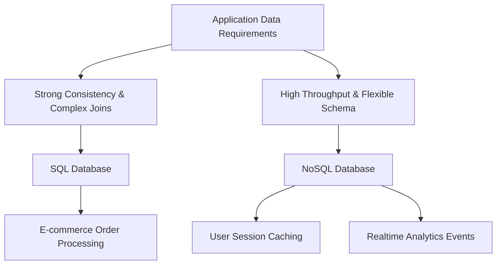

## SQL vs NoSQL
### Core Concepts

*   **SQL (Relational Databases)**
    *   **Structured Query Language:** Defines, manipulates, and queries data in relational databases.
    *   **Relational Model:** Data is organized into tables (relations) with predefined schemas, rows (records), and columns (attributes).
    *   **Strong Consistency (ACID):** Guarantees Atomicity, Consistency, Isolation, and Durability for transactions, ensuring data integrity.
    *   **Examples:** PostgreSQL, MySQL, Oracle, SQL Server.

*   **NoSQL (Non-Relational Databases)**
    *   **"Not only SQL" or "No SQL":** Broad category of databases that do not use the traditional tabular relational model.
    *   **Flexible Schema:** Can store unstructured, semi-structured, or structured data, allowing for dynamic changes to data structure.
    *   **Scalability (BASE):** Often prioritizes Availability and Partition Tolerance (from CAP theorem), leading to eventual consistency (Basically Available, Soft state, Eventually consistent). Designed for horizontal scaling.
    *   **Diverse Models:** Categorized by how they store data:
        *   **Document-oriented:** Stores data as flexible, JSON-like documents (e.g., MongoDB, Couchbase).
        *   **Key-Value:** Simple key-value pairs (e.g., Redis, DynamoDB).
        *   **Column-family:** Stores data in columns arranged in column families (e.g., Cassandra, HBase).
        *   **Graph:** Stores data in nodes and edges, representing relationships (e.g., Neo4j, Amazon Neptune).

### Key Details & Nuances

*   **Schema Enforcement:**
    *   **SQL:** Strict, schema-on-write. Data must conform to predefined table structures. Changes often require downtime or complex migrations.
    *   **NoSQL:** Flexible, schema-on-read. Data doesn't need to conform to a fixed schema, allowing faster iteration and handling of diverse data types.

*   **Scalability:**
    *   **SQL:** Primarily scales vertically (more powerful server). Horizontal scaling (sharding) is complex to implement and manage.
    *   **NoSQL:** Designed for horizontal scaling (distributing data across many servers/nodes), allowing for massive scalability and high availability.

*   **Data Relationships & Joins:**
    *   **SQL:** Excellent for complex relationships and joins across multiple tables using SQL queries. Denormalization is often avoided for integrity.
    *   **NoSQL:** Relationships are typically handled by embedding data within documents or through application-level joins. Complex, multi-document/table joins are inefficient or impossible in many NoSQL types. Denormalization is common to optimize reads.

*   **Consistency Model:**
    *   **SQL:** ACID properties ensure strong consistency, critical for financial transactions, inventory, etc.
    *   **NoSQL:** Most prioritize availability and partition tolerance over immediate consistency (BASE). Eventual consistency is common, meaning data might not be immediately consistent across all replicas but will become so over time. Some NoSQL databases offer tunable consistency.

*   **Querying:**
    *   **SQL:** Powerful, standardized SQL language for complex analytical queries, aggregations, and reporting.
    *   **NoSQL:** Querying is typically specific to the database type (e.g., document queries for MongoDB, key lookups for Redis). Less flexible for ad-hoc analytical queries across diverse data.

### Practical Examples

**Scenario: Choosing a Database for an Application**

Consider a new application.
*   **User Management & Order Processing (E-commerce):**
    *   Requires strong transactional integrity (ACID properties for orders, payments).
    *   Data is highly structured (users, products, orders, addresses).
    *   Relationships are critical (user linked to orders, orders linked to products).
    *   **Choice:** SQL (e.g., PostgreSQL).

*   **User Session Data & Real-time Analytics (E-commerce):**
    *   High volume, fast writes and reads for transient data.
    *   Schema can be fluid (new event types added frequently).
    *   Eventual consistency is acceptable.
    *   Relationships are less critical for primary storage; aggregation happens later.
    *   **Choice:** NoSQL (e.g., Redis for sessions/caching, MongoDB/Cassandra for analytics events).

### Common Pitfalls & Trade-offs

*   **"One Size Fits All" Mentality:** A common mistake is believing either SQL or NoSQL is universally superior. Modern systems often use polyglot persistence (a mix of database types) to leverage the strengths of each for different parts of the application.
*   **Migrating from SQL to NoSQL (or vice-versa) without understanding core differences:** This can lead to significant re-architecture, data model issues, and performance problems if the chosen database doesn't align with the actual data access patterns and consistency needs.
*   **Ignoring Consistency Models:** Choosing an eventually consistent NoSQL database for use cases requiring strong consistency (e.g., banking transactions) can lead to critical data integrity issues. Conversely, forcing ACID on high-volume, fluid data can lead to scalability bottlenecks.
*   **Over-normalization in NoSQL or Under-normalization in SQL:** While SQL favors normalization, denormalization is often key to optimal performance in NoSQL. Applying the wrong strategy for either leads to inefficient queries or data integrity risks.

### Interview Questions

1.  **When would you choose a SQL database over a NoSQL database for a new system, and vice-versa? Provide concrete examples.**
    *   **Answer:** Choose SQL for systems requiring strong transactional integrity (ACID), complex multi-table joins, well-defined/stable schemas, and where vertical scaling is initially sufficient (e.g., financial systems, traditional CRM/ERP, inventory management). Choose NoSQL for high-volume, rapidly changing data, flexible schemas, horizontal scalability needs, and where eventual consistency is acceptable (e.g., user profiles, IoT sensor data, content management, real-time analytics).

2.  **Explain the CAP theorem and how it influences the choice between SQL and NoSQL databases.**
    *   **Answer:** The CAP theorem states that a distributed system can only guarantee two of three properties: Consistency (all nodes see the same data at the same time), Availability (every request receives a response, without guarantee of latest data), and Partition Tolerance (system continues to operate despite network partitions).
        *   **SQL (traditional RDBMS):** Typically prioritize Consistency and Availability (CP), sacrificing Partition Tolerance (though modern SQL systems are improving here). They are not inherently designed for distributed environments.
        *   **NoSQL:** Often prioritize Availability and Partition Tolerance (AP), sacrificing immediate Consistency for eventual consistency, which is more suited for massively distributed systems. Some NoSQL (e.g., MongoDB, Cassandra with specific configurations) can be tuned to lean towards Consistency and Partition Tolerance (CP).

3.  **Describe a scenario where a hybrid approach, combining both SQL and NoSQL databases, would be beneficial. What are the advantages?**
    *   **Answer:** A common scenario is an e-commerce platform. SQL (e.g., PostgreSQL) can manage core transactional data like orders, payments, and user accounts (strong ACID guarantees). NoSQL (e.g., MongoDB or Redis) can handle user session data, product catalogs (flexible schema for varied attributes), real-time analytics, or user activity streams (high write/read throughput, horizontal scaling). The advantage is leveraging the strengths of each database type for specific parts of the application, optimizing performance, scalability, and data integrity where it matters most, rather than forcing a single database type to handle all workloads sub-optimally.

4.  **Discuss the different types of NoSQL databases (Document, Key-Value, Column-family, Graph) and provide a suitable use case for each.**
    *   **Answer:**
        *   **Document:** Stores flexible, semi-structured data (e.g., JSON). Ideal for content management, user profiles, catalogs with varied attributes. (e.g., MongoDB)
        *   **Key-Value:** Simple storage of data by a unique key. Extremely fast reads/writes. Ideal for caching, session management, leaderboards. (e.g., Redis, DynamoDB)
        *   **Column-family:** Stores data in columns arranged in column families. Optimized for aggregates over large datasets. Ideal for time-series data, large-scale analytics, and event logging. (e.g., Cassandra, HBase)
        *   **Graph:** Stores data as nodes and edges, emphasizing relationships. Ideal for social networks, recommendation engines, fraud detection. (e.g., Neo4j, Amazon Neptune)

5.  **What are the main trade-offs between strong consistency and eventual consistency in the context of distributed databases?**
    *   **Answer:**
        *   **Strong Consistency:**
            *   **Pros:** Data is always up-to-date across all nodes, simplifies application logic (no need to handle stale reads). Critical for financial transactions, inventory.
            *   **Cons:** Higher latency for writes (must wait for replication), lower availability during network partitions or node failures, harder to scale horizontally.
        *   **Eventual Consistency:**
            *   **Pros:** Higher availability and fault tolerance, lower write latency, easier horizontal scaling. Excellent for web applications where immediate consistency isn't critical (e.g., social media feeds, user preferences).
            *   **Cons:** Data might be stale for a period, requires more complex application logic to handle potential conflicts or temporary inconsistencies, harder to reason about data state.