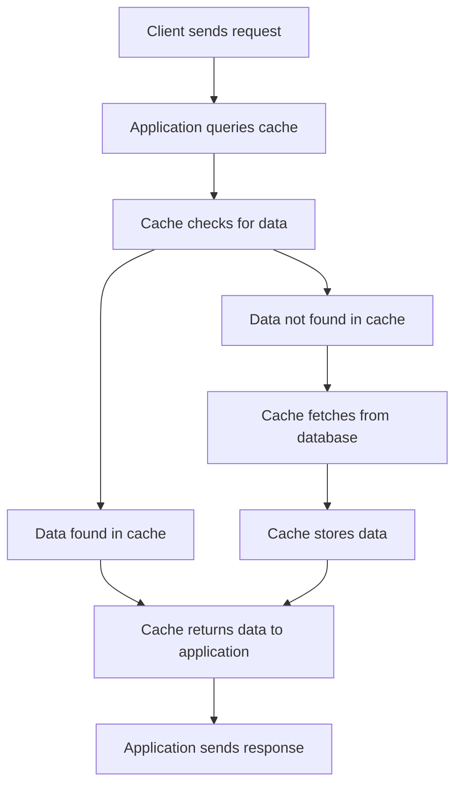

## Cache Patterns
### Core Concepts

Caching patterns define how applications interact with a cache to store and retrieve data, balancing performance, consistency, and complexity. They dictate the flow of read and write operations through the cache and underlying data store.

*   **Cache-Aside (Lazy Loading):** The application is responsible for managing data in the cache. It checks the cache first, and if data is not found (cache miss), it fetches from the database, stores it in the cache, and then returns it. On writes, the application writes directly to the database and invalidates or updates the cache.
*   **Read-Through:** The cache library/service handles the data loading logic. If data is not in the cache, the cache itself retrieves it from the underlying data store (using a configured `CacheLoader`), stores it, and then returns it to the application. The application only interacts with the cache.
*   **Write-Through:** On writes, the application writes data to the cache, and the cache immediately writes that data to the underlying data store synchronously. This ensures data is always consistent between cache and database.
*   **Write-Back (Write-Behind):** On writes, the application writes data to the cache, and the cache asynchronously writes that data to the underlying data store after a delay or batching. This offers very low latency for writes but introduces a risk of data loss if the cache fails before data is persisted.

### Key Details & Nuances

*   **Cache-Aside (Lazy Loading):**
    *   **Mechanism:** Application owns cache logic. Read: check cache -> if miss, read DB -> populate cache. Write: write DB -> invalidate cache.
    *   **Pros:** Simple to implement; highly fault-tolerant (cache failures don't impact data persistence); cache only stores requested data.
    *   **Cons:** Cache misses incur higher latency (two round trips); data can be stale between writes and invalidation; potential for "cache stampede" on cold keys.
    *   **Use Case:** Most common pattern for general-purpose caching where some staleness is acceptable.

*   **Read-Through:**
    *   **Mechanism:** Cache acts as the primary data source from the application's perspective. Cache service itself manages database read on miss.
    *   **Pros:** Simpler application code (doesn't handle DB reads for caching); guaranteed cache consistency on reads.
    *   **Cons:** Requires cache service to have direct DB access and logic; can be harder to debug.
    *   **Use Case:** Often used with in-memory caches (e.g., Guava Cache, Redis with custom loaders) where the cache acts as a proxy.

*   **Write-Through:**
    *   **Mechanism:** Cache and DB are always in sync for writes. Application writes to cache -> cache synchronously writes to DB.
    *   **Pros:** Strong consistency; data is never lost on cache failure.
    *   **Cons:** Higher write latency due to synchronous DB write; cache becomes a critical path for all writes.
    *   **Use Case:** Data where strong consistency is paramount (e.g., financial transactions, inventory).

*   **Write-Back (Write-Behind):**
    *   **Mechanism:** Application writes to cache -> cache asynchronously writes to DB. Writes are batched/delayed.
    *   **Pros:** Very low write latency; high write throughput (batching); reduces load on DB.
    *   **Cons:** Data loss risk on cache failure before persistence; eventual consistency model; increased complexity in cache logic (dirty flags, write queues).
    *   **Use Case:** High-volume writes where some data loss risk is acceptable, or where the cache is durable (e.g., distributed file systems, some NoSQL stores).

*   **Cache Invalidation:**
    *   **Time-To-Live (TTL):** Data expires after a set duration. Simple, but can lead to stale data or unnecessary evictions.
    *   **Least Recently Used (LRU):** Evicts data that hasn't been accessed recently. Good for general-purpose caches.
    *   **Least Frequently Used (LFU):** Evicts data that is accessed least often. Prioritizes popular items.
    *   **Write-Invalidate/Update:** On a write, invalidate/update the corresponding entry in the cache. Essential for consistency.

### Practical Examples

**1. Cache-Aside Pattern (TypeScript/JavaScript)**

```typescript
import { createClient } from 'redis'; // Example: using Redis for caching

interface User {
  id: string;
  name: string;
  email: string;
}

const redisClient = createClient({ url: 'redis://localhost:6379' });
redisClient.on('error', (err) => console.log('Redis Client Error', err));

async function getUserFromDB(userId: string): Promise<User | null> {
  // Simulate a database call
  console.log(`Fetching user ${userId} from DB...`);
  return new Promise(resolve => setTimeout(() => {
    if (userId === '123') {
      resolve({ id: '123', name: 'Alice Smith', email: 'alice@example.com' });
    } else {
      resolve(null);
    }
  }, 100));
}

async function getUser(userId: string): Promise<User | null> {
  // 1. Check cache first
  try {
    const cachedUser = await redisClient.get(`user:${userId}`);
    if (cachedUser) {
      console.log(`User ${userId} found in cache.`);
      return JSON.parse(cachedUser);
    }
  } catch (err) {
    console.error('Error reading from cache:', err);
    // Fallback to DB if cache read fails
  }

  // 2. Cache miss: fetch from database
  console.log(`User ${userId} not in cache. Fetching from DB.`);
  const user = await getUserFromDB(userId);

  // 3. If found in DB, populate cache
  if (user) {
    try {
      await redisClient.setEx(`user:${userId}`, 3600, JSON.stringify(user)); // Cache for 1 hour
      console.log(`User ${userId} stored in cache.`);
    } catch (err) {
      console.error('Error writing to cache:', err);
    }
  }

  return user;
}

async function updateUser(userId: string, newName: string): Promise<User | null> {
  // Simulate updating in DB
  console.log(`Updating user ${userId} in DB...`);
  // In a real scenario, this would be an actual DB write.
  const updatedUser: User = { id: userId, name: newName, email: 'updated@example.com' };

  // 1. Write directly to database
  // await database.updateUser(userId, newName);

  // 2. Invalidate cache entry
  try {
    await redisClient.del(`user:${userId}`);
    console.log(`Cache invalidated for user ${userId}.`);
  } catch (err) {
    console.error('Error invalidating cache:', err);
  }

  return updatedUser;
}

async function runExample() {
  await redisClient.connect();

  console.log('\n--- First read (cache miss) ---');
  await getUser('123'); // Should fetch from DB and cache

  console.log('\n--- Second read (cache hit) ---');
  await getUser('123'); // Should hit cache

  console.log('\n--- Update user ---');
  await updateUser('123', 'Alice NewName'); // Should update DB and invalidate cache

  console.log('\n--- Third read (cache miss after invalidation) ---');
  await getUser('123'); // Should fetch from DB again

  await redisClient.quit();
}

// runExample(); // Uncomment to run
```

**2. Read-Through Cache Pattern (Mermaid Diagram)**



### Common Pitfalls & Trade-offs

*   **Consistency vs. Performance:**
    *   **Cache-Aside / Write-Back:** Offers high read/write performance but can lead to stale data or eventual consistency.
    *   **Write-Through:** Provides strong consistency but at the cost of higher write latency.
*   **Cache Invalidation:** The hardest problem in caching.
    *   **Stale Data:** A common issue with Cache-Aside if invalidation fails or isn't timely.
    *   **Thundering Herd/Cache Stampede:** Many requests for the same expired/missing key simultaneously hit the database. Mitigate with request coalescing, mutexes, or probabilistic caching.
*   **Cold Cache:** When a cache starts empty, initial requests will all be misses, hitting the database directly and potentially overloading it. Pre-warming or intelligent loading strategies can help.
*   **Serialization Overhead:** Data must be serialized/deserialized when moved to/from cache, adding latency and CPU cost. Choose efficient formats (e.g., MsgPack, Protobuf) or rely on native cache types if possible.
*   **Capacity Planning:** Over-provisioning is costly; under-provisioning leads to high eviction rates and cache misses.
*   **Distributed Cache Challenges:** Network latency, consistency across nodes, cache partitioning, and failover complexities.

### Interview Questions

1.  **"Compare and contrast Cache-Aside and Read-Through cache patterns. When would you choose one over the other?"**
    *   **Answer:** Cache-Aside places caching logic in the application (app checks cache, then DB, then populates cache). Read-Through delegates DB fetching on a cache miss directly to the cache provider (app asks cache, cache handles DB interaction). Choose Cache-Aside for simpler setup, more control over invalidation, and when cache is not always available. Choose Read-Through for simpler application code, when the cache is reliable and can manage data loading, common in-memory caches or frameworks.

2.  **"Discuss the trade-offs between Write-Through and Write-Back caching. Provide scenarios where each would be preferred."**
    *   **Answer:** Write-Through offers strong consistency as writes go synchronously to both cache and DB. Trade-off: higher write latency. Preferred for critical data where consistency is paramount (e.g., banking, inventory). Write-Back offers lower write latency by asynchronously writing to DB, often batched. Trade-off: potential data loss on cache failure, eventual consistency. Preferred for high-volume, less critical writes (e.g., logging, session data) or when throughput is prioritized over immediate consistency.

3.  **"Describe the 'cache stampede' problem and common strategies to mitigate it."**
    *   **Answer:** Cache stampede (or thundering herd) occurs when a cache entry expires or is invalidated, and many concurrent requests for that key simultaneously miss the cache and hit the underlying data store, potentially overwhelming it. Mitigation strategies include:
        *   **Request Coalescing (Mutex/Locking):** Only one request computes the value on a miss; others wait for it to populate the cache.
        *   **Probabilistic Early Expiration:** Expire keys slightly before their actual TTL based on a probability, allowing one request to refresh it proactively.
        *   **Distributed Locks:** Use a distributed lock service (e.g., Redis `SET NX`) to ensure only one client computes the value.
        *   **Background Refresh:** A dedicated process or async task periodically refreshes popular data.

4.  **"How do you handle cache invalidation in a distributed system, especially considering eventual consistency models?"**
    *   **Answer:** Handling invalidation in distributed systems is complex. Strategies include:
        *   **Time-To-Live (TTL):** Simplest, but results in stale data until expiration.
        *   **Publish/Subscribe (Pub/Sub):** When data changes in the DB, publish an event to a message queue. Cache nodes subscribe and invalidate their local copy. This introduces eventual consistency.
        *   **Write-Through/Write-Back with Atomic Updates:** If the cache is tightly coupled with the DB (e.g., through triggers or a CDC stream), changes can be propagated automatically.
        *   **Version Numbers/ETags:** Store a version number with cached data. Clients include the version in requests. If server data version is newer, client invalidates/refetches.
        *   **Last-Modified Headers:** For HTTP caches, use standard headers to manage freshness. The key challenge is propagating invalidation across all distributed cache instances promptly and consistently.

5.  **"When designing a system, how would you decide whether to use a local in-memory cache versus a distributed cache like Redis or Memcached?"**
    *   **Answer:**
        *   **Local In-Memory Cache:**
            *   **Pros:** Extremely fast (no network hop), simple to implement, low operational overhead for single instances.
            *   **Cons:** Data is lost on application restart; limited by host memory; data not shared across multiple application instances (leading to potential inconsistencies and lower hit rates in clustered environments).
            *   **Use Case:** Caching frequently accessed, non-critical data within a single application instance, or for data specific to that instance (e.g., user session details tied to a specific server).
        *   **Distributed Cache (e.g., Redis):**
            *   **Pros:** Data shared across multiple application instances, high availability (replication), scalable (sharding), persistent storage options, richer data structures.
            *   **Cons:** Network latency for every access, increased operational complexity (deployment, monitoring, scaling), higher cost.
            *   **Use Case:** Caching critical shared data across a microservice architecture, managing user sessions in a load-balanced environment, leaderboard data, or any scenario requiring large-scale, shared, and fault-tolerant caching.
        *   **Decision Factors:** Scale of application, consistency requirements, data volatility, data size, fault tolerance needs, and budget/operational complexity tolerance. Often, a multi-tier caching strategy (local + distributed) is used.