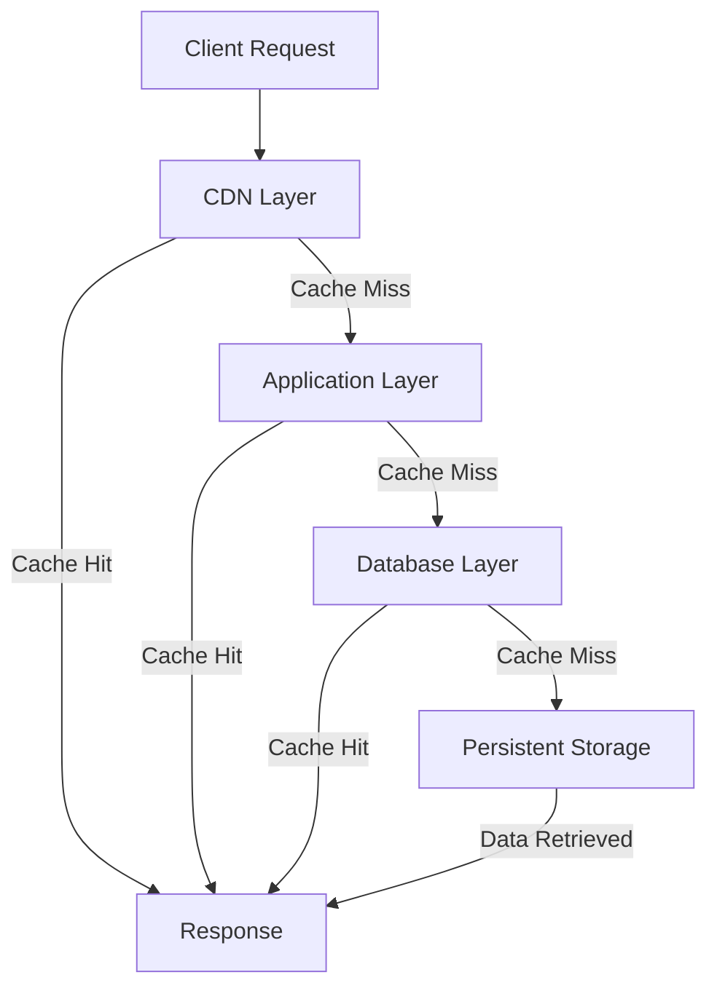

## Caching Levels
### Core Concepts
Caching levels refer to the tiered organization of caches in a system, each progressively further from the client but typically larger in capacity and slower to access. The goal is to maximize cache hit rates and minimize latency by placing frequently accessed data as close to the consumer as possible.

*   **Hierarchy:** Data flows downwards through levels on a cache miss and upwards on a cache hit.
*   **Latency vs. Capacity:**
    *   **Closer levels (L1):** Lower latency, smaller capacity, higher cost per byte.
    *   **Further levels (L-N):** Higher latency, larger capacity, lower cost per byte.
*   **Purpose:**
    *   Reduce load on origin servers and databases.
    *   Improve response times for users.
    *   Lower operational costs (e.g., database read IOPS).

### Key Details & Nuances
Understanding the specific types of caching levels is critical for system design.

*   **Client-Side Cache (L1):**
    *   **Location:** Browser, mobile app.
    *   **Type:** HTTP cache (ETags, Cache-Control headers), local storage, memory cache.
    *   **Pros:** Fastest access, eliminates network round trips.
    *   **Cons:** Limited size, specific to a single client, invalidation is challenging (browser-controlled).
    *   **Use Case:** Static assets (images, CSS, JS), user-specific data.

*   **Content Delivery Network (CDN) Cache (L2):**
    *   **Location:** Edge servers geographically distributed closer to users.
    *   **Type:** Reverse proxy cache.
    *   **Pros:** Reduces latency for geographically dispersed users, offloads origin server, provides DDoS protection.
    *   **Cons:** Cache invalidation complexity (purging), potential for stale data if not managed well, cost.
    *   **Use Case:** Global distribution of static and dynamic (edge-cached) content.

*   **Application Cache (L3):**
    *   **Location:** Application servers.
    *   **Types:**
        *   **In-Memory Cache:** Within a single application instance (e.g., Redis on localhost, `Map` in Node.js app).
            *   **Pros:** Extremely fast (local memory access).
            *   **Cons:** Not shared across instances, data loss on restart, limited by RAM.
        *   **Distributed Cache:** External, shared cache cluster (e.g., Redis, Memcached).
            *   **Pros:** Shared across application instances, horizontally scalable, durable options.
            *   **Cons:** Network overhead, adds operational complexity, consistency challenges.
    *   **Use Case:** Frequently accessed query results, session data, computed values.

*   **Database Cache (L4):**
    *   **Location:** Within the database system itself.
    *   **Types:**
        *   **Query Cache:** Caches results of `SELECT` queries (often problematic, sometimes disabled).
        *   **Buffer Pool/Page Cache:** Caches frequently accessed data blocks/pages from disk.
        *   **Index Cache:** Caches frequently accessed index blocks.
    *   **Pros:** Managed automatically by DB, optimized for data access patterns.
    *   **Cons:** Specific to DB technology, limited control for application logic, often small compared to application needs.
    *   **Use Case:** Underlying data storage optimization.

### Practical Examples

#### **Caching Levels Request Flow**
Illustrates how a request traverses caching layers, hitting different levels if data is not found at a closer one.



#### **In-Memory Application Cache (TypeScript)**
A basic example of a local, in-memory cache often used at the application server level.

```typescript
class ProductService {
    private productCache: Map<string, any> = new Map(); // Simple in-memory cache
    private cacheTTL: number = 60 * 1000; // 60 seconds TTL

    async getProductById(productId: string): Promise<any> {
        // 1. Check cache
        const cachedItem = this.productCache.get(productId);
        if (cachedItem && Date.now() < cachedItem.expiry) {
            console.log(`Cache Hit for product ${productId}`);
            return cachedItem.data;
        }

        // 2. Cache Miss: Fetch from database (simulate async DB call)
        console.log(`Cache Miss for product ${productId}. Fetching from DB...`);
        const product = await this.fetchProductFromDatabase(productId);

        // 3. Store in cache
        if (product) {
            this.productCache.set(productId, {
                data: product,
                expiry: Date.now() + this.cacheTTL
            });
            console.log(`Product ${productId} cached.`);
        }
        return product;
    }

    private async fetchProductFromDatabase(productId: string): Promise<any> {
        // Simulate a database call
        return new Promise(resolve => {
            setTimeout(() => {
                console.log(`Fetched product ${productId} from actual DB.`);
                resolve({ id: productId, name: `Product ${productId}`, price: Math.random() * 100 });
            }, 500); // Simulate network/DB latency
        });
    }

    // Invalidation example
    invalidateProductCache(productId: string): void {
        this.productCache.delete(productId);
        console.log(`Product ${productId} invalidated from cache.`);
    }
}

// Example usage:
async function demonstrateCaching() {
    const service = new ProductService();

    // First call - cache miss
    await service.getProductById("123");

    // Second call - cache hit
    await service.getProductById("123");

    // Invalidate and call again - cache miss
    service.invalidateProductCache("123");
    await service.getProductById("123");

    // Wait for TTL to expire (for demo, not good practice in real code)
    // console.log("Waiting for cache to expire...");
    // await new Promise(resolve => setTimeout(resolve, 65000));
    // await service.getProductById("123"); // Should be a miss again
}

// demonstrateCaching();
```

### Common Pitfalls & Trade-offs

*   **Cache Invalidation & Consistency:**
    *   **Pitfall:** Stale data, especially across multiple caching levels, leading to incorrect user experience. Complex and hard to get right.
    *   **Trade-off:** Strong consistency (always freshest data) often means lower cache hit rates or complex invalidation logic. Eventual consistency allows higher performance but tolerates temporary staleness.
    *   **Strategies:** TTL (Time-to-Live), write-through, write-back, cache-aside, explicit invalidation/purging, pub/sub for distributed invalidation.

*   **Cache Stampede/Dog-piling:**
    *   **Pitfall:** Many concurrent requests for the same expired/missing data item hit the backend simultaneously, overwhelming it.
    *   **Solution:** Cache warming, probabilistic early expiration, mutex/locks (e.g., single flight, thundering herd protection) to ensure only one request repopulates the cache.

*   **Over-caching vs. Under-caching:**
    *   **Pitfall:** Over-caching (caching too much, complex objects, low-read data) wastes memory and adds complexity. Under-caching misses opportunities for performance gains.
    *   **Trade-off:** Identifying optimal data to cache requires profiling and understanding access patterns. Cache hot spots, frequently read, rarely modified data are ideal candidates.

*   **Management Overhead:**
    *   **Pitfall:** Each caching layer adds operational complexity (monitoring, deployment, scaling, debugging).
    *   **Trade-off:** Performance gains vs. increased operational burden. Choose the right level of caching for the problem.

### Interview Questions

1.  **"Imagine you're designing a high-traffic e-commerce platform. Describe how you would leverage different caching levels to optimize performance for product catalog views, detailing the types of data you'd cache at each level and why."**
    *   **Expert Answer:**
        *   **Client-side:** Static assets (JS, CSS, images), possibly user-specific preferences, some product view data with short TTL or ETags. Benefits from no network latency for repeated views.
        *   **CDN:** Global distribution of product images, CSS, JS, and potentially static product pages/APIs for anonymous users. Reduces load on origin, provides low latency for geo-distributed users. Invalidation via CDN purge.
        *   **Application Cache (Distributed Redis/Memcached):** Product details, category listings, search results, often-accessed aggregates. This serves as the primary data offload for the database. Critical for handling high read QPS. Invalidated on product updates (publish event to invalidate relevant keys).
        *   **Database Cache:** Let the database manage its internal buffer pool for hot data pages/indexes. Rely on the application cache for explicit caching strategies.

2.  **"Multi-level caching introduces significant challenges regarding data consistency. How would you ensure an acceptable level of consistency across CDN, application, and client-side caches for rapidly changing data, like stock availability for a popular product?"**
    *   **Expert Answer:** For rapidly changing, critical data like stock, strong consistency is paramount.
        *   **Avoid Client/CDN Caching:** For stock counts, I would generally advise *against* aggressive caching at the client or CDN layer, or at least use very short TTLs (seconds) or `no-store` directives for critical API responses. The risk of selling out-of-stock items outweighs caching benefits here.
        *   **Application Cache:** Use a cache-aside pattern with short TTLs and explicit invalidation. When stock changes (e.g., sale, return), publish an event to invalidate the specific product's stock entry in the distributed cache. This needs to be near real-time.
        *   **Backend Source of Truth:** The database is always the source of truth. All stock updates must happen there.
        *   **Read-Through/Write-Through (selectively):** Potentially, a read-through cache for stock values, ensuring the application always fetches fresh data if the cache is stale or missing, and updates the cache immediately after a write.
        *   **Event-Driven Invalidation:** For updates, trigger invalidation messages (e.g., via Kafka/RabbitMQ) to all application instances to invalidate their local caches and to the CDN to purge specific paths.

3.  **"When might it be detrimental to add another caching layer, and what trade-offs should be considered before introducing a new level of caching?"**
    *   **Expert Answer:** Adding a caching layer can be detrimental if:
        *   **Data is rarely accessed:** Cache miss rates would be high, invalidating the cost/complexity.
        *   **Data changes too frequently:** Leads to constant invalidation overhead, negating performance benefits and increasing staleness risks.
        *   **Operational complexity outweighs benefits:** Each layer adds monitoring, deployment, scaling, and debugging overhead. For simple systems, it might be overkill.
        *   **Cost exceeds benefit:** Caching infrastructure (especially distributed) can be expensive.
        *   **Security implications:** Caching sensitive data without proper encryption or access control can be a major security vulnerability.

    *   **Trade-offs:**
        *   **Performance vs. Consistency:** Faster access often means higher risk of stale data.
        *   **Reduced Backend Load vs. Increased Operational Overhead:** Offloading databases/APIs comes at the cost of managing the cache layer itself.
        *   **Cost vs. Latency:** Premium caching solutions offer lower latency but higher price.
        *   **Debugging Complexity:** Tracing data flows and debugging issues becomes harder with more layers.
        *   **Architectural Complexity:** Adds more components, failure points, and decision-making for data placement.