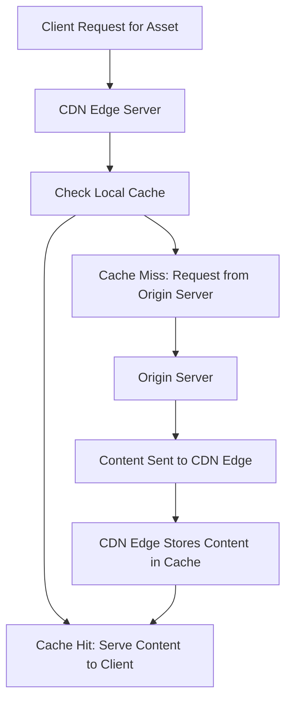

## Types of Caching
### Core Concepts

Caching is storing copies of data closer to the consumer to reduce latency, improve throughput, and decrease load on origin servers or databases. It's a fundamental optimization technique in system design.

Key types of caching, categorized by their location in the system architecture:

*   **Client-Side Cache:** Resides directly on the client device (e.g., web browser, mobile app). Caches responses for quicker retrieval without network requests.
*   **Content Delivery Network (CDN) Cache:** Distributed network of servers (edge locations) geographically closer to users. Caches static and sometimes dynamic content to serve it quickly.
*   **Server-Side/Application Cache:** Located on the application server(s). Can be:
    *   **Local/In-Memory:** Cache within a single application instance's memory. Fastest access but not shared across instances.
    *   **Distributed:** A separate caching layer (e.g., Redis, Memcached) shared across multiple application instances, providing high availability and scalability.
*   **Database Cache:** Caching mechanisms within the database itself (e.g., query caches, buffer pools) or by an ORM layer.

### Key Details & Nuances

*   **Client-Side Caching (Browser):**
    *   Leverages HTTP headers like `Cache-Control`, `Expires`, `ETag`, `Last-Modified`.
    *   `Cache-Control`: Directs browser and intermediary caches (e.g., proxies) on how to cache resources (`max-age`, `no-cache`, `no-store`, `public`, `private`).
    *   `ETag` (Entity Tag) / `Last-Modified`: Used for revalidation (conditional requests). If the resource is unchanged, the server responds with a `304 Not Modified` status, avoiding full download.
*   **CDN Caching:**
    *   **Edge Locations:** Content served from the closest available data center.
    *   **Content Types:** Primarily static assets (images, CSS, JS, videos) but increasingly for dynamic content using Edge Compute or Serverless functions.
    *   **Invalidation:** Manual purge, `max-age` expiration, or cache-tagging.
*   **Server-Side Caching (Application Layer):**
    *   **Local Caching:** Simple, extremely fast (in-process memory). Limited by server's RAM and doesn't handle consistency across multiple app servers. Suitable for frequently accessed, rarely changing data within a single instance.
    *   **Distributed Caching:**
        *   **Purpose:** Shared state, high availability, horizontal scalability.
        *   **Characteristics:** Separate service, often uses key-value stores. Higher latency than local but lower than database.
        *   **Consistency:** Critical concern; often uses eventual consistency model.
        *   **Eviction Policies:** Algorithms to decide which items to remove when cache is full (e.g., **LRU** - Least Recently Used, **LFU** - Least Frequently Used, **FIFO** - First-In, First-Out).
        *   **Time-To-Live (TTL):** Specifies how long an item should remain in cache before being considered stale.
*   **Database Caching:**
    *   **Query Cache:** Caches results of identical `SELECT` queries (often disabled in modern DBs due to invalidation complexity).
    *   **Buffer Pool:** Caches data pages and index pages in memory for faster access.
    *   **ORM Caching (e.g., Hibernate, Prisma):** Caches objects retrieved from the database to avoid redundant queries.

### Practical Examples

**1. HTTP `Cache-Control` Header (Client-Side/CDN):**

```http
HTTP/1.1 200 OK
Content-Type: application/json
Cache-Control: public, max-age=3600, must-revalidate
ETag: "abcdef12345"

{
  "data": "important_payload"
}
```
*   `public`: Cacheable by any cache.
*   `max-age=3600`: Cache content for 1 hour (3600 seconds).
*   `must-revalidate`: Cache must revalidate its status with the origin server before using a stale copy.

**2. CDN Caching Flow (Mermaid Diagram):**



**3. Simple In-Memory Cache (TypeScript):**

```typescript
type CacheStore = {
  [key: string]: {
    data: any;
    expiresAt: number;
  };
};

class SimpleInMemoryCache {
  private cache: CacheStore = {};
  private defaultTtlMs: number; // Default Time-To-Live in milliseconds

  constructor(defaultTtlMs: number = 60 * 1000) { // 1 minute default
    this.defaultTtlMs = defaultTtlMs;
  }

  get<T>(key: string): T | undefined {
    const entry = this.cache[key];
    if (!entry) {
      return undefined;
    }

    if (Date.now() > entry.expiresAt) {
      // Data is stale, remove it
      delete this.cache[key];
      return undefined;
    }

    return entry.data as T;
  }

  set<T>(key: string, data: T, ttlMs?: number): void {
    const expiresAt = Date.now() + (ttlMs || this.defaultTtlMs);
    this.cache[key] = { data, expiresAt };
  }

  delete(key: string): void {
    delete this.cache[key];
  }

  clear(): void {
    this.cache = {};
  }
}

// Usage example
const myCache = new SimpleInMemoryCache(5000); // 5-second TTL
myCache.set('user:123', { name: 'Alice', email: 'alice@example.com' });

console.log(myCache.get('user:123')); // { name: 'Alice', email: 'alice@example.com' }

setTimeout(() => {
  console.log(myCache.get('user:123')); // undefined (after 5 seconds)
}, 6000);
```

### Common Pitfalls & Trade-offs

*   **Stale Data / Cache Invalidation:** The biggest challenge. Strategies include:
    *   **Cache-Aside (Lazy Loading):** Application explicitly checks cache, then database on miss, then populates cache. Simple, but initial requests are slow.
    *   **Write-Through:** Data written to cache and database simultaneously. Ensures data consistency but adds write latency.
    *   **Write-Back:** Data written only to cache, then asynchronously written to database. Fastest writes but data loss risk on cache failure.
    *   **Refresh-Ahead:** Data is proactively refreshed in cache before expiration based on predicted access.
*   **Cache Coherency/Consistency:** Maintaining consistency across multiple distributed cache nodes or between cache and origin. Often managed with eventual consistency and careful TTL settings.
*   **Cache Stampede (Thundering Herd):** Many concurrent requests for the same uncached item overwhelm the origin. Mitigate with:
    *   **Request Collapsing/Deduplication:** Only one request goes to the origin; others wait for the result and then populate the cache.
    *   **Pre-fetching/Warming:** Loading popular items into cache proactively.
    *   **Circuit Breakers:** Prevent overloading the origin.
*   **Increased System Complexity:** Adding a cache layer means more components to manage, monitor, and troubleshoot.
*   **Cost:** While reducing database load, distributed caches consume memory and network resources.
*   **Serialization/Deserialization Overhead:** Data needs to be converted for storage/retrieval from distributed caches.

### Interview Questions

1.  **Explain the different types of caching and when you would use each in a typical web application architecture.**
    *   **Answer:** Discuss client-side (browser, for static assets/API responses with `Cache-Control`), CDN (for global distribution of static and some dynamic content), server-side local (for small, frequently accessed, per-instance data), and distributed (for shared, scalable, high-throughput caching like user sessions, frequently accessed API data). Emphasize the trade-offs of each regarding latency, consistency, and scalability.
2.  **Describe the common cache invalidation strategies (e.g., Cache-Aside, Write-Through, Write-Back) and their respective trade-offs in terms of consistency, latency, and complexity.**
    *   **Answer:** Detail Cache-Aside (reads from cache, writes to DB, populates cache on miss; good for read-heavy, eventual consistency for reads), Write-Through (writes to cache and DB simultaneously; good for high consistency, higher write latency), and Write-Back (writes to cache, then async to DB; fastest writes, risk of data loss on cache crash). Also mention TTL and manual invalidation.
3.  **How do you handle cache consistency in a distributed system where multiple application instances are accessing a shared cache? What challenges arise?**
    *   **Answer:** Focus on challenges like stale data, race conditions. Solutions involve: careful TTLs, explicit invalidation messages (e.g., using pub/sub), optimistic locking, or versioning. Mention that true strong consistency with caches is hard; often, eventual consistency is accepted for performance gains.
4.  **What is the "cache stampede" or "thundering herd" problem, and how can you mitigate it?**
    *   **Answer:** Explain it as many concurrent requests hitting an expired or non-existent cache entry, all simultaneously requesting data from the origin, leading to overload. Mitigation strategies include: request collapsing/deduplication (using locks or semaphores so only one request goes to origin), jittering cache expiration, and pre-warming the cache for popular items.
5.  **Discuss the trade-offs between using a local in-memory cache versus a distributed caching solution like Redis or Memcached.**
    *   **Answer:** Compare local (faster, simpler, no network latency, limited by single server RAM, not shared, consistency issues across instances) with distributed (scalable, shared across instances, higher availability, higher latency, adds network overhead, more complex to manage, but provides consistency for shared data). Local is good for individual server optimizations, distributed for system-wide shared data and high availability.