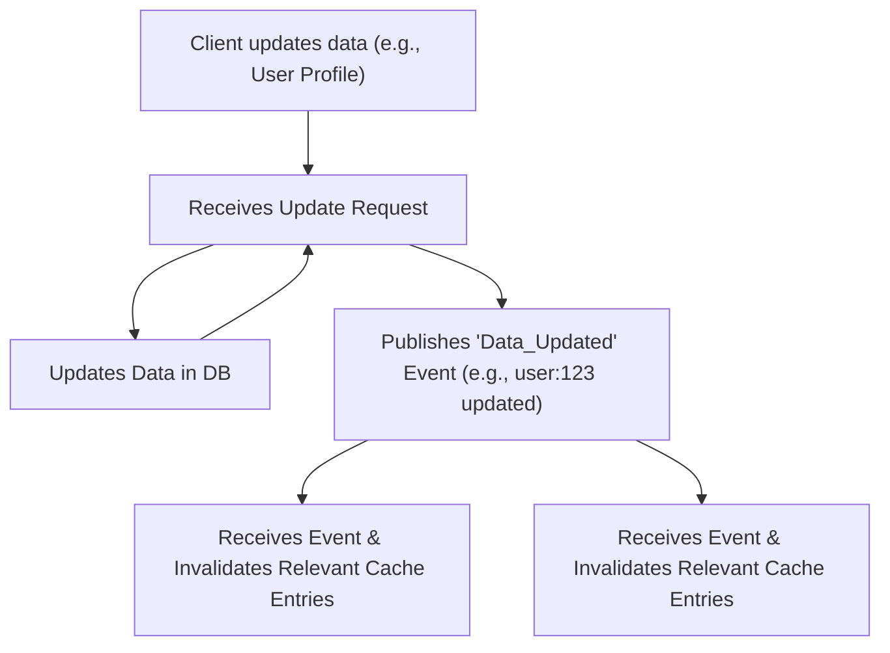

## Cache Invalidation
### Core Concepts
*   **Cache Invalidation:** The process of marking or removing data in a cache as "stale" or "invalid" when its corresponding source data (e.g., in a database) changes.
*   **Purpose:** To maintain data consistency between the cache and the primary data source, ensuring that users always retrieve the most up-to-date information, while still benefiting from the performance advantages of caching.
*   **Challenge:** Balancing the need for data freshness (consistency) with the desire for high cache hit rates and low latency (performance). An effective invalidation strategy minimizes stale reads without negating caching benefits.

### Key Details & Nuances

*   **Invalidation Strategies:**
    *   **Time-Based (TTL - Time-To-Live / Expiration):**
        *   **Mechanism:** Each cached item is assigned a fixed expiration time. After this time, it's automatically considered stale and evicted or re-fetched on demand.
        *   **Pros:** Simple to implement, effective for data with predictable staleness or eventual consistency requirements.
        *   **Cons:** Data can become stale before TTL expires, or fresh data might be evicted prematurely, leading to unnecessary cache misses.
    *   **Explicit Invalidation (Write-Through/Cache-Aside with Invalidation):**
        *   **Mechanism:** The application explicitly removes or updates a cache entry whenever the underlying data changes (e.g., after a `PUT`, `POST`, or `DELETE` operation to the database).
        *   **Pros:** Guarantees strong consistency; cache is kept up-to-date with the source.
        *   **Cons:** Adds complexity to write paths; potential for race conditions or missed invalidations if not handled atomically (e.g., database update succeeds, but cache invalidation fails).
    *   **Write-Through Cache:** Writes go to both the cache and the database synchronously. The cache itself is updated as part of the write.
    *   **Write-Back Cache:** Writes go to the cache, and then are asynchronously written to the database. More complex for other cache nodes to ensure consistency.
    *   **Version-Based / Content Hashing (ETags):**
        *   **Mechanism:** Cache items are tagged with a version number or a hash of their content. When data is requested, the client or server sends the stored version/hash. If the source data's version/hash differs, it's considered stale. Often used with HTTP ETags for conditional requests.
        *   **Pros:** Efficient for client-side caching; reduces unnecessary data transfers.
        *   **Cons:** Requires additional metadata management and logic.
    *   **Event-Driven / Pub-Sub:**
        *   **Mechanism:** When data changes in the primary data store, an event is published to a message broker (e.g., Kafka, Redis Pub/Sub). Cache nodes subscribe to these events and invalidate relevant entries upon receiving the notification.
        *   **Pros:** Highly scalable for distributed caches, near real-time invalidation.
        *   **Cons:** Adds system complexity (message broker, event consumers, potential for message loss/ordering issues).
    *   **Stale-While-Revalidate (Optimistic Invalidation):**
        *   **Mechanism:** Serves stale content immediately from the cache to the client while asynchronously initiating a background revalidation request to the primary data source. Once the fresh data is received, the cache is updated for future requests.
        *   **Pros:** Improves perceived performance and availability by always serving something instantly.
        *   **Cons:** Clients might temporarily receive stale data.

*   **Cache Coherency:** In distributed systems with multiple independent cache nodes, ensuring all nodes have a consistent view of the cached data is a significant challenge. Strategies like Pub-Sub are crucial here.

### Practical Examples

**1. Cache-Aside Pattern with Explicit Invalidation on Write**

This is one of the most common and robust patterns for managing cache consistency.

```typescript
// Assume 'cache' is a Redis client instance
// Assume 'db' is a database client instance (e.g., PostgreSQL client)

// Function to fetch a user by ID
async function getUser(userId: string): Promise<any> {
    const cacheKey = `user:${userId}`;

    // 1. Try to fetch from cache
    try {
        const cachedUser = await cache.get(cacheKey);
        if (cachedUser) {
            console.log(`Cache hit for user: ${userId}`);
            return JSON.parse(cachedUser);
        }
    } catch (err) {
        console.error(`Error fetching from cache for user ${userId}:`, err);
        // Fall through to DB fetch if cache has issues
    }

    // 2. Cache miss: Fetch from primary database
    console.log(`Cache miss for user: ${userId}. Fetching from DB.`);
    const result = await db.query('SELECT * FROM users WHERE id = $1', [userId]);
    const user = result.rows[0];

    // 3. If found, store in cache for future requests (with a TTL)
    if (user) {
        try {
            await cache.set(cacheKey, JSON.stringify(user), 'EX', 3600); // Cache for 1 hour
            console.log(`User ${userId} cached successfully.`);
        } catch (err) {
            console.error(`Error setting cache for user ${userId}:`, err);
        }
    }
    return user;
}

// Function to update a user's profile and invalidate cache
async function updateUserProfile(userId: string, newProfileData: Record<string, any>): Promise<any> {
    const cacheKey = `user:${userId}`;

    // 1. Update the data in the primary database first
    console.log(`Updating user ${userId} in DB.`);
    const result = await db.query(
        'UPDATE users SET name = $1, email = $2 WHERE id = $3 RETURNING *',
        [newProfileData.name, newProfileData.email, userId]
    );
    const updatedUser = result.rows[0];

    // 2. IMPORTANT: Invalidate the corresponding cache entry
    // This ensures subsequent reads fetch the fresh data from the DB
    try {
        await cache.del(cacheKey);
        console.log(`Cache invalidated for user: ${userId}`);
    } catch (err) {
        console.error(`Error invalidating cache for user ${userId}:`, err);
        // Consider alerting or logging this, as it can lead to stale data
    }

    return updatedUser;
}

// Example Usage (conceptual):
// await getUser('user-123'); // First call: cache miss, DB fetch, cache set
// await getUser('user-123'); // Second call: cache hit
// await updateUserProfile('user-123', { name: 'Alice Smith', email: 'alice@example.com' }); // DB update, cache invalidated
// await getUser('user-123'); // Third call: cache miss again, fetches new data from DB, cache set
```

**2. Distributed Cache Invalidation Flow (Event-Driven)**



### Common Pitfalls & Trade-offs

*   **Stale Data:** The most frequent issue. Occurs if invalidation fails, is delayed, or a TTL is too long for the desired consistency level. Leads to users seeing outdated information.
*   **Over-Invalidation:** Invalidating too broadly (e.g., an entire cache namespace when only a single item changes) reduces the cache hit ratio, leading to more cache misses and increased load on the backend database.
*   **Thundering Herd Problem:** When a popular cached item expires or is explicitly invalidated, many concurrent requests for that item might simultaneously hit the backend, potentially overwhelming it.
    *   **Mitigation:** Distributed locks (allow only one request to re-populate the cache), Stale-While-Revalidate, probabilistic expiration (adding jitter to TTLs), or circuit breakers.
*   **Complexity in Distributed Systems:** Ensuring consistent and timely invalidation across multiple, geographically distributed cache nodes is a complex problem, often requiring robust messaging systems and careful error handling.
*   **Race Conditions:** A critical race condition can occur if a read operation fetches stale data from the cache immediately after a database write but *before* the cache invalidation operation completes.
*   **Consistency vs. Performance/Availability:** Strict consistency (always serving the freshest data) often comes at the cost of lower performance (more cache misses, higher latency) or reduced availability (e.g., during complex invalidation processes). Eventual consistency allows for higher performance but tolerates temporary staleness.

### Interview Questions

1.  **"Describe common cache invalidation strategies and their trade-offs. When would you choose one over another?"**
    *   **Answer:** Discuss TTL, Explicit (Cache-Aside on write), Event-Driven (Pub-Sub), and Stale-While-Revalidate. Emphasize trade-offs like consistency vs. complexity, freshness vs. performance. Choose TTL for less critical/static data; Explicit for strong consistency on specific items; Event-Driven for large-scale distributed systems requiring near real-time updates; Stale-While-Revalidate for user experience critical paths where slight temporary staleness is acceptable for faster loads.

2.  **"How do you handle cache invalidation in a large-scale distributed system with multiple cache nodes?"**
    *   **Answer:** The primary method is **Event-Driven/Pub-Sub invalidation**. When data changes in the primary source, an event (e.g., via Kafka, Redis Pub/Sub) is published. All relevant cache nodes subscribe to these events and invalidate their local copies. Other considerations include using a centralized cache (e.g., Redis Cluster acting as a shared cache layer) or relying on shorter TTLs for eventual consistency, acknowledging potential temporary inconsistencies during network partitions.

3.  **"Explain the 'thundering herd' problem in the context of caching and how you would mitigate it."**
    *   **Answer:** The thundering herd problem occurs when a highly popular cached item expires or is invalidated, causing a large number of concurrent client requests to simultaneously miss the cache and hit the backend database or service. This can overwhelm the backend, leading to performance degradation or outages. Mitigations include: **Distributed Locks** (allowing only one request to re-populate the cache), **Stale-While-Revalidate** (serving stale data while asynchronously fetching fresh data), and **Jitter/Probabilistic Expiration** (adding randomness to TTLs to stagger expirations).

4.  **"You have a user profile service. When a user updates their profile, how would you ensure their cached data is updated consistently?"**
    *   **Answer:** The most robust approach for strong consistency is **Explicit Invalidation (Cache-Aside on Write)**. After successfully updating the user's data in the primary database, the application service would immediately `DELETE` the corresponding user entry from the cache. The next read request for that user will result in a cache miss, forcing a fresh fetch from the database and subsequent re-population of the cache with the new data. For distributed systems, ensure this invalidation event is propagated to all relevant cache nodes (e.g., via Pub-Sub).

5.  **"What are the implications of choosing a very long TTL versus a very short TTL for cache invalidation?"**
    *   **Answer:**
        *   **Very Long TTL:**
            *   **Pros:** Higher cache hit ratio, significantly less load on the backend database, better performance (fewer cache misses, lower latency).
            *   **Cons:** Higher probability of serving stale data, less consistency with the source. Suitable for data that changes infrequently or where eventual consistency is acceptable.
        *   **Very Short TTL:**
            *   **Pros:** Better data freshness and consistency (data is stale for a very short period).
            *   **Cons:** Lower cache hit ratio, more frequent cache misses, increased load on the backend, potentially worse overall system performance due to more database queries. Suitable for highly volatile data where immediate consistency is critical. The choice depends on the specific data's volatility and the application's consistency requirements.