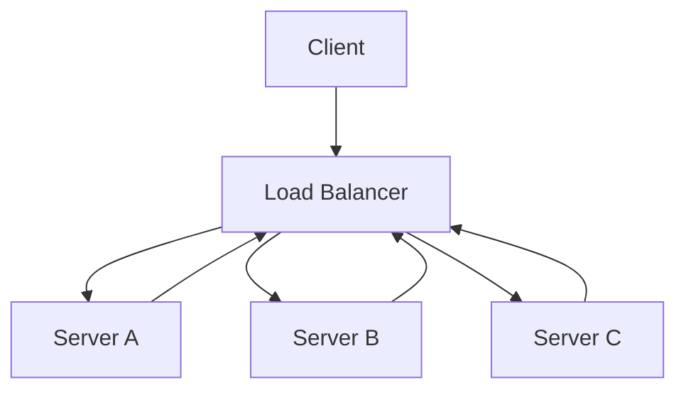

## Load Balancers
### Core Concepts
*   **Definition:** A load balancer is a device (physical or virtual) that distributes incoming network traffic across multiple backend servers, ensuring no single server is overloaded.
*   **Primary Goals:**
    *   **Scalability:** Allows horizontal scaling by adding more servers.
    *   **High Availability:** Improves fault tolerance by detecting unhealthy servers and directing traffic away from them.
    *   **Performance:** Optimizes resource utilization and reduces response times.
    *   **Security:** Can act as a reverse proxy, hiding backend server IPs and providing SSL termination.

### Key Details & Nuances
*   **Types of Load Balancers:**
    *   **Layer 4 (Transport Layer):** Operates at the TCP/UDP level. Routes based on IP address and port. Faster due to less processing, but lacks content awareness.
        *   **Examples:** AWS Network Load Balancer (NLB), HAProxy (Layer 4 mode).
    *   **Layer 7 (Application Layer):** Operates at the HTTP/HTTPS level. Can inspect application content (e.g., URL, headers, cookies). Enables more intelligent routing.
        *   **Capabilities:** SSL termination, content-based routing, URL rewriting, sticky sessions.
        *   **Examples:** AWS Application Load Balancer (ALB), Nginx, HAProxy (Layer 7 mode).
*   **Load Balancing Algorithms:**
    *   **Round Robin:** Distributes requests sequentially to each server in the pool. Simple and widely used.
    *   **Weighted Round Robin:** Assigns different weights to servers (e.g., based on capacity). Servers with higher weights receive more requests.
    *   **Least Connections:** Directs new requests to the server with the fewest active connections. Good for handling servers with varying processing times.
    *   **IP Hash:** Uses the client's IP address to hash and direct the request to a specific server. Ensures the same client always goes to the same server, useful for stateful applications without sticky sessions.
    *   **Least Response Time:** Directs requests to the server with the fastest response time and fewest active connections.
*   **Health Checks:**
    *   Periodically verify the health and availability of backend servers.
    *   **Active Checks:** Load balancer sends specific requests (e.g., HTTP GET, TCP ping) to backend servers.
    *   **Passive Checks:** Monitor server responses to actual client requests (e.g., observe connection errors, timeouts).
    *   Unhealthy servers are temporarily removed from the pool until they pass health checks.
*   **Session Persistence (Sticky Sessions):**
    *   Ensures that a client's subsequent requests during a session are directed to the same backend server.
    *   **Methods:** Cookie-based (LB injects cookie), IP-hash (less reliable if client IP changes).
    *   **Trade-offs:** Can lead to uneven load distribution if one server accumulates many long-lived sessions; complicates scaling and maintenance. Generally preferred to make services stateless where possible.
*   **SSL Termination:**
    *   Load balancer decrypts incoming HTTPS traffic, passes plain HTTP to backend servers, and re-encrypts outgoing responses.
    *   **Benefits:** Offloads CPU-intensive decryption from backend servers, simplifies certificate management (only LB needs certificates), allows L7 inspection of traffic.

### Practical Examples

*   **Explanation:** The client sends requests to the Load Balancer. The Load Balancer intelligently distributes these requests to one of the available backend servers (Server A, Server B, or Server C) based on its configured algorithm and health checks. Responses flow back through the Load Balancer to the client.

### Common Pitfalls & Trade-offs
*   **Single Point of Failure (SPOF):** A load balancer itself can become a SPOF. High availability for the load balancer often involves active-passive or active-active setups (e.g., using VRRP, keepalived, or cloud provider managed services).
*   **Increased Latency:** Introducing an additional hop (the load balancer) can add a small amount of latency, though usually negligible for modern applications.
*   **Complexity:** Advanced Layer 7 routing rules, SSL certificate management, and sticky session configurations can add significant operational complexity.
*   **Cost:** Commercial hardware load balancers or cloud-managed load balancers can be expensive, especially at high traffic volumes. Open-source solutions like Nginx or HAProxy offer a cost-effective alternative but require more setup and maintenance.
*   **Session Persistence vs. Statelessness:** While sticky sessions solve stateful application issues, they hinder true horizontal scalability and can lead to uneven load. Prefer designing services to be stateless whenever possible.

### Interview Questions

1.  **What is the core difference between Layer 4 and Layer 7 load balancing? When would you choose one over the other?**
    *   **Answer:** Layer 4 operates at the transport layer (TCP/UDP), routing traffic based on IP/port. It's faster and simpler but cannot inspect application content. Choose it for high-performance, simple distribution (e.g., gaming, raw TCP services). Layer 7 operates at the application layer (HTTP/HTTPS), inspecting content like URLs, headers, and cookies. It allows for advanced routing, SSL termination, and sticky sessions. Choose it for web applications requiring intelligent routing, content modification, or SSL offloading.

2.  **Describe common load balancing algorithms and discuss their suitability for different scenarios.**
    *   **Answer:**
        *   **Round Robin:** Simple, even distribution. Good for homogeneous server pools where all servers have similar capacity and processing times.
        *   **Least Connections:** Routes to the server with fewest active connections. Ideal for servers with varying processing loads or connection durations, aiming for better overall server utilization.
        *   **IP Hash:** Uses client's IP to consistently route to the same server. Useful for stateful applications without relying on cookies or if client IP must always hit the same server, but can lead to uneven distribution if many requests come from the same IP or range.
        *   **Weighted Round Robin/Least Connections:** Allows prioritizing more capable servers. Useful in heterogeneous environments where servers have different hardware or capacity.

3.  **How do you handle session persistence (sticky sessions) with a load balancer, and what are the trade-offs?**
    *   **Answer:** Session persistence ensures a client's requests consistently go to the same backend server. Common methods include:
        *   **Cookie-based:** Load balancer injects a cookie into the client's browser, which is then used on subsequent requests to route to the correct server.
        *   **IP Hash:** The load balancer uses the client's IP address to consistently route to a specific server.
        *   **Trade-offs:** It simplifies stateful application design by avoiding shared state, but it can lead to uneven load distribution (hotspots) if one server accumulates many active sessions. It also complicates horizontal scaling, server maintenance (draining connections), and failover scenarios. Ideally, services should be stateless to simplify scaling and improve resilience.

4.  **How does a load balancer typically react when a backend server fails, and what mechanisms are involved?**
    *   **Answer:** Load balancers use **health checks** to monitor the availability of backend servers. When a server fails (e.g., stops responding to HTTP probes, TCP pings, or returns error codes), the load balancer marks it as unhealthy and immediately stops sending new traffic to it. Once the server recovers and passes subsequent health checks, the load balancer will automatically reintegrate it into the active server pool and resume sending traffic. This mechanism ensures high availability and prevents requests from being sent to non-responsive servers.

5.  **Discuss the pros and cons of implementing SSL termination at the load balancer versus at the backend servers.**
    *   **Answer:**
        *   **Pros of LB Termination:** Offloads CPU-intensive SSL/TLS encryption/decryption from backend servers, freeing up their resources for application logic. Simplifies certificate management as certificates only need to be installed on the load balancer. Allows Layer 7 load balancers to inspect and route traffic based on HTTP headers, URLs, etc.
        *   **Cons of LB Termination:** The traffic between the load balancer and backend servers is unencrypted (HTTP), which might be a security concern in untrusted internal networks. Adds a slight overhead and latency due to the additional processing. Requires careful management of SSL certificates on the load balancer itself. In some high-security environments, end-to-end encryption (TLS to backend) might be preferred.