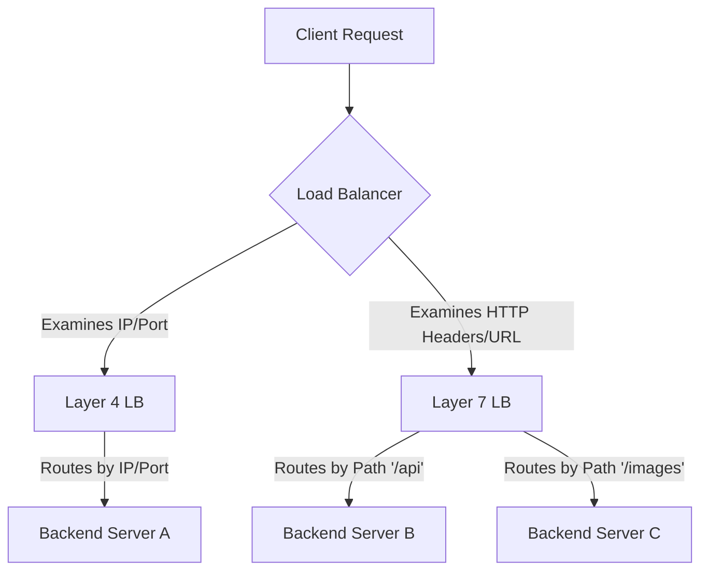

## Layer 4 vs Layer 7 Load Balancing
### Core Concepts

*   **Load Balancing:** Distributing incoming network traffic across multiple backend servers to ensure no single server is overloaded, improving responsiveness and availability.
*   **Proxies:** Servers that act as an intermediary for requests from clients seeking resources from other servers.
    *   **Forward Proxy:** Client-side intermediary (e.g., for internet access control).
    *   **Reverse Proxy:** Server-side intermediary (e.g., Load Balancer, API Gateway).

*   **OSI Model Layers:** Load balancing operates at different layers of the Open Systems Interconnection (OSI) model.
    *   **Layer 4 (Transport Layer):** Operates on network information like IP addresses and ports (TCP/UDP).
    *   **Layer 7 (Application Layer):** Operates on application-specific information like HTTP headers, URLs, cookies, or SSL sessions.

### Key Details & Nuances

#### Layer 4 Load Balancing (Transport Layer)
*   **Mechanism:** Routes traffic based on IP addresses and ports. Inspects only the initial packets of a connection (SYN for TCP) to make routing decisions.
*   **Session Management:** Maintains a mapping of client IP/port to backend server IP/port for the duration of the connection.
*   **Pros:**
    *   **High Performance/Low Latency:** Minimal processing overhead; fast forwarding.
    *   **Protocol Agnostic:** Can handle any TCP/UDP traffic (HTTP, FTP, SSH, database connections).
    *   **Simplicity:** Easier to configure and manage for basic distribution.
    *   **Transparent to Application:** Backend servers see the original client IP (unless SNAT/Masquerade is used).
*   **Cons:**
    *   **Limited Intelligence:** Cannot inspect application-level data (e.g., HTTP headers, cookies).
    *   **Less Granular Routing:** Cannot route based on URL path, content type, etc.
    *   **No SSL/TLS Termination:** Requires backend servers to handle encryption/decryption, or separate devices.
*   **Examples:** NGINX (stream module), HAProxy (TCP mode), IPVS (Linux Virtual Server), AWS NLB (Network Load Balancer).

#### Layer 7 Load Balancing (Application Layer)
*   **Mechanism:** Terminates the client's connection, inspects the full application-layer request (e.g., HTTP headers, URL, cookies), and then establishes a new connection to the chosen backend server.
*   **Session Management:** Can use application-level sticky sessions (e.g., cookie-based) in addition to IP-based.
*   **Pros:**
    *   **Intelligent Routing:** Can route requests based on HTTP method, URL path, host header, cookie data, user-agent, etc.
    *   **SSL/TLS Termination:** Can decrypt/encrypt traffic, offloading this CPU-intensive task from backend servers.
    *   **Advanced Features:** Supports content caching, compression, web application firewall (WAF) integration, API gateway functionality.
    *   **Content Rewriting:** Can modify headers or URLs before forwarding.
*   **Cons:**
    *   **Higher Latency:** Requires full request parsing and re-establishment of connections, adding processing time.
    *   **More Resource Intensive:** Requires more CPU and memory due to deep packet inspection and connection management.
    *   **Complexity:** More challenging to configure and troubleshoot due to advanced features.
    *   **Loss of Client IP:** Backend servers typically see the load balancer's IP unless `X-Forwarded-For` or `Proxy-Protocol` headers are used.
*   **Examples:** NGINX (HTTP module), HAProxy (HTTP mode), AWS ALB (Application Load Balancer), Envoy, F5 BIG-IP.

### Practical Examples

#### Conceptual Flow


#### NGINX Configuration Example (Illustrative)

```nginx
# Layer 4 (Stream Module - TCP Proxy)
stream {
    upstream backend_l4 {
        server 192.168.1.10:8000;
        server 192.168.1.11:8000;
    }

    server {
        listen 80;
        proxy_pass backend_l4;
        # Other L4 specific directives
    }
}

# Layer 7 (HTTP Module - HTTP Proxy)
http {
    upstream backend_l7 {
        server 192.168.1.12:80;
        server 192.168.1.13:80;
    }

    server {
        listen 80;
        server_name example.com;

        location /api {
            proxy_pass http://backend_l7; # Routes based on path
            proxy_set_header X-Forwarded-For $remote_addr; # Preserves original client IP
            # Other L7 specific directives (e.g., caching, compression)
        }

        location /images {
            proxy_pass http://backend_l7_images; # Could be a different upstream
        }
    }
}
```

### Common Pitfalls & Trade-offs

*   **Overhead vs. Features:** Choosing Layer 7 for simple use cases adds unnecessary latency and resource consumption. Choosing Layer 4 for complex routing means distributing intelligence to client-side or backend, increasing complexity there.
*   **SSL/TLS Termination:** While Layer 7 LBs can offload SSL, it introduces a trust boundary and requires careful certificate management. If security requires end-to-end encryption, the backend servers still need to handle SSL, possibly with internal certificates.
*   **Client IP Preservation:** Layer 7 LBs generally hide the client's original IP. Proper configuration (`X-Forwarded-For`, `Proxy-Protocol`) is crucial for logging, analytics, and security. Layer 4 typically preserves it, making it simpler for backend services.
*   **Health Checks:** Layer 4 health checks are basic (e.g., TCP handshake success). Layer 7 allows more sophisticated application-level health checks (e.g., HTTP GET on `/healthz` endpoint).
*   **Cookie-based Sticky Sessions (L7):** While powerful, these rely on clients respecting cookies and can lead to uneven load distribution if a few clients have many requests or if the cookie is lost.

### Interview Questions

1.  **When would you choose a Layer 4 load balancer over a Layer 7, and vice versa?**
    *   **Layer 4:** For high-performance, low-latency scenarios where simple traffic distribution is sufficient, or for non-HTTP/S protocols (e.g., gaming servers, database connections, high-volume raw TCP traffic). When minimal processing overhead is critical.
    *   **Layer 7:** When intelligent routing decisions are needed based on application-level context (e.g., URL paths, user agent, cookies), for SSL/TLS termination, content-based routing, caching, or WAF integration. For HTTP/S web services.

2.  **Explain the role of SSL/TLS termination in a Layer 7 load balancer.**
    *   SSL/TLS termination at the Layer 7 load balancer means the LB decrypts incoming HTTPS traffic from the client, processes the unencrypted request, and then re-encrypts it (optionally) before forwarding it to the backend server.
    *   **Benefits:** Offloads CPU-intensive encryption/decryption from backend servers, simplifies certificate management (only LB needs certs), enables deep packet inspection for advanced routing and security features (WAF).
    *   **Drawbacks:** Creates a security boundary where traffic is briefly unencrypted.

3.  **How do sticky sessions differ in implementation between Layer 4 and Layer 7 load balancers?**
    *   **Layer 4:** Typically uses **source IP hashing** to direct all connections from a specific client IP address to the same backend server. This is less robust as multiple users might share an IP (e.g., behind a NAT) or a single user's IP might change.
    *   **Layer 7:** Can use **cookie-based sticky sessions**, where the load balancer inserts a cookie into the client's response. Subsequent requests from that client (with the cookie) are directed to the same backend server. This is more precise for maintaining user sessions across various network conditions.

4.  **Describe a scenario where a Layer 4 load balancer might cause issues that a Layer 7 could resolve.**
    *   **Scenario:** An application with different microservices exposed on distinct URL paths (e.g., `/api/users` and `/api/products`) all running on port 80/443, but needing to be routed to separate backend service clusters. A Layer 4 LB cannot inspect the URL path, so it would simply distribute traffic to servers based on IP/port, requiring all servers to handle all paths or requiring additional routing logic on the backend.
    *   **Layer 7 Solution:** A Layer 7 load balancer can inspect the URL path (`/api/users` vs. `/api/products`) and route requests to the appropriate backend service cluster, providing clear separation of concerns and simplifying backend service architecture.

5.  **What's the impact of using Layer 7 load balancing on the visibility of the original client's IP address by the backend servers? How is this typically addressed?**
    *   **Impact:** Since a Layer 7 load balancer terminates the client connection and establishes a new one to the backend, the backend server typically sees the IP address of the load balancer as the source, not the original client. This impacts logging, analytics, and security features that rely on client IP.
    *   **Resolution:** This is usually addressed by the load balancer adding an `X-Forwarded-For` HTTP header (or similar headers like `X-Real-IP`) to the request, which contains the original client's IP address. Backend applications must be configured to read this header instead of the direct source IP. The `Proxy-Protocol` is another mechanism for this, especially for non-HTTP L7 cases.