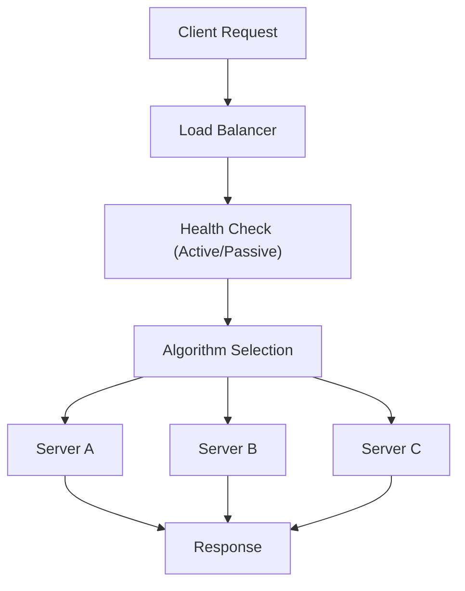

## Load Balancing Algorithms
### Core Concepts
Load balancing algorithms determine how a Load Balancer (LB) distributes incoming network traffic across a group of backend servers. Their primary goal is to optimize resource utilization, maximize throughput, minimize response time, and avoid overloading any single server. They are fundamental for scalability, high availability, and reliability in distributed systems.

### Key Details & Nuances

*   **Round Robin (RR):**
    *   **Mechanism:** Distributes requests sequentially to each server in the pool.
    *   **Use Case:** Simple, stateless, good for homogeneous server environments where all servers have similar processing capabilities.
    *   **Trade-offs:** Does not consider server load or response time; can send requests to an overloaded or slow server.
*   **Weighted Round Robin (WRR):**
    *   **Mechanism:** Assigns a "weight" to each server, sending more requests to servers with higher weights.
    *   **Use Case:** Heterogeneous server environments (e.g., newer, more powerful servers get higher weights).
    *   **Trade-offs:** Still stateless regarding current load; requires manual weight configuration.
*   **Least Connections (LC):**
    *   **Mechanism:** Directs new requests to the server with the fewest active connections.
    *   **Use Case:** Highly effective for handling long-lived connections (e.g., WebSockets, persistent database connections) as it balances actual server load.
    *   **Trade-offs:** Requires the LB to maintain state of active connections per server; can be less effective if connection times vary widely (a server with few *active* but very *long* connections might still be busy).
*   **Weighted Least Connections (WLC):**
    *   **Mechanism:** Similar to LC, but considers server weights. A server's "effective" connections might be its actual connections divided by its weight.
    *   **Use Case:** Combines the benefits of LC with the ability to manage heterogeneous server capacities.
    *   **Trade-offs:** More complex state tracking.
*   **IP Hash:**
    *   **Mechanism:** Uses a hash of the client's IP address to determine which server receives the request.
    *   **Use Case:** Ensures "session affinity" or "sticky sessions" without requiring cookies or other application-layer state. All requests from a specific client IP go to the same server.
    *   **Trade-offs:** If a server fails, all clients hashed to that server lose their session; can lead to uneven distribution if client IPs are not evenly distributed; less effective behind large NATs where many clients share an IP.
*   **Least Response Time / Least Latency:**
    *   **Mechanism:** Directs requests to the server with the quickest response time (often measured by the LB through health checks or active monitoring).
    *   **Use Case:** Prioritizes user experience by sending requests to the fastest responding server, even if it has more connections than another.
    *   **Trade-offs:** Requires constant monitoring and may introduce a small overhead for measurement; a server might be fast but approaching capacity.
*   **Least Bandwidth:**
    *   **Mechanism:** Directs requests to the server currently serving the least amount of traffic (measured in Mbps or Bps).
    *   **Use Case:** Good for environments where network throughput is the primary bottleneck.
    *   **Trade-offs:** Requires monitoring bandwidth usage; doesn't account for CPU/memory load.
*   **Health Checks:** All advanced algorithms rely heavily on continuous health checks to identify and remove unhealthy or unresponsive servers from the pool, preventing requests from being sent to dead ends.

### Practical Examples

A common flow showing a Load Balancer distributing requests using a generic algorithm.

### Common Pitfalls & Trade-offs

*   **Session Affinity (Sticky Sessions):**
    *   **Problem:** Some applications require a client to consistently connect to the same backend server (e.g., if session state is stored in memory on that server).
    *   **Solution:** IP Hash, Cookie-based persistence (LB injects/reads cookie), or URL-based persistence.
    *   **Trade-off:** Reduces load balancing effectiveness (can create hot spots) and complicates server maintenance (e.g., draining connections, server replacement). Ideally, design applications to be stateless.
*   **Algorithm Complexity vs. Overhead:** More sophisticated algorithms (e.g., Least Response Time) require the LB to collect and process more data, potentially adding latency to the balancing decision. Simple algorithms like Round Robin have minimal overhead.
*   **Cold Start Problem:** When a new server is added to the pool, it might initially have zero connections (Least Connections) or appear very fast (Least Response Time), leading to a sudden surge of requests before it's fully warmed up or its caches are populated.
*   **False Health Check Positives/Negatives:** Poorly configured health checks can lead to healthy servers being marked unhealthy or vice-versa, impacting availability or performance.
*   **Inconsistent Data for Dynamic Algorithms:** If the LB's view of server load (connections, response time) is not frequently updated or accurate, dynamic algorithms can make suboptimal decisions.

### Interview Questions

1.  **Question:** When would you choose a simple Round Robin algorithm over a more dynamic one like Least Connections, and what are the potential downsides of that choice?
    *   **Answer:** Use Round Robin for homogeneous backend servers with stateless applications, where request processing times are relatively consistent. It's simple, stateless, and has minimal overhead. Downsides include not accounting for actual server load, potentially sending requests to an overloaded or slow server, and not being suitable for services with long-lived connections.

2.  **Question:** Explain the concept of "session affinity" in the context of load balancing. What are the common methods to achieve it, and what are its implications for system design?
    *   **Answer:** Session affinity (sticky sessions) ensures a client's requests are consistently routed to the same backend server. Common methods include IP Hash (based on client IP), Cookie-based persistence (LB injects/reads a cookie), or URL-based routing. Implications: it compromises optimal load distribution by creating hot spots, complicates server scaling (adding/removing servers becomes harder), and reduces fault tolerance (if the "sticky" server fails, the session is lost). It's generally preferred to design stateless applications where possible.

3.  **Question:** How do health checks integrate with load balancing algorithms, and why are they critical?
    *   **Answer:** Health checks are fundamental to any load balancing algorithm. They continuously monitor the availability and responsiveness of backend servers. If a server fails a health check, the load balancer automatically removes it from the pool, preventing requests from being sent to an unhealthy destination. This ensures high availability and prevents service degradation, regardless of the chosen distribution algorithm. Once the server recovers, health checks will re-add it to the pool.

4.  **Question:** Compare Least Connections and Least Response Time algorithms. In what scenarios would one be preferred over the other?
    *   **Answer:**
        *   **Least Connections (LC):** Preferred for applications with long-lived connections (e.g., WebSockets, database connections), as it balances the *number* of active connections, aiming to distribute the concurrent load evenly. It assumes connections equate to load.
        *   **Least Response Time (LRT):** Preferred when optimizing for user experience and latency. It routes traffic to the server that *responds fastest*, which might not always be the one with the fewest connections (e.g., a server with fewer, but very heavy, connections might be slower than one with more, but lighter, connections). LRT directly targets performance, but requires continuous measurement and adds slight overhead. Choose LC if connection count is the primary load indicator, LRT if perceived performance is paramount.