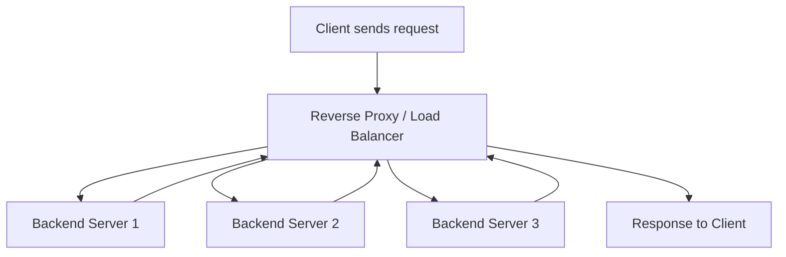

## LB vs Reverse Proxy
### Core Concepts

*   **Reverse Proxy:**
    *   A server that sits in front of one or more web servers, forwarding client requests to those servers.
    *   **Primary Purpose:** Enhance security, performance, and reliability by acting as an intermediary.
    *   **Client's View:** The client sees only the reverse proxy, not the origin servers.
*   **Load Balancer:**
    *   A device or software that distributes incoming network traffic across a group of backend servers (a "server farm" or "server pool").
    *   **Primary Purpose:** Optimize resource utilization, maximize throughput, minimize response time, and avoid overload of any single server.
    *   **Relationship:** A load balancer is a *type* of reverse proxy. All load balancers act as reverse proxies, but not all reverse proxies are primarily focused on load distribution across identical servers.

### Key Details & Nuances

*   **Load Balancer Specific Focus:**
    *   **Traffic Distribution Algorithms:** Round Robin, Least Connections, IP Hash, Weighted Round Robin/Least Connections.
    *   **Health Checks:** Continuously monitors backend servers, automatically removing unhealthy ones from the pool.
    *   **Session Persistence (Sticky Sessions):** Directing a client's requests to the same backend server for the duration of a session.
*   **Reverse Proxy Specific Focus:**
    *   **Security:** Hides internal network topology, provides a single public entry point, can filter malicious requests (e.g., WAF integration), and offers DDoS protection.
    *   **Performance Optimization:** Caching static content, compression, SSL/TLS termination (offloading encryption/decryption from backend servers).
    *   **Centralized Logging & Monitoring:** All traffic flows through it, enabling centralized request logging and performance monitoring.
    *   **URL Rewriting & Routing:** Can rewrite URLs or route requests to different backend services based on the URL path or headers (e.g., `/api/users` to User Service, `/api/products` to Product Service).
*   **Overlap & Complementarity:**
    *   Both often perform SSL termination, caching, compression, and health checks.
    *   A sophisticated reverse proxy (like Nginx) can also perform basic load balancing.
    *   A dedicated Load Balancer (like AWS ELB/ALB, HAProxy) will always function as a reverse proxy, with its primary feature being intelligent traffic distribution.

### Practical Examples

**Nginx as both Reverse Proxy and Load Balancer**

```nginx
http {
    upstream backend_servers {
        # Load balancing methods:
        # round robin (default)
        # least_conn
        # ip_hash
        server backend1.example.com; # Default port 80, can specify port
        server backend2.example.com weight=3; # backend2 gets 3x more traffic
        server 192.168.1.100:8080 max_fails=3 fail_timeout=30s; # With health check params
    }

    server {
        listen 80;
        server_name api.example.com;

        location / {
            # Basic reverse proxying
            proxy_pass http://backend_servers; # Uses the upstream block for load balancing
            proxy_set_header Host $host;
            proxy_set_header X-Real-IP $remote_addr;
            proxy_set_header X-Forwarded-For $proxy_add_x_forwarded_for;
            # Other reverse proxy features:
            # proxy_cache my_cache; # Caching
            # gzip on; # Compression
        }

        # Example of specific path routing
        location /admin/ {
            proxy_pass http://admin_server; # Route to a different specific backend
        }
    }
}
```

**Conceptual Flow Diagram**



### Common Pitfalls & Trade-offs

*   **Single Point of Failure (SPOF):** The Load Balancer/Reverse Proxy itself can become a SPOF. This is mitigated by deploying them in highly available (HA) pairs or clusters (e.g., Active-Passive, Active-Active setups, cloud-managed LBs).
*   **Increased Latency:** Adding an extra hop introduces a small amount of latency. The benefits (performance optimization, security) typically outweigh this.
*   **Complexity:** Introducing an additional layer adds complexity to configuration, monitoring, and debugging.
*   **Sticky Sessions Drawbacks:**
    *   Can lead to uneven load distribution if some sessions are long-lived or resource-intensive.
    *   Complicates scaling out or scaling down backend servers, as active sessions must be maintained or migrated.
    *   Reduces fault tolerance; if a server with sticky sessions fails, all active sessions on that server are lost.

### Interview Questions

1.  **Explain the core difference between a Load Balancer and a Reverse Proxy. Can one exist without the other?**
    *   **Answer:** A reverse proxy is a server that fronts backend services, offering features like security, caching, and URL routing. A load balancer is a *type* of reverse proxy whose primary function is to intelligently distribute traffic across multiple *identical* backend servers to optimize resource usage and ensure high availability. Conceptually, a reverse proxy can exist without load balancing (e.g., proxying to a single server or different services based on path), but a load balancer inherently performs reverse proxying as it sits in front of servers.

2.  **Describe scenarios where you would primarily use a Reverse Proxy vs. when you would emphasize Load Balancing.**
    *   **Answer:**
        *   **Reverse Proxy Emphasis:** When you have a single backend server (e.g., a simple blog or API) but need to add security (WAF, DDoS protection), enable SSL, cache static content, or consolidate multiple services under one domain (e.g., `/api` for microservice A, `/dashboard` for microservice B).
        *   **Load Balancing Emphasis:** When you have multiple identical backend servers for the same service and need to scale horizontally, distribute client requests efficiently, ensure high availability by directing traffic away from unhealthy servers, and improve overall system throughput.

3.  **What are the benefits of performing SSL termination at the Load Balancer/Reverse Proxy layer?**
    *   **Answer:**
        *   **Performance Offload:** Frees up compute resources on backend application servers, allowing them to focus solely on business logic.
        *   **Simplified Certificate Management:** Certificates are managed in one central location.
        *   **Enhanced Security:** Provides a single point to enforce security policies and inspect traffic before it reaches backend servers.
        *   **Backend Flexibility:** Allows backend servers to communicate over unencrypted HTTP internally if the network is secure, simplifying configuration.

4.  **Discuss the trade-offs of using sticky sessions and how to mitigate them.**
    *   **Answer:**
        *   **Trade-offs:** Can lead to uneven load distribution (some servers get more traffic/load), complicates scaling (adding/removing servers can disrupt sessions), reduces fault tolerance (server failure means session loss).
        *   **Mitigation:** Prefer stateless applications where possible. If state is necessary, move session state to an external, distributed store (e.g., Redis, Memcached, database). Use intelligent load balancing algorithms that consider server load in conjunction with stickiness (if partial stickiness is desired). Shorten session timeouts.