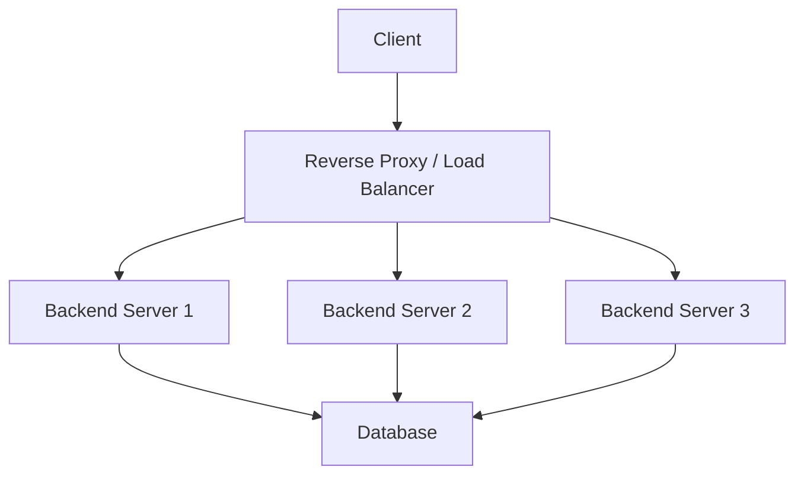

## Horizontal Scaling
### Core Concepts

*   **Horizontal Scaling (Scale-Out):** Adding more machines (instances) to a pool of resources to handle increased load, rather than upgrading existing machines (vertical scaling/scale-up).
*   **Load Balancing:** Distributing incoming network traffic across multiple servers to ensure no single server becomes a bottleneck. Improves availability, reliability, and performance.
*   **Proxies:** Act as intermediaries between clients and servers.
    *   **Forward Proxy:** Sits in front of clients, forwarding their requests to various servers. Used for caching, filtering, anonymity.
    *   **Reverse Proxy:** Sits in front of servers, forwarding client requests to the appropriate backend server. Used for load balancing, SSL termination, caching, security.

### Key Details & Nuances

*   **Load Balancer Algorithms:**
    *   **Round Robin:** Distributes requests sequentially to each server. Simple, but doesn't account for server load.
    *   **Least Connections:** Forwards request to the server with the fewest active connections. Better than Round Robin for varying request durations.
    *   **IP Hash:** Uses a hash of the client's IP address to route requests. Ensures a client consistently hits the same server (useful for sticky sessions).
    *   **Weighted Round Robin/Least Connections:** Assigns weights to servers based on their capacity.
*   **Health Checks:** Load balancers continuously monitor backend servers (e.g., ping, HTTP GET on a health endpoint) and remove unhealthy servers from the pool.
*   **Session Affinity (Sticky Sessions):** Ensuring that all requests from a particular client are routed to the same backend server. Achieved via cookies or IP hashing. Can hinder load distribution if not managed carefully.
*   **Reverse Proxy Benefits for Horizontal Scaling:**
    *   **Single Point of Entry:** Clients interact with the proxy, not individual backend servers.
    *   **Abstraction:** Backend infrastructure can change (add/remove servers) without affecting clients.
    *   **SSL Termination:** Proxy handles SSL encryption/decryption, offloading CPU-intensive tasks from backend servers.
    *   **Caching:** Proxy can cache responses, reducing load on backend servers.
    *   **Rate Limiting:** Proxy can enforce limits on incoming requests.
*   **Types of Load Balancers:**
    *   **Layer 4 (Transport Layer):** Operates at the TCP/UDP level. Fast, but less intelligent about application-level data. Distributes based on IP and port.
    *   **Layer 7 (Application Layer):** Operates at the HTTP level. Can inspect request content (URL, headers, cookies) for smarter routing decisions. More overhead.
*   **Scaling Considerations:**
    *   **State Management:** Applications needing to maintain user session state become more complex with horizontal scaling. Options:
        *   **Sticky Sessions:** Can lead to uneven load distribution.
        *   **External Session Store:** (e.g., Redis, Memcached) Centralized storage for session data, allowing any backend server to handle any request.
    *   **Database Scaling:** Often the next bottleneck. Requires separate strategies like replication, sharding.
    *   **Stateless vs. Stateful Services:** Stateless services are easier to scale horizontally as any instance can handle any request.

### Practical Examples

*   **High-Level Flow with a Reverse Proxy/Load Balancer:**



*   **Nginx Configuration Snippet (Simple Round Robin):**

```nginx
http {
    upstream my_backend {
        server backend_server_1:8080;
        server backend_server_2:8080;
        server backend_server_3:8080;
    }

    server {
        listen 80;
        server_name example.com;

        location / {
            proxy_pass http://my_backend;
            proxy_set_header Host $host;
            proxy_set_header X-Real-IP $remote_addr;
            proxy_set_header X-Forwarded-For $proxy_add_x_forwarded_for;
            proxy_set_header X-Forwarded-Proto $scheme;
        }
    }
}
```

### Common Pitfalls & Trade-offs

*   **Single Point of Failure (SPOF):** The load balancer itself can become a SPOF. Solution: Deploy redundant load balancers (e.g., active-passive or active-active).
*   **Session Management Complexity:** Sticky sessions can lead to uneven load distribution if some users are very active, while external session stores introduce another dependency and potential bottleneck.
*   **Health Check Misconfiguration:** Incorrectly configured health checks can lead to perfectly healthy servers being removed from rotation, or unhealthy servers remaining in service.
*   **Overhead of Layer 7 Load Balancing:** While providing more routing intelligence, Layer 7 load balancers consume more CPU and memory compared to Layer 4.
*   **Discovery Issues:** As servers are added or removed dynamically, the load balancer needs to be aware of the current pool of healthy servers. This often involves service discovery mechanisms.

### Interview Questions

1.  **Question:** How would you scale a web application experiencing a surge in traffic?
    **Answer:** Primarily through horizontal scaling. This involves adding more instances of the application servers. A load balancer would distribute traffic across these new instances. We'd also need to consider scaling the database, caching layers, and potentially background worker pools. Monitoring key metrics (CPU, memory, network I/O, request latency, error rates) would guide the scaling decisions.

2.  **Question:** Explain the difference between Layer 4 and Layer 7 load balancing and when you would use each.
    **Answer:** Layer 4 (Transport Layer) load balancing operates at the TCP/UDP level, distributing traffic based on IP address and port. It's fast and has low overhead. Use it when you need simple, high-performance distribution without inspecting request content. Layer 7 (Application Layer) load balancing operates at the HTTP level, allowing routing decisions based on URL, headers, cookies, etc. Use it for more intelligent routing, SSL termination, caching, or when specific requests need to go to different backend services.

3.  **Question:** How do you handle state (e.g., user sessions) when horizontally scaling a web application?
    **Answer:** There are a few strategies:
    1.  **Sticky Sessions:** The load balancer directs all requests from a specific client to the same server using cookies or IP hashing. This is simple but can lead to uneven load distribution and makes server maintenance harder.
    2.  **External Session Store:** Store session data in a centralized, highly available data store like Redis or Memcached. This makes the application servers stateless, allowing any server to handle any request, improving scalability and resilience.
    3.  **Client-Side Storage:** For simpler states, store data in client-side cookies or tokens (e.g., JWT), though this has size limitations and security implications.

4.  **Question:** What are the trade-offs of using sticky sessions versus an external session store?
    **Answer:**
    *   **Sticky Sessions:**
        *   **Pros:** Simpler to implement initially, no external dependency.
        *   **Cons:** Can lead to uneven load distribution, makes rolling updates or server maintenance more complex (need to drain connections), less resilient if the sticky server fails.
    *   **External Session Store:**
        *   **Pros:** Enables true stateless application servers, better load distribution, easier server maintenance and scaling, more resilient to individual server failures.
        *   **Cons:** Introduces an additional dependency (the session store itself must be highly available and scalable), adds network latency for session access, requires careful management of the session store.