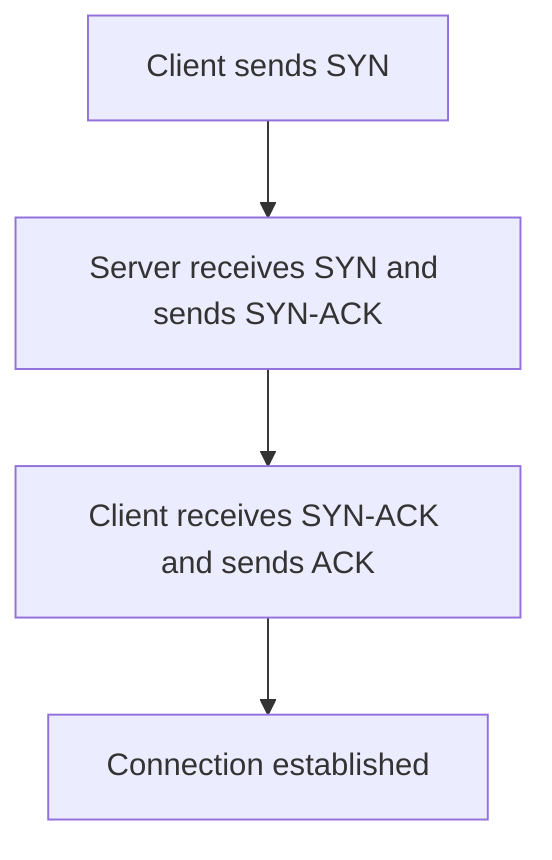

## HTTP/TCP/UDP
### Core Concepts

*   **HTTP (Hypertext Transfer Protocol):**
    *   **Application Layer Protocol:** Governs how clients and servers communicate on the web.
    *   **Request-Response Model:** Client sends a request, server sends a response.
    *   **Stateless:** Each request is independent; server retains no memory of past requests by default (sessions are built on top, e.g., via cookies).
    *   **Generally over TCP:** HTTP/1.1 and HTTP/2 primarily use TCP. HTTP/3 uses UDP (via QUIC).

*   **TCP (Transmission Control Protocol):**
    *   **Transport Layer Protocol:** Provides reliable, ordered, and error-checked delivery of a stream of bytes between applications.
    *   **Connection-Oriented:** Requires a 3-way handshake to establish a connection before data transfer.
    *   **Reliable:** Guarantees delivery via acknowledgments and retransmissions.
    *   **Ordered:** Ensures data packets arrive in the correct sequence.
    *   **Flow Control:** Prevents sender from overwhelming receiver.
    *   **Congestion Control:** Prevents overwhelming the network.

*   **UDP (User Datagram Protocol):**
    *   **Transport Layer Protocol:** Provides a simple, connectionless, and unreliable datagram service.
    *   **Connectionless:** No handshake needed before sending data.
    *   **Unreliable:** No guarantees of delivery, order, or duplication.
    *   **Minimal Overhead:** Faster due to lack of overhead from connection establishment, reliability, and ordering mechanisms.
    *   **Datagrams:** Data is sent in independent packets.

### Key Details & Nuances

*   **TCP Guarantees:**
    *   **Reliable Delivery:** Achieved via sequence numbers, acknowledgments (ACKs), and retransmission timers. Lost segments are re-sent.
    *   **Ordered Delivery:** Segments are reassembled in the correct order at the receiver using sequence numbers. Out-of-order segments are buffered.
    *   **Flow Control (Sliding Window):** Receiver advertises its available buffer space (receive window) to the sender, preventing overrunning the receiver.
    *   **Congestion Control:** Algorithms (e.g., Slow Start, Congestion Avoidance, Fast Retransmit, Fast Recovery) detect and react to network congestion, reducing transmission rates to avoid network collapse.
    *   **Head-of-Line Blocking (HOLB):** If one segment in a TCP stream is lost, subsequent segments (even if received) must wait for the retransmission of the lost segment to maintain order. This can delay the entire stream.

*   **UDP Characteristics:**
    *   **No Overhead:** Faster for applications that can tolerate some data loss or handle reliability at the application layer.
    *   **Datagrams:** Each datagram is independent; no inherent relationship between packets from UDP's perspective.
    *   **Useful for:** Real-time applications like voice/video streaming, online gaming, DNS queries, where speed is critical and minor data loss is acceptable.

*   **HTTP Protocol Evolution:**
    *   **HTTP/1.0:** New TCP connection for each request.
    *   **HTTP/1.1:** Introduced persistent connections (`Connection: keep-alive`) to reuse TCP connections, reducing overhead of handshakes. Also added pipelining (sending multiple requests without waiting for responses, but suffered from HOLB at the application level).
    *   **HTTP/2:** Addressed HTTP/1.1's HOLB by introducing **multiplexing** over a single TCP connection. Requests/responses are broken into frames and interleaved, allowing multiple concurrent logical streams. Used binary framing for efficiency. Still susceptible to TCP's HOLB.
    *   **HTTP/3:** Uses **QUIC** (Quick UDP Internet Connections) protocol, which runs over UDP. QUIC incorporates TCP-like reliability and congestion control at the UDP layer, but with **stream-level multiplexing**. If one stream experiences loss, others are unaffected (no HOLB at the transport layer, only within a stream). Faster handshakes (0-RTT for resumed connections).

### Practical Examples

**1. TCP 3-Way Handshake (Connection Establishment)**



**2. Basic HTTP Request (over TCP)**

```sh
# Example: Fetching a webpage using curl, which uses TCP internally
curl -v https://example.com
```
*Behind the scenes:*
1.  DNS lookup for `example.com`.
2.  TCP 3-way handshake with `example.com`'s server on port 443 (for HTTPS).
3.  TLS handshake (for HTTPS).
4.  HTTP GET request sent over the established TCP connection.
5.  HTTP response received over the same TCP connection.
6.  TCP connection can be kept alive for subsequent requests (HTTP/1.1+) or closed.

### Common Pitfalls & Trade-offs

*   **TCP vs. UDP Choice:**
    *   **TCP for reliability:** File transfers, web browsing (HTTP), email (SMTP), database connections.
    *   **UDP for speed/tolerance to loss:** VoIP, live video streaming, online gaming (fast-paced), DNS, IoT sensor data.
*   **HTTP/1.1 Pipelining vs. HTTP/2 Multiplexing:**
    *   HTTP/1.1 pipelining suffered from HOLB: if the first response was slow, all subsequent responses were blocked.
    *   HTTP/2 multiplexing resolves this at the application layer by interleaving frames from different streams, but it's still affected by **TCP's HOLB**. If one TCP segment is lost, *all* multiplexed HTTP streams on that connection are blocked until retransmission.
*   **HTTP/3 (QUIC) and HOLB:** QUIC, built on UDP, implements stream-level reliability. A lost packet for one stream does not block other streams within the same QUIC connection, effectively solving TCP's HOLB for HTTP.
*   **Overhead of Reliability:** TCP's guarantees (handshake, ACKs, retransmissions, flow/congestion control) add overhead and latency. This is a deliberate trade-off for reliability. UDP sacrifices these for minimal overhead and speed.

### Interview Questions

1.  **Compare and contrast TCP and UDP. Provide examples of applications where each protocol is preferred and justify your choices.**
    *   **Answer:** TCP is connection-oriented, reliable, ordered, and has flow/congestion control. Preferred for applications where data integrity and order are paramount (e.g., HTTP, FTP, email, database transactions). UDP is connectionless, unreliable, unordered, and has minimal overhead. Preferred for applications where speed and low latency are critical, and some data loss is acceptable or handled at the application layer (e.g., VoIP, online gaming, DNS, streaming video).

2.  **Explain the TCP 3-way handshake and its purpose. What happens if one of the steps fails?**
    *   **Answer:** The 3-way handshake (SYN, SYN-ACK, ACK) establishes a full-duplex, reliable connection.
        1.  **SYN (Synchronize Sequence Numbers):** Client sends SYN to server, proposing an initial sequence number.
        2.  **SYN-ACK:** Server responds with SYN-ACK, acknowledging client's SYN and sending its own initial sequence number.
        3.  **ACK:** Client sends ACK to acknowledge server's SYN.
        *   **Purpose:** Ensures both sides are ready to send/receive, synchronize initial sequence numbers for reliable ordering, and confirm connection parameters.
        *   **Failure:** If a step fails (e.g., packet loss), TCP retransmission timers will typically trigger a retry. Persistent failure leads to connection timeout and termination (e.g., "Connection refused" or "Timeout").

3.  **How does HTTP/2 improve upon HTTP/1.1, and what role do TCP/UDP play in these improvements?**
    *   **Answer:** HTTP/2 improves HTTP/1.1 primarily through **multiplexing** over a single TCP connection, using binary framing. This allows multiple requests/responses to be in flight concurrently without HOLB at the *application* level (unlike HTTP/1.1 pipelining). It also introduced header compression and server push. HTTP/2 still runs over TCP, meaning it's still susceptible to **TCP's Head-of-Line Blocking**: if a TCP segment is lost, all HTTP/2 streams on that connection are blocked until retransmission, despite application-level multiplexing.

4.  **Describe what happens when you type a URL into a browser and press Enter, focusing on the network protocols involved.**
    *   **Answer:**
        1.  **DNS Resolution (UDP/TCP):** Browser checks DNS cache, then queries a DNS resolver (often via UDP, falling back to TCP for large responses) to get the IP address for the domain.
        2.  **TCP Connection (TCP):** Browser initiates a TCP 3-way handshake with the server's IP address on the appropriate port (80 for HTTP, 443 for HTTPS).
        3.  **TLS Handshake (HTTPS only, over TCP):** If HTTPS, a TLS handshake occurs over the established TCP connection to secure communication (key exchange, certificate validation).
        4.  **HTTP Request (HTTP over TCP):** Browser sends an HTTP GET request (along with headers, cookies) over the secured (if HTTPS) TCP connection.
        5.  **HTTP Response (HTTP over TCP):** Server processes the request, retrieves data, and sends an HTTP response (status code, headers, HTML content) back over the same TCP connection.
        6.  **Rendering:** Browser receives the HTML, parses it, and renders the webpage, potentially making additional requests (CSS, JS, images) using the same or new TCP connections (depending on HTTP version and keep-alive).

5.  **What is Head-of-Line Blocking (HOLB), and how do different protocols (TCP, HTTP/1.1, HTTP/2, HTTP/3) address or suffer from it?**
    *   **Answer:** HOLB occurs when the processing of one item in a queue is delayed, which in turn delays all subsequent items in the same queue, even if those items are ready for processing.
        *   **TCP:** Suffers from HOLB at the transport layer. If a TCP segment is lost, all subsequent segments on that connection are held back until the lost segment is retransmitted and reordered, blocking all application data on that connection.
        *   **HTTP/1.1:** Suffers from application-layer HOLB with pipelining. Though multiple requests could be sent without waiting for responses, responses had to arrive in order, so a slow first response blocked all subsequent ones.
        *   **HTTP/2:** Solves application-layer HOLB by multiplexing streams over a single TCP connection. However, it *still* suffers from TCP's HOLB, as the underlying TCP connection's segment loss affects all multiplexed HTTP/2 streams.
        *   **HTTP/3 (QUIC):** Solves HOLB effectively by running over UDP. QUIC implements its own stream-level reliability and flow control. If packets for one stream are lost, only that specific stream is affected; other streams within the same QUIC connection continue unimpeded, eliminating TCP's HOLB problem.