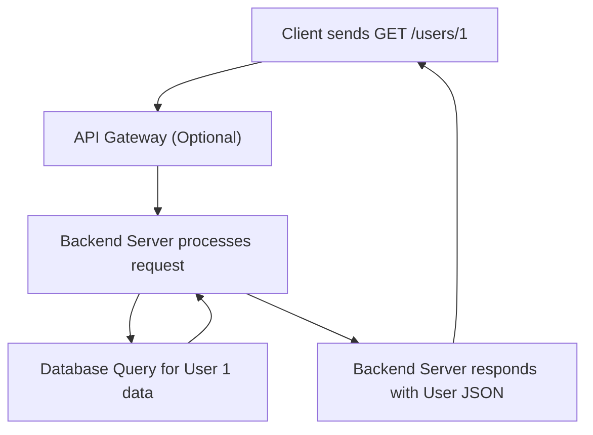

## RPC vs REST vs GraphQL
### Core Concepts

*   **Remote Procedure Call (RPC):**
    *   **Paradigm:** Models remote interactions as local function calls. The client calls a function on a remote server, and the server executes it and returns the result.
    *   **Key Idea:** Focuses on actions/operations. Tightly coupled client-server interface through a defined contract (Interface Definition Language - IDL).
    *   **Examples:** gRPC (HTTP/2, Protobuf), Apache Thrift, XML-RPC, SOAP.
*   **Representational State Transfer (REST):**
    *   **Paradigm:** Architectural style for networked applications based on resources. Interactions revolve around manipulating state of resources using a uniform interface.
    *   **Key Idea:** Focuses on resources (nouns) identified by URLs. Uses standard HTTP methods (GET, POST, PUT, DELETE, PATCH) for operations. Stateless, cacheable, layered system.
    *   **Examples:** Most modern public APIs (e.g., GitHub API, Stripe API).
*   **GraphQL:**
    *   **Paradigm:** A query language for APIs and a runtime for fulfilling those queries with your existing data.
    *   **Key Idea:** Client declares exactly what data it needs. Single endpoint. Eliminates over-fetching and under-fetching. Schema-driven, strongly typed.
    *   **Examples:** Facebook, Shopify, GitHub (v4 API).

### Key Details & Nuances

*   **Data Fetching Model:**
    *   **RPC:** Operation-centric. Client calls specific functions.
    *   **REST:** Resource-centric. Client fetches predefined resource representations. Often requires multiple round-trips for related data (e.g., `GET /users/1` then `GET /users/1/posts`).
    *   **GraphQL:** Client-centric. Client sends a single query describing nested data requirements. Server resolves the query based on its schema.
*   **Over/Under-fetching:**
    *   **RPC:** Less prone if functions are well-defined for specific needs.
    *   **REST:** Common problem. `GET /users` might return too much data (over-fetching) or not enough (under-fetching, leading to N+1 problem on the client).
    *   **GraphQL:** Solves this by allowing clients to specify precise data needs.
*   **Schema & Contracts:**
    *   **RPC:** Relies on IDL (e.g., Protobuf, Thrift) for strict contract definition, enabling strong typing and code generation.
    *   **REST:** Less formal. OpenAPI/Swagger can define schemas, but not inherent to REST. Relies on convention and documentation.
    *   **GraphQL:** Central to its design. A server defines a strict schema of types, fields, and operations (queries, mutations, subscriptions).
*   **Versioning:**
    *   **RPC:** Versioning breaking changes can be complex due to tight coupling (e.g., `service.v2.proto`).
    *   **REST:** Common strategies include URL versioning (`/v1/users`), header versioning, or content negotiation.
    *   **GraphQL:** Evolves by adding new fields/types, rarely requiring breaking changes or explicit versioning as clients ignore unknown fields. Deprecating fields is the primary strategy.
*   **Performance:**
    *   **RPC (gRPC):** Often higher performance due to HTTP/2 multiplexing, binary serialization (Protobuf), and stream support.
    *   **REST:** Can be efficient with caching, but multiple round-trips can negate this. JSON parsing can be overhead.
    *   **GraphQL:** Reduced network requests (single round-trip for complex data) often leads to better perceived performance. However, complex queries can be CPU-intensive on the server.
*   **Error Handling:**
    *   **RPC:** Protocol-specific error codes (gRPC Status codes).
    *   **REST:** Uses standard HTTP status codes (2xx, 4xx, 5xx) and often includes JSON error bodies.
    *   **GraphQL:** Always returns 200 OK, with errors nested within the JSON response body under an `errors` array.

### Practical Examples

**1. REST API Request Flow (Mermaid Diagram)**



**2. GraphQL Query Example**

```graphql
query GetUserProfile {
  user(id: "123") {
    id
    name
    email
    posts {
      id
      title
      comments(first: 2) {
        id
        text
      }
    }
  }
}
```

**3. Corresponding REST Requests (Conceptual, for comparison)**

```typescript
// To get user and posts in REST, potentially multiple requests
async function getUserAndPosts(userId: string) {
  const userResponse = await fetch(`/users/${userId}`);
  const user = await userResponse.json();

  const postsResponse = await fetch(`/users/${userId}/posts`);
  const posts = await postsResponse.json();

  // For each post, if you need comments, more requests...
  // This illustrates the N+1 problem for the client.
}
```

### Common Pitfalls & Trade-offs

*   **RPC:**
    *   **Pitfall:** Tight coupling between client and server, making independent evolution difficult. Breaking changes require coordinated updates.
    *   **Trade-off:** High performance, clear contract enforcement, good for internal microservices where control over clients is high. Less human-readable.
*   **REST:**
    *   **Pitfall:** Over-fetching (getting more data than needed) or under-fetching (getting too little, leading to multiple round trips, i.e., client-side N+1).
    *   **Trade-off:** Simplicity, relies on ubiquitous HTTP standards, highly cacheable, good for public APIs where flexibility and discoverability are key. Less strict contract.
*   **GraphQL:**
    *   **Pitfall:** **N+1 Problem (Server-side):** If not implemented carefully (e.g., using DataLoader), fetching related data for a list can lead to N+1 database queries.
    *   **Pitfall:** **Caching:** HTTP caching mechanisms (CDN, browser cache) are less effective as all queries are POST to a single endpoint. Requires application-level caching.
    *   **Pitfall:** **Complexity:** Initial setup of schema, resolvers, and managing complex queries can be more involved.
    *   **Pitfall:** **Rate Limiting:** Harder to implement simple URL-based rate limiting as all requests go to one endpoint.
    *   **Trade-off:** Extreme client flexibility, efficient data fetching (single round-trip), strong type system, simplifies frontend development by eliminating manual data aggregation.

### Interview Questions

1.  **"You're designing an API for a new mobile application that needs to display complex, nested data efficiently with minimal network requests. Which communication protocol would you lean towards (RPC, REST, or GraphQL) and why?"**
    *   **Answer:** I would lean towards **GraphQL**. Mobile apps often suffer from network latency and limited bandwidth. GraphQL's ability for the client to precisely specify required data in a single query minimizes over-fetching and reduces the number of round-trips, which is crucial for mobile performance. While REST could achieve this with custom endpoints, GraphQL provides a declarative, schema-driven approach that scales better with evolving data requirements and client needs.

2.  **"Describe a scenario where gRPC (a form of RPC) would be a superior choice compared to a REST API. What are the key benefits in that context?"**
    *   **Answer:** gRPC would be superior for **internal, high-performance microservices communication** within a distributed system. Key benefits include:
        *   **Performance:** Uses HTTP/2 for multiplexing, binary serialization (Protobuf) for smaller payloads, and allows streaming (bidirectional, server, client).
        *   **Strong Typing & Code Generation:** IDL (Protobuf) enforces strict contracts, enabling automatic code generation for clients and servers in multiple languages, reducing integration errors.
        *   **Efficiency:** Ideal for chatty services or real-time data streams where low latency and high throughput are critical.

3.  **"REST is widely adopted. What are its primary advantages, and what are its major drawbacks in a client-server application, especially concerning data retrieval?"**
    *   **Answer:**
        *   **Advantages:** Simplicity, leverages ubiquitous HTTP standards (verbs, status codes), highly cacheable (for GET requests), easily human-readable (JSON/XML), and has a mature ecosystem of tools. Great for public APIs due to its widespread understanding.
        *   **Drawbacks:** The main drawback is **over-fetching or under-fetching**. Clients often receive more data than needed (over-fetching) or need to make multiple requests to get all related data (under-fetching, leading to client-side N+1 problems), increasing network latency and reducing efficiency for complex data graphs.

4.  **"GraphQL eliminates over-fetching, but it introduces new challenges. Discuss one significant challenge related to caching and another related to performance or complexity on the server-side when implementing GraphQL."**
    *   **Answer:**
        *   **Caching Challenge:** Standard HTTP caching mechanisms are less effective with GraphQL because most queries are sent as POST requests to a single endpoint, making URL-based caching difficult. This requires more sophisticated application-level caching strategies, such as using `ETag` headers for individual GraphQL objects or implementing client-side data normalization (e.g., Apollo Client's cache).
        *   **Server-Side Performance/Complexity:** A significant challenge is the **N+1 problem at the server-side resolver layer**. If not optimized (e.g., with tools like Facebook's DataLoader), resolving a list of items and their nested relationships can trigger numerous individual database queries, leading to performance bottlenecks. Additionally, complex or deep queries can be resource-intensive, making query cost analysis and rate limiting more intricate than with REST.