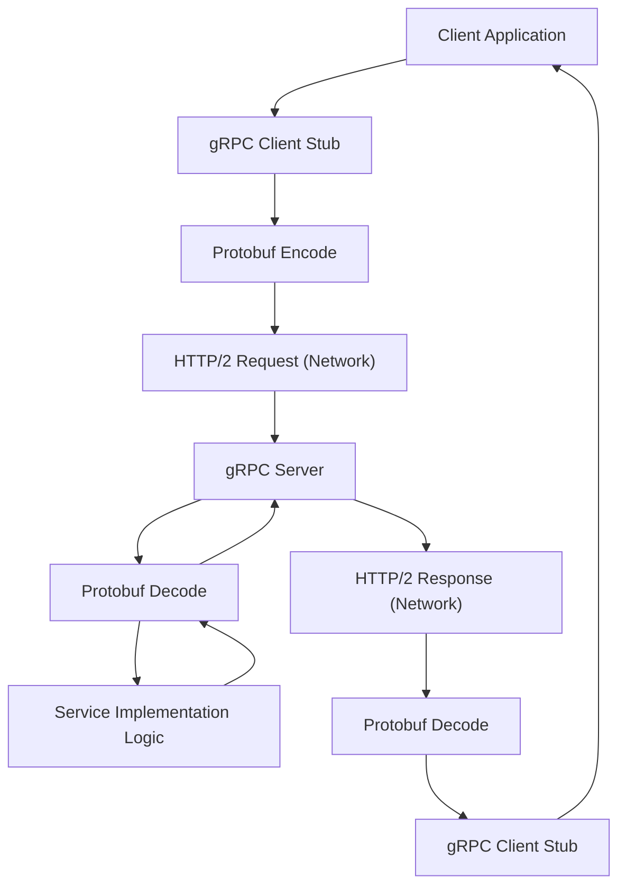

## gRPC
### Core Concepts

*   **Remote Procedure Call (RPC) Framework:** gRPC is a modern open-source RPC framework that allows client and server applications to communicate transparently, as if they were local objects.
*   **Protocol Buffers (Protobuf):** Uses Protobuf as its Interface Definition Language (IDL) and for message serialization. This provides a language-agnostic, efficient, and strongly-typed contract for services.
*   **Built on HTTP/2:** Leverages HTTP/2 for transport, enabling features like multiplexing (multiple concurrent requests over a single TCP connection), header compression (HPACK), and long-lived connections essential for streaming.
*   **Code Generation:** Compiling `.proto` files generates client-side "stubs" and server-side "interfaces/abstract classes" in various languages, simplifying service interaction and ensuring type safety.

### Key Details & Nuances

*   **HTTP/2 Advantages:**
    *   **Multiplexing:** Allows multiple concurrent RPC calls over a single TCP connection, reducing latency and resource usage compared to HTTP/1.x.
    *   **Server Push:** Though less common in typical gRPC usage, HTTP/2 supports server push, which can be beneficial in certain scenarios.
    *   **Header Compression (HPACK):** Reduces overhead, especially for requests with many headers.
*   **Protobuf Serialization:**
    *   **Binary Format:** Compact and efficient for network transfer, leading to lower bandwidth consumption.
    *   **Strongly Typed Schemas:** Enforces strict data contracts, reducing runtime errors and simplifying cross-service integration.
    *   **Backward/Forward Compatibility:** Protobuf offers mechanisms for schema evolution, allowing services to add new fields without breaking older clients/servers, provided rules are followed (e.g., field numbers remain consistent, new fields are optional).
*   **Communication Patterns (Streaming Types):**
    *   **Unary RPC:** Standard request-response (one client request, one server response).
    *   **Server Streaming RPC:** Client sends a request, server responds with a sequence of messages (stream).
    *   **Client Streaming RPC:** Client sends a sequence of messages, server responds with a single message.
    *   **Bidirectional Streaming RPC:** Both client and server send a sequence of messages independently (full-duplex). Order of messages is preserved within each stream, but not necessarily between the two streams.

### Practical Examples

**1. Protobuf Service Definition (`.proto` file)**

```protobuf
syntax = "proto3";

package helloworld;

// The greeter service definition.
service Greeter {
  // Sends a greeting
  rpc SayHello (HelloRequest) returns (HelloReply) {}

  // Sends multiple greetings back
  rpc SayHelloServerStream (HelloRequest) returns (stream HelloReply) {}

  // Sends multiple greetings from client
  rpc SayHelloClientStream (stream HelloRequest) returns (HelloReply) {}

  // Sends and receives multiple greetings
  rpc SayHelloBiDirectionalStream (stream HelloRequest) returns (stream HelloReply) {}
}

// The request message containing the user's name.
message HelloRequest {
  string name = 1;
}

// The response message containing the greetings.
message HelloReply {
  string message = 1;
}
```

**2. Unary RPC Communication Flow**



### Common Pitfalls & Trade-offs

*   **Browser Compatibility:** gRPC is not directly supported by web browsers. It requires a proxy layer (like gRPC-web) to translate HTTP/1.x to gRPC, adding complexity. REST is natively supported.
*   **Human Readability & Debugging:** Protobuf's binary format makes inspecting payloads difficult without specific tooling. Debugging can be more challenging compared to human-readable JSON/XML from REST.
*   **Ecosystem Maturity:** While rapidly growing, gRPC's ecosystem (tooling, monitoring, gateways) is generally less mature and widely adopted than REST's for general-purpose web services.
*   **Steeper Learning Curve:** Requires understanding Protobuf, code generation, and HTTP/2 nuances, which can be a higher barrier to entry for teams accustomed to simple JSON over HTTP/1.1.
*   **Versioning:** Evolving Protobuf schemas requires careful management to ensure backward/forward compatibility, especially in distributed systems.

### Interview Questions

1.  **When would you choose gRPC over traditional REST APIs?**
    *   **Answer:** gRPC is preferable for internal microservices communication, high-performance needs, multi-language environments, and scenarios requiring real-time streaming (bidirectional or server-side). Its benefits include efficiency (Protobuf, HTTP/2), strong type safety, and efficient code generation.

2.  **Explain how HTTP/2 benefits gRPC communication.**
    *   **Answer:** HTTP/2 provides multiplexing, allowing multiple RPC calls over a single TCP connection, reducing overhead and improving latency. It also offers header compression (HPACK) for smaller payloads and is foundational for gRPC's long-lived connections, which are crucial for efficient streaming RPCs.

3.  **Describe the different types of streaming available in gRPC and provide a use case for each.**
    *   **Answer:**
        *   **Unary:** Standard request/response (e.g., getting user details by ID).
        *   **Server Streaming:** Client sends one request, server sends multiple responses (e.g., receiving real-time stock price updates).
        *   **Client Streaming:** Client sends multiple requests, server sends one response (e.g., uploading a large file in chunks).
        *   **Bidirectional Streaming:** Both client and server send multiple messages independently (e.g., a chat application or video conferencing).

4.  **What role does Protocol Buffers play in gRPC's efficiency and developer experience?**
    *   **Answer:** Protobuf provides a language-agnostic, compact binary serialization format, leading to smaller payloads and faster data transfer. Its schema-driven IDL enables strong type checking, automatic code generation for client stubs and server interfaces in various languages, significantly reducing boilerplate code and ensuring contract adherence, improving developer productivity and reducing integration errors.

5.  **What are some challenges or downsides of using gRPC in a system, especially compared to REST?**
    *   **Answer:** Challenges include its lack of native browser support (requiring gRPC-web), difficulty in debugging due to binary payloads (less human-readable than JSON), a steeper learning curve for teams unfamiliar with Protobuf/code generation, and a generally less mature ecosystem compared to REST for broad web integration (e.g., public APIs).