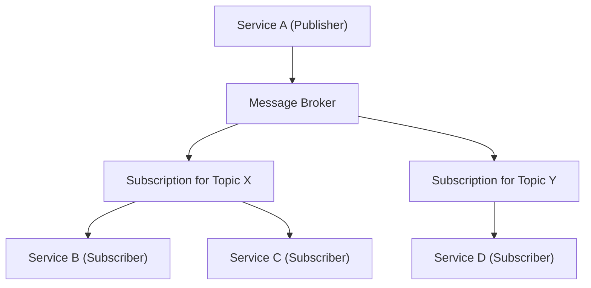

## Communication Patterns
### Core Concepts

*   **Communication Patterns:** Abstract models defining how different components (clients, servers, services) interact and exchange information in a distributed system. They dictate the flow of data and control.
    *   **Higher Level than Protocols:** Patterns (e.g., Request/Response) are conceptual; protocols (e.g., HTTP, gRPC, AMQP) are concrete implementations that enable these patterns. A single protocol can support multiple patterns.

### Key Details & Nuances

1.  **Request/Response:**
    *   **Description:** A client sends a request to a server and waits for a synchronous response.
    *   **Characteristics:**
        *   **Synchronous:** Client blocks (or uses async I/O to avoid blocking the thread) until the response is received.
        *   **Point-to-Point:** Typically one-to-one communication.
        *   **Tight Coupling:** Client directly depends on the server's availability and immediate processing.
    *   **Use Cases:** Web APIs (REST, GraphQL), database queries, RPC calls, user interface interactions needing immediate feedback.
    *   **Protocols/Technologies:** HTTP/1.1, HTTP/2 (unary), gRPC (unary), REST.

2.  **Publish/Subscribe (Pub/Sub):**
    *   **Description:** Publishers send messages to a topic or channel without knowing who will receive them. Subscribers express interest in topics and receive messages asynchronously.
    *   **Characteristics:**
        *   **Asynchronous:** Decoupled communication; publishers and subscribers operate independently.
        *   **Spatial Decoupling:** Publishers and subscribers don't need to know each other's network addresses.
        *   **Temporal Decoupling:** Publishers and subscribers don't need to be running at the same time (if messages are durable).
        *   **Many-to-Many:** One publisher can send to multiple subscribers; multiple publishers can send to one topic.
    *   **Use Cases:** Event streaming, real-time analytics, distributed logging, notifications, microservices communication where immediate response isn't critical.
    *   **Protocols/Technologies:** Kafka, RabbitMQ (AMQP), Redis Pub/Sub, AWS SNS/SQS, Google Cloud Pub/Sub.

3.  **Streaming:**
    *   **Description:** A continuous, often bidirectional, flow of data between sender and receiver over a persistent connection.
    *   **Characteristics:**
        *   **Persistent Connection:** Connection remains open for extended periods.
        *   **Low Latency:** Data delivered as it becomes available, minimizing delays.
        *   **Bidirectional (often):** Both client and server can send data independently.
        *   **Stateful:** The connection itself maintains state.
    *   **Use Cases:** Real-time data processing, live video/audio, online gaming, chat applications, stock tickers, server monitoring.
    *   **Protocols/Technologies:** WebSockets, gRPC (client/server/bidirectional streaming RPCs), SSE (Server-Sent Events - unidirectional).

### Practical Examples

#### Request/Response (HTTP GET)

```typescript
// Client-side JavaScript (e.g., in a browser or Node.js service)
async function getUserProfile(userId: string) {
  try {
    // Client sends request and waits for server's response
    const response = await fetch(`/api/users/${userId}`); 

    if (!response.ok) {
      throw new Error(`Error: ${response.status}`);
    }
    const userData = await response.json();
    console.log("User Data:", userData);
    return userData;
  } catch (error) {
    console.error("Failed to fetch user profile:", error);
  }
}

getUserProfile("user123");
```

#### Publish/Subscribe (Conceptual Flow)



#### Streaming (WebSocket Client)

```javascript
// Client-side JavaScript for a real-time data feed
const socket = new WebSocket("ws://localhost:8080/data-feed");

socket.onopen = () => {
  console.log("Connected to real-time data feed.");
  socket.send("Requesting initial data..."); // Client can send data too
};

socket.onmessage = (event) => {
  // Client continuously receives data without making new requests
  console.log("Received live update:", event.data); 
};

socket.onclose = () => {
  console.log("Disconnected from data feed.");
};

socket.onerror = (error) => {
  console.error("WebSocket error:", error);
};
```

### Common Pitfalls & Trade-offs

*   **Synchronous Request/Response Overuse:**
    *   **Pitfall:** Can lead to cascading failures (if one service is slow/down), tightly coupled systems, and reduced throughput due to blocking operations.
    *   **Trade-off:** Simpler to reason about and implement for direct interactions requiring immediate feedback.
*   **Choosing Pub/Sub for Immediate Feedback:**
    *   **Pitfall:** Pub/Sub is asynchronous; if a caller *needs* an immediate synchronous response, Pub/Sub alone is insufficient and requires complex patterns (e.g., correlation IDs and response queues).
    *   **Trade-off:** Excellent for decoupling, scalability, and handling high volumes of events, but sacrifices direct real-time confirmation.
*   **Stateful Connections (Streaming/WebSockets):**
    *   **Pitfall:** More complex to scale (requires sticky sessions or load balancers aware of connection state), potentially higher resource usage per client connection, and harder to manage connection lifecycle.
    *   **Trade-off:** Enables true real-time, low-latency, bidirectional communication, which is impossible with stateless Request/Response.
*   **Message Loss/Ordering in Asynchronous Systems:**
    *   **Pitfall:** Without robust message brokers and careful configuration (e.g., durable queues, at-least-once delivery, idempotent consumers), messages can be lost or processed out of order, leading to data inconsistencies.
    *   **Trade-off:** The complexity of ensuring reliability and ordering adds overhead but is crucial for data integrity.

### Interview Questions

1.  **Q:** When would you choose a Publish/Subscribe pattern over a traditional Request/Response model for inter-service communication in a microservices architecture?
    *   **A:** Choose Pub/Sub when services need high decoupling (spatial, temporal, flow), when events need to be broadcast to multiple potential consumers, or for building event-driven architectures. It enhances scalability and resilience by allowing services to fail independently and preventing direct dependencies, whereas Request/Response is for synchronous, direct interactions needing immediate feedback.

2.  **Q:** Describe a scenario where a pure Request/Response pattern would be insufficient, and you'd need to introduce a streaming pattern like WebSockets or gRPC streaming.
    *   **A:** A pure Request/Response is insufficient for applications requiring continuous, low-latency data flow or bidirectional real-time communication. Examples include live chat applications, real-time stock price tickers, online multiplayer games, or continuous sensor data ingestion, where the overhead of repeatedly opening/closing connections would be prohibitive.

3.  **Q:** How do communication patterns impact system scalability, reliability, and fault tolerance? Provide examples.
    *   **A:**
        *   **Scalability:** Pub/Sub generally offers the best scalability by decoupling components, allowing independent scaling. Request/Response can limit scalability due to synchronous dependencies. Streaming scales well for data throughput but managing many persistent connections can be complex.
        *   **Reliability:** Pub/Sub, with durable message queues, can enhance reliability by ensuring messages are not lost even if consumers are down. Request/Response is more susceptible to immediate failures. Streaming's reliability depends on connection stability and re-connection strategies.
        *   **Fault Tolerance:** Pub/Sub improves fault tolerance as a publisher doesn't depend on subscriber availability; messages can be retried. Request/Response can lead to cascading failures if a dependency is unhealthy, requiring circuit breakers and timeouts. Streaming connections require robust error handling and re-establishment logic.

4.  **Q:** Discuss the trade-offs between using HTTP (typically Request/Response) versus gRPC (which supports Request/Response and various streaming patterns) for service-to-service communication.
    *   **A:**
        *   **HTTP (REST):** Pros: Human-readable, widely supported, easier debugging with standard tools, good for stateless, resource-oriented APIs. Cons: Text-based (larger payloads), often synchronous, less efficient for high-frequency or streaming data, lacks strong type contracts.
        *   **gRPC:** Pros: Binary protocol (more efficient), uses HTTP/2 (multiplexing, lower latency), supports various streaming patterns (unary, server, client, bidirectional), strong type-safety via Protobuf. Cons: Steeper learning curve, tooling not as universally mature as REST, less human-readable for debugging network traffic, browser support often requires proxies. Choose gRPC for performance-critical microservices and when diverse streaming capabilities or strict contracts are required.